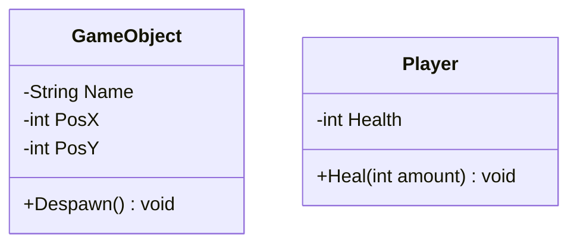

import Tabs from '@theme/Tabs';
import TabItem from '@theme/TabItem';

# Collections



### What is the difference between `Array` and `ArrayList` in Java?
`Array` is a fixed length data structure while `ArrayList` is a dynamic length data structure.

We have defined an ArrayList with size 2 and inserting the 3rd element in it, what will happen? The new element will be added as ArrayList size will be grown dynamically. 

<details>
<summary>ArrayList</summary>
```java title="ArrayList"
List<String> list = new ArrayList<>(2);
System.out.println(list.size()); // 0
list.add("Amit");
list.add("Prashant");
list.add("Suresh");
System.out.println(list.size()); // 3
```
</details>

#### While trying to insert one million elements in the list with no size predefined will it be faster if we initialize the list with size of a million?
With size defined taken taken will be significantly faster due to following reasons.
- While adding a new element the List size will be checked and grow() method will be called to increase the size. This will not happen as we know the size already. 
- Each time the List is grown the elements will be copied from old capacity to new Capacity. This memory allocation will happen earlier, and multiple copies will be avoided.
<Tabs>
<TabItem value="Without Size">

```java
Date start = new Data();
// define an ArrayList
List<String> list = new ArrayList<>();
// loop for 1 million times
for(int i=0; i<1000000; i++){
  list.add(""+i);
}

Date end = new Date();
System.out.printf("Time taken : %s (ms)",(end.getTime()-start.getTime()));

```
</TabItem>
<TabItem value="With Size">

```java
Date start = new Data();
// define an ArrayList
List<String> list = new ArrayList<>(1000000);
// loop for 1 million times
for(int i=0; i<1000000; i++){
  list.add(""+i);
}

Date end = new Date();
System.out.printf("Time taken : %s (ms)",(end.getTime()-start.getTime()));

```
</TabItem>
</Tabs>

<details> 
<summary>What is the difference between List.of() and Arrays.asList() method?</summary>
```java title="List.of() vs Arrays.asList()"
// returns immutable list
// allows null values
// throws UnsupportedOperationException
List<Integer> list = List.of("Amit","Prashant","Suresh"); 
list.add("Ramesh");

// returns modifiable list
// allows null values
List<Integer> list = Arrays.asList("Amit","Prashant","Suresh");
list.add("Ramesh");

```
:::note
We can wrap the `new LinkedList(Arrays.asList())` to get the modifiable collection.
::::
</details>

#### What are different kinds of `List` in Java?

<Tabs>
<TabItem value="ArrayList">
`ArrayList` is a dynamic length data structure.
- Unordered: Elements are not stored in any particular order.
- Fast access: Offers constant-time access to elements by index (O(1)).
- Dynamic resizing: Automatically grows as needed.
- Best for: General-purpose lists where order doesn't matter, frequent random access, and adding/removing elements at the end.
</TabItem>
<TabItem value="LinkedList">
`LinkedList` is a doubly linked list data structure.
- Ordered: Elements are stored in a sequential order.
- Fast insertions and deletions: Excels at adding/removing elements anywhere in the list (O(1) for additions/removals at the beginning or end).
- Less efficient random access: Accessing elements by index is slower (O(n)).
- Best for: Lists where order matters, frequent insertions/deletions in the middle, and iterating through elements sequentially.
</TabItem>
<TabItem value="Stack">
`Stack` is a last-in, first-out (LIFO) data structure.
- Last-in, first-out (LIFO) data structure: Elements are added and removed from the top.
- Use cases: Implementing undo/redo functionality, parsing expressions, backtracking algorithms.
</TabItem>
<TabItem value="PriorityQueue">
`PriorityQueue` is a priority-based queue data structure.
- Orders elements based on their priority: The element with the highest priority is always at the head.
- Use cases: Scheduling tasks, managing priority-based events, implementing heap data structures.
</TabItem>
<TabItem value="Choosing the right List">
- Order: If order matters, use LinkedList or PriorityQueue.
- Random access: If frequent random access is needed, use ArrayList.
- Insertions/deletions: If frequent insertions/deletions in the middle are required, use LinkedList.
- Thread safety: If thread safety is essential, use Vector or synchronize access to ArrayList/LinkedList.
- Specialized operations: For specific operations like LIFO or priority-based access, use Stack or PriorityQueue.

</TabItem>
</Tabs>


### What will be the output of the below Code?
```java
List<String> list = new ArrayList<>();
list.add("amit");
list.add("prashant");
list.add("suresh");

for(String s: list){
  // delete if Amit
  if(s.equals("Amit")) list.remove(s);
}

```

<details>
<summary>Answer </summary>
```java title="Iterator"
Iterator iterator = list.iterator();
while(iterator.hasNext()){
  String s = (String) iterator.next();
  // delete if Amit
  if(s.equals("Amit")) list.remove(s);
}

```
It will give the `ConcurrentModificationException`, to save memory Java creates a subList as viewed on the original list.
</details> 
----

### What is Hashing and how it is implemented in Java?
`Hashing` is like a fingerprinting technique for data. It takes any piece of information, like a text document, a password, or even a whole file, and transforms it into a unique code called a "hash." Think of it like taking a complex recipe and turning it into a short grocery list – the list is much easier to manage and compare, but it still contains all the essential information.

Hashing has a ton of applications, here are a few key ones:

<details>
<summary>Verifying data integrity:</summary>
-  Imagine downloading a large file. How do you know it wasn't corrupted during download? You can compare its hash to the original one – if they match, the file is good to go!
</details>
<details>
<summary>Securing passwords:</summary>
- Instead of storing your actual password, websites store its hash. When you log in, they hash your entered password and compare it to the stored hash. If they match, you're in! This way, even if hackers steal the database, they can't get your actual passwords.
</details>
<details>
<summary>Finding duplicates:</summary>
-  Need to quickly weed out identical files in a massive collection? Hashing can do that in a flash. Just compare the hashes, and you'll instantly know which ones are copies.
- Speeding up searches: Hash tables, which use hashing to store and retrieve data, are incredibly fast. This makes them ideal for applications like databases and search engines.
</details>

#### How `Hashing` is implemented in Java?
`Hashing` is implemented in Java using `hashCode()` and `equals()` methods. `hashCode()` method returns an integer value and `equals()` method returns a boolean value. 

<Tabs>
<TabItem value="Hash Functions">
Purpose: To map data of any size to a fixed-length integer value, called a hash code.

**Characteristics**:
- Deterministic: Same input always produces the same hash code.
Efficient to compute.
- Uniform distribution: Ideally, hash codes should be evenly distributed across the possible range of values.

Common Java hash functions:
- **hashCode() method:** Inherited by all Java objects.
- **String.hashCode():** Specifically for strings.
</TabItem>
<TabItem value="Hash Code">
`Hashing` is a technique to convert a range of key values into a range of indexes of an array. We're going to use the remainder operator `%` to get a range of key values. 
- Represent: The output of a hash function, typically an integer.
- Usage: Serve as indices within hash tables to efficiently store and retrieve data.
```java
int[] arr = new int[10];
int key = 10;
int index = key % arr.length;
```
</TabItem>
<TabItem value="Hash Table">
- Data structure: Utilizes hashing for fast storage and retrieval of key-value pairs.
- Key classes:
  - **HashMap**: Unordered collection of key-value pairs.
  - **HashSet**: Set implementation using a hash table.
  - **Hashtable**: Older, thread-safe version of HashMap.
</TabItem>
<TabItem value="Collision Handling">
- Problem: Different keys can produce the same hash code (collision).
- Resolution: Java primarily uses separate chaining:
Each hash table bucket holds a linked list of entries with the same hash code.
Allows multiple values to be stored at the same index.
</TabItem>
</Tabs>


:::note Default `hashCode()`: 
Typically returns a value based on the object's memory address.
Reason: It's a unique identifier for each object instance, ensuring different objects usually have different hash codes.
::::

:::warning Not encryption
 `Hashing` is a one-way process; original data cannot be recovered from the hash code.
::::

#### What is the difference between `HashMap` and `HashTable` in Java?
<Tabs>
<TabItem value="HashMap">
`HashMap` is a key-value pair data structure.
- `HashMap` is not synchronized while `HashTable` is synchronized.
- `HashMap` allows one null key and multiple null values while `HashTable` does not allow null key or value.
</TabItem>
<TabItem value="HashTable">
`HashTable` is a key-value pair data structure.
- `HashTable` is synchronized while `HashMap` is not synchronized.
- `HashTable` does not allow null key or value while `HashMap` allows one null key and multiple null values.
</TabItem>
</Tabs>

#### What is the difference between `HashMap` and `HashSet` in Java? 
- `HashMap` is a key-value pair while `HashSet` is a set of unique values.
- `HashMap` allows one null key and multiple null values while `HashSet` does not allow null values.


----


### What are different kinds of `Maps` in Java?
`Map Interface`: Represents a collection of key-value pairs, where each key is unique.
Provides methods for storing, retrieving, and managing these pairs.
<Tabs>
<TabItem value="HashMap">
`HashMap` is a key-value pair data structure. It is not synchronized and allows one null key and multiple null values.
- Most common and versatile implementation.
- Unordered: Doesn't maintain any particular order of elements.
- Fast performance: Average constant-time operations for basic operations.
- Internal structure: Uses a hash table for efficient storage and retrieval.
- Allows null keys and values.
</TabItem>
<TabItem value="TreeMap">
`TreeMap` is a key-value pair data structure. It is sorted and does not allow null key or value.
- Sorted: Maintains keys in ascending order based on their natural ordering or a custom comparator.
- Internal structure: Uses a red-black tree for efficient sorting and retrieval.
- Slightly slower than HashMap for basic operations: Logarithmic time complexity.
- Doesn't allow null keys.
</TabItem>
<TabItem value="LinkedHashMap">
`LinkedHashMap` is a key-value pair data structure. It is ordered and does not allow null key or value.
- Combines features of HashMap and LinkedHashMap:
- Order: Preserves insertion order of elements.
- Performance: Similar to HashMap for basic operations.
- Internal structure: Uses a hash table and a linked list.
- Allows null keys and values.
</TabItem>
<TabItem value="EnumMap">
`EnumMap` is a key-value pair data structure. It is ordered and does not allow null key or value.
- Specialized implementation for maps with enum keys: Very efficient.
- Internal structure: Optimized for enum keys.
</TabItem>
<TabItem value="Choosing the right Map">
- HashMap: General-purpose, fast, doesn't require ordering.
- TreeMap: When key ordering is essential.
- LinkedHashMap: When insertion order needs to be preserved.
- Hashtable: Thread safety is a primary concern, but performance is less critical.
- EnumMap: Working with maps of enum keys.
</TabItem>
</Tabs>


<Tabs>
<TabItem value="String">
StringBuffer is mutable and high performant for modifying String.
</TabItem>
<TabItem value="StringBuilder">
StringBuffer is mutable and high performant for modifying String.
</TabItem>
</Tabs>
