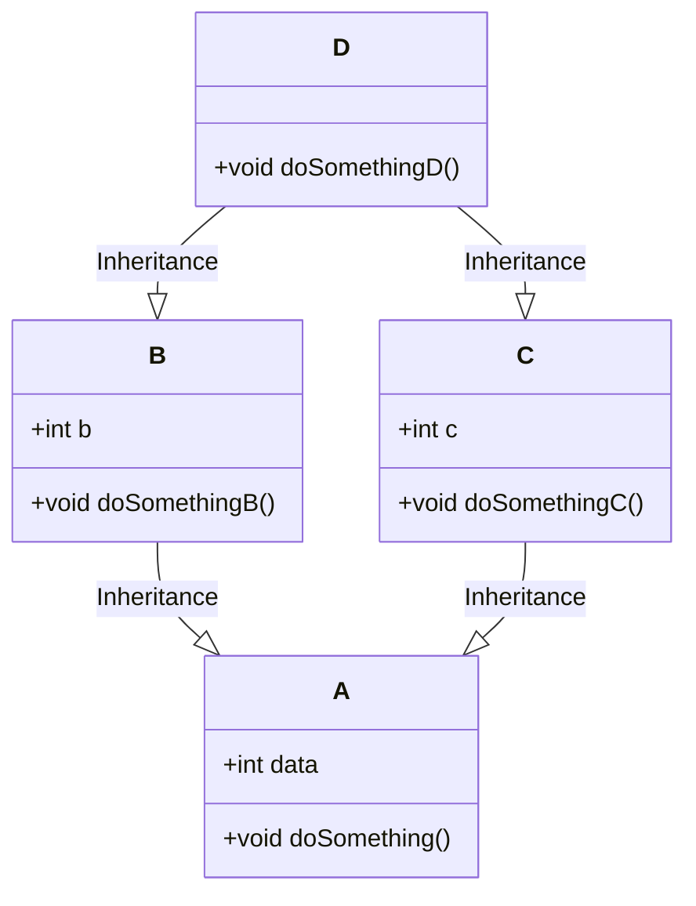

```mdx-code-block
import Tabs from '@theme/Tabs';
import TabItem from '@theme/TabItem';
```

# Core Java

### What is String and String Pool in Java?
Strings in Java are immutable Object, using `new` keyword will always create a new Object in Heap Memory. String Pool is a special memory location in Heap Memory where all the String literals are stored. When we create a String literal using `""` or `new String()` it will be stored in String Pool. If we create a String using `new` keyword it will be stored in Heap Memory.

```java
String str1 = "Hello";  // Interned string, stored in pool
String str2 = "Hello";  // Reuses the same "Hello" from pool
String str3 = new String("Hello");  // May or may not be in pool (depends on JVM)
```

:::warning String Pool
Avoid storing **sensitive information** in the String pool, as it can potentially be accessed by other parts of the application.
In scenarios where you need frequent string comparisons, using interned strings from the pool can be faster.
:::

#### What is the difference between `String`, `StringBuffer` and `StringBuilder` in Java?
<Tabs>
<TabItem value="String">
- `String` is immutable while `StringBuffer` and `StringBuilder` are mutable. 
</TabItem>
<TabItem value="StringBuilder">
- `StringBuilder` is synchronized while `StringBuilder` is not synchronized.
</TabItem>
<TabItem value="StringBuffer">
- `StringBuffer` is mutable and high performant for modifying String.
- `StringBuffer` is synchronized while StringBuilder is not synchronized.
</TabItem>
</Tabs>

### Why do we need a wrapper Class ? What is Auto-Boxing in Java?
Auto Boxing is the automatic conversion that the Java compiler makes between the primitive types and their corresponding object wrapper classes. Below are the following reasons.
- They have a lot of Utility methods in them and support null values which is not possible in primitives.
- They are compatible with Collections as collections do not support primitive types.
- They support Object like creation from other types like String using Auto-Boxing.

:::info valueOf vs Constructor
A constructor will create a new object while **`valueOf`** will check the cache for existing objects.
:::

```java
Integer i1 = new Integer(10);
Integer i2 = Integer.valueOf(10);
System.out.println(i1 == i2); // true
System.out.println(i1.equals(i2)); // true
```

### What is `Static` in Java?
`Static` is a keyword in Java which is used to create a class level variable or method. `Static` variables are created in the class memory and are shared by all the objects of the class. `Static` methods can be called without creating an object of the class.

:::tip Static Block
**`Static Block`** is a block of code which is executed when the class is loaded in the memory. It is used to initialize the `Static` variables of the class.
:::

```java
public class StaticBlockExample {
    static {
        System.out.println("Static Block");
    }

    public static void main(String[] args) {
        System.out.println("Main Method");
    }
}
```

### What are `constructor` in java?
`Constructor` is a special method in Java which is used to initialize the object of the class. It has the same name as the class and does not have any return type. It can have parameters for initial values.

```java
public class ConstructorExample {
    private int i;

    public ConstructorExample(int i) {
        this.i = i;
    }

    public static void main(String[] args) {
        ConstructorExample c = new ConstructorExample(10);
    }
}
```

:::info Default Constructor
We can not instantiate an object of the class without a constructor. If we do not create any constructor in the class, the compiler will create a default constructor for us.
:::
#### How many ways can we create an object in Java?
We can create an object in Java using `new` keyword, `newInstance()` method, `clone()` method, `deserialization` and `reflection`.

```java
public class ObjectCreationExample {
    public static void main(String[] args) throws Exception {
        ObjectCreationExample o1 = new ObjectCreationExample();
        ObjectCreationExample o2 = ObjectCreationExample.class.newInstance();
        ObjectCreationExample o3 = (ObjectCreationExample) o1.clone();
        ObjectCreationExample o4 = (ObjectCreationExample) SerializationUtils.clone(o1);
        ObjectCreationExample o5 = (ObjectCreationExample) Class.forName("ObjectCreationExample").newInstance();
    }
}
```

:::tip Private Constructor (`Singleton`)
If we create a private constructor in the class, we will not be able to create an object of the class from outside the class. This is used in the Singleton design pattern.
:::
### What is the Singleton pattern and how can we implement it in Java?
`Singleton` is a design pattern in Java which is used to create only one instance of the class. We can implement it by creating a private constructor and a static method which will return the object of the class.
We have to make sure that the class is not Serializable, Clonable and we do not have any other constructor in the class.

```java title=SingletonExample.java
public class SingletonExample {
    private static SingletonExample singletonExample;

    private SingletonExample() {
    }

    public static SingletonExample getInstance() {
        if (singletonExample == null) {
            singletonExample = new SingletonExample();
        }
        return singletonExample;
    }
}
```

<details>
<summary>
Each JVM (Java Virtual Machine) runs in its own isolated environment, with its own class loader and memory space. This isolation ensures that singleton instances are unique within their respective JVMs.
</summary>
- Class Loading: Each JVM has its own class loader, responsible for loading classes and creating their instances. When a singleton class is loaded for the first time within a JVM, its single instance is created and maintained thereafter.
- Memory Isolation: JVMs have separate memory spaces, preventing interference between classes and objects in different JVMs. This means singleton instances in one JVM are distinct from those in other JVMs.
- Distributed Systems: In distributed systems where multiple JVMs interact, each JVM will have its own singleton instances, potentially leading to multiple instances of the same singleton class across the system.
- Serialization: When a singleton is serialized and deserialized, its unique instance identity might not be preserved, potentially leading to multiple instances within a JVM. Careful handling of serialization is crucial to maintain the singleton pattern.
</details>

#### What is the difference between `Singleton` and `Static` class in Java?
`Singleton` is a design pattern in Java which is used to create only one instance of the class while `Static` class is a class which has only static methods and variables.

<details>
<summary>SingletonExample.java</summary>
  ```java
  public class SingletonExample {
      private static SingletonExample singletonExample;
  
      private SingletonExample() {
      }
  
      public static SingletonExample getInstance() {
          if (singletonExample == null) {
              singletonExample = new SingletonExample();
          }
          return singletonExample;
      }
  }
  ```
</details>
  ```java title=StaticClassExample.java
  public class StaticClassExample {
      private static int i;
  
      private StaticClassExample() {
      }
  
      public static void method() {
          // some code
      }
  }
  ```

### What is the difference between `instanceof` and `isInstance` in Java?
`instanceof` is a keyword in Java which is used to check if an object is an instance of a class while `isInstance` is a method in Java which is used to check if an object is an instance of a class.

```java
public class InstanceOfExample {
    public static void main(String[] args) {
        InstanceOfExample i = new InstanceOfExample();
        System.out.println(i instanceof InstanceOfExample); // true
        System.out.println(InstanceOfExample.class.isInstance(i)); // true
    }
}
```

### What is the difference between `this` and `super` in Java?
`this` is a keyword in Java which is used to refer to the current object while `super` is a keyword in Java which is used to refer to the parent class object.

```java
public class ThisExample {
    private int i;

    public ThisExample(int i) {
        this.i = i;
    }

    public static void main(String[] args) {
        ThisExample c = new ThisExample(10);
    }
}
```
```java
public class SuperExample {
    private int i;

    public SuperExample(int i) {
        this.i = i;
    }

    public static void main(String[] args) {
        SuperExample c = new SuperExample(10);
    }
}
```

###  Why does Java not support multiple inheritance?
Java does not support multiple inheritance because of the Diamond problem. If we have two classes A and B which extends C and we have a method in C which is overridden in both A and B. Now if we create a class D which extends both A and B and we call the method from D, which method will be called?



This is the reason Java does not support multiple inheritance.

### What is the difference between `Abstract Class` and `Interface` in Java?
We should use interface when we only know the specification but Abstract when we know the partial Implementation.
:::tip 
**Interfaces** are more preferred as we can implement multiple Interfaces but can only extend one Abstract class. With java 8 we can have default implementation of a method in an Interface. 
:::
<Tabs>
<TabItem value="Interface">
- `Interface` can only have abstract methods.
- `Interface` can only have static and final variables. 
-`Interface` cannot have constructor. 
```java
public interface InterfaceExample {
    int i = 10;

    void method();

    default void method2() {
        // some code
    }
}

//  implements InterfaceExample
public class InterfaceExampleImpl implements InterfaceExample {
    @Override
    public void method() {
        // some code
    }
}

```

#### How to implement multiple interfaces with same method name?
```java
interface Interface1 {
  void myMethod(String arg);
}

interface Interface2 {
  void myMethod(String arg);
}

public class MyClass implements Interface1, Interface2 {
  @Override
  public void myMethod(String arg) {
    System.out.println("Implementing method from both interfaces: " + arg);
  }
}
```

</TabItem>
<TabItem value="Abstract Class">
- `Abstract` Class can have both abstract and non-abstract methods.
- `Abstract` Class can have static, final and non-final variables.
- `Abstract` Class can have constructor.
```java 
public abstract class AbstractClassExample {
    private int i;

    public AbstractClassExample(int i) {
        this.i = i;
    }

    public abstract void method();

    public void method2() {
        // some code
    }
}

//  extends AbstractClassExample
public class AbstractClassExampleImpl extends AbstractClassExample {
    public AbstractClassExampleImpl(int i) {
        super(i);
    }

    @Override
    public void method() {
        // some code
    }
}
```
</TabItem>
</Tabs>


### What is difference between `==` and `equals` in Java?
`==` is used to compare the reference of the object while `equals` is used to compare the content of the object.
```java
Integer i1 = new Integer(10);
Integer i2 = new Integer(10);
System.out.println(i1 == i2); // false
System.out.println(i1.equals(i2)); // true
```

### What is the difference between `final`, `finally` and `finalize` in Java?
`final` is used to make a variable constant, `finally` is used to execute a block of code irrespective of the exception and `finalize` is a method which is called by the Garbage Collector before destroying the object.

```java
public final int i = 10;
```
```java
try {
    // some code
} catch (Exception e) {
    // some code
} finally {
    // some code
}
```
```java
public class FinalizeExample {
    public static void main(String[] args) {
        FinalizeExample f1 = new FinalizeExample();
        FinalizeExample f2 = new FinalizeExample();
        f1 = null;
        f2 = null;
        System.gc();
    }

    @Override
    protected void finalize() throws Throwable {
        System.out.println("Finalize method called");
    }
}
```

:::note
Code in finally is NOT executed only in two situations.
- If exception is thrown in finally.
- If JVM Crashes in between (for example, System.exit()).
:::

### What is the difference between `throw` and `throws` in Java?
`throw` is used to throw an exception while `throws` is used to declare an exception.
  
  ```java
  throw new Exception("Exception");
  ```
  ```java
  public void method() throws Exception {
    // some code
  }
  ```

:::warning What is the difference between `Error` and `Exception` in Java?
`Error` is a serious problem which a programmer should not try to handle while `Exception` is a problem which can be handled by the programmer.
:::


### What is the difference between `checked` and `unchecked` Exception in Java?
`checked` Exception are the Exception which are checked at compile time while `unchecked` Exception are the Exception which are not checked at compile time.

<details>
<summary>Checked Exception</summary>
```java
public void method(){
    // some code
    throw new Exception("Checked Exception");
}

public static void main(String[] args) {
    try {
        method();
    } catch (Exception e) {
        // Need to handle the Exception otherwise it will give compile time error
        // They should either be caught or declared in the method signature
    }
}
```
</details>

<details>
<summary>Unchecked Exception</summary>
```java
public void method() {
    // some code
    throw new RuntimeException("Unchecked Exception");
}

public static void main(String[] args) {
    method();
}
```
Exception in thread "main" java.lang.RuntimeException: Unchecked Exception at Main.main(Main.java:7)
</details>

### Explain the Factory Design pattern and two class examples you have used?
We can use SessionFactory to obtain the session Object to perform CRUD operation and BeanFactory to obtain the Bean Object.

We can use SessionFactory to obtain the session Object to perform CRUD operation and BeanFactory to obtain the Bean Object.

