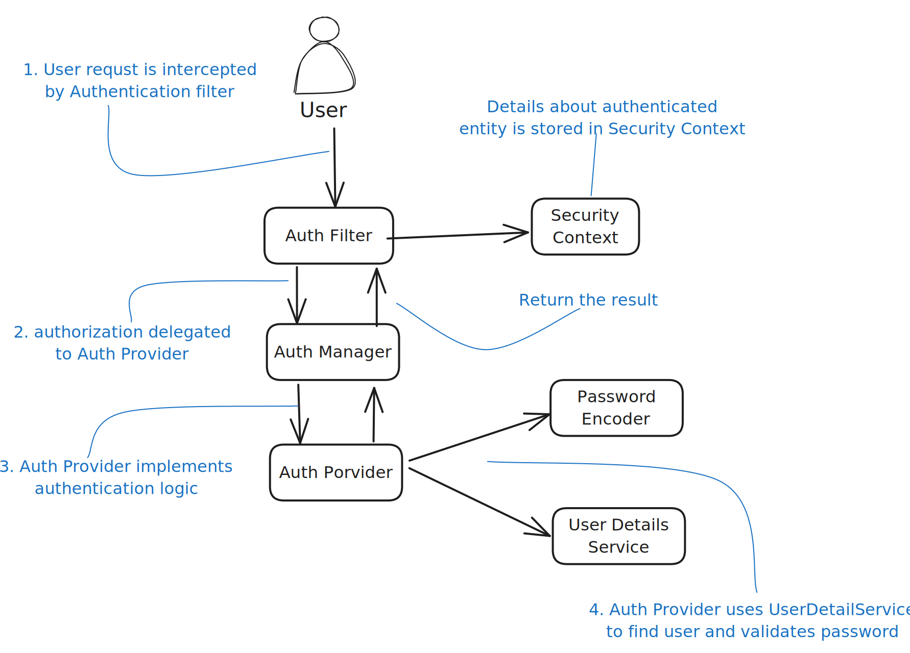

import Tabs from '@theme/Tabs';
import TabItem from '@theme/TabItem';

# Spring Security

### What is Spring Security?
It is a powerful and highly customizable authentication and access-control framework.
It is the de-facto standard for securing Spring-based applications.

#### Authentication flow



### Difference between Authentication and Authorization
Authentication is the process of verifying the identity of a user, whereas authorization is the process of verifying
that the authenticated user has access to the requested resource.
To customize authentication and authorization, we’ll need to define a bean of type SecurityFilterChain.
```java
@Configuration
public class ProjectConfig {
    @Bean
    SecurityFilterChain configure(HttpSecurity http) throws Exception {
        http.httpBasic(Customizer.withDefaults()); // Authentication approach
        http.authorizeHttpRequests(
            c -> c.anyRequest().authenticated()
        ); // Authorization approach, customizing the authorization at specific endpoints
        return http.build();
    }

    @Bean
    PasswordEncoder passwordEncoder() {
        return NoOpPasswordEncoder.getInstance();
    }
}
```

:::tip
The HTTP 401 Unauthorized status code is a bit ambiguous. Usually, it’s
used to represent a failed authentication rather than authorization.

For a failed authorization, we’d probably use the 403 Forbidden status.
Generally, an HTTP 403 means that the server identified the caller of
the request, but they don’t have the needed privileges for the call that they are
trying to make.
:::

:::warning
a PasswordEncoder
exists together with the default UserDetailsService. When we replace the
default implementation of the UserDetailsService, we must also specify a
PasswordEncoder
:::

----

### UserDetailsService and PasswordEncoder
You can define users with the `User` class. A user should at least have a username, a password, and an authority.
Authorities are actions that you allow a user to do in the context of the application.
- **Principal** → The user requesting the access to the application.
- **UserDetails** → Describes user for Spring, must have at least on Authority.
- **GrantedAuthority** → Describes the actions assigned to a user, authority of a user, actions he/she can perform.
- **PasswordEncoder** → It is a contract to tell spring how to encode and verify the password.
    - It has two methods named `encode()` and `matches()`.
    - `NoOpPasswordEncoder.getInstance()` is used to store passwords in plain text.

<details>
    <summary>UserDetailsService</summary>

    - It is used to retrieve user-related data.
    - It has one method named `loadUserByUsername()` which returns a UserDetails object.
    - A simple implementation of a UserDetailsService that Spring Security
    provides is `InMemoryUserDetailsManager`
    - The JdbcUserDetailsManager implementation expects three columns in the users table: a username,
  a password, and enabled, which you can use to deactivate the user.
</details>
<details>
    <summary>UserDetailsManager</summary>

    - It is used to manage user-related data.
    - It has methods like `createUser()`, `updateUser()`, and `deleteUser()`.
</details>
<details>
    <summary>AuthenticationProvider</summary>

    - It is used to authenticate a user by delegating to `UserDetailsService` and `PasswordEncoder`.
    - It's responsibility is strongly coupled with the `Authentication` contract.
    - It has one method named `authenticate()` which receives `Authentication` object as parameter and returns
  an Authentication object.
    - If method receives an `Authentication` object which is not supported then it must return null.
    - `DaoAuthenticationProvider` is used to authenticate a user against the UserDetailsService.
</details>

---


:::note
```bash Base64-encoded string
echo -n user:93a01cf0-794b-4b98-86ef-54860f36f7f3 | base64
```

HTTP Basic authentication doesn’t offer confidentiality of the credentials.
Base64 is only an encoding method for the convenience of the transfer; it’s
not an encryption or hashing method. While in transit, if intercepted, anyone
can see the credentials. Generally, we don’t use HTTP Basic authentication
without at least HTTPS for confidentiality.
:::

:::tip
Sometimes the class design allows the app to store
sensitive data like credentials or private keys for a long time. In such cases,
someone who has the privilege to make a heap dump could find these details
and then use them maliciously
:::

### Filters
In Spring Security, HTTP filters delegate the different responsibilities that apply to an HTTP request.
In Spring Security, in general, HTTP filters manage each responsibility that must be applied to the request.
The filters form a chain of responsibilities. A filter receives a request, executes its logic,
and eventually delegates the request to the next filter in the chain (figure below).


Knowing how to customize the HTTP filter chain of responsibilities is a valuable skill.
You can add or remove filters, change the order of filters, or even replace a filter with a custom one.

Spring Security offers a few abstract classes that implement the Filter interface and for which you can extend your
filter definitions.
These classes also add functionality your implementations could benefit from when you extend them.
`OncePerRequestFilter`, as the name suggests, implements logic to make sure that the filter’s `doFilter()` method
is executed only one time per request.


In the below example we have a `ValidateRequestFilter` which will be applied before authentication filter.
We only only check if request has a header value `X-Request-Id` and if it is not present we will throw an exception.

<details>
  <summary>Example code</summary>
```java
public class ValidateRequestFilter extends OncePerRequestFilter {
    @Override
    protected void doFilterInternal(HttpServletRequest request, HttpServletResponse response, FilterChain filterChain) throws ServletException, IOException {
        String requestId = request.getHeader("X-Request-Id");
        if (requestId == null) {
            response.setResponse(HttpStatus.BAD_REQUEST);
            throw new RuntimeException("No X-Request-Id header present");
        }
        filterChain.doFilter(request, response);
    }
}
```

```java
@Configuration
public class ProjectConfig {
    @Bean
    SecurityFilterChain configure(HttpSecurity http) throws Exception {
        http.addFilterBefore(new ValidateRequestFilter(), UsernamePasswordAuthenticationFilter.class);
        http.httpBasic(Customizer.withDefaults());
        http.authorizeHttpRequests(
            c -> c.anyRequest().authenticated()
        );
        return http.build();
    }

    @Bean
    PasswordEncoder passwordEncoder() {
        return NoOpPasswordEncoder.getInstance();
    }
}
```
</details>

:::tip
When adding a filter at a specific position, Spring Security does not assume it is the only one at that position.
You might add more filters at the same location in the chain.
In this case, Spring Security doesn’t guarantee in which order these will act.

Some developers think that when you apply a filter at a position of a known one, it will be replaced.
This is not the case! We must make sure not to add filters that we don’t need to the chain

**Adding multiple filters in the same position in the chain can lead to unexpected behavior,
it makes sense to define order in the chain.**
:::


### Authentication Provider
Authentication Provider's responsibility is strongly coupled with the `Authentication` contract.
The user requesting the access to the application is called the `principal`.

In Java Security, an interface named Principal represents the same concept.
The Authentication interface of Spring Security extends this contract

**How to implement `authenticate()` method**
  - The method should throw `AuthenticationException` if the authentication fails.
  - If method receives an `Authentication` object which is not supported then it must return null.

**How to implement `supports()` method**
  - You can implement the method to return true if the `Authentication` object is supported by the provider.
  - Even if this method returns true, the `authenticate()` method can still return null if the
    provider cannot authenticate the user.

<details>
  <summary>How to implement `authenticate()` method</summary>

  - The method should throw `AuthenticationException` if the authentication fails.
  - If method receives an `Authentication` object which is not supported then it must return null.
  - `DaoAuthenticationProvider` is used to authenticate a user against the UserDetailsService.
</details>
