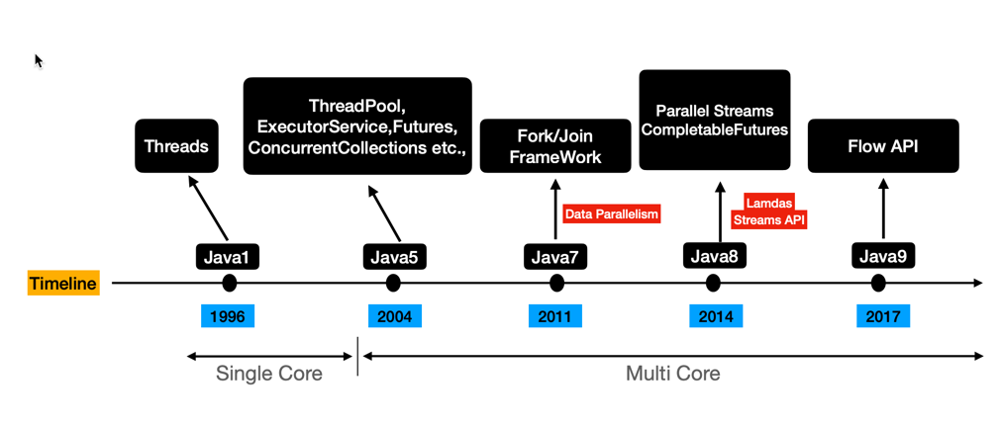

import Tabs from '@theme/Tabs';
import TabItem from '@theme/TabItem';

# Multi-Threading

### What is the difference between `Concurrency` and `Parallelism`?
Concurrency is when two tasks can start, run, and complete in overlapping time periods. It doesn't necessarily mean they'll ever both be running at the same instant. For example, multitasking on a single-core machine.
Parallelism is when tasks literally run at the same time, e.g., on a multicore processor.

:::note 
Concurrency is a concept which is implemented in Java using Threads
::::
<details>
<summary>What is `Process`?</summary>
- A process is a program in execution. It is an active entity.
</details>

<details>
<summary>What is `Thread`?</summary>
```java
public class Main {
    public static void main(String[] args) {
        System.out.println("Concurrency vs Parallelism");
        System.out.println("Concurrency: " + Runtime.getRuntime().availableProcessors());
        System.out.println("Parallelism: " + Runtime.getRuntime().availableProcessors());
    }
}
```
A thread is a single sequential flow of control within a program. It is a lightweight process.
</details>


### What is `Multi-tasking`?
Multi-tasking is a process of executing multiple tasks simultaneously. We use multi-tasking to utilize the CPU. Multi-tasking can be achieved by two ways:

- Process-based Multitasking (Multiprocessing)
- Thread-based Multitasking (Multithreading)
<Tabs>
<TabItem value="Multi-threading">
Multi-threading is a Java feature that allows concurrent execution of two or more parts of a program for maximum utilization of CPU. Each part of such program is called a thread. So, threads are light-weight processes within a process.
</TabItem>
<TabItem value="Multiprocessing">
Multiprocessing is a process of executing multiple processes simultaneously. For example: typing and listening music both are going on simultaneously.
</TabItem>
</Tabs>


### What are primary ways to create threads in Java 17?
<Tabs>
<TabItem value="Extending the Thread Class">
- Create a class that extends the Thread class.
- Override the run() method to define the thread's behavior.
- Instantiate the class and call its start() method to start the thread.
```java
class MyThread extends Thread {
    @Override
    public void run() {
        // Code to be executed in the thread
        System.out.println("Thread running...");
    }

    public static void main(String[] args) {
        MyThread thread = new MyThread();
        thread.start();
    }
}
```
</TabItem>
<TabItem value="Implementing the Runnable Interface">
- Create a class that implements the Runnable interface.
- Implement the run() method to define the thread's behavior.
- Instantiate the class and pass it to a Thread object's constructor.
- Call the start() method on the Thread object to start the thread.
```Java
class MyRunnable implements Runnable {
    @Override
    public void run() {
        // Code to be executed in the thread
        System.out.println("Thread running...");
    }
}
public class Main {
    public static void main(String[] args) {
        MyRunnable runnable = new MyRunnable();
        Thread thread = new Thread(runnable);
        thread.start();
    }
}
```
</TabItem>
<TabItem value="Using Executors:">
- Use the Executor framework to manage thread pools and task execution.
- Create an ExecutorService using Executors.newCachedThreadPool() or Executors.newFixedThreadPool().
- Submit tasks to the executor using the submit() method.
```Java
ExecutorService executor = Executors.newCachedThreadPool();
executor.submit(() -> {
    // Code to be executed in the thread
    System.out.println("Thread running in executor...");
});
```
</TabItem>
</Tabs>

:::tip Key Considerations:
Choice between Thread and Runnable: Extend Thread for self-contained thread logic; implement Runnable for separating thread behavior from other class responsibilities.
- Thread management: Use Executors for easier thread management and better resource utilization.
- Synchronization: Ensure thread safety when accessing shared resources using synchronized blocks, Lock objects, or atomic variables.
:::


### What is `Thread Pool`?
A thread pool is a collection of threads that can be reused. Thread pools are used in multi-threaded applications. **Thread pools are also known as a thread executor framework.**
- In a thread pool, each thread is assigned a task. 
- When a thread completes its task, it can be reused for another task. 
- Thread pools are used to reduce the overhead of creating new threads. 
- Creating and destroying new threads is resource intensive, and it takes time. 
- So, when a thread completes its task, it can be reused for another task. 

### What is `ExecutorService`?
The ExecutorService interface provides a way to manage threads. It is an interface that extends the Executor interface. It provides methods to manage threads and tasks. It is a high-level API that provides features like thread pooling, scheduling, etc. It is a part of the java.util.concurrent package. It is an interface that provides methods like execute(), submit(), shutdown(), etc.
```java
public interface ExecutorService extends Executor {
    void shutdown();
    List<Runnable> shutdownNow();
    boolean isShutdown();
    boolean isTerminated();
    boolean awaitTermination(long timeout, TimeUnit unit) throws InterruptedException;
    <T> Future<T> submit(Callable<T> task);
    <T> Future<T> submit(Runnable task, T result);
    Future<?> submit(Runnable task);
    <T> List<Future<T>> invokeAll(Collection<? extends Callable<T>> tasks) throws InterruptedException;
    <T> List<Future<T>> invokeAll(Collection<? extends Callable<T>> tasks, long timeout, TimeUnit unit) throws InterruptedException;
    <T> T invokeAny(Collection<? extends Callable<T>> tasks) throws InterruptedException, ExecutionException;
    <T> T invokeAny(Collection<? extends Callable<T>> tasks, long timeout, TimeUnit unit) throws InterruptedException, ExecutionException, TimeoutException;
}
```


### Why use a different thread pool than the default(Common ForkJoinPool) one?
The default thread pool is a fixed thread pool with a size of 5. It is a common thread pool that is shared by all the parallel streams. So, if you are using parallel streams in your application, then it is recommended to use a different thread pool than the default one. If you use the default thread pool, then it may cause performance issues. So, it is recommended to use a different thread pool than the default one.
```java
public class Main {
    public static void main(String[] args) {
        // Fixed thread pool with a size of num of processors
        ExecutorService executor = Executors.newFixedThreadPool(Runtime.getRuntime().availableProcessors());
        executor.submit(() -> {
            // Code to be executed in the thread
            System.out.println("Thread running in executor...");
        });
    }
}
```


### What are some of the main scenarios where threading is heavily used in Java:
<Tabs>
<TabItem value="Handling Long-Running Tasks">
- Background tasks: Tasks that don't require user interaction (e.g., file downloads, data processing, sending emails) can run in separate threads to prevent the main thread from blocking and maintain application responsiveness.
- Time-consuming computations: Thread use for complex calculations or simulations can improve performance by utilizing multiple CPU cores.
```java
// file download
new Thread(() -> {
    downloadFile("https://example.com/largefile.zip");
}).start();

// image processing
ExecutorService executor = Executors.newFixedThreadPool(4);
for (Image image : images) {
    executor.submit(() -> processImage(image));
}
```
</TabItem>
<TabItem value="I/O-Bound Operations">
- Network communication: Handling network operations like file uploads/downloads or API calls in separate threads prevents blocking the main thread while waiting for responses.
- File I/O: Reading from or writing to files can be performed asynchronously using threads, improving performance and responsiveness.
```java
// network request
ExecutorService executor = Executors.newCachedThreadPool();
executor.submit(() -> {
    String response = sendHttpRequest("https://api.example.com");
    // Process response
});

// file reading
new Thread(() -> {
    readDataFromFile("data.txt");
}).start();
```
</TabItem>
<TabItem value="Asynchronous Programming:">
- Event-driven applications: Handling events like user interactions, sensor readings, or network events often requires asynchronous execution to prevent blocking and maintain responsiveness.
- Reactive programming: Asynchronous data streams and non-blocking operations in reactive frameworks heavily rely on threading for efficient execution.
```java
// event-driven programming
button.addActionListener(new ActionListener() {
    @Override
    public void actionPerformed(ActionEvent e) {
        new Thread(() -> performLongTask()).start();
    }
});

// reactive programming
Flux.just(1, 2, 3)
    .subscribeOn(Schedulers.parallel())
    .map(number -> processNumber(number))
    .subscribe(result -> System.out.println(result));
```
</TabItem>
</Tabs>

<details>
<summary>Some more `Applications`?</summary>
<Tabs>
<TabItem value="GUI Applications:">
- Responsive UI: Updating the user interface and handling user interactions often happen on a separate thread, called the Event Dispatch Thread (EDT), to prevent UI freezing and ensure smooth interactions.
- Background tasks: Long-running tasks in GUI applications are often executed in separate threads to avoid blocking the EDT and maintain UI responsiveness.
</TabItem>
<TabItem value="Server-Side Applications:">
- Handling multiple requests: Web servers and other server-side applications use threading to handle multiple concurrent requests efficiently, improving scalability and throughput.
- Asynchronous processing: Handling long-running tasks or I/O operations asynchronously in server-side applications can improve responsiveness and resource utilization.
</TabItem>
<TabItem value="Concurrent Data Structures and Algorithms:">
- Concurrent collections: Thread-safe collections like ConcurrentHashMap and BlockingQueue enable safe and efficient data sharing among multiple threads.
- Parallel algorithms: Splitting tasks into smaller, independent units that can be executed concurrently on multiple threads can significantly improve performance for certain algorithms.
</TabItem>
</Tabs>
Blocking is when the execution of additional JavaScript in the Node.js process must wait until a non-JavaScript operation completes. This happens because the event loop is unable to continue running JavaScript while a blocking operation is occurring.
</details>


### What are `BlockingQueue` in Java?
A BlockingQueue is a queue that supports operations that wait for the queue to become non-empty when retrieving an element and wait for space to become available in the queue when storing an element. 

BlockingQueue methods come in four forms, 
- with different ways of handling operations that cannot be satisfied immediately, but may be satisfied at some point in the future
- one throws an exception, 
- the second returns a special value (either null or false, depending on the operation), 
- the third blocks the current thread indefinitely until the operation can succeed, 
- the fourth blocks for only a given maximum time limit before giving up. 
These methods are summarized in the following table:

<details>
<summary>BlockingQueue in SpringBoot</summary>
```java title="Define a BlockingQueue, Producer and Consumer"
@SpringBootApplication
public class MyApplication {

    @Bean
    public BlockingQueue<DataItem> dataQueue() {
        return new LinkedBlockingQueue<>(); // Or choose a different implementation
    }

    // ... other beans
}

/**
* Define a Producer
**/
@Component
public class DataProducer {

    private final BlockingQueue<DataItem> dataQueue;
    private final DataRepository repository;

    @Autowired
    public DataProducer(BlockingQueue<DataItem> dataQueue, DataRepository repository) {
        this.dataQueue = dataQueue;
        this.repository = repository;
    }

    @Scheduled(fixedRate = 5000) // Example: Produce data every 5 seconds
    public void produceData() {
        DataItem item = generateDataItem(); // Replace with your data generation logic
        dataQueue.offer(item);
    }
}

/**
* Define a Consumer
**/
@Component
public class DataConsumer implements Runnable {

    private final BlockingQueue<DataItem> dataQueue;
    private final DataRepository repository;

    @Autowired
    public DataConsumer(BlockingQueue<DataItem> dataQueue, DataRepository repository) {
        this.dataQueue = dataQueue;
        this.repository = repository;
    }

    @Override
    public void run() {
        while (true) {
            try {
                DataItem item = dataQueue.take();
                repository.save(item); // Asynchronous database operation
            } catch (InterruptedException e) {
                Thread.currentThread().interrupt();
            }
        }
    }
}
```

```java title="Run the consumer"
@SpringBootApplication
public class MyApplication {

    // ... other beans

    @Autowired
    private DataConsumer consumer;

    @PostConstruct
    public void startConsumer() {
        new Thread(consumer).start();
    }
}
```
</details>

#### Key points:
- Decoupling: The producer and consumer are independent, promoting modularity and scalability.
- Asynchronous Operations: The consumer handles database operations asynchronously, improving responsiveness and resource utilization.
- Thread Safety: The BlockingQueue ensures thread-safe data transfer.
- Flow Control: The queue manages data flow, preventing overproduction or overconsumption.
- Flexibility: Adjust queue size and implementation based on your application's needs.
- Error Handling: Implement proper error handling to address potential issues like queue overflow or database errors.

### What are `parrallelStreams`?
Parallel streams use a common ForkJoinPool available via the static ForkJoinPool.commonPool() method. The size of the underlying thread-pool uses up to five threads - depending on the number of available processors - to process the elements of the stream in parallel. The following example demonstrates the usage of parallel streams:
```java
public class Main {
    public static void main(String[] args) {
        parallelStream();
    }

    public static void parallelStream() {
        System.out.println("Parallel Stream");
        System.out.println("Available Processors: " + Runtime.getRuntime().availableProcessors());
        List<Integer> list = Arrays.asList(1, 2, 3, 4, 5, 6, 7, 8);
        list.parallelStream().forEach(System.out::println);
    }

    public static void stream() {
        List<Integer> list = Arrays.asList(1, 2, 3, 4, 5, 6, 7, 8);
        System.out.println("Normal Stream");
        list.stream().forEach(System.out::println);
    }
}
```

### What are CompletableFuture?
CompletableFuture is used for asynchronous programming in Java. Asynchronous programming is a means of writing non-blocking code by running a task on a separate thread than the main application thread and notifying the main thread about its progress, completion, or failure. The CompletableFuture class was added in Java 8 and provides a way to write asynchronous programs in Java. It is a Future that may be explicitly completed (setting its value and status), and may be used as a CompletionStage, supporting dependent functions and actions that trigger upon its completion.
```java
public class Main {
    public static void main(String[] args) {
        CompletableFuture<String> completableFuture = new CompletableFuture<>();
        completableFuture.complete("Future's Result");
        completableFuture.thenAccept(result -> {
            System.out.println(result);
        });
    }
}
```

<details>
<summary>What are `CompletableFuture` methods?</summary>
```java
`thenApply()`: It is used to process and transform the result of a CompletableFuture when it arrives. It takes a Function<T, R> as an argument and returns CompletableFuture<R>.
`thenAccept()`: It is used to process the result of a CompletableFuture when it arrives. It takes a Consumer<T> as an argument and returns CompletableFuture<Void>.
`thenRun()`: It is used to process the result of a CompletableFuture when it arrives. It takes a Runnable as an argument and returns CompletableFuture<Void>.
`thenCompose()`: It is used to combine two CompletableFutures. It takes a Function<T, CompletionStage<U>> as an argument and returns CompletableFuture<U>.
`thenCombine()`: It is used to combine two CompletableFutures. It takes a BiFunction<T, U, R> as an argument and returns CompletableFuture<R>.
`thenAcceptBoth()`: It is used to combine two CompletableFutures. It takes a BiConsumer<T, U> as an argument and returns CompletableFuture<Void>.
`runAfterBoth()`: It is used to combine two CompletableFutures. It takes a Runnable as an argument and returns CompletableFuture<Void>.
`applyToEither()`: It is used to combine two CompletableFutures. It takes a Function<T, R> as an argument and returns CompletableFuture<R>.
`acceptEither()`: It is used to combine two CompletableFutures. It takes a Consumer<T> as an argument and returns CompletableFuture<Void>.
`runAfterEither()`: It is used to combine two CompletableFutures. It takes a Runnable as an argument and returns CompletableFuture<Void>.
`exceptionally()`: It is used to handle exceptions that occur in a CompletableFuture. It takes a Function<Throwable, T> as an argument and returns CompletableFuture<T>.
`handle()`: It is used to handle exceptions that occur in a CompletableFuture. It takes a BiFunction<T, Throwable, R> as an argument and returns CompletableFuture<R>.
`whenComplete()`: It is used to handle exceptions that occur in a CompletableFuture. It takes a BiConsumer<T, Throwable> as an argument and returns CompletableFuture<Void>.
`allOf()`: It is used to combine multiple CompletableFutures. It takes a varargs of CompletableFutures as an argument and returns CompletableFuture<Void>.
`anyOf()`: It is used to combine multiple CompletableFutures. It takes a varargs of CompletableFutures as an argument and returns CompletableFuture<Object>.
```
</details>

#### What is difference between `CompletableFuture` and `Future`?
<Tabs>
<TabItem value="Future">
- Future is used to represent the result of an asynchronous computation. You must use !isDone() and get() to obtain the result of the computation.
- Future cannot be manually completed.
- Future can be cancelled using the cancel() method.
- Future can be used with the Executor framework.
- Future requires manual handling of errors.
</TabItem>
<TabItem value="CompletableFuture">
- CompletableFuture is used to represent the result of an asynchronous computation. You can use isDone() and get() to obtain the result of the computation.
- Allows both blocking and non-blocking access to the result. You can use join() to block until the result is available, similar to Future.get(). But importantly, you can also use non-blocking methods like thenApply() or thenAccept() to perform further actions when the result becomes available. This allows for more efficient asynchronous programming.
- CompletableFuture can be manually completed using the complete() method.
- CompletableFuture can be cancelled using the cancel() method.
- CompletableFuture can be used with the Executor framework.
</TabItem>
</Tabs>

### What are Atomic and Volatile variables?
<Tabs>
<TabItem value="Atomic">
- Atomic variables are used in concurrent programming to avoid data inconsistency issues caused by concurrent access to the same variable.
- Atomic variables are thread-safe and can be used without synchronization.
- Atomic variables are available in the java.util.concurrent.atomic package.
- Atomic variables are used to perform atomic operations on single variables.
- Atomic variables are used to perform atomic operations on single variables.
</TabItem>
<TabItem value="Volatile">
- Volatile variables are used in concurrent programming to avoid data inconsistency issues caused by concurrent access to the same variable.
- Volatile variables are thread-safe and can be used without synchronization.
- Volatile variables are available in the java.util.concurrent.atomic package.
- Volatile variables are used to perform atomic operations on single variables.
</TabItem>
</Tabs>


### What are `Callable`?
Callable is an interface in Java that is similar to Runnable. It is used to create a thread that returns a result.
- It is a task that returns a result and may throw an exception.
- It is a part of the java.util.concurrent package. It is a functional interface that contains only one abstract method call().
- It is used to create a thread that returns a result.
```java
public class Main {
    public static void main(String[] args) {
        Callable<String> callable = () -> {
            return "Callable's Result";
        };
        ExecutorService executor = Executors.newSingleThreadExecutor();
        Future<String> future = executor.submit(callable);
        String result = future.get();
        System.out.println(result);
    }
}
```

### What are `ThreadLocal` variables?
ThreadLocal is a class in Java that allows you to store data that will be accessible only by a specific thread. It is a thread-local variable. Each thread that accesses the variable (via its get or set method) has its own, independently initialized copy of the variable. ThreadLocal instances are typically private static fields in classes that wish to associate state with a thread (e.g., a user ID or Transaction ID).
```java
public class Main {
    public static void main(String[] args) {
        ThreadLocal<String> threadLocal = new ThreadLocal<>();
        threadLocal.set("ThreadLocal's Value");
        String value = threadLocal.get();
        System.out.println(value);
    }
}
```

### What are `ThreadLocalRandom`?
ThreadLocalRandom is a class in Java that provides methods for generating random numbers. It is a random number generator that is local to the current thread.
It is a thread-local random number generator. It is used to generate random numbers in multi-threaded applications. It is a part of the java.util.concurrent package.
```java
public class Main {
    public static void main(String[] args) {
        ThreadLocalRandom random = ThreadLocalRandom.current();
        int value = random.nextInt(1, 10);
        System.out.println(value);
    }
}
```


<details>
<summary>What are `CountDownLatch`?</summary>
```java
public class Main {
    public static void main(String[] args) {
        CountDownLatch latch = new CountDownLatch(1);
        new Thread(() -> {
            System.out.println("Thread waiting...");
            try {
                latch.await();
            } catch (InterruptedException e) {
                e.printStackTrace();
            }
            System.out.println("Thread running...");
        }).start();
        latch.countDown();
    }
}
```
CountDownLatch is a class in Java that allows one or more threads to wait until a set of operations being performed in other threads completes. It is a synchronization aid that allows one or more threads to wait until a set of operations being performed in other threads completes.

It is a part of the java.util.concurrent package. It is a synchronization aid that allows one or more threads to wait until a set of operations being performed in other threads completes.
</details>

<details>
<summary>What are `CyclicBarrier`?</summary>
```java
public class Main {
    public static void main(String[] args) {
        CyclicBarrier barrier = new CyclicBarrier(2);
        new Thread(() -> {
            System.out.println("Thread waiting...");
            try {
                barrier.await();
            } catch (InterruptedException | BrokenBarrierException e) {
                e.printStackTrace();
            }
            System.out.println("Thread running...");
        }).start();
        barrier.await();
    }
}
```
CyclicBarrier is a class in Java that allows a set of threads to wait for each other to reach a common barrier point. It is a synchronization aid that allows a set of threads to wait for each other to reach a common barrier point. It is a part of the java.util.concurrent package.
It is a synchronization aid that allows a set of threads to wait for each other to reach a common barrier point.
</details>

<details>
<summary>What are `Semaphore`?</summary>
```java
public class Main {
    public static void main(String[] args) {
        Semaphore semaphore = new Semaphore(1);
        new Thread(() -> {
            try {
                semaphore.acquire();
                System.out.println("Thread running...");
            } catch (InterruptedException e) {
                e.printStackTrace();
            } finally {
                semaphore.release();
            }
        }).start();
    }
}
```
Semaphore is a class in Java that is used to control access to a shared resource. It is a synchronization aid that allows a set of threads to perform a limited set of operations in parallel. It is a part of the java.util.concurrent package. It is a synchronization aid that allows a set of threads to perform a limited set of operations in parallel.
</details>

<details>
<summary>What are `Exchanger`?</summary>
```java
public class Main {
    public static void main(String[] args) {
        Exchanger<String> exchanger = new Exchanger<>();
        new Thread(() -> {
            try {
                String value = exchanger.exchange("String 1");
                System.out.println("Thread 1: " + value);
            } catch (InterruptedException e) {
                e.printStackTrace();
            }
        }).start();
        new Thread(() -> {
            try {
                String value = exchanger.exchange("String 2");
                System.out.println("Thread 2: " + value);
            } catch (InterruptedException e) {
                e.printStackTrace();
            }
        }).start();
    }
}
```
Exchanger is a class in Java that is used to exchange objects between two threads. It is a synchronization point at which two threads can exchange objects. It is a part of the java.util.concurrent package. It is a synchronization point at which two threads can exchange objects.
</details>

<details>
<summary>What are `Lock`?</summary>
```java
public class Main {
    public static void main(String[] args) {
        Lock lock = new ReentrantLock();
        lock.lock();
        try {
            System.out.println("Thread running...");
        } finally {
            lock.unlock();
        }
    }
}
```
Lock is an interface in Java that is used to control access to a shared resource by multiple threads. It is a synchronization aid that allows threads to take turns acquiring and releasing locks. It is a part of the java.util.concurrent package. It is a synchronization aid that allows threads to take turns acquiring and releasing locks.
</details>
