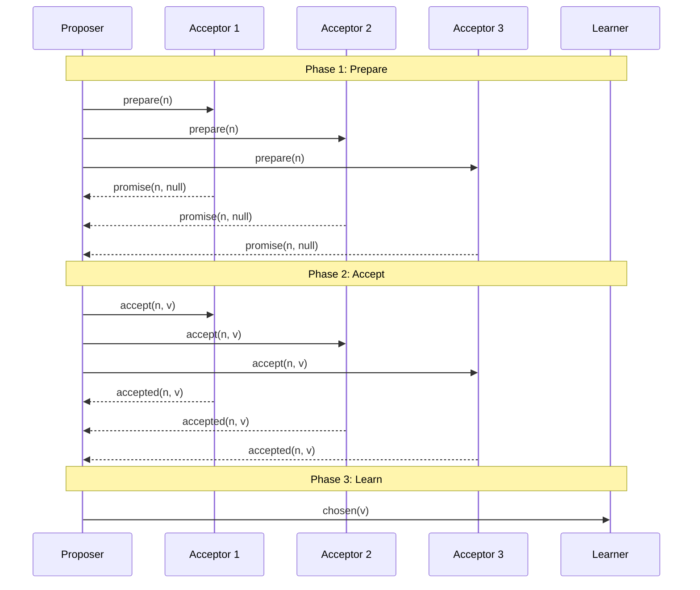
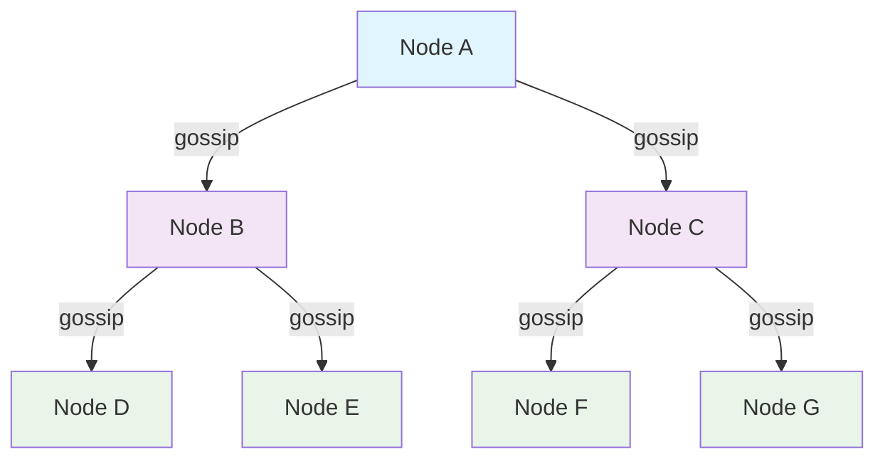
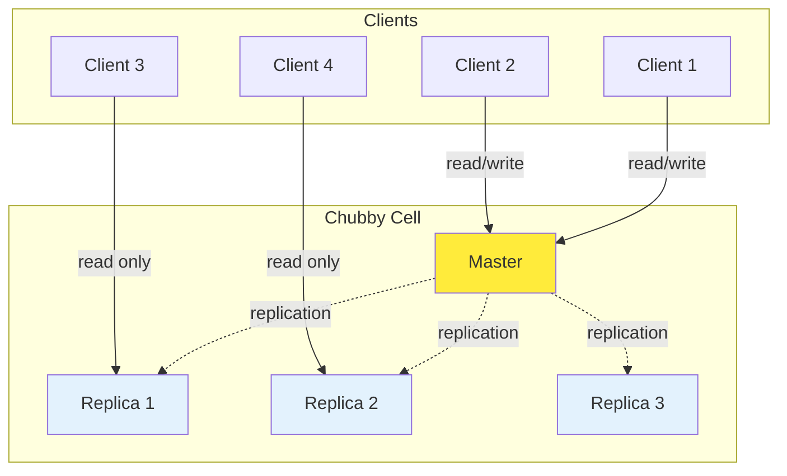
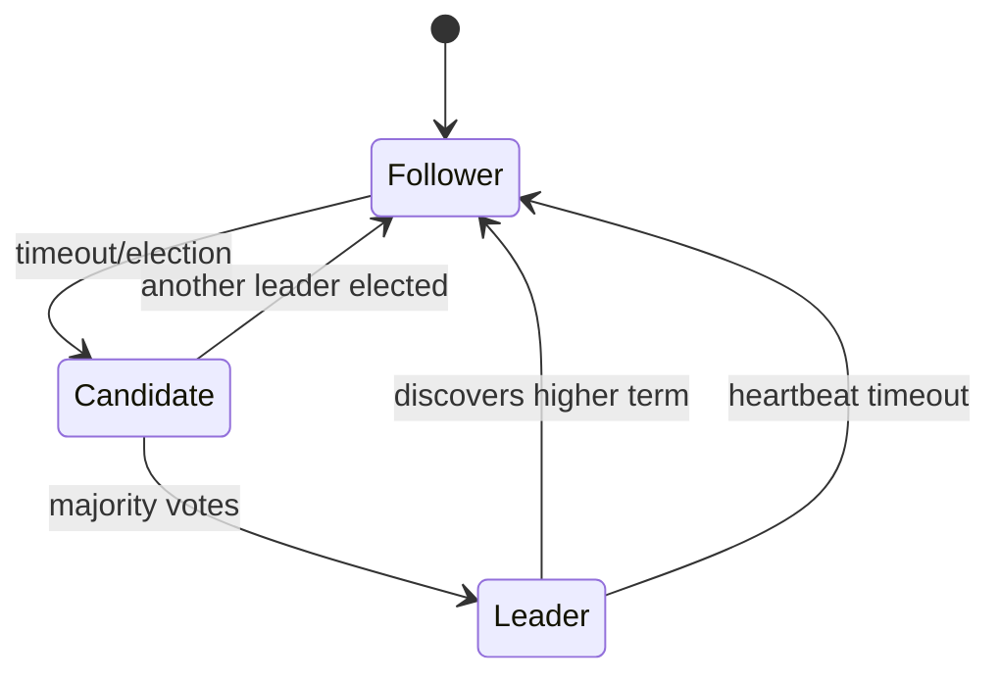
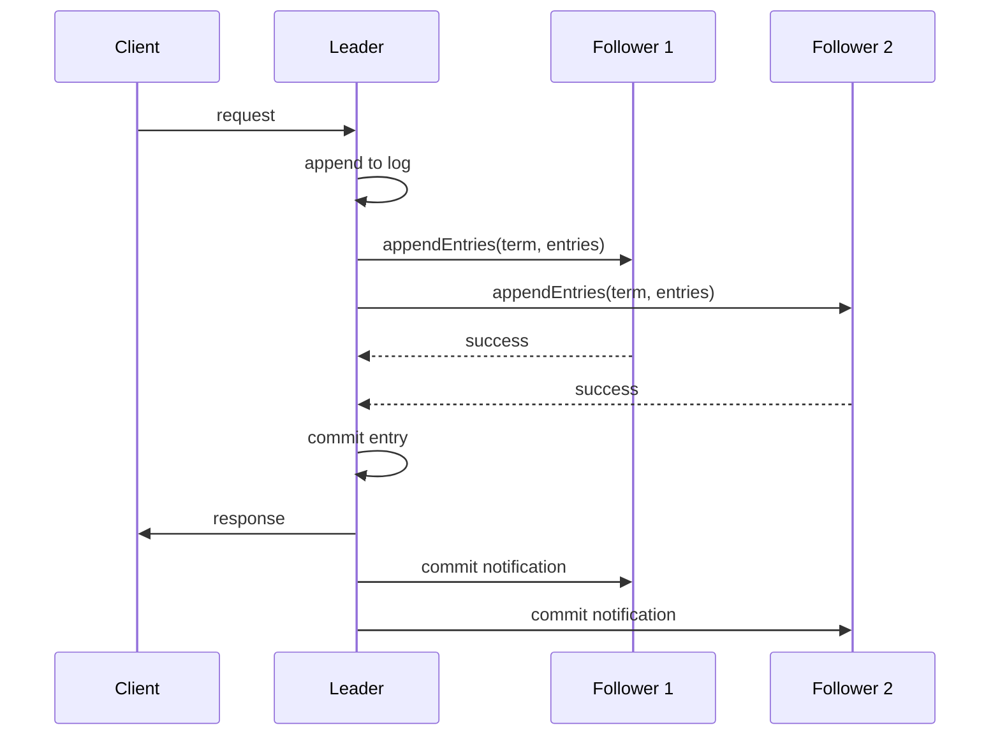
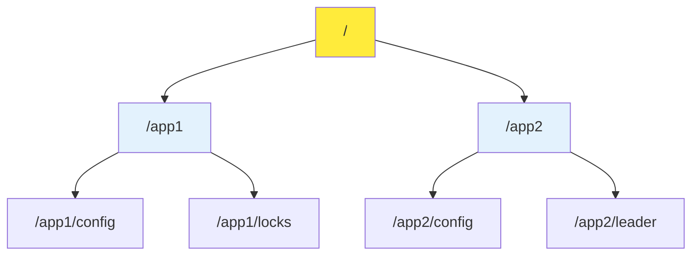

import Tabs from '@theme/Tabs';
import TabItem from '@theme/TabItem';

# Distributed Systems Protocols & Consensus Algorithms

This section covers advanced distributed systems protocols and consensus algorithms that are essential for building reliable, scalable distributed systems.

---

## Paxos

Paxos is a family of protocols for solving consensus in a network of unreliable processors. It's one of the most fundamental consensus algorithms in distributed systems.

### The Problem

What is the consensus problem?

The consensus problem involves getting a collection of processes to agree on a single value. The key requirements are:

- **Safety**: Only a value that has been proposed may be chosen
- **Safety**: Only a single value is chosen  
- **Safety**: A process never learns that a value has been chosen unless it actually has been
- **Liveness**: Some proposed value is eventually chosen
- **Liveness**: If a value has been chosen, then a process can eventually learn the value

### Paxos Algorithm Overview

### Key Components

<Tabs>
<TabItem value="proposers" label="Proposers" default>

**Proposers** initiate the consensus process by proposing values. They go through two phases:
1. **Prepare Phase**: Send prepare requests with proposal numbers
2. **Accept Phase**: Send accept requests with values

</TabItem>
<TabItem value="acceptors" label="Acceptors">

**Acceptors** respond to proposers and can accept proposals. They maintain:
- The highest proposal number they've seen
- The value they've accepted (if any)

</TabItem>
<TabItem value="learners" label="Learners">

**Learners** discover what values have been chosen. They can be notified by acceptors or proposers about chosen values.

</TabItem>
</Tabs>

:::tip
**Why Majority?** Paxos requires a majority of acceptors to agree because any two majorities have at least one acceptor in common. This ensures that only one value can be chosen.
:::

---

## Gossip Protocol

Gossip protocols are decentralized communication protocols that spread information through a network like a virus, eventually reaching all nodes.

### How Gossip Works

### Key Features

Failure Detection

Gossip protocols excel at failure detection in large distributed systems:

- **Decentralized**: No single point of failure
- **Scalable**: Works with thousands of nodes
- **Fault-tolerant**: Continues working even with node failures
- **Eventual consistency**: Information eventually reaches all nodes

Each node maintains a "gossip" about other nodes' health and shares this information with a subset of other nodes.

### Use Cases

<Tabs>
<TabItem value="failure-detection" label="Failure Detection" default>

**Failure Detection**: Nodes share reachability information to quickly determine when a node is down. Multiple independent sources confirm node failures.

</TabItem>
<TabItem value="monitoring" label="Resource Monitoring">

**Resource Monitoring**: Share node properties like load average, free memory, queue depths to enable load balancing decisions.

</TabItem>
<TabItem value="configuration" label="Configuration Distribution">

**Configuration Distribution**: Distribute configuration changes and metadata across the cluster without centralized coordination.

</TabItem>
</Tabs>

:::tip
**Gossip vs Centralized**: Gossip protocols avoid the availability and performance issues of centralized approaches while being more practical than strict consensus protocols like Paxos for large clusters.
:::

---

## Chubby Lock Service

Chubby is Google's lock service for loosely-coupled distributed systems, providing coarse-grained locking and reliable storage.

### Chubby Architecture

### Key Features

Design Goals

Chubby was designed with these priorities:
1. **Reliability**: High availability and consistency
2. **Simplicity**: Easy-to-understand semantics
3. **Scalability**: Support for thousands of clients
4. **Performance**: Secondary to reliability and availability

### Use Cases

<Tabs>
<TabItem value="leader-election" label="Leader Election" default>

**Leader Election**: Services use Chubby locks to elect a master from among equivalent servers. The lock holder becomes the leader.

</TabItem>
<TabItem value="metadata" label="Metadata Storage">

**Metadata Storage**: Store small amounts of critical metadata like master locations, configuration data, and service discovery information.

</TabItem>
<TabItem value="coordination" label="Coordination">

**Coordination**: Provide coarse-grained synchronization for distributed systems, especially for work partitioning and resource coordination.

</TabItem>
</Tabs>

### Chubby vs Other Systems

| Feature | Chubby | ZooKeeper | etcd |
|---------|--------|-----------|------|
| **Primary Use** | Lock service | Coordination | Key-value store |
| **Consistency** | Strong | Strong | Strong |
| **Interface** | File-like | Tree-like | Key-value |
| **Performance** | Low latency | Medium | High throughput |

:::tip
**Chubby's Impact**: Chubby influenced many distributed systems including ZooKeeper, etcd, and Consul. It demonstrated how to build reliable coordination services for large-scale systems.
:::

---

## Raft Consensus Algorithm

Raft is a consensus algorithm designed to be more understandable than Paxos while providing equivalent fault-tolerance and performance.

### Raft States

### Raft Components

<Tabs>
<TabItem value="leader" label="Leader" default>

**Leader**:
- Handles all client requests
- Sends heartbeat messages to followers
- Manages log replication

</TabItem>
<TabItem value="follower" label="Follower">

**Follower**:
- Responds to leader's requests
- Votes in elections
- Receives log entries from leader

</TabItem>
<TabItem value="candidate" label="Candidate">

**Candidate**:
- Requests votes from other servers
- Transitions to leader if majority votes received
- Returns to follower if another leader elected

</TabItem>
</Tabs>

### Log Replication Process

---

## ZooKeeper

Apache ZooKeeper is a centralized service for maintaining configuration information, naming, providing distributed synchronization, and providing group services.

### ZooKeeper Data Model

### ZooKeeper Guarantees

Sequential Consistency

Updates from a client will be applied in the order that they were sent. This means that if a client sends update A and then update B, all servers will see A before B.

Atomicity

Updates either succeed or fail - there are no partial results. This ensures data integrity across the distributed system.

Single System Image

A client will see the same view of the service regardless of the server it connects to. This provides a consistent interface across the cluster.

### Common ZooKeeper Patterns

<Tabs>
<TabItem value="leader-election" label="Leader Election" default>

**Leader Election**: Use ephemeral sequential nodes to implement leader election. The node with the smallest sequence number becomes the leader.

</TabItem>
<TabItem value="configuration" label="Configuration Management">

**Configuration Management**: Store configuration data in ZooKeeper nodes and use watchers to notify clients of changes.

</TabItem>
<TabItem value="locks" label="Distributed Locks">

**Distributed Locks**: Implement distributed locks using ephemeral nodes and watchers for lock acquisition and release.

</TabItem>
</Tabs>

---

## Comparison of Consensus Algorithms

<Tabs>
<TabItem value="overview" label="Overview" default>

| Algorithm | Complexity | Performance | Use Cases |
|-----------|------------|-------------|-----------|
| **Paxos** | High | Medium | General consensus |
| **Raft** | Medium | Medium | Log replication |
| **Gossip** | Low | High | Failure detection |
| **Chubby** | Medium | Low | Lock service |

</TabItem>
<TabItem value="trade-offs" label="Trade-offs">

**Paxos**: Most theoretically sound but complex to implement
**Raft**: Easier to understand, good for log replication
**Gossip**: Excellent for failure detection, eventual consistency
**Chubby**: Specialized for lock services, battle-tested at scale

</TabItem>
</Tabs>

:::tip
**Choosing the Right Algorithm**: Consider your specific requirements - do you need strong consistency (Paxos/Raft) or can you tolerate eventual consistency (Gossip)? Do you need a general consensus protocol or a specialized service like Chubby?
:::

---