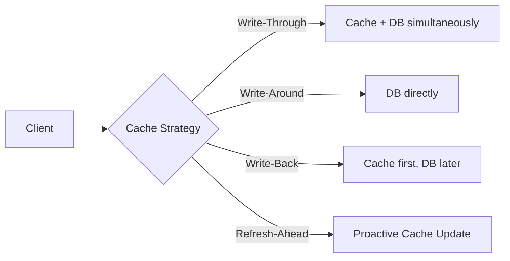
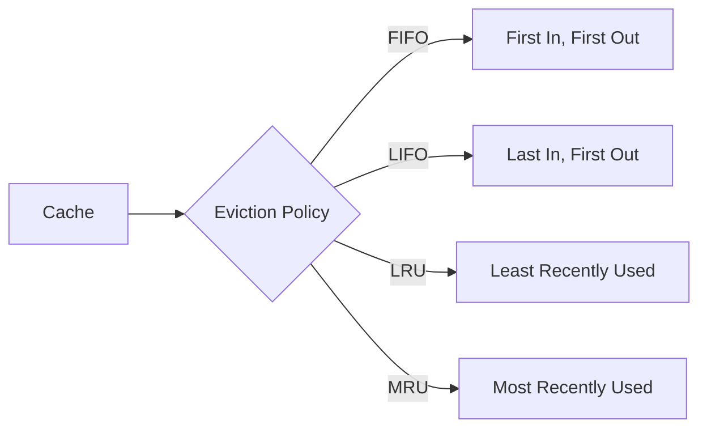
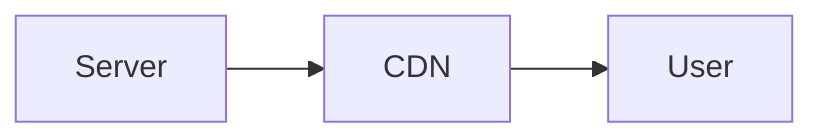
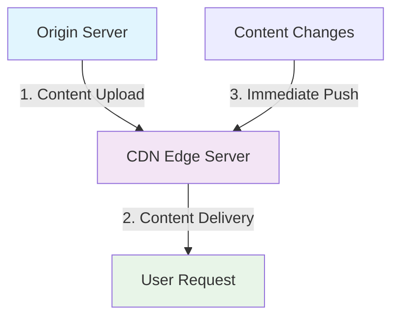
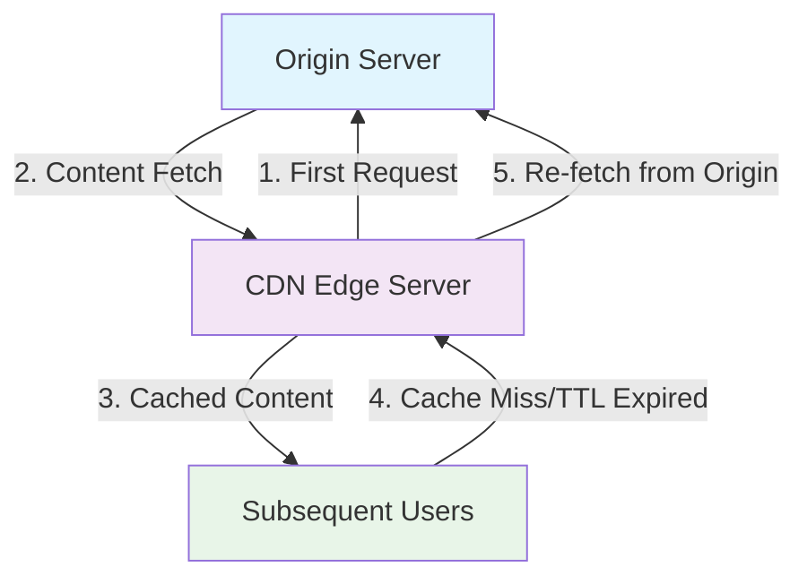

### What is Distributed Caching?
Caching takes advantage of `Locality of Reference` to speed up the process of serving data. If a requested data is found in the cache,
it is called a `cache hit`, if not, it is called a `cache miss` and the data has to be recomputed or fetched from its original storage location.

- Caching is the process of storing frequently used data in a cache.
- A cache is a temporary storage component area where the data is stored so that it can be accessed quickly in the future.
- Distributed caching is the process of caching data in multiple cache instances that are deployed in different servers.
- Distributed caching is used to improve the performance of applications by reducing the load on the database.
- Distributed caching is used to store data that is frequently accessed by applications, expensive to compute, shared by multiple users.

#### Cache Invalidation Strategies
- **Write-Through Cache:** In this strategy, data is written into the cache and the corresponding database at the same time. This ensures that the cache is never stale, but has the disadvantage of lower write performance due to the dual writes.
- **Write-Around Cache:** In this strategy, data is written directly to the storage, bypassing the cache. This is useful for very large datasets that are rarely accessed.
- **Write-Back Cache:** In this strategy, data is written to the cache and the write is immediately acknowledged to the client. The write to the backend storage is performed sometime later. This can improve write performance, but has the disadvantage of potential data loss in the event of a crash, since the only copy of the written data is in the cache.
- **Refresh Ahead Cache:** In this strategy, the cache is proactively refreshed in anticipation of future requests. This can help avoid the latency of cache misses, but runs the risk of refreshing data that is never read.

#### Cache Eviction Policies
- **First In, First Out (FIFO):** The cache evicts the first block accessed first without any regard to how often or how many times it was accessed before.
- **Last In, First Out (LIFO):** The cache evicts the block accessed most recently first without any regard to how often or how many times it was accessed before.
- **Least Recently Used (LRU):** Discards the least recently used items first.
- **Most Recently Used (MRU):** Discards, in contrast to LRU, the most recently used items first.

### What is a CDN
A content delivery network (CDN) is a **globally distributed network of proxy servers, serving content from locations closer to the user**. Generally, static files such as HTML/CSS/JS, photos, and videos are served from CDN, although some CDNs such as Amazon's CloudFront support dynamic content. The site's DNS resolution will tell clients which server to contact.

Serving content from CDNs can significantly improve performance in two ways:

- Users receive content from data centers close to them
- Your servers do not have to serve requests that the CDN fulfills

#### Push CDNs
Push CDNs receive new content whenever changes occur on your server. You take full responsibility for providing content, uploading directly to the CDN and rewriting URLs to point to the CDN. You can configure when content expires and when it is updated. Content is uploaded only when it is new or changed, minimizing traffic, but maximizing storage.

:::note
Sites with a small amount of traffic or sites with content that isn't often updated work well with push CDNs. Content is placed on the CDNs once, instead of being re-pulled at regular intervals.
::::

#### Pull CDNs
Pull CDNs grab new content from your server when the first user requests the content. You leave the content on your server and rewrite URLs to point to the CDN. This results in a slower request until the content is cached on the CDN.

A time-to-live (TTL) determines how long content is cached. Pull CDNs minimize storage space on the CDN, but can create redundant traffic if files expire and are pulled before they have actually changed.

Sites with heavy traffic work well with pull CDNs, as traffic is spread out more evenly with only recently-requested content remaining on the CDN.

**Disadvantage(s):** CDN
- CDN costs could be significant depending on traffic, although this should be weighed with additional costs you would incur not using a CDN.
- Content might be stale if it is updated before the TTL expires it.
- CDNs require changing URLs for static content to point to the CDN.
- Source(s) and further reading
- Globally distributed content delivery
The differences between push and pull CDNs
