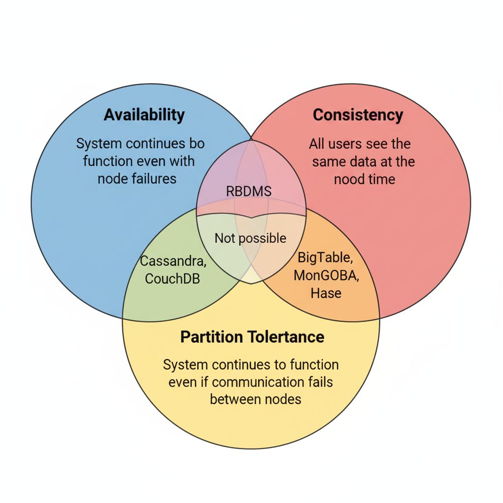
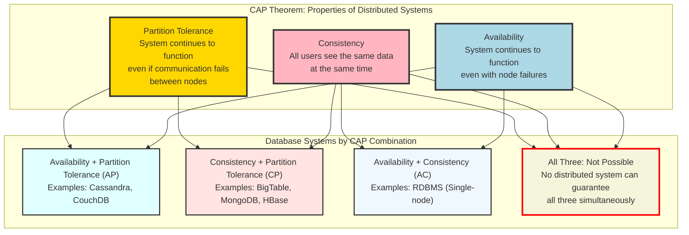

The CAP theorem states that it is impossible for a distributed system to simultaneously provide more than two out of three of the following guarantees:
- Consistency: Every read receives the most recent write or an error.
- Availability: Every request receives a (non-error) response, without the guarantee that it contains the most recent write.
- Partition tolerance: The system continues to operate despite an arbitrary number of messages being dropped (or delayed) by the network between nodes.

    
What is Consistency?

    - Consistency is the guarantee that all nodes in a distributed system will have the same data at the same time.
    - Consistency is usually measured as the time it takes for the data to be replicated across all nodes.
    - Consistency is usually measured in milliseconds.
    - A system that is highly consistent will have the same data across all nodes at the same time.

    
What is Partition Tolerance?

    - Partition Tolerance is the ability of a system to continue to function even if the network is partitioned.
    - A system that is highly partition tolerant will continue to function even if the network is partitioned.

    
What is Availability?

    - Availability is the time a system remains operational to perform its required function in a specific period.
    - Availability is usually measured as a percentage of uptime in a given year.
    - Availability = uptime / (uptime + downtime)
    - A system that is highly available will be able to provide service even if one or more of its components fail.
    - Any failing node can be replaced with a new node without affecting the service.

### CAP Theorem for Distributed Systems

Understanding the CAP theorem is crucial for designing distributed systems like newsfeed platforms. The CAP theorem states that a distributed system cannot simultaneously guarantee all three properties: Consistency, Availability, and Partition Tolerance.

#### CAP Theorem Implications for Newsfeed Systems

**For Newsfeed Systems, we typically choose AP (Availability + Partition Tolerance):**

- **Availability**: Users can always access their feed, even if some data is slightly stale
- **Partition Tolerance**: System continues working even if some servers are unreachable
- **Eventual Consistency**: Feed updates may take time to propagate, but eventually all users see the same data

**Why AP for Newsfeeds?**
- **User Experience**: Better to show slightly outdated content than no content at all
- **Scale**: Millions of users need constant access to their feeds
- **Tolerance**: Users can accept minor delays in seeing new posts from friends
- **Performance**: Allows for aggressive caching and optimization strategies

**Trade-offs:**
- Users might see posts in slightly different orders
- New posts might take a few seconds to appear in all followers' feeds
- Some users might see cached content while others see fresh content

