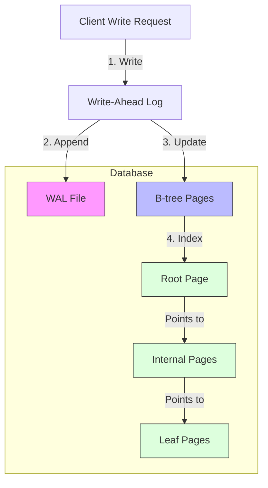
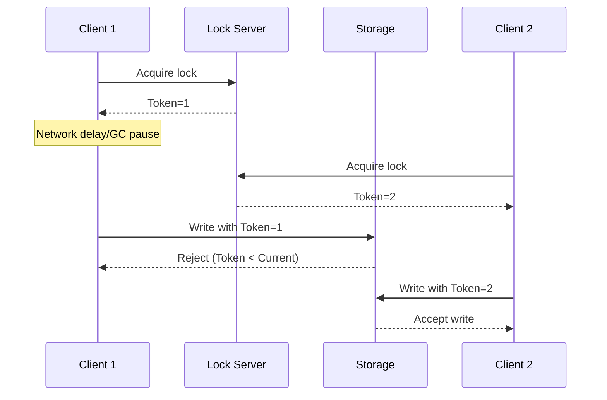

import Tabs from '@theme/Tabs';
import TabItem from '@theme/TabItem';

## Relational Databases
A relational database is a type of database that stores and provides access to data points that are related to one another.
There are no restrictions on the number of relationships that can be stored in a relational database.

In a relational database, the query optimizer automatically decides which parts of the query to execute in which order, and which indexes to use.

:::note
Anything that is meaningful to humans may need to change sometime in
the future—and if that information is duplicated, all the redundant copies need to be
updated.

Removing such duplication is the key idea behind `Normalization` in databases.
:::

On the `OLTP` side, `storage engines` originates from two main schools of thought:
- The log-structured school, which only permits appending to files and deleting
obsolete files, but never updates a file that has been written. Bitcask, SSTables,
LSM-trees, LevelDB, Cassandra, HBase, Lucene, and others belong to this group.
- The update-in-place school, which treats the disk as a set of fixed-size pages that
can be overwritten. B-trees are the biggest example of this philosophy, being used
in all major relational databases and also many non-relational ones.

### Indexes
The goal of an index is to speed up the retrieval of data from a database, to quickly find the rows that match the query.

The most common type of index is a `B-tree index`, which is well suited to the most common access pattern where you look up a single document by its key.

:::note
a B-tree with n keys always has a depth of O(log n).
Most databases can fit into a B-tree that is three or four levels deep, so you don’t need to follow many page references to find the page you are look‐
ing for.

(A four-level tree of 4 KB pages with a branching factor of 500 can store up to 256 TB.)
:::

In order to make the database resilient to crashes, it is common for B-tree implementations to include an additional data structure on disk:
a `write-ahead` log (WAL, also known as a redo log).
This is an append-only file to which every B-tree modification must be written before it can be applied to the pages of the tree itself.
When the database comes back up after a crash, this log is used to restore the B-tree back to a consistent state.

:::tip Performance
 Avoid using too many indexes, it is better to have a few indexes that are used frequently, than many indexes that are not used frequently.

Indexes are not used for write operations.
:::

    
How do Index decrease write performance?

    Indexes are stored in a separate file from the data, and they need to be updated when the data is updated.
    This means that writing to the database is slower when there are indexes.
    When writing to the database, the index also needs to be updated, which takes time.
    This is why indexes decrease write performance.
    This is why indexes are not used for write operations.

    
Why there is only one primary key in a table?

    There can only be one primary key in a table because it is used to identify the row uniquely.
    It would be difficult to identify the row uniquely, join the tables and perform transactions on the row. 

    It would be difficult to perform CRUD operations on the row.

### Transactions

    
What is BASE?

    - BASE is an acronym for Basically Available, Soft state, Eventual consistency.
    - BASE is a set of principles that inform how distributed systems should be designed.
    - BASE is an alternative to ACID.
    - BASE is used to describe the properties of many NoSQL databases.

    
What is ACID?

    - ACID is an acronym for Atomicity, Consistency, Isolation, Durability.
    - ACID is a set of principles that inform how distributed systems should be designed.
    - ACID is used to describe the properties of many SQL databases.

Most databases are accessed by several clients at the same time. That is no problem if
they are reading and writing different parts of the database, but if they are accessing
the same database records, you can run into concurrency problems (race conditions)

- **Atomic** : It refers to something that cannot be broken down into smaller parts.
The system can only be in the state it was before the operation
or after the operation, not something in between.
- **Isolation** : Isolation in the sense of ACID means that concurrently executing transactions are
isolated from each other: they cannot step on each other’s toes.
- **Durability** : Durability is the promise that once a transaction has committed successfully,
any data it has written will not be forgotten, even if there is a hardware fault or the database crashes.

:::tip
Atomicity can be implemented using a log for crash recovery, and isolation can be implemented
using a lock on each object (allowing only one thread to access an object at any one time).
:::

**A transaction is usually understood as a mechanism for grouping multiple operations on multiple objects into one
unit of execution.**

    
Read committed

Imagine a transaction has written some data to the database, but the transaction has not yet committed or aborted.
Can another transaction see that uncommitted data?
If yes, that is called a dirty read.
Transactions running at the read committed isolation level must prevent dirty reads.
This means that any writes by a transaction only become visible to others when that
transaction commits

**Read committed is a very popular isolation level.
It is the default setting in Oracle 11g, PostgresSQL, SQL Server 2012, MemSQL, and many other databases**

    
Write committed

Image two clients are trying to update the same data, one is part of a transaction, and the other is not.
If the non-transactional client overwrites the uncommited data of the transactional client, that is called a dirty write.
Most commonly, databases prevent dirty writes by using row-level locks: when a transaction wants to modify a
particular object (row or document), it must first acquire a lock on that object.
It must then hold that lock until the transaction is committed or aborted.
Only one transaction can hold the lock for any given object; if another transaction wants to write to the same object,
it must wait until the first transaction is committed or aborted before it can acquire the lock and continue

:::note
Locks and compare-and-set operations assume that there is a single up-to-date copy of the data.
However, databases with multi-leader or leaderless replication usually allow several writes to happen concurrently and replicate them asynchronously,
so they cannot guarantee that there is a single up-to-date copy of the data.
Thus, techniques based on locks or compare-and-set do not apply in this context.

A common approach in such replicated databases is to allow concurrent writes to create several conflicting versions of
a value (also known as siblings), and to use application code or special data structures to resolve and merge
these versions after the fact.
:::

**Transaction isolation** is primarily about avoiding race conditions due to concurrently executing transactions,
whereas **distributed consistency** is mostly about coordinating the state of replicas in the face of delays and faults.

---

### Column-family stores
In most OLTP databases, storage is laid out in a row-oriented fashion: all the values
from one row of a table are stored next to each other. Document databases are similar: an entire document is
typically stored as one contiguous sequence of bytes.

A `row-oriented` storage engine still needs to load all of those rows (each consisting of over 100 attributes) from
disk into memory, parse them, and filter out those that don't meet the required conditions, that can take a long time.
The idea behind `column-oriented` storage is simple: don't store all the values from one row together, but store all the values from each column together instead.

Often, the number of distinct values in a column is small compared to the number of rows.
`Bitmap Indexes` such as these are very well suited for the kinds of queries that are common in a data warehouse.

:::tip
Besides reducing the volume of data that needs to be loaded from disk, column-oriented storage layouts are also good
for making efficient use of CPU cycles. For example, the query engine can take a chunk of compressed column data that fits
comfortably in the CPU's L1 cache and iterate through it in a tight loop (that is, with no function calls).
:::

## NoSQL Databases
The main arguments in favor of the document data model are schema flexibility, better performance due to locality, and that for some applications it is closer to the data
structures used by the application.

#### Most common types of NoSQL databases
<Tabs>
<TabItem value="Key-value stores">

Key-value stores are a simple data model that store data in key-value pairs.

**Example:** Redis, DynamoDB, Riak
</TabItem>
<TabItem value="Document databases">

Document databases are a data model that store data in documents.

**Example:** MongoDB, Couchbase
</TabItem>
<TabItem value="Column-family or wide-column stores">

Column-family or wide-column stores are a data model that store data in columns.

**Example:** Cassandra, HBase
</TabItem>
<TabItem value="Graph databases">

Graph databases are a data model that store data in graphs.

**Example:** Neo4j, JanusGraph
</TabItem>
</Tabs>

---

The document model has limitations: for example, you cannot refer directly to a nested item within a document, but instead you need to say something like “the second item in the list of positions for user 251” (much like an access path in the hierarchical model).
 However, as long as documents are not too deeply nested, that is not usually a problem.
The locality advantage only applies if you need large parts of the document at the same time.

The relational model counters by providing better support for joins, and many-to-one and many-to-many relationships.

:::note
Document databases are sometimes called `schemaless`, but that's misleading, as the
code that reads the data usually assumes some kind of structure—i.e., there is an
implicit schema, but it is not enforced by the database.

A more accurate term is `schema-on-read` (the structure of the data is implicit, and only interpreted when the
data is read), in contrast with `schema-on-write` (the traditional approach of relational)
:::

    
Which data model leads to simpler application code?

    If the data in your application has a document-like structure (i.e., a tree of one-to many relationships, where
    typically the entire tree is loaded at once), then it's probably a good idea to use a document model.

    The poor support for joins in document databases may or may not be a problem,
    depending on the application.

---

:::note
Many different databases implement their proprietary binary encoding to send and receive data. They have a network
protocol over which we can send query and receive results over network protocol using DB drivers.
:::

### Fencing Tokens
When using a lock or lease to protect a resource from being accessed by multiple clients at the same time, it is
important to ensure that the lock or lease is released when the client no longer needs it.

If a client becomes unreachable while holding a lock or lease due to network delay or GC pause,
the resource may become unavailable
indefinitely. This is known as a `split-brain` situation. When the client come back alive it may assume that it still
holds the lock or lease, and start modifying the resource, even though another client may have acquired the lock or lease.

To prevent this, the lock or lease can be associated with a `fencing token`, which is an increasing value that changes
every time the lock or lease is acquired by `lock server`. When a client sends a write request it includes the
fencing token. If the fencing token has changed since the resource last saw it,
the lock or lease is considered to be held by another client, and the operation fails.

