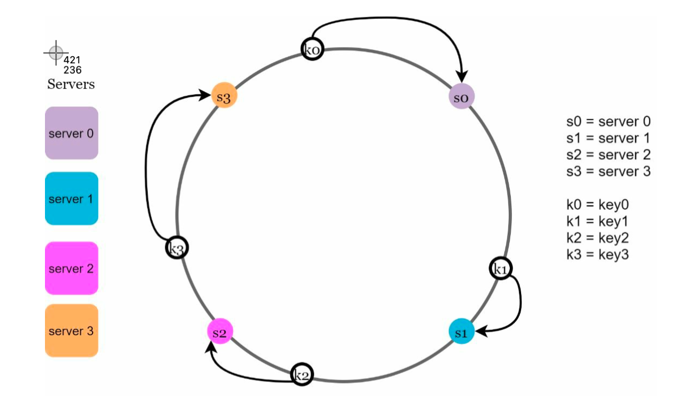
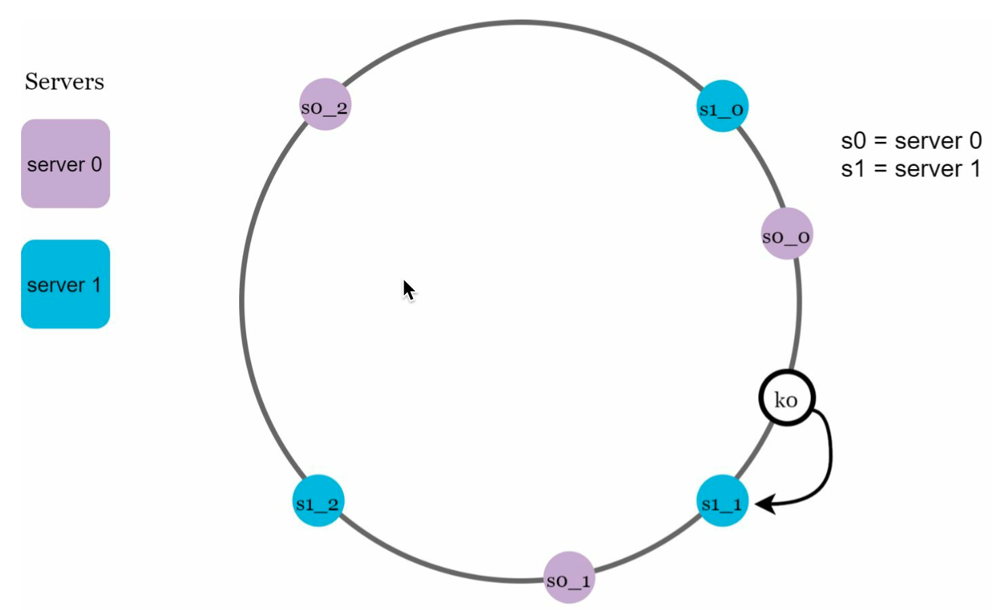

### What is Load Balancing?
Load balancing is the process of distributing network traffic across multiple servers.
Load balancing improves responsiveness and increases availability of applications, websites or databases.
- Load balancing is performed by an algorithm known as a load balancer.
- Load balancing is performed by a dedicated software or hardware such as a multilayer switch or a Domain Name System server.
- Load balancing can be implemented with hardware, software or a combination of both.
- Load balancing can be implemented at the network level, transport level and application level.
- Load balancing can be implemented with a single server or multiple servers.
- Load balancing can be implemented with a single data center or multiple data centers.
- Load balancing can be implemented with a single cloud provider or multiple cloud providers.

### What is a Load Balancer?
A load balancer is a device that acts as a reverse proxy and distributes network or application traffic across a number of servers.
- Load balancers are used to increase capacity (concurrent users) and reliability of applications.
- Load balancers can be implemented with hardware (expensive) or with software such as HAProxy, nginx or Apache (open source).
- Load balancers can be configured to check for failed servers and automatically remove them from the pool temporarily.
- Load balancers can also be configured to balance traffic across multiple data centers.
- Load balancers can be configured to use multiple algorithms to determine how to distribute traffic.
- Load balancers can route traffic based on various factors, including:
    - Random
    - Least loaded
    - Session/cookies
    - Round robin or weighted round robin
    - Layer 4
    - Layer 7

### Classifications of Load Balancers
- **Layer 4 Load Balancer**: A layer 4 load balancer operates at the network level.
 It forwards traffic based on IP address and port number. Layer 4 load balancers make routing decisions based on the source and destination IP addresses and ports, and are the most efficient load balancers.
- **Layer 7 Load Balancer**: A layer 7 load balancer operates at the application level, and can make routing decisions based on various characteristics of the HTTP header, cookies, or data within the application message itself.
 Layer 7 load balancers are more powerful, but also more resource intensive.

### What is a Reverse Proxy ?
A reverse proxy is a web server that centralizes internal services and provides unified interfaces to the public. Requests from clients are forwarded to a server that can fulfill it before the reverse proxy returns the server's response to the client.

Additional benefits include:

- Increased security - Hide information about backend servers, blacklist IPs, limit number of connections per client
- Increased scalability and flexibility - Clients only see the reverse proxy's IP, allowing you to scale servers or change their configuration
- SSL termination - Decrypt incoming requests and encrypt server responses so backend servers do not have to perform these potentially expensive operations
  - Removes the need to install X.509 certificates on each server
- Compression - Compress server responses
- Caching - Return the response for cached requests
- Static content - Serve static content directly
  - HTML/CSS/JS
  - Photos
  - Videos
  - Etc

#### Load balancer vs reverse proxy
- Deploying a load balancer is useful when you have multiple servers. Often, load balancers route traffic to a set of servers serving the same function.
- Reverse proxies can be useful even with just one web server or application server, opening up the benefits described in the previous section.
- Solutions such as NGINX and HAProxy can support both layer 7 reverse proxying and load balancing.

##### Disadvantage(s): reverse proxy
Introducing a reverse proxy results in increased complexity.
A single reverse proxy is a single point of failure, configuring multiple reverse proxies (ie a failover) further increases complexity.
### What is Consistent Hashing?
Consistent hashing is a special kind of hashing such that when a hash table is resized, only `K/n` keys need to be remapped on average, where `K` is the number of keys, and `n` is the number of slots.
- Consistent hashing is a scheme that provides hash table functionality in a way that the addition or removal of one slot does not significantly change the mapping of keys to slots.
- Consistent hashing is used to distribute the load among multiple servers while maintaining the same mapping from keys to servers.

:::warning Hashing Problem
- To store a key-value pair, the key is hashed to yield an integer, which is then mapped modulo the number of servers, `n`. This maps the key to one of the `n` servers.
- This approach is simple and works well until the number of servers changes. When a server is added, most keys have to be remapped to different servers. When a server is removed, even more keys have to be remapped to different servers.
- Applying modulus operation to the hash function can lead to uneven distribution of keys.
::::

### Hash Space and Hash Ring
- The hash space is a circle with values ranging from `0` to `2^32-1` (32-bit hash values).
- Each server is assigned a random value within the hash space.
- Connecting the two ends of the hash space creates a ring, called the hash ring.
- A partition is a space between two adjacent servers in the hash ring.

### Consistent Hashing Algorithm
- To map a key to a server, the hash value of the key is calculated, and then the hash ring is traversed clockwise until the first server is found, starting from the hash value of the key.
- If the hash value of the key is greater than the largest hash value of a server, the key is mapped to the first server in the hash ring.

**Issues**

    - Size of Ring is not fixed, it varies when servers are added or removed.
    - Size of partitions is not uniform, one partition can be very large and another can be very small.
    - Impossible to add or remove servers without remapping all the keys.

#### Virtual Nodes
- To solve the issues of Consistent Hashing, we can add virtual nodes to the hash ring.
- Each server is assigned multiple random values within the hash space.
- Each server is represented by multiple virtual nodes in the hash ring.
- Each virtual node is mapped to a single server.
- Each server is responsible for all the keys between it and its predecessor in the hash ring.
- The number of virtual nodes that a server is assigned is proportional to its capacity.

