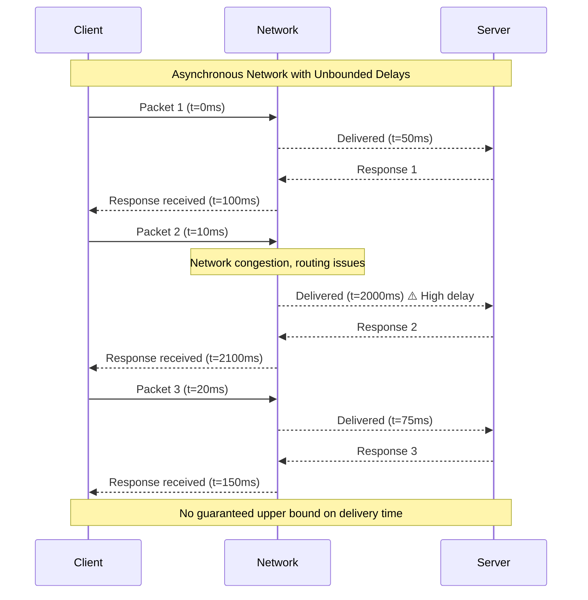
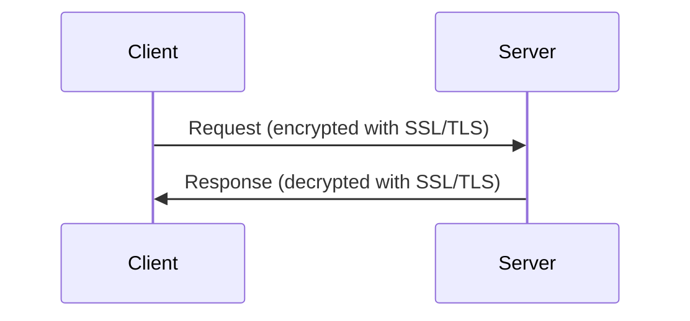
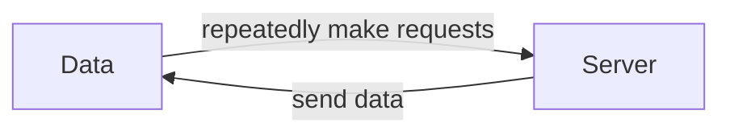
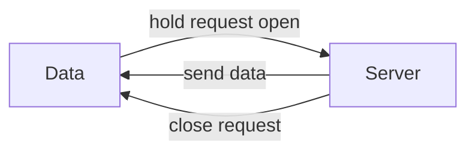
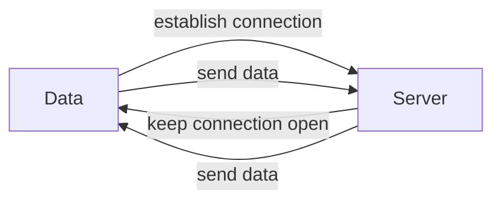

<details>
    <summary>Latency vs Response Time</summary>
    - Response time is the time taken to respond to a request.
    - Latency is the time request waiting to be handled - during which it was latent.
</details>

- `head-of-line` blocking: it only takes a small number of slow requests to hold up the processing of subsequent requests.
- An `SLO `is a target value or range of values for a service level that is measured, monitored, and reported.
- An `SLA `may state that the service is considered to be up if it has a median response time of less than 200 ms and a 99th percentile under 1 s (if the
response time is longer, it might as well be down), and the service may be required to be up at least 99.9% of the time.
These metrics set expectations for clients of the service and allow customers to demand a refund if the `SLA `is not met.


### Timeouts and unbounded delays

Asynchronous systems try to deliver packets as soon as possible, but there is no upper bound on how long it might take for a packet to be delivered.
This is called an `unbounded delay`.




<details>
<summary>**If a timeout is the only sure way of detecting a fault, then how long should the timeout be?**</summary>

    **There is unfortunately no simple answer.**
    - A short timeout will detect faults quickly, but it might also generate false positives.
    - A long timeout will generate fewer false positives, but it will take longer to detect actual faults.

    When a node is declared dead it's work is reassigned to other nodes. This is called `failover`. It burdens the
    other nodes and increases the latency of the system or even cause it to fail. This is called `cascading failure`.
</details>

In a public cloud and multi-tenant data centers, the network is a shared resource and the performance of the network can be unpredictable.
In such environment, we can measure the distribution of network latency and use it to set timeouts.
So rather than choosing constant timeout, the system can continuously measure network response time and their
variability(jitter) and adjust the timeout accordingly.

This is called `adaptive timeouts` and used by Google's Spanner, Cassandra and F1 systems.


### Sync vs Async
A traditional fixed line telephone is extremely reliable,
wouldn't it be nice to have similar reliability in computer networks.

A telephone line uses `circuit(a guranteed amount of bandwidth)` to establish a connection between two parties.
This kind of communication is called `synchronous` communication, there is no queuing.
A `circuit` is a dedicated path between two points in a network which is very different from the packet-switched (TCP)
networks, while internet shares bandwidth among multiple users dynamically.

The datacenters and internet are designed for burst traffic, so they don't have any guaranteed bandwidth and are
supposed to complete a job quickly.
Using `circuit` for some applications would be wasteful of network capacity.

---

## Protocols

### HTTP vs HTTPS

HTTP and HTTPS are protocols used for communication between a web browser and a server. While they serve similar purposes, they differ significantly in terms of security, functionality, and usage.

#### **Key Differences**

| Feature                  | HTTP (Hypertext Transfer Protocol)       | HTTPS (Hypertext Transfer Protocol Secure)  |
|--------------------------|------------------------------------------|---------------------------------------------|
| **Security**             | No encryption; data is transmitted as plaintext, making it vulnerable to interception (e.g., man-in-the-middle attacks). | Encrypts data using SSL/TLS, ensuring secure communication and protecting sensitive information. |
| **URL Format**           | URLs start with `http://`.        | URLs start with `https://` and display a padlock icon in the browser. |
| **Port**                 | Uses port 80 by default .          | Uses port 443 by default.            |
| **Certificate Requirement** | Does not require any certificates.      | Requires an SSL/TLS certificate issued by a trusted Certificate Authority (CA). The server provides an SSL certificate to the browser, which verifies the server's identity.|
| **Use Cases**            | Suitable for non-sensitive data or older websites. | Essential for websites handling sensitive data like passwords, financial transactions, or personal information. |
| **SEO Benefits**         | No direct impact on search rankings.     | Improves website authority and rankings in search engines like Google. |

#### **Why HTTPS is Preferred**
1. **Security**: Protects against eavesdropping, tampering, and man-in-the-middle attacks.
2. **Trust**: Users are more likely to trust websites with HTTPS due to visible security indicators like the padlock icon.
3. **Compliance**: Many regulations (e.g., GDPR) mandate secure data transmission.
4. **Performance**: Modern HTTPS implementations using HTTP/2 can improve website loading times compared to older HTTP versions [4].

<details>
<summary>
    **Where are private & Public Keys stored for HTTPS? Who gives the public key to the client? What is the role of SSL Certificate?**
</summary>
    - Private keys are stored on the server.
    - Public keys are stored on the client.
    - The server gives the public key to the client from the server's SSL certificate.
    - SSL certificate is a digital certificate that is used to verify the identity of the server.
    - SSL certificate is used to encrypt the data sent to the server.
    - SSL certificate is used to decrypt the data sent to the client.

    For example, Gmail, Google Chrome browser uses a public key(which will be given by the server) to encrypt the data sent to the server, and the server uses a private key to decrypt the data.
    SSL certificate is used to verify the identity of the server.


    ```mermaid
    sequenceDiagram
        participant Client
        participant Server
        
        Client->>Server: Request (encrypted with public key)
        Server->>Client: Response (decrypted with private key)
    ```
</details>

---


REST is not a protocol, but rather a design philosophy that builds upon the principles
of HTTP. It emphasizes simple data formats, using URLs for identifying
resources and using HTTP features for cache control, authentication, and content
type negotiation.

:::tip
Due to its widespread usage, the REST over HTTP-based API in obvious choice for most of the applications having
synchronous request-response communication.

REST excels in a situation where we want large scale effective caching of requests.
:::

:::warning
Though we can build asynchronous systems using REST, it is not the best choice for such systems compared to
alternatives for general microservices communication like gRPC, Kafka, RabbitMQ etc.
:::

:::tip
GraphQL's sweet spot is when we have a lot of clients that need different data from the same API.
These clients are usually GUI & mobile devices where we want to minimize the data.
:::

#### Challenge with GraphQL
Compared with REST-based HTTP APIs, caching is more complex with GraphQL because a single query can fetch data from
multiple endpoints, and the response can contain nested data structures.
This makes it difficult to determine which parts of the response are affected by a change in the underlying data,
and therefore which parts of the cache need to be invalidated.

Workaround this issue is associate an ID with every returned resource and use it in a client device for caching.

While GraphQL can handle writes, it doesn't seem to fit as well as for reads. This often leads to situation where
we have to use REST for writes and GraphQL for reads.

#### Shifting from REST's Endpoint-Based Approach to GraphQL’s Schema


<details>
    <summary>
#### Schema Definition
    </summary>
- **Challenge**: REST is structured around multiple endpoints(e.g. `\users`, `\posts`, `\comments`) and each endpoint has its own error-handling mechanism.
Whereas, GraphQL has a single endpoint and a single response format, which makes it challenging to implement a consistent error-handling mechanism.
- **Solution**: Define a GraphQL schema (.graphqls files) that represents types, queries, and mutations to replace multiple REST endpoints.
</details>

<details>
    <summary>
#### Error Handling Differences
    </summary>
- **Challenge**: REST uses HTTP status codes (200 OK, 404 Not Found, 500 Internal Server Error), but GraphQL always returns 200 OK with errors inside the response body.
- **Solution**: Implement a custom error-handling mechanism using GraphQLErrorHandler to ensure consistency in error reporting.
</details>

<details>
    <summary>
#### Authentication and Authorization Differences
    </summary>
- **Challenge**: In REST, security is usually enforced at the endpoint level (e.g., @PreAuthorize("hasRole('ADMIN')")), but in GraphQL, authorization must be handled inside resolvers.
- **Solution**: Use GraphQL Context to manage authentication and enforce role-based access control at the resolver level.
</details>

### SOAP
The API of a SOAP web service is described using an XML-based language called the
Web Services Description Language, or WSDL. WSDL enables code generation so
that a client can access a remote service using local classes and method calls (which
are encoded to XML messages and decoded again by the framework). This is useful in
statically typed programming languages, but less so in dynamically typed ones


As WSDL is not designed to be human-readable, and as SOAP messages are often too
complex to construct manually, users of SOAP rely heavily on tool support


### RPC
Using an RPC technology means adopting serialization and deserialization of data.
RPC frameworks define how data is encoded and decoded,
and how the remote procedure is called and the result is returned.
This is often done using a binary protocol, which is more efficient than text-based protocols like SOAP or REST.
However,
binary protocols are harder to debug and less interoperable between different programming languages and platforms.

A consumer needs to have access to the same interface definition that the producer used to generate the code.

:::tip
Avro RPC in an interesting outlier as it sends full schema information with every message, allowing for more flexibility in the data format.
:::

#### Difference between RPC and Local function calls
| Aspect | Local Function Call | Network Request |
|--------|-------------------|-----------------|
| Predictability | Predictable - succeeds or fails based on parameters under your control | Unpredictable - subject to network problems, machine availability, etc. Requires retry mechanisms |
| Return Behavior | Returns result, throws exception, or never returns (infinite loop/crash) | Additional outcome: may timeout without result, leaving uncertainty if request went through |
| Execution Time | Consistent execution time | Much slower and highly variable latency |
| Parameter Passing | Efficient passing of references/pointers to local memory | Parameters must be encoded to bytes for network transmission. Complex for large objects |


**gRPC(build to take advantage of HTTP/2) supports streams, where a call consists of not just one request and one response, but a series of requests and responses over time**


:::warning
The problem with RPC is that with every change, we need to generate new client stubs.
Client that wants to consume new method needs the new stubs.
This is manageable in small teams, but in large teams it becomes a problem.

Similarly, if we want to remove a field or rename a field or restructure an object, we need to maintain backward compatibility.
:::

---

### Message brokers
A topic provides only one-way dataflow. However, a consumer may itself publish messages to another topic (so you can chain
them together), or to a reply queue that is consumed by the sender of the original message (allowing a request/response dataflow, similar to RPC).

A variety of message brokers exists like RabbitMQ, Kafka, Amazon SQS, Google Cloud Pub/Sub etc.
Kafka's popularity is due to its high throughput, fault tolerance, and horizontal scalability making is more suitable for
stream processing pipelines.


:::tip
One of the easiest ways to provide guaranteed message delivery is to have the consumer acknowledge the message only after it has successfully processed the message.
One of the easiest ways to provide guaranteed message delivery is to resend the message if the consumer does not acknowledge it within a certain time.
:::

---

## Security Protocols

### SSL/TLS
SSL/TLS is a protocol that provides security for communication between two parties.
It is used to encrypt the data sent between two parties.



:::tip
TLS-1.3 is the latest version of SSL/TLS.
Different from TLS-1.2, TLS-1.3 does not use a master key to encrypt the data.
Instead, it uses a pre-shared key to encrypt the data.
This makes TLS-1.3 more secure and faster.
:::

### SSH
SSH is a protocol that provides security for communication between two parties.
It is used to encrypt the data sent between two parties.

### SSL Pinning
SSL pinning is a technique where the client stores the public key of the server in the client.
When the client makes a request to the server, the client sends the public key of the server to the server.
The server then uses the public key to encrypt the data sent to the client.
This makes the communication more secure.

:::tip
SSL pinning is a good way to ensure that the client is communicating with the correct server.
:::

### Certificate Transparency
Certificate transparency is a system where a certificate authority (CA) is publicly accountable for the certificates it issues.
This system allows the public to monitor the issuance of certificates and detect any unauthorized or fraudulent certificates.

:::tip
Certificate transparency is a good way to ensure that the server is using a valid certificate.
:::

---

## Long Polling vs WebSockets

Polling is a technique where the client makes a request to the server and the server sends the data to the client.


The problem with polling is that it is not efficient, it is a waste of resources.
The server is constantly sending data to the client, even if the client is not interested in the data.

### Long Polling
Long polling is a technique where the client makes a request to the server and the server holds the request open until new data is available.
The server then sends the data to the client and closes the request. Sometimes also referred as `Hanging GET` or `HTTP Streaming`.



### WebSockets
WebSockets is a protocol that allows for full-duplex communication between a client and a server.
It is a persistent connection between a client and a server that allows for real-time communication.
Client establishes a connection(WebSocket handshake) to the server and keeps it open.
WebSocket enables communication with lower latency and higher throughput, which is made possible by using a single TCP connection for both directions.



### Server Sent Events
Server Sent Events (SSE) is a technology where a browser receives automatic updates from a server via HTTP connection.
It is a simple way to push data from the server to the client.
It is a persistent connection between a client and a server that allows for real-time communication.
Client establishes a connection(SSE handshake) to the server and keeps it open.
SSE enables communication with lower latency and higher throughput, which is made possible by using a single TCP connection for both directions.
SSE is a good alternative to WebSockets for simple use cases.


### Difference between Long Polling, WebSockets and Server Sent Events
| Aspect | Long Polling | WebSockets | Server Sent Events |
|--------|-------------|------------|------------|
| Latency | High | Low | Low |
| Throughput | Low | High | Low |   
| Connection | Persistent | Persistent | Persistent |
| Protocol | HTTP | WebSocket | HTTP |
| Handshake | None | Yes | None |
| Data Transfer | Polling | Streaming | Streaming |

### When to use Long Polling, WebSockets and Server Sent Events
| Use Case | Long Polling | WebSockets | Server Sent Events |
|--------|-------------|------------|------------|
| Real-time communication | Yes | Yes | Yes |
| Low latency | Yes | Yes | Yes |
| High throughput | No | Yes | Yes |
| Simple use case | Yes | No | Yes |