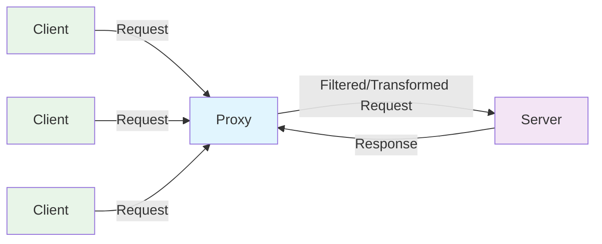
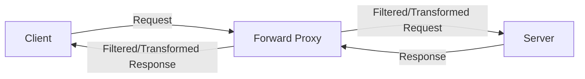
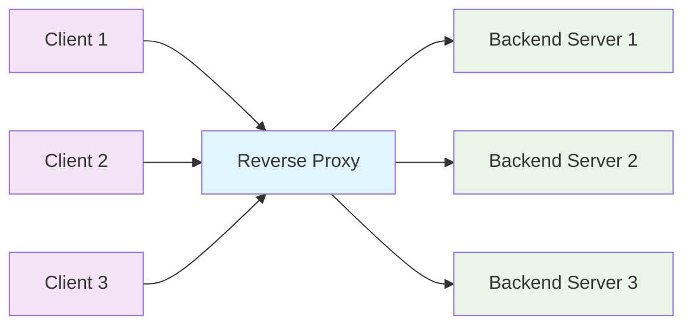

A proxy is a server that acts as an intermediary between a client and a server.
Client make connections to the proxy for web, file, or other requests, and the proxy makes connections to the server.

Typically, proxies are used to logging, transformation, filtering requests and responses, like adding authentication, authorization, rate limiting, caching, etc.

Proxies are commonly used to add functionality to a server.
- **Authentication:** Enforces authentication, authorization, and rate limiting policies to protect microservices from unauthorized access and abuse.
- **Protocol translation:** Translates incoming requests from external clients to the appropriate protocol and message format used by microservices.
- **Aggregation:** Combines multiple microservice responses into a single response to fulfill complex client requests.
- **Monitoring and logging:** Provides centralized monitoring and logging capabilities to track API usage and performance.
- **Caching:** Caches responses from microservices to improve response times and reduce load on backend services.

## Proxy Types
- **Forward Proxy:** A forward proxy is a proxy that sits between a client and a server.
    - **Anonymous Proxy:** An anonymous proxy is a proxy that does not reveal the client's IP address to the server.
    - **Transparent Proxy:** A transparent proxy is a proxy that is transparent to the client.
- **Reverse Proxy:** A reverse proxy is a proxy that sits between a server and a client.

## Forward Proxy
A forward proxy is a proxy that sits between a client and a server.
If exposed to the internet, it is called a `public forward proxy` or `Open Proxy`.

It is typically used to add authentication, authorization, rate limiting, caching, etc.

### Reverse Proxy 
A reverse proxy is a web server that centralizes internal services and provides unified interfaces to the public.
Requests from clients are forwarded to a server that can fulfill it before the reverse proxy returns the server's response to the client.

It is typically used to act on behalf of a client, apprearing as if requests are coming from the proxy.

Additional benefits include:

- Increased security - Hide information about backend servers, blacklist IPs, limit number of connections per client
- Increased scalability and flexibility - Clients only see the reverse proxy's IP, allowing you to scale servers or change their configuration
- SSL termination - Decrypt incoming requests and encrypt server responses so backend servers do not have to perform these potentially expensive operations
- Removes the need to install X.509 certificates on each server
- Compression - Compress server responses
- Caching - Return the response for cached requests
- Static content - Serve static content directly like HTML/CSS/JS, Photos, Videos , etc.

### Disadvantage(s): reverse proxy
Introducing a reverse proxy results in increased complexity.
- A single reverse proxy is a single point of failure
- Configuring multiple reverse proxies (ie a failover) further increases complexity.

---

### API Gateway

API Gateway is a design pattern that aggregates multiple microservice APIs into a single entry point, simplifying external access and enforcing security policies.
Key features of an API Gateway include:
- **Request routing:** Directs incoming requests to the appropriate microservice based on the request URL or parameters.
- **Security:** Enforces authentication, authorization, and rate limiting policies to protect microservices from unauthorized access and abuse.
- **Protocol translation:** Translates incoming requests from external clients to the appropriate protocol and message format used by microservices.
- **Aggregation:** Combines multiple microservice responses into a single response to fulfill complex client requests.
- **Monitoring and logging:** Provides centralized monitoring and logging capabilities to track API usage and performance.
- **Caching:** Caches responses from microservices to improve response times and reduce load on backend services.
API Gateways are commonly implemented using technologies like NGINX, Kong, Apigee, and AWS API Gateway.
