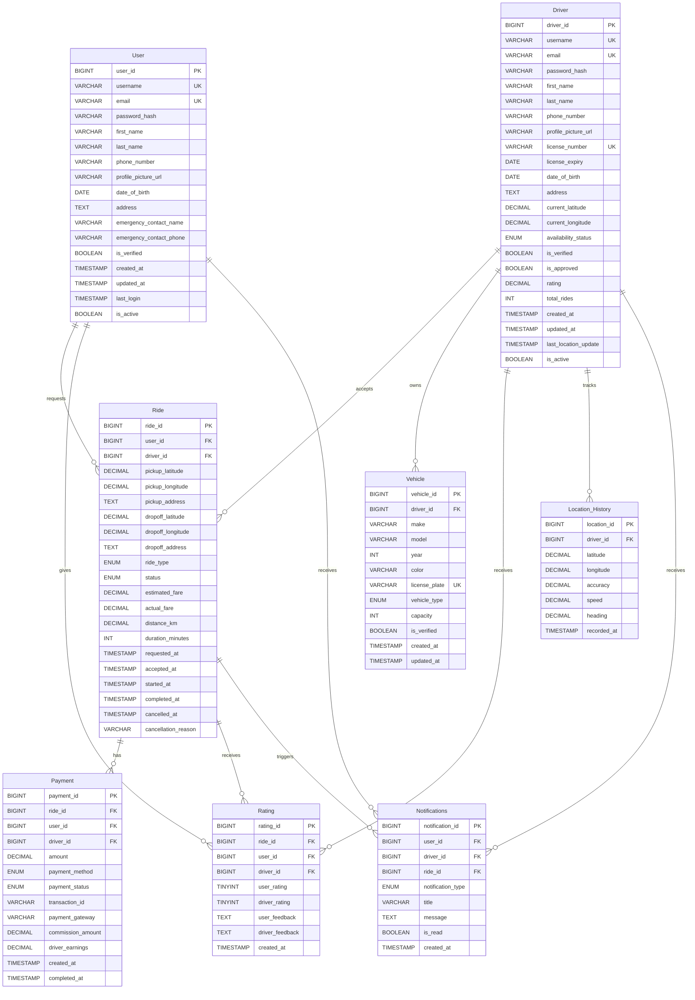
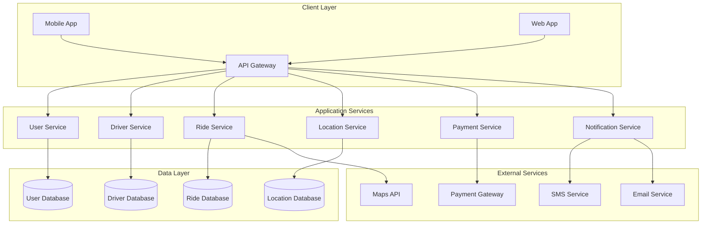
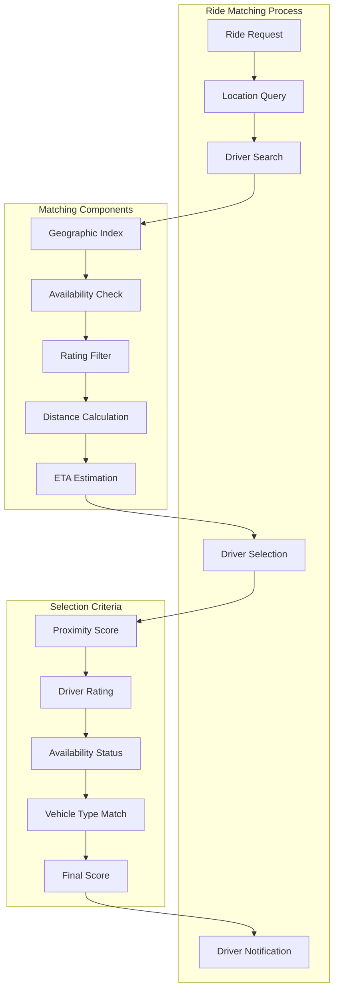
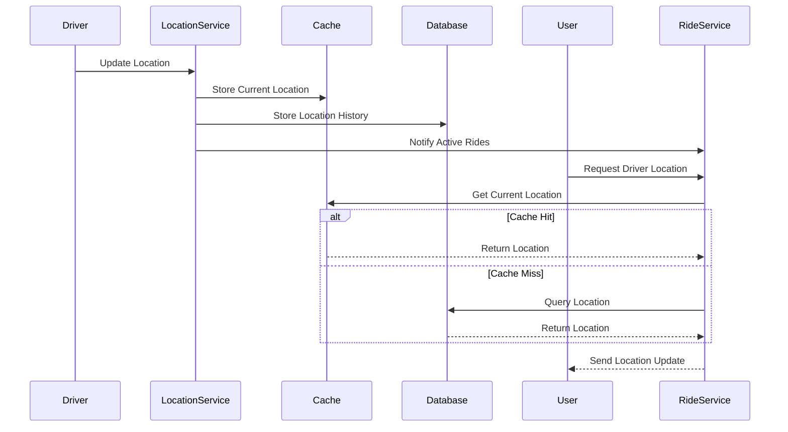
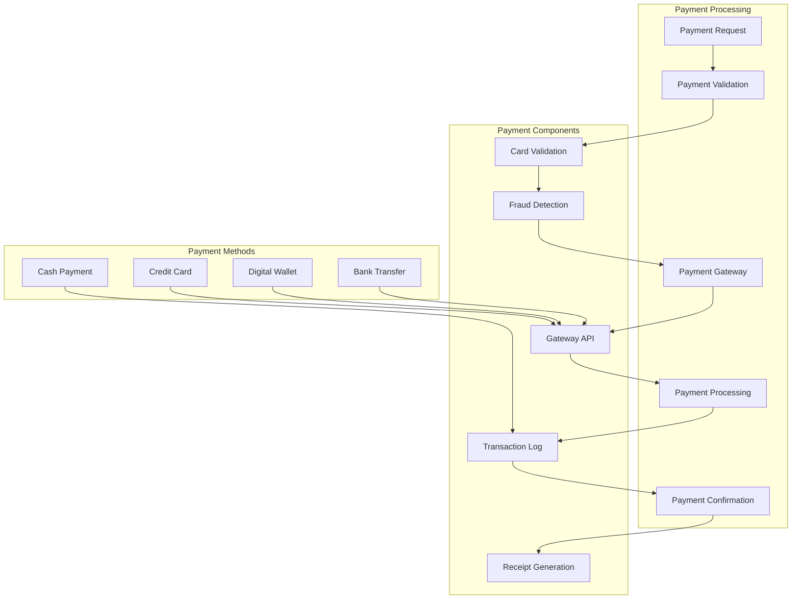
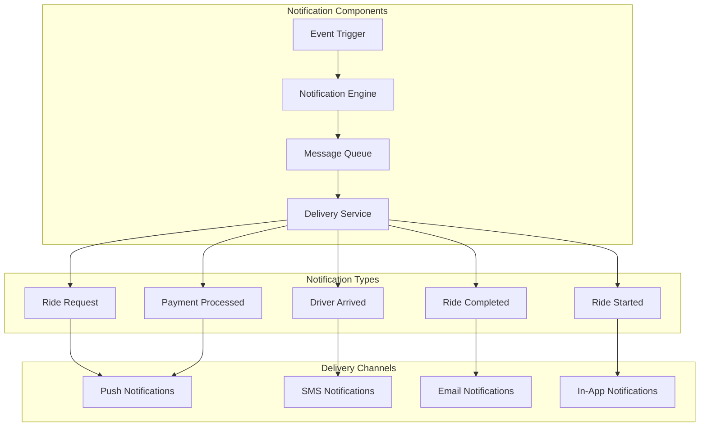
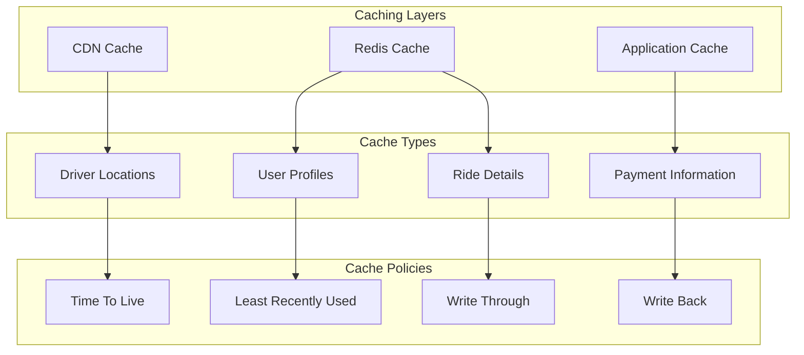

# Design a Cab Booking System like Uber
A Cab Booking system like Uber connects users with drivers in real-time. Users can book a cab, track the driver's location, and pay for the ride. Drivers can accept ride requests, navigate to pickup locations, and complete rides. The system handles real-time location tracking, driver matching, payment processing, and ride management.

### Requirements and Goals of the System
Let's discuss what features we will be designing so that we can come up with a set of useful requirements.

<details>
    <summary>**Functional Requirements**</summary>
    - The system should allow users to book a cab.
    - Drivers should regularly update their availability.
    - Users should be able to see available cabs in their vicinity.
    - The system should match users with the nearest available driver.
    - Users should be able to track the cab in real-time when ride is accepted.
    - The system should handle payments and provide receipts.
    - Users should be able to rate drivers and provide feedback.
</details>

<details>
    <summary>**Non-Functional Requirements**</summary>
    - The system should be highly available and reliable.
    - The system should have low latency to provide a smooth user experience.
    - The system should be scalable to handle a large number of users and drivers.
    - The system should ensure data consistency and integrity.
</details>

<details>
    <summary>**Extended Requirements**</summary>
    - The system should provide analytics and reporting features.
    - The system should support multiple payment methods.
    - The system should have a robust notification system for ride updates.
</details>

### Capacity Estimation and Constraints
Let's consider below assumptions:
- **Total Users**: 100 Million
- **Daily Active Users**: 10 Million
- **Daily Active Drivers**: 1 Million
- **Daily Rides**: 5 Million
- **Average Ride Duration**: 20 minutes
- **Location Update Frequency**: Every 3 seconds
- **Average Ride Distance**: 5 miles

<details>
    <summary>**Traffic**</summary>
    - Total rides per day: 5M
    - Rides per second: 5M / (24 * 3600) ≈ 58
    - Location updates per second: 1M drivers * (3600/3) = 1.2M updates/second
    - Peak traffic (rush hours): 3x normal = 174 rides/second, 3.6M location updates/second
</details>

<details>
    <summary>**Storage**</summary>
    - Each ride record: 1KB (ride details, payment, rating)
    - Daily ride storage: 5M * 1KB = 5GB
    - Location history per driver: 1MB per day
    - Total location storage: 1M drivers * 1MB = 1TB per day
    - Monthly storage: (5GB + 1TB) * 30 = 30TB
    - Yearly storage: 30TB * 12 = 360TB
</details>

<details>
    <summary>**Bandwidth**</summary>
    - Location updates: 1.2M * 20 bytes = 24MB/second
    - Ride requests: 58 * 1KB = 58KB/second
    - Total incoming: 24MB + 58KB ≈ 24MB/second
    - Total outgoing: 24MB/second (location broadcasts)
</details>

<details>
    <summary>**Memory**</summary>
    - Active driver locations: 1M * 20 bytes = 20MB
    - Active ride sessions: 5M * 1KB = 5GB
    - Driver availability cache: 1M * 1KB = 1GB
    - Total memory requirement: ~6GB for active data
</details>

### API Design
This problem can be decomposed into several main components:
- **User Service:** Handles user registration, authentication, and profile management.
- **Driver Service:** Handles driver registration, authentication, and profile management.
- **Ride Service:** Handles ride booking, matching, tracking, and completion.
- **Location Service:** Handles real-time location tracking and updates.
- **Payment Service:** Handles payment processing and receipts.
- **Notification Service:** Handles real-time notifications and updates.

import Tabs from '@theme/Tabs';
import TabItem from '@theme/TabItem';

<Tabs>
<TabItem value="User Service">
```java
/**
POST API to create a new user
api/v1/users
    api_dev_key - A developer key to track the user
    user_id - ID of the user
    name - User's name
    email - User's email
    phone_number - User's phone number
returns: success or error message
*/
String createUser(String api_dev_key, String user_id, String name, String email, String phone_number)

/**
GET API to get user profile
api/v1/users/{user_id}
    api_dev_key - A developer key
    user_id - ID of the user
returns: user profile or error message
*/
UserProfile getUserProfile(String api_dev_key, String user_id)

/**
PUT API to update user profile
api/v1/users/{user_id}
    api_dev_key - A developer key
    user_id - ID of the user
    profile_data - Updated profile information
returns: success or error message
*/
String updateUserProfile(String api_dev_key, String user_id, UserProfile profile_data)
```
</TabItem>
<TabItem value="Driver Service">
```java
/**
POST API to register a new driver
api/v1/drivers
    api_dev_key - A developer key
    driver_id - ID of the driver
    name - Driver's name
    email - Driver's email
    phone_number - Driver's phone number
    vehicle_info - Vehicle information
    license_number - Driver's license number
returns: success or error message
*/
String registerDriver(String api_dev_key, String driver_id, String name, String email, String phone_number, VehicleInfo vehicle_info, String license_number)

/**
POST API to update driver location
api/v1/drivers/{driver_id}/location
    api_dev_key - A developer key
    driver_id - ID of the driver
    latitude - Current latitude
    longitude - Current longitude
    availability_status - Driver's availability status
returns: success or error message
*/
String updateDriverLocation(String api_dev_key, String driver_id, double latitude, double longitude, String availability_status)

/**
GET API to get nearby drivers
api/v1/drivers/nearby
    api_dev_key - A developer key
    user_latitude - User's latitude
    user_longitude - User's longitude
    radius - Search radius in meters
returns: list of nearby drivers
*/
List<Driver> getNearbyDrivers(String api_dev_key, double user_latitude, double user_longitude, int radius)
```
</TabItem>
<TabItem value="Ride Service">
```java
record Location(double latitude, double longitude) {}

enum RideStatus {
    REQUESTED,
    DRIVER_ASSIGNED,
    DRIVER_ARRIVED,
    IN_PROGRESS,
    COMPLETED,
    CANCELLED
}

/**
POST API to request a ride
api/v1/rides
    api_dev_key - A developer key
    user_id - ID of the user requesting the ride
    pickup_location - Pickup location
    dropoff_location - Dropoff location
    ride_type - Type of ride (economy, premium, etc.)
returns: ride_id or error message
*/
String requestRide(String api_dev_key, String user_id, Location pickup_location, Location dropoff_location, String ride_type)

/**
POST API to accept a ride
api/v1/rides/{ride_id}/accept
    api_dev_key - A developer key
    driver_id - ID of the driver accepting the ride
    ride_id - ID of the ride
returns: success or error message
*/
String acceptRide(String api_dev_key, String driver_id, String ride_id)

/**
GET API to get ride status
api/v1/rides/{ride_id}/status
    api_dev_key - A developer key
    ride_id - ID of the ride
returns: ride status and details
*/
RideStatus getRideStatus(String api_dev_key, String ride_id)

/**
POST API to start a ride
api/v1/rides/{ride_id}/start
    api_dev_key - A developer key
    driver_id - ID of the driver
    ride_id - ID of the ride
returns: success or error message
*/
String startRide(String api_dev_key, String driver_id, String ride_id)

/**
POST API to complete a ride
api/v1/rides/{ride_id}/complete
    api_dev_key - A developer key
    driver_id - ID of the driver
    ride_id - ID of the ride
    final_location - Final location
returns: success or error message
*/
String completeRide(String api_dev_key, String driver_id, String ride_id, Location final_location)
```
</TabItem>
<TabItem value="Payment Service">
```java
/**
POST API to process payment
api/v1/payments
    api_dev_key - A developer key
    ride_id - ID of the ride
    payment_method - Payment method (credit_card, digital_wallet, etc.)
    amount - Payment amount
returns: payment_id or error message
*/
String processPayment(String api_dev_key, String ride_id, String payment_method, double amount)

/**
GET API to get payment receipt
api/v1/payments/{payment_id}/receipt
    api_dev_key - A developer key
    payment_id - ID of the payment
returns: payment receipt
*/
PaymentReceipt getPaymentReceipt(String api_dev_key, String payment_id)

/**
POST API to refund payment
api/v1/payments/{payment_id}/refund
    api_dev_key - A developer key
    payment_id - ID of the payment
    refund_amount - Amount to refund
returns: refund_id or error message
*/
String refundPayment(String api_dev_key, String payment_id, double refund_amount)
```
</TabItem>
<TabItem value="Rating Service">
```java
/**
POST API to rate a ride
api/v1/rides/{ride_id}/rate
    api_dev_key - A developer key
    user_id - ID of the user rating
    ride_id - ID of the ride
    driver_rating - Rating for the driver (1-5)
    driver_feedback - Feedback for the driver
returns: success or error message
*/
String rateDriver(String api_dev_key, String user_id, String ride_id, int driver_rating, String driver_feedback)

/**
POST API to rate a passenger
api/v1/rides/{ride_id}/rate-passenger
    api_dev_key - A developer key
    driver_id - ID of the driver rating
    ride_id - ID of the ride
    passenger_rating - Rating for the passenger (1-5)
    passenger_feedback - Feedback for the passenger
returns: success or error message
*/
String ratePassenger(String api_dev_key, String driver_id, String ride_id, int passenger_rating, String passenger_feedback)
```
</TabItem>
</Tabs>

### Database Schema
We need to store user data, driver data, ride information, payments, and ratings. Below is a comprehensive schema for the database:

#### Core Tables

<Tabs>
<TabItem value="User">
```sql
CREATE TABLE User (
    user_id BIGINT PRIMARY KEY,
    username VARCHAR(50) UNIQUE NOT NULL,
    email VARCHAR(100) UNIQUE NOT NULL,
    password_hash VARCHAR(255) NOT NULL,
    first_name VARCHAR(50),
    last_name VARCHAR(50),
    phone_number VARCHAR(20),
    profile_picture_url VARCHAR(500),
    date_of_birth DATE,
    address TEXT,
    emergency_contact_name VARCHAR(100),
    emergency_contact_phone VARCHAR(20),
    is_verified BOOLEAN DEFAULT FALSE,
    created_at TIMESTAMP DEFAULT CURRENT_TIMESTAMP,
    updated_at TIMESTAMP DEFAULT CURRENT_TIMESTAMP ON UPDATE CURRENT_TIMESTAMP,
    last_login TIMESTAMP,
    is_active BOOLEAN DEFAULT TRUE,
    INDEX idx_email (email),
    INDEX idx_phone (phone_number),
    INDEX idx_created_at (created_at)
);
```
</TabItem>
<TabItem value="Driver">
```sql
CREATE TABLE Driver (
    driver_id BIGINT PRIMARY KEY,
    username VARCHAR(50) UNIQUE NOT NULL,
    email VARCHAR(100) UNIQUE NOT NULL,
    password_hash VARCHAR(255) NOT NULL,
    first_name VARCHAR(50),
    last_name VARCHAR(50),
    phone_number VARCHAR(20),
    profile_picture_url VARCHAR(500),
    license_number VARCHAR(50) UNIQUE NOT NULL,
    license_expiry DATE,
    date_of_birth DATE,
    address TEXT,
    current_latitude DECIMAL(10, 8),
    current_longitude DECIMAL(11, 8),
    availability_status ENUM('AVAILABLE', 'BUSY', 'OFFLINE') DEFAULT 'OFFLINE',
    is_verified BOOLEAN DEFAULT FALSE,
    is_approved BOOLEAN DEFAULT FALSE,
    rating DECIMAL(3, 2) DEFAULT 0.00,
    total_rides INT DEFAULT 0,
    created_at TIMESTAMP DEFAULT CURRENT_TIMESTAMP,
    updated_at TIMESTAMP DEFAULT CURRENT_TIMESTAMP ON UPDATE CURRENT_TIMESTAMP,
    last_location_update TIMESTAMP,
    is_active BOOLEAN DEFAULT TRUE,
    INDEX idx_email (email),
    INDEX idx_phone (phone_number),
    INDEX idx_license (license_number),
    INDEX idx_availability (availability_status),
    INDEX idx_location (current_latitude, current_longitude),
    INDEX idx_rating (rating)
);
```
</TabItem>
<TabItem value="Vehicle">
```sql
CREATE TABLE Vehicle (
    vehicle_id BIGINT PRIMARY KEY,
    driver_id BIGINT NOT NULL,
    make VARCHAR(50) NOT NULL,
    model VARCHAR(50) NOT NULL,
    year INT NOT NULL,
    color VARCHAR(30),
    license_plate VARCHAR(20) UNIQUE NOT NULL,
    vehicle_type ENUM('SEDAN', 'SUV', 'HATCHBACK', 'LUXURY') DEFAULT 'SEDAN',
    capacity INT DEFAULT 4,
    is_verified BOOLEAN DEFAULT FALSE,
    created_at TIMESTAMP DEFAULT CURRENT_TIMESTAMP,
    updated_at TIMESTAMP DEFAULT CURRENT_TIMESTAMP ON UPDATE CURRENT_TIMESTAMP,
    FOREIGN KEY (driver_id) REFERENCES Driver(driver_id),
    INDEX idx_driver (driver_id),
    INDEX idx_license_plate (license_plate),
    INDEX idx_type (vehicle_type)
);
```
</TabItem>
<TabItem value="Ride">
```sql
CREATE TABLE Ride (
    ride_id BIGINT PRIMARY KEY,
    user_id BIGINT NOT NULL,
    driver_id BIGINT,
    pickup_latitude DECIMAL(10, 8) NOT NULL,
    pickup_longitude DECIMAL(11, 8) NOT NULL,
    pickup_address TEXT,
    dropoff_latitude DECIMAL(10, 8) NOT NULL,
    dropoff_longitude DECIMAL(11, 8) NOT NULL,
    dropoff_address TEXT,
    ride_type ENUM('ECONOMY', 'PREMIUM', 'LUXURY', 'SHARED') DEFAULT 'ECONOMY',
    status ENUM('REQUESTED', 'DRIVER_ASSIGNED', 'DRIVER_ARRIVED', 'IN_PROGRESS', 'COMPLETED', 'CANCELLED') DEFAULT 'REQUESTED',
    estimated_fare DECIMAL(10, 2),
    actual_fare DECIMAL(10, 2),
    distance_km DECIMAL(8, 2),
    duration_minutes INT,
    requested_at TIMESTAMP DEFAULT CURRENT_TIMESTAMP,
    accepted_at TIMESTAMP NULL,
    started_at TIMESTAMP NULL,
    completed_at TIMESTAMP NULL,
    cancelled_at TIMESTAMP NULL,
    cancellation_reason VARCHAR(200),
    FOREIGN KEY (user_id) REFERENCES User(user_id),
    FOREIGN KEY (driver_id) REFERENCES Driver(driver_id),
    INDEX idx_user (user_id),
    INDEX idx_driver (driver_id),
    INDEX idx_status (status),
    INDEX idx_requested_at (requested_at),
    INDEX idx_pickup_location (pickup_latitude, pickup_longitude)
);
```
</TabItem>
</Tabs>

<Tabs>
<TabItem value="Payment">
```sql
CREATE TABLE Payment (
    payment_id BIGINT PRIMARY KEY,
    ride_id BIGINT NOT NULL,
    user_id BIGINT NOT NULL,
    driver_id BIGINT NOT NULL,
    amount DECIMAL(10, 2) NOT NULL,
    payment_method ENUM('CREDIT_CARD', 'DEBIT_CARD', 'DIGITAL_WALLET', 'CASH') NOT NULL,
    payment_status ENUM('PENDING', 'COMPLETED', 'FAILED', 'REFUNDED') DEFAULT 'PENDING',
    transaction_id VARCHAR(100),
    payment_gateway VARCHAR(50),
    commission_amount DECIMAL(10, 2),
    driver_earnings DECIMAL(10, 2),
    created_at TIMESTAMP DEFAULT CURRENT_TIMESTAMP,
    completed_at TIMESTAMP NULL,
    FOREIGN KEY (ride_id) REFERENCES Ride(ride_id),
    FOREIGN KEY (user_id) REFERENCES User(user_id),
    FOREIGN KEY (driver_id) REFERENCES Driver(driver_id),
    INDEX idx_ride (ride_id),
    INDEX idx_user (user_id),
    INDEX idx_driver (driver_id),
    INDEX idx_status (payment_status),
    INDEX idx_created_at (created_at)
);
```
</TabItem>
<TabItem value="Rating">
```sql
CREATE TABLE Rating (
    rating_id BIGINT PRIMARY KEY,
    ride_id BIGINT NOT NULL,
    user_id BIGINT NOT NULL,
    driver_id BIGINT NOT NULL,
    user_rating TINYINT CHECK (user_rating >= 1 AND user_rating <= 5),
    driver_rating TINYINT CHECK (driver_rating >= 1 AND driver_rating <= 5),
    user_feedback TEXT,
    driver_feedback TEXT,
    created_at TIMESTAMP DEFAULT CURRENT_TIMESTAMP,
    FOREIGN KEY (ride_id) REFERENCES Ride(ride_id),
    FOREIGN KEY (user_id) REFERENCES User(user_id),
    FOREIGN KEY (driver_id) REFERENCES Driver(driver_id),
    INDEX idx_ride (ride_id),
    INDEX idx_user (user_id),
    INDEX idx_driver (driver_id),
    INDEX idx_created_at (created_at)
);
```
</TabItem>
<TabItem value="Location_History">
```sql
CREATE TABLE Location_History (
    location_id BIGINT PRIMARY KEY,
    driver_id BIGINT NOT NULL,
    latitude DECIMAL(10, 8) NOT NULL,
    longitude DECIMAL(11, 8) NOT NULL,
    accuracy DECIMAL(8, 2),
    speed DECIMAL(8, 2),
    heading DECIMAL(8, 2),
    recorded_at TIMESTAMP DEFAULT CURRENT_TIMESTAMP,
    FOREIGN KEY (driver_id) REFERENCES Driver(driver_id),
    INDEX idx_driver (driver_id),
    INDEX idx_recorded_at (recorded_at),
    INDEX idx_location (latitude, longitude)
);
```
</TabItem>
<TabItem value="Notifications">
```sql
CREATE TABLE Notifications (
    notification_id BIGINT PRIMARY KEY,
    user_id BIGINT,
    driver_id BIGINT,
    ride_id BIGINT,
    notification_type ENUM('RIDE_REQUEST', 'RIDE_ACCEPTED', 'DRIVER_ARRIVED', 'RIDE_STARTED', 'RIDE_COMPLETED', 'PAYMENT_PROCESSED') NOT NULL,
    title VARCHAR(200),
    message TEXT,
    is_read BOOLEAN DEFAULT FALSE,
    created_at TIMESTAMP DEFAULT CURRENT_TIMESTAMP,
    FOREIGN KEY (user_id) REFERENCES User(user_id),
    FOREIGN KEY (driver_id) REFERENCES Driver(driver_id),
    FOREIGN KEY (ride_id) REFERENCES Ride(ride_id),
    INDEX idx_user (user_id),
    INDEX idx_driver (driver_id),
    INDEX idx_ride (ride_id),
    INDEX idx_type (notification_type),
    INDEX idx_unread (is_read),
    INDEX idx_created_at (created_at)
);
```
</TabItem>
</Tabs>

#### Entity Relationship Diagram



### Step-by-Step Architecture Design

To better understand the system, let's break down the architecture into smaller, manageable components:

#### 1. Core Services Architecture



#### 2. Ride Matching Flow



#### 3. Real-time Location Tracking



#### 4. Payment Processing Flow



#### 5. Notification System



#### 6. Caching Strategy



### High Level Design

Now that we understand the individual components, here's how they all work together:

```mermaid
graph TB
    subgraph "Client Layer"
        Mobile[Mobile Apps]
        Web[Web Applications]
        DriverApp[Driver Apps]
    end
    
    subgraph "Load Balancing & API Gateway"
        LoadBalancer[Load Balancer]
        APIGateway[API Gateway]
        RateLimiter[Rate Limiter]
    end
    
    subgraph "Application Services"
        UserService[User Service]
        DriverService[Driver Service]
        RideService[Ride Service]
        LocationService[Location Service]
        PaymentService[Payment Service]
        NotificationService[Notification Service]
        AnalyticsService[Analytics Service]
    end
    
    subgraph "Caching Layer"
        RedisCluster[Redis Cluster]
        Memcached[Memcached]
        CDN[CDN]
    end
    
    subgraph "Database Layer"
        UserDB[(User Database)]
        DriverDB[(Driver Database)]
        RideDB[(Ride Database)]
        LocationDB[(Location Database)]
        PaymentDB[(Payment Database)]
    end
    
    subgraph "Search & Indexing"
        Elasticsearch[Elasticsearch]
        GeoIndex[Geographic Index]
        SearchEngine[Search Engine]
    end
    
    subgraph "External Services"
        MapsAPI[Google Maps API]
        PaymentGateway[Payment Gateway]
        SMSService[SMS Service]
        EmailService[Email Service]
        PushService[Push Notification Service]
    end
    
    subgraph "Message Queue"
        Kafka[Apache Kafka]
        RabbitMQ[RabbitMQ]
    end
    
    subgraph "Monitoring & Analytics"
        Logging[Logging Service]
        Metrics[Metrics Collection]
        Alerting[Alerting System]
    end
    
    Mobile --> LoadBalancer
    Web --> LoadBalancer
    DriverApp --> LoadBalancer
    
    LoadBalancer --> APIGateway
    APIGateway --> RateLimiter
    RateLimiter --> UserService
    RateLimiter --> DriverService
    RateLimiter --> RideService
    RateLimiter --> LocationService
    RateLimiter --> PaymentService
    RateLimiter --> NotificationService
    RateLimiter --> AnalyticsService
    
    UserService --> UserDB
    DriverService --> DriverDB
    RideService --> RideDB
    LocationService --> LocationDB
    PaymentService --> PaymentDB
    
    UserService --> RedisCluster
    DriverService --> RedisCluster
    RideService --> RedisCluster
    LocationService --> RedisCluster
    
    RideService --> Elasticsearch
    LocationService --> GeoIndex
    DriverService --> SearchEngine
    
    RideService --> MapsAPI
    PaymentService --> PaymentGateway
    NotificationService --> SMSService
    NotificationService --> EmailService
    NotificationService --> PushService
    
    NotificationService --> Kafka
    AnalyticsService --> Kafka
    AnalyticsService --> RabbitMQ
    
    UserService --> Logging
    DriverService --> Logging
    RideService --> Logging
    LocationService --> Logging
    
    Logging --> Metrics
    Metrics --> Alerting
```



### Topics of Discussion

At a high level, we need to handle real-time location tracking, driver matching, and payment processing for a ride-sharing platform.

The topic of discussion for this problem is mainly around the following components:
- How to handle real-time location updates efficiently.
- How to match users with the nearest available drivers.
- How to handle surge pricing and dynamic pricing.

#### Key Challenges

1. **Real-time Location Tracking**: 
   - Handling millions of location updates per second
   - Efficient storage and retrieval of location data
   - Managing location history and analytics

2. **Driver Matching**:
   - Finding the nearest available drivers
   - Balancing load across drivers
   - Handling driver preferences and ratings

3. **Scalability Issues**:
   - High-frequency location updates
   - Real-time matching algorithms
   - Payment processing at scale

#### Solutions

Below are some of the possible solutions:

- **Geographic Indexing**: Use spatial data structures like QuadTree or R-tree for efficient location queries
- **Caching Strategy**: Multi-layer caching for hot location data and user profiles
- **Message Queues**: Use Kafka or RabbitMQ for handling high-frequency location updates
- **Database Sharding**: Partition data based on geographic regions or user IDs
- **Load Balancing**: Distribute load across multiple servers and regions

:::warning
- Location data is sensitive and requires proper privacy controls
- Need to handle driver safety and emergency situations
- Consider data retention policies for location history
:::

### AI Generation Prompts

For creating high-quality diagrams using AI tools like ChatGPT, Gemini, or Claude, use these prompts:

#### 1. Entity Relationship Diagram
```
Create a comprehensive ER diagram for a ride-sharing system with the following entities:
- User (user_id, profile info, contact details)
- Driver (driver_id, license info, vehicle details, location)
- Vehicle (vehicle_id, make, model, license_plate)
- Ride (ride_id, pickup/dropoff locations, status, fare)
- Payment (payment_id, amount, method, status)
- Rating (rating_id, user_rating, driver_rating, feedback)
- Location_History (location_id, driver_id, coordinates, timestamp)
- Notifications (notification_id, type, message, delivery_status)

Include all relationships, foreign keys, and cardinalities. Use a professional color scheme with clear labels.
```

#### 2. System Architecture Diagram
```
Design a high-level system architecture diagram for a ride-sharing platform showing:
- Client layer (mobile apps, web apps)
- API Gateway and Load Balancer
- Microservices (User, Driver, Ride, Location, Payment, Notification services)
- Database layer (User DB, Driver DB, Ride DB, Location DB)
- Caching layer (Redis, CDN)
- External services (Maps API, Payment Gateway, SMS/Email services)
- Message queues (Kafka, RabbitMQ)

Use different colors for each layer and show data flow with arrows.
```

#### 3. Ride Matching Flow
```
Create a detailed flowchart showing the ride matching process:
- User requests a ride
- System finds nearby drivers
- Geographic indexing and filtering
- Driver selection algorithm
- Notification to selected driver
- Driver acceptance/rejection handling

Use decision diamonds for algorithmic steps and rectangles for processes.
```

#### 4. Real-time Location Tracking
```
Design a sequence diagram showing real-time location tracking:
- Driver updates location
- Location service processes update
- Cache and database updates
- User requests driver location
- Location retrieval and delivery

Include all services, databases, and caches with proper timing and alternatives.
```

#### 5. Payment Processing Flow
```
Create a payment processing workflow diagram showing:
- Payment request initiation
- Payment validation and fraud detection
- Payment gateway integration
- Transaction processing
- Receipt generation and confirmation

Use different shapes for each process step and show error handling paths.
```

#### 6. Notification System Architecture
```
Design a notification system architecture showing:
- Event triggers (ride requests, driver updates, payment confirmations)
- Notification engine and message queue
- Delivery channels (push, SMS, email, in-app)
- User preference management
- Rate limiting and batching

Use different colors for each notification type and delivery channel.
```

#### 7. Geographic Data Management
```
Create a geographic data management diagram showing:
- Location update ingestion
- Spatial indexing (QuadTree/R-tree)
- Geographic partitioning
- Location history storage
- Proximity search algorithms

Include data flow and storage strategies for location data.
```

#### 8. High-Level System Overview
```
Design a comprehensive system overview diagram showing the complete ride-sharing platform:
- All microservices and their interactions
- Database clusters and geographic partitioning
- Caching layers and CDN
- External integrations (Maps, Payment, Communication)
- Monitoring and analytics
- Security and authentication layers

Use a professional color scheme with clear service boundaries and data flow indicators.
```
