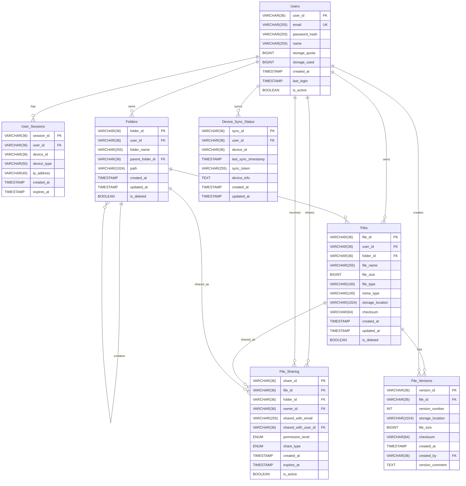

import Tabs from '@theme/Tabs';
import TabItem from '@theme/TabItem';

# Design a Cloud Storage System like Dropbox or Google Drive

A Cloud Storage System like Dropbox or Google Drive provides users with the ability to store, sync, and share files across multiple devices. This system enables users to access their files from anywhere, collaborate with others, and maintain data consistency across all their devices.

## Table of Contents

1. [Requirements and Goals of the System](#requirements-and-goals-of-the-system)
2. [Capacity Estimation and Constraints](#capacity-estimation-and-constraints)
3. [API Design](#api-design)
4. [Database Design](#database-design)
5. [High-Level Design](#high-level-design)
6. [Step-by-Step Architecture Design](#step-by-step-architecture-design)
7. [Topics of Discussion](#topics-of-discussion)
8. [AI Generation Prompts](#ai-generation-prompts)

### Requirements and Goals of the System

<details>
<summary>**Functional Requirements**</summary>
- Users should be able to upload files of various types and sizes
- Users should be able to download and access their files from any device
- Users should be able to organize files into folders and subfolders
- Users should be able to share files and folders with other users
- Users should be able to sync files across multiple devices automatically
- Users should be able to search for files by name, type, or content
- Users should be able to restore previous versions of files
- Users should be able to set permissions on shared files/folders
- Users should be able to collaborate on files in real-time
</details>

<details>
<summary>**Non-Functional Requirements**</summary>
- The system should be highly reliable with 99.99% availability
- The system should provide data durability with 99.999999999% (eleven nines)
- The system should be highly scalable to support millions of users
- The system should provide strong consistency for metadata operations
- The system should support eventual consistency for file synchronization
- The system should handle large files (up to several GB) efficiently
- The system should provide fast file access with low latency
- The system should support offline access with sync when online
</details>

<details>
<summary>**Extended Requirements**</summary>
- File versioning and history tracking
- Advanced search capabilities (content-based search)
- File encryption at rest and in transit
- Integration with third-party applications
- Mobile app support with offline capabilities
- Bandwidth optimization for large files
- Real-time collaboration features
- Advanced sharing and permission management
</details>

### Capacity Estimation and Constraints

Let's consider the following assumptions for a cloud storage system:

- **Total Users**: 500 million registered users
- **Daily Active Users**: 100 million users
- **Average Files per User**: 1,000 files
- **Average File Size**: 2 MB
- **Daily New Files**: 50 million files
- **Daily File Modifications**: 20 million files
- **Average Folder Depth**: 5 levels
- **Shared Files**: 20% of all files are shared
- **Read to Write Ratio**: 10:1 (read-heavy system)

<details>
<summary>**Traffic Estimation**</summary>
- **File Uploads per second**: 50M / (24 * 3600) ≈ 580 uploads/sec
- **File Downloads per second**: 10 * 580 ≈ 5,800 downloads/sec
- **Metadata Operations per second**: 100 * 580 ≈ 58,000 operations/sec
- **Sync Operations per second**: 200 * 580 ≈ 116,000 operations/sec
</details>

<details>
<summary>**Storage Requirements**</summary>
- **Total Files**: 500M users * 1,000 files = 500 billion files
- **Total Raw Storage**: 500B files * 2MB = 1,000 PB (1 Exabyte)
- **With Replication (3x)**: 1,000 PB * 3 = 3,000 PB (3 Exabytes)
- **Metadata Storage**: 500B files * 1KB metadata = 500 TB
- **Daily New Storage**: 50M files * 2MB = 100 TB per day
- **Total Storage with Growth**: 3,000 PB + (100 TB * 365 days) ≈ 3,036 PB
</details>

<details>
<summary>**Bandwidth Requirements**</summary>
- **Upload Bandwidth**: 50M files * 2MB = 100 TB per day ≈ 1.16 GB/sec
- **Download Bandwidth**: 5,800 files/sec * 2MB = 11.6 GB/sec
- **Sync Bandwidth**: 116,000 operations/sec * 1KB = 116 MB/sec
- **Peak Bandwidth**: 3x average = 35 GB/sec
</details>

<details>
<summary>**Memory Requirements**</summary>
- **Metadata Cache**: 20% of metadata = 100 TB * 20% = 20 TB
- **Hot File Cache**: 5% of total files = 1,000 PB * 5% = 50 PB
- **CDN Cache**: 10% of total files = 1,000 PB * 10% = 100 PB
</details>

:::tip
**Storage Optimization Techniques:**
- **Deduplication**: Can reduce storage by 30-50% for common files
- **Compression**: Can reduce storage by 20-40% for text files
- **Tiered Storage**: Hot data on SSD, cold data on cheaper storage
- **Erasure Coding**: More efficient than replication for large files
:::


### API Design

We will design REST APIs for our cloud storage system. The system will have the following main services:

- **File Service:** Handle file upload, download, and management operations
- **Folder Service:** Manage folder structure and organization
- **User Service:** Handle user authentication and profile management
- **Sharing Service:** Manage file sharing and permissions
- **Sync Service:** Handle file synchronization across devices
- **Search Service:** Provide file search and discovery capabilities
- **Version Service:** Manage file versions and history

<Tabs>
<TabItem value="File Service">
```java
/**
POST API to upload a file
api/v1/files/upload
    user_id - ID of the user uploading the file
    file_name - Name of the file
    file_size - Size of the file in bytes
    file_type - MIME type of the file
    parent_folder_id - ID of the parent folder
    file_data - Binary file data
returns: file_id and upload status
*/
String uploadFile(String user_id, String file_name, long file_size, String file_type, String parent_folder_id, byte[] file_data)

/**
GET API to download a file
api/v1/files/{file_id}/download
    user_id - ID of the user requesting the file
    file_id - ID of the file to download
returns: file data stream
*/
InputStream downloadFile(String user_id, String file_id)

/**
PUT API to update a file
api/v1/files/{file_id}
    user_id - ID of the user updating the file
    file_id - ID of the file to update
    file_data - New file data
returns: success or error message
*/
String updateFile(String user_id, String file_id, byte[] file_data)

/**
DELETE API to delete a file
api/v1/files/{file_id}
    user_id - ID of the user deleting the file
    file_id - ID of the file to delete
returns: success or error message
*/
String deleteFile(String user_id, String file_id)

/**
POST API to copy a file
api/v1/files/{file_id}/copy
    user_id - ID of the user copying the file
    file_id - ID of the file to copy
    destination_folder_id - ID of the destination folder
returns: new file_id
*/
String copyFile(String user_id, String file_id, String destination_folder_id)

/**
POST API to move a file
api/v1/files/{file_id}/move
    user_id - ID of the user moving the file
    file_id - ID of the file to move
    destination_folder_id - ID of the destination folder
returns: success or error message
*/
String moveFile(String user_id, String file_id, String destination_folder_id)
```

</TabItem>
<TabItem value="Folder Service">
```java
/**
POST API to create a folder
api/v1/folders
    user_id - ID of the user creating the folder
    folder_name - Name of the folder
    parent_folder_id - ID of the parent folder
returns: folder_id
*/
String createFolder(String user_id, String folder_name, String parent_folder_id)

/**
GET API to get folder contents
api/v1/folders/{folder_id}/contents
    user_id - ID of the user requesting folder contents
    folder_id - ID of the folder
    page - Page number for pagination
    limit - Number of items per page
returns: list of files and subfolders
*/
List<FileItem> getFolderContents(String user_id, String folder_id, int page, int limit)

/**
PUT API to rename a folder
api/v1/folders/{folder_id}
    user_id - ID of the user renaming the folder
    folder_id - ID of the folder to rename
    new_name - New name for the folder
returns: success or error message
*/
String renameFolder(String user_id, String folder_id, String new_name)

/**
DELETE API to delete a folder
api/v1/folders/{folder_id}
    user_id - ID of the user deleting the folder
    folder_id - ID of the folder to delete
    recursive - Whether to delete contents recursively
returns: success or error message
*/
String deleteFolder(String user_id, String folder_id, boolean recursive)
```

</TabItem>
<TabItem value="User Service">
```java
/**
POST API to create a new user
api/v1/users
    email - User's email address
    password - User's password
    name - User's full name
returns: user_id and authentication token
*/
AuthResponse createUser(String email, String password, String name)

/**
POST API to authenticate user
api/v1/users/auth
    email - User's email address
    password - User's password
returns: authentication token
*/
String authenticateUser(String email, String password)

/**
GET API to get user profile
api/v1/users/{user_id}
    user_id - ID of the user
returns: user profile information
*/
UserProfile getUserProfile(String user_id)

/**
PUT API to update user profile
api/v1/users/{user_id}
    user_id - ID of the user
    name - Updated name
    email - Updated email
returns: success or error message
*/
String updateUserProfile(String user_id, String name, String email)
```

</TabItem>
<TabItem value="Sharing Service">
```java
/**
POST API to share a file
api/v1/files/{file_id}/share
    user_id - ID of the user sharing the file
    file_id - ID of the file to share
    share_with_email - Email of the user to share with
    permission - Permission level (read, write, admin)
    expires_at - Expiration date for the share
returns: share_id
*/
String shareFile(String user_id, String file_id, String share_with_email, String permission, Date expires_at)

/**
POST API to share a folder
api/v1/folders/{folder_id}/share
    user_id - ID of the user sharing the folder
    folder_id - ID of the folder to share
    share_with_email - Email of the user to share with
    permission - Permission level (read, write, admin)
returns: share_id
*/
String shareFolder(String user_id, String folder_id, String share_with_email, String permission)

/**
GET API to get shared files
api/v1/users/{user_id}/shared
    user_id - ID of the user
returns: list of shared files and folders
*/
List<SharedItem> getSharedItems(String user_id)

/**
DELETE API to revoke sharing
api/v1/shares/{share_id}
    user_id - ID of the user revoking the share
    share_id - ID of the share to revoke
returns: success or error message
*/
String revokeShare(String user_id, String share_id)
```

</TabItem>
</Tabs>

<Tabs>
<TabItem value="Sync Service">
```java
/**
GET API to get sync status
api/v1/sync/status
    user_id - ID of the user
    device_id - ID of the device
returns: sync status and pending changes
*/
SyncStatus getSyncStatus(String user_id, String device_id)

/**
POST API to sync changes
api/v1/sync/changes
    user_id - ID of the user
    device_id - ID of the device
    last_sync_timestamp - Last sync timestamp
returns: list of changes since last sync
*/
List<SyncChange> getSyncChanges(String user_id, String device_id, long last_sync_timestamp)

/**
POST API to upload sync changes
api/v1/sync/upload
    user_id - ID of the user
    device_id - ID of the device
    changes - List of changes to sync
returns: sync result
*/
SyncResult uploadSyncChanges(String user_id, String device_id, List<SyncChange> changes)
```

</TabItem>
<TabItem value="Search Service">
```java
/**
GET API to search files
api/v1/search/files
    user_id - ID of the user searching
    query - Search query
    file_type - Filter by file type
    folder_id - Search within specific folder
    page - Page number for pagination
    limit - Number of results per page
returns: list of matching files
*/
List<FileItem> searchFiles(String user_id, String query, String file_type, String folder_id, int page, int limit)

/**
GET API to get file versions
api/v1/files/{file_id}/versions
    user_id - ID of the user
    file_id - ID of the file
returns: list of file versions
*/
List<FileVersion> getFileVersions(String user_id, String file_id)

/**
POST API to restore file version
api/v1/files/{file_id}/restore
    user_id - ID of the user
    file_id - ID of the file
    version_id - ID of the version to restore
returns: success or error message
*/
String restoreFileVersion(String user_id, String file_id, String version_id)
```

</TabItem>
<TabItem value="Version Service">
```java
/**
GET API to get file history
api/v1/files/{file_id}/history
    user_id - ID of the user
    file_id - ID of the file
returns: file change history
*/
List<FileHistory> getFileHistory(String user_id, String file_id)

/**
POST API to create file version
api/v1/files/{file_id}/versions
    user_id - ID of the user
    file_id - ID of the file
    version_comment - Comment for the version
returns: version_id
*/
String createFileVersion(String user_id, String file_id, String version_comment)
```

</TabItem>
</Tabs>


---

### Database Design

For a cloud storage system, we need to store:
- **User information** and authentication data
- **File metadata** including names, sizes, types, and storage locations
- **Folder hierarchy** and organization structure
- **Sharing permissions** and access control
- **File versions** and change history
- **Sync information** for multi-device support
- **Search indexes** for file discovery

#### What kind of database should we use?

- **Relational Database (PostgreSQL/MySQL)**: For critical metadata that requires ACID properties (user accounts, file permissions, folder structure)
- **NoSQL Database (Cassandra/DynamoDB)**: For scalable file metadata and search indexes
- **Object Storage (S3/HDFS)**: For actual file content storage
- **Search Engine (Elasticsearch)**: For full-text search capabilities
- **Cache (Redis)**: For frequently accessed metadata and session data

:::tip
**Hybrid Approach Benefits:**
- **Strong Consistency**: Use relational DB for critical operations (user auth, permissions)
- **High Scalability**: Use NoSQL for file metadata that can tolerate eventual consistency
- **Cost Efficiency**: Use object storage for large file content
- **Performance**: Use cache for hot data and search engine for queries
:::

#### Database Schema

<Tabs>
<TabItem value="Users">
```sql
CREATE TABLE Users (
    user_id VARCHAR(36) PRIMARY KEY,
    email VARCHAR(255) UNIQUE NOT NULL,
    password_hash VARCHAR(255) NOT NULL,
    name VARCHAR(255) NOT NULL,
    storage_quota BIGINT DEFAULT 5368709120, -- 5GB default
    storage_used BIGINT DEFAULT 0,
    created_at TIMESTAMP DEFAULT CURRENT_TIMESTAMP,
    last_login TIMESTAMP,
    is_active BOOLEAN DEFAULT TRUE
);

CREATE TABLE User_Sessions (
    session_id VARCHAR(36) PRIMARY KEY,
    user_id VARCHAR(36) NOT NULL,
    device_id VARCHAR(36),
    device_type VARCHAR(50),
    ip_address VARCHAR(45),
    created_at TIMESTAMP DEFAULT CURRENT_TIMESTAMP,
    expires_at TIMESTAMP NOT NULL,
    FOREIGN KEY (user_id) REFERENCES Users(user_id)
);
```

</TabItem>
<TabItem value="Folders">
```sql
CREATE TABLE Folders (
    folder_id VARCHAR(36) PRIMARY KEY,
    user_id VARCHAR(36) NOT NULL,
    folder_name VARCHAR(255) NOT NULL,
    parent_folder_id VARCHAR(36),
    path VARCHAR(1024) NOT NULL,
    created_at TIMESTAMP DEFAULT CURRENT_TIMESTAMP,
    updated_at TIMESTAMP DEFAULT CURRENT_TIMESTAMP ON UPDATE CURRENT_TIMESTAMP,
    is_deleted BOOLEAN DEFAULT FALSE,
    FOREIGN KEY (user_id) REFERENCES Users(user_id),
    FOREIGN KEY (parent_folder_id) REFERENCES Folders(folder_id),
    UNIQUE KEY unique_folder_path (user_id, path)
);
```

</TabItem>
<TabItem value="Files">
```sql
CREATE TABLE Files (
    file_id VARCHAR(36) PRIMARY KEY,
    user_id VARCHAR(36) NOT NULL,
    folder_id VARCHAR(36) NOT NULL,
    file_name VARCHAR(255) NOT NULL,
    file_size BIGINT NOT NULL,
    file_type VARCHAR(100),
    mime_type VARCHAR(100),
    storage_location VARCHAR(1024) NOT NULL,
    checksum VARCHAR(64) NOT NULL,
    created_at TIMESTAMP DEFAULT CURRENT_TIMESTAMP,
    updated_at TIMESTAMP DEFAULT CURRENT_TIMESTAMP ON UPDATE CURRENT_TIMESTAMP,
    is_deleted BOOLEAN DEFAULT FALSE,
    FOREIGN KEY (user_id) REFERENCES Users(user_id),
    FOREIGN KEY (folder_id) REFERENCES Folders(folder_id),
    UNIQUE KEY unique_file_path (user_id, folder_id, file_name)
);
```

</TabItem>
<TabItem value="File_Versions">
```sql
CREATE TABLE File_Versions (
    version_id VARCHAR(36) PRIMARY KEY,
    file_id VARCHAR(36) NOT NULL,
    version_number INT NOT NULL,
    storage_location VARCHAR(1024) NOT NULL,
    file_size BIGINT NOT NULL,
    checksum VARCHAR(64) NOT NULL,
    created_at TIMESTAMP DEFAULT CURRENT_TIMESTAMP,
    created_by VARCHAR(36) NOT NULL,
    version_comment TEXT,
    FOREIGN KEY (file_id) REFERENCES Files(file_id),
    FOREIGN KEY (created_by) REFERENCES Users(user_id),
    UNIQUE KEY unique_file_version (file_id, version_number)
);
```

</TabItem>
<TabItem value="Sharing">
```sql
CREATE TABLE File_Sharing (
    share_id VARCHAR(36) PRIMARY KEY,
    file_id VARCHAR(36),
    folder_id VARCHAR(36),
    owner_id VARCHAR(36) NOT NULL,
    shared_with_email VARCHAR(255) NOT NULL,
    shared_with_user_id VARCHAR(36),
    permission_level ENUM('read', 'write', 'admin') NOT NULL,
    share_type ENUM('file', 'folder') NOT NULL,
    created_at TIMESTAMP DEFAULT CURRENT_TIMESTAMP,
    expires_at TIMESTAMP,
    is_active BOOLEAN DEFAULT TRUE,
    FOREIGN KEY (owner_id) REFERENCES Users(user_id),
    FOREIGN KEY (shared_with_user_id) REFERENCES Users(user_id),
    CHECK ((file_id IS NOT NULL AND folder_id IS NULL) OR (file_id IS NULL AND folder_id IS NOT NULL))
);
```

</TabItem>
<TabItem value="Sync_Status">
```sql
CREATE TABLE Device_Sync_Status (
    sync_id VARCHAR(36) PRIMARY KEY,
    user_id VARCHAR(36) NOT NULL,
    device_id VARCHAR(36) NOT NULL,
    last_sync_timestamp TIMESTAMP NOT NULL,
    sync_token VARCHAR(255),
    device_info TEXT,
    created_at TIMESTAMP DEFAULT CURRENT_TIMESTAMP,
    updated_at TIMESTAMP DEFAULT CURRENT_TIMESTAMP ON UPDATE CURRENT_TIMESTAMP,
    FOREIGN KEY (user_id) REFERENCES Users(user_id),
    UNIQUE KEY unique_user_device (user_id, device_id)
);
```

</TabItem>
</Tabs>

#### Entity Relationship Diagram (ERD)



---

### High-Level Design

A cloud storage system consists of several key components working together to provide reliable, scalable, and efficient file storage and synchronization services.


### Step-by-Step Architecture Design

Let's break down the cloud storage system into smaller, manageable components to better understand the architecture.

#### 1. Client Interaction and API Gateway

This layer handles all incoming requests and provides a unified entry point.


:::note
**API Gateway Responsibilities:**
- **Authentication & Authorization**: Verify user credentials and permissions
- **Rate Limiting**: Prevent abuse and ensure fair usage
- **Request Routing**: Direct requests to appropriate microservices
- **Response Aggregation**: Combine responses from multiple services
- **Monitoring & Logging**: Track API usage and performance metrics
:::

#### 2. File Upload and Storage Flow

This diagram shows how files are processed and stored in the system.


#### 3. File Download and Retrieval Flow

This diagram illustrates how files are retrieved from storage.


#### 4. File Synchronization Architecture

This diagram shows how files are synchronized across multiple devices.


#### 5. Sharing and Permission Management

This diagram shows how file sharing and permissions are managed.


#### 6. Search and Discovery System

This diagram illustrates how file search and discovery works.


#### 7. Data Replication and Backup Strategy

This diagram shows how data is replicated and backed up for durability.


#### 8. Full System Architecture

Combining all components, here's the complete cloud storage system architecture.


### Topics of Discussion

#### Key Challenges in Cloud Storage Systems

1. **Data Consistency**
   - **Challenge**: Ensuring all devices see the same file state
   - **Solution**: Use eventual consistency with conflict resolution
   - **Trade-off**: Performance vs. consistency

2. **File Synchronization**
   - **Challenge**: Keeping files in sync across multiple devices
   - **Solution**: Implement efficient sync algorithms and change detection
   - **Considerations**: Bandwidth usage, conflict resolution, offline support

3. **Storage Optimization**
   - **Challenge**: Reducing storage costs while maintaining performance
   - **Solution**: Implement deduplication, compression, and tiered storage
   - **Benefits**: Cost reduction, improved performance

4. **Security and Privacy**
   - **Challenge**: Protecting user data and ensuring privacy
   - **Solution**: End-to-end encryption, access controls, audit logging
   - **Requirements**: Compliance with regulations (GDPR, HIPAA)

5. **Scalability**
   - **Challenge**: Handling millions of users and billions of files
   - **Solution**: Horizontal scaling, sharding, caching
   - **Considerations**: Load balancing, data distribution

#### Performance Optimization Strategies

:::tip
**Caching Strategy:**
- **Metadata Cache**: Cache frequently accessed file metadata
- **Content Cache**: Cache popular files in CDN
- **Session Cache**: Cache user sessions and permissions
- **Search Cache**: Cache search results and indexes
:::

:::note
**Storage Tiering:**
- **Hot Storage**: Frequently accessed files (SSD)
- **Warm Storage**: Occasionally accessed files (HDD)
- **Cold Storage**: Rarely accessed files (cheaper storage)
- **Archive Storage**: Long-term archival (tape/glacier)
:::

#### Fault Tolerance and Reliability

- **Data Replication**: Multiple copies across different regions
- **Backup Strategy**: Regular backups with point-in-time recovery
- **Disaster Recovery**: Cross-region replication and failover
- **Monitoring**: Real-time monitoring and alerting
- **Health Checks**: Automated health checks and self-healing

### AI Generation Prompts

Here are some prompts you can use with AI tools like ChatGPT or Gemini to generate enhanced and HD diagrams for this document:

1. **Cloud Storage System Architecture:**
   - "Generate a comprehensive architecture diagram for a cloud storage system like Dropbox or Google Drive. Include client applications (web, mobile, desktop), API gateway, microservices (file service, folder service, user service, sharing service, sync service), data storage layers (metadata database, object storage, cache, search index), and background services (backup, replication, cleanup). Use a modern, clean visual style with distinct component colors and clear connections."

2. **File Upload Flow Sequence Diagram:**
   - "Create a detailed sequence diagram for file upload in a cloud storage system. Participants should include Client, API Gateway, File Service, Metadata Service, Object Storage, and Checksum Service. Show the complete flow from file upload request to successful storage, including checksum calculation, metadata storage, and content storage."

3. **File Synchronization Architecture:**
   - "Design an architecture diagram for file synchronization in a cloud storage system. Include components like Sync Service, Change Detector, Conflict Resolver, Sync Queue, Device Manager, and data sources (Metadata DB, Object Storage, Device Status). Show how changes are detected, conflicts are resolved, and updates are propagated across devices."

4. **Sharing and Permission Management:**
   - "Create a detailed diagram for file sharing and permission management in a cloud storage system. Include Sharing Service, Permission Engine, Access Control, Share Manager, and different sharing methods (email sharing, link sharing, user sharing, group sharing). Show permission types (read, write, admin) and expiration controls."

5. **Search and Discovery System:**
   - "Illustrate a search and discovery system for a cloud storage platform. Include Search Service, Content Indexer, Query Processor, Result Ranker, and different search types (name search, content search, metadata search, tag search). Show how search indexes are maintained and queries are processed."

6. **Data Replication and Backup Strategy:**
   - "Generate a diagram showing data replication and backup strategy for a cloud storage system. Include primary storage, multiple replicas, backup schedules (daily, weekly, monthly), cold storage, and data integrity components (checksum validator, consistency checker, repair service). Show the flow of data replication and backup processes."

7. **High-Level System Overview:**
   - "Create a high-level overview diagram of a complete cloud storage system. Include client layer (web, mobile, desktop apps), edge layer (CDN, load balancer), API gateway, core services (file, folder, user, sharing, sync, search, version services), data storage (metadata DB, object storage, cache, search index), and background services (backup, replication, cleanup, analytics). Use professional color coding and ensure all major components are visible and logically grouped."

8. **File Download and CDN Integration:**
   - "Design a sequence diagram for file download with CDN integration in a cloud storage system. Show the flow from download request through API Gateway, File Service, Metadata Service, CDN cache check, Object Storage retrieval, and response delivery. Include both CDN cache hit and miss scenarios."

9. **Multi-Device Sync Flow:**
   - "Create a detailed flow diagram showing how files are synchronized across multiple devices in a cloud storage system. Include device registration, change detection, conflict resolution, sync queue management, and update propagation. Show the complete sync process from one device to another."

10. **Security and Access Control:**
    - "Generate a comprehensive security architecture diagram for a cloud storage system. Include authentication service, authorization engine, encryption services (at rest and in transit), access control lists, audit logging, and security monitoring. Show how user permissions are managed and enforced throughout the system."


