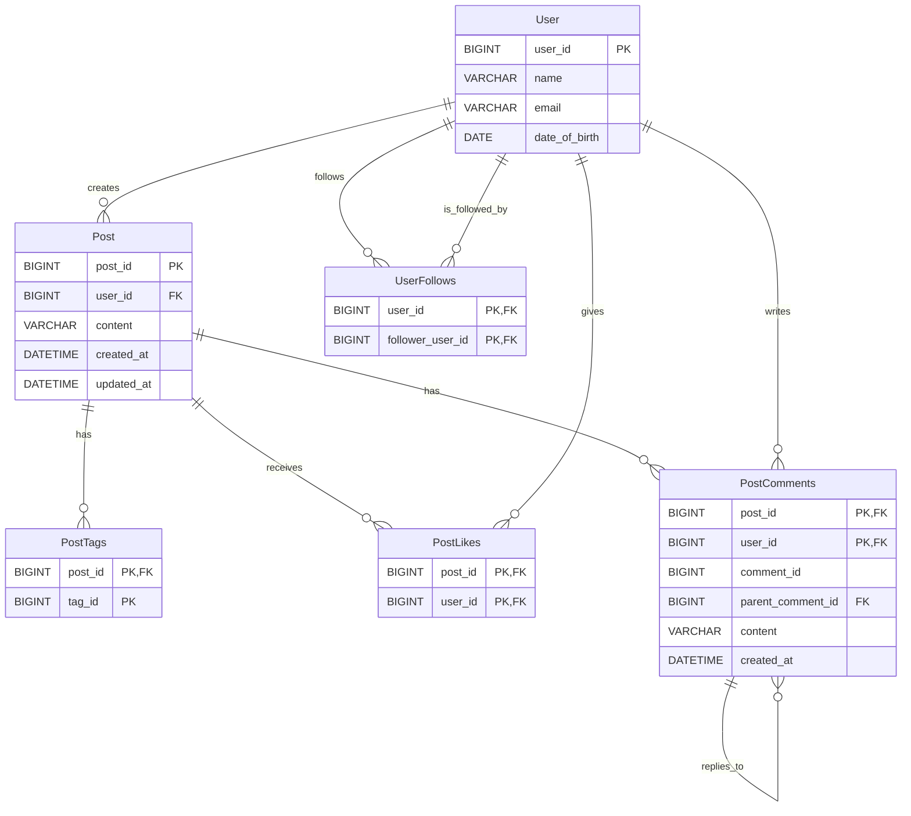
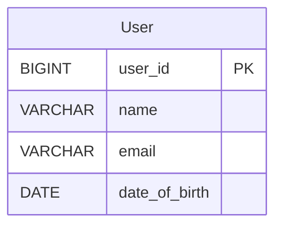
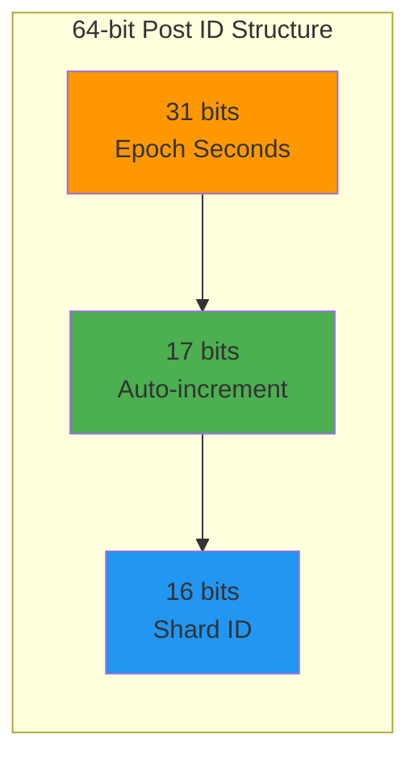
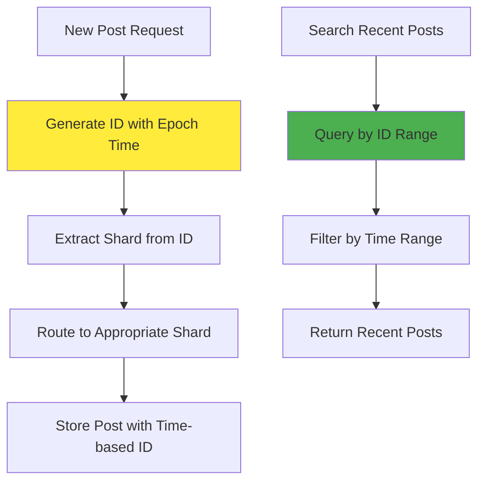
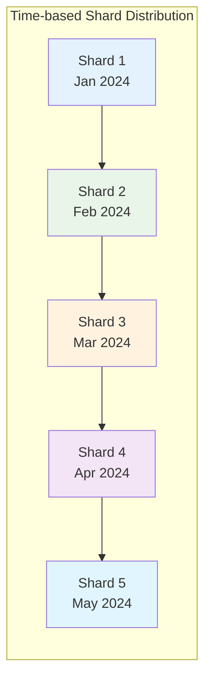
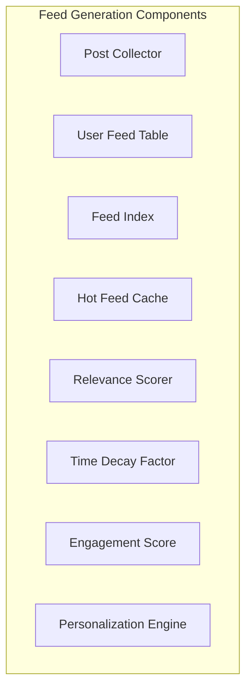

## Design a Social Media service like Instagram
A Social media service like Instagram or Tiktok let's user upload and share their videos/pictures/posts with others.

We will only focus on simple functionality of Instagram and will cover [NewsFeed](../news-feed/news-feed.mdx) in next section.

### Requirements and Goals of the System
Let's discuss what features we will be designing so that we can come up with a set of useful requirements.

<details>
<summary>**Functional Requirements**</summary>
    - Users should be able to upload or “post their images/videos.
    - Users should be able to view/download their posts.
    - Users should be able to follow other users.
</details>

<details>
<summary> **Non-Functional Requirements**</summary>
    - The system should be highly reliable, any data loss should be avoided.
    - The system should be highly available. This is required because if our service is down, users will not be able to access their pastes.
    - System can be eventually consistent in favour of Availability.
    - The system should be highly scalable to support a high number of users uploading/downloading images.
</details>

<details>
<summary>**Extended Requirements**</summary>
    - Analytics, e.g., how many times a post was viewed?
    - Users should be able to search for images by title.
    - Users should be able to tag images.
    - Users should be able to perform CRUD operations on their posts.
</details>

### Capacity Estimation and Constraints
Let’s consider below assumptions :
- Total Users : 1 Billion
- Daily Active Users : 200 Million
- Daily New Posts : 100 Million
- Average Image Size : 200KB
- Average Video Size : 5MB
- Average Post Size : 1MB
- Every 1 out 10 posts is a video
- Average number of tags per post : 10, 10 Bytes per tag
- Average number of comments per post : 20, 100 Bytes per comment
- Average number of likes per post : 50, 8 Bytes per like
- **Read heavy** system, **100:1** read to write ratio.

<details>
<summary>**Traffic**</summary>
    - Total number of post per second: 100M / (24 * 3600) ~= 1150
    - Total number of reads per second: 100 * 1150 ~= 115K
</details>
<details>
<summary>**Storage**</summary>
    - Total storage required for one day of images: 100M * 90% * 200KB ~= 18TB
    - Total storage required for one day of videos: 100M * 10% * 5MB ~= 50TB
    - Total storage required for one day of posts: 18TB + 50TB ~= 70TB
    - Total storage required for one day of tags: 100M * 10 * 10B ~= 10TB
    - Total storage required for one day of comments: 100M * 20 * 100B ~= 200TB
    - Total storage required for one day of likes: 100M * 50 * 8B ~= 40TB
    - Total storage: 2PB + 20TB + 200TB + 50TB ~= 2.3PB
</details>
<details>
<summary>**Bandwidth**</summary>
    - Incoming data: 90M * 200KB + 10M * 5MB ~= 18TB per day
    - Outgoing data: 115K * 1MB ~= 115GB per day
</details>
<details>
<summary>**Memory**</summary>
    - To cache hot images and videos, we will need 20% of daily incoming traffic:
    - 18TB * 20% ~= 4TB
    - To cache hot posts, we will need 20% of daily read traffic: 115GB * 20% ~= 25GB
</details>


### API Design
We can have SOAP or REST APIs to expose the functionality of our service. Let’s see the REST APIs for our service.

- **Post Service:** A service to store post in Database
- **Media Service:** A service to store media in Object Storage
- **User Service:** A service to store user and user relationships
- **Search Service:** A service to search posts and users
- **News Feed Service:** A service to generate news feed for users
- **Notification Service:** A service to send notifications to users
- **Analytics Service:** A service to send analytics

<Tabs>
<TabItem value="Post Service">
```java
/**
POST API to create a new post
api/v1/posts
    api_dev_key - A developer key to track the user who created the post and to block abuse
    user_id - ID of the user creating the post
    content - The post content
    media_urls - URLs of attached media files
returns: success or error message
*/
String createPost(String api_dev_key, String user_id, String content, String media_urls)

/**
GET API to get a post
api/v1/posts/{post_id}
    api_dev_key - A developer key to track the user who created the post and to block abuse
    post_id - ID of the post to get
returns: post
*/
String getPost(String api_dev_key, String post_id)
```

</TabItem>
<TabItem value="Media Service">
```java
/**
POST API to upload a media file - image or video
api/v1/media/upload
    api_dev_key - A developer key
    user_id - ID of the user uploading the media
    media_type - Type of the media
    media_url - URL of the media
returns: success or error message
*/
String uploadMedia(String api_dev_key, String user_id, String media_type, String media_url)

/**
GET API to get a media file - image or video
api/v1/media/{media_url}
    api_dev_key - A developer key to track the user who created the media and to block abuse
    media_url - URL of the media to get
returns: media
*/
String getMedia(String api_dev_key, String user_id, String media_type, String media_url)


/**
DELETE API to delete a media file - image or video
api/v1/media/{media_url}
    api_dev_key - A developer key to track the user who created the media and to block abuse
    media_url - URL of the media to delete
returns: success or error message
*/
String deleteMedia(String api_dev_key, String user_id, String media_type, String media_url)

```
</TabItem>
<TabItem value="User Service">
```java
/**
POST API to create a new user and to store user in Database
api/v1/users
    api_dev_key - A developer key to track the user who created the user and to block abuse
    user_id - ID of the user creating the user
    name - The user name
    email - The user email
returns: success or error message
*/
String createUser(String api_dev_key, String user_id, String name, String email)

/**
GET API to get a user
api/v1/users/{user_id}
    api_dev_key - A developer key to track the user who created the user and to block abuse
    user_id - ID of the user to get
returns: user
*/
String getUser(String api_dev_key, String user_id)

/**
POST API to follow a user
api/v1/users/{user_id}/follow
    api_dev_key - A developer key to track the user who created the user and to block abuse
    user_id - ID of the user to follow
    target_user_id - ID of the user to follow
returns: success or error message
*/
String followUser(String api_dev_key, String user_id, String target_user_id)

/**
POST API to unfollow a user
api/v1/users/{user_id}/unfollow
    api_dev_key - A developer key to track the user who created the user and to block abuse
    user_id - ID of the user to unfollow
    target_user_id - ID of the user to unfollow
returns: success or error message
*/
String unfollowUser(String api_dev_key, String user_id, String target_user_id)
```

</TabItem>
<TabItem value="Search Service">
```java
/**
POST API to search for a user
api/v1/search/users
    api_dev_key - A developer key to track the user who created the user and to block abuse
    user_id - ID of the user to search for
    query - search query
returns: success or error message
*/
String followUser(String api_dev_key, String user_id, String target_user_id)

```
</TabItem>
</Tabs>

<Tabs>
<TabItem value="News Feed Service">
```java
/**
POST API to generate news feed
api/v1/newsfeed/generate
    api_dev_key - A developer key
    user_id - ID of the user generating the news feed
returns: success or error message
*/
void generateNewsFeed(String api_dev_key, String user_id)


/**
GET API to get news feed
api/v1/newsfeed/{user_id}
    api_dev_key - A developer key
    user_id - ID of the user getting the news feed
returns: news feed
*/
List<Post> getNewsFeed(String api_dev_key, String user_id)
```
</TabItem>

<TabItem value="Notification Service">
```java
/**
POST API to send notification
api/v1/notification/send
    api_dev_key - A developer key
    user_id - ID of the user sending the notification
    notification_type - Type of the notification
    notification_message - Message of the notification
returns: success or error message
*/
String sendNotification(String api_dev_key, String user_id, String notification_type, String notification_message)
```
</TabItem>
<TabItem value="Analytics Service">
```java
/**
POST API to send analytics
api/v1/analytics/send
    api_dev_key - A developer key
    user_id - ID of the user sending the analytics
    analytics_type - Type of the analytics
    analytics_message - Message of the analytics
returns: success or error message
*/
String sendAnalytics(String api_dev_key, String user_id, String analytics_type, String analytics_message)
```
</TabItem>
</Tabs>


---

### Database Design
- **We need to store billions of posts**.
- **We need to store metadata** with each post, including **tags**, **creation date**, **the number of likes**, **the number of visits**, **etc**.
- **Each post can have millions of likes** and **comments**.
- **Users can perform CRUD operations** on their posts.
- **Users can follow other users**.
- **Users can search posts** by tags.
- **Users can search posts** by title.
- **Users can search posts** by user.
- **Our service is read-heavy**.
- **Our services has relationships** between **entities**.

#### What kind of database should we use?
- **SQL** databases are not a good fit for such a large scale system as they don’t scale well horizontally.
- **NoSQL** databases are a better choice for such a large dataset as we can add more machines easily when we need to scale out our system.
- **Cassandra** is a good choice because it is specifically designed to handle huge amounts of data and **scale** horizontally across multiple nodes.
- We can store **post** in a distributed **Blob Storage** like **HDFS** or **S3**.
- We can use **MySQL** or a **key-value store** to store **metadata** about the post like **tags**, **number of likes**, **number of comments**, etc.

:::tip
- **We can also use** a **key-value** store like **DynamoDB** or **Riak** to store a **huge amount of data**. **These stores provide** **predictable performance** and **low latency** for **read** and **write** operations, but **the only drawback** is that **they don’t support range queries**.

**Cassandra** is a better choice **if we want to run different queries** on our data.
:::

#### Database Schema
- **User** table will store all the user information who have registered with our system.
- **Post** table will store all the posts.
- **UserFollows** table will store all the follow relationships.
- **PostTags** table will store all the tags for each post.
- **PostLikes** table will store all the likes for each post.
- **PostComments** table will store all the comments on each post.

import Tabs from '@theme/Tabs';
import TabItem from '@theme/TabItem';

<Tabs>
<TabItem value="User">
```sql
CREATE TABLE User (
    user_id BIGINT,
    name VARCHAR(30),
    email VARCHAR(30),
    date_of_birth DATE,
    PRIMARY KEY (user_id)
);

CREATE TABLE UserFollows (
    user_id BIGINT,
    follower_user_id BIGINT,
    PRIMARY KEY (user_id, follower_user_id)
);

```
</TabItem>
<TabItem value="Post">
```sql
CREATE TABLE Post (
    post_id BIGINT,
    user_id BIGINT,
    content VARCHAR(MAX),
    created_at DATETIME,
    updated_at DATETIME,
    PRIMARY KEY (post_id)
);
```
</TabItem>
<TabItem value="PostTags">
```sql
CREATE TABLE PostTags (
    post_id BIGINT,
    tag_id BIGINT,
    PRIMARY KEY (post_id, tag_id)
);
```
</TabItem>
<TabItem value="PostLikes">
```sql
CREATE TABLE PostLikes (
    post_id BIGINT,
    user_id BIGINT,
    PRIMARY KEY (post_id, user_id)
);
```
</TabItem>
<TabItem value="PostComments">
```sql
CREATE TABLE PostComments (
    post_id BIGINT,
    user_id BIGINT,
    comment_id BIGINT,
    parent_comment_id BIGINT,
    content VARCHAR(MAX),
    created_at DATETIME,
    PRIMARY KEY (post_id, user_id)
);
```
</TabItem>
</Tabs>




---

### High Level Design
Since it's a very read heavy system and uploading post can consume most of the data, we can keep **Read** and **Write** as
separate services to scale out separately as well.

We can remove **Single point of Failure** by bringing redundancy, to provide backup or analytics.

import FinalDesignSVG from './high-level-design.svg';

<FinalDesignSVG width="100%" height="80%"/>

### Data Sharding
Let's discuss how we can shard the data.

<details>
<summary>**User-based Partitioning**</summary>

We can partition data based on UserId to keep all posts together
- Above approach can lead to hotspots, for hot users we can use consistent hashing to distribute data evenly across nodes.
- Some users have more posts than others, distribution will be uneven. Similarly some users will upload more media files than others.
- What if we cannot store all posts or media files on a single shard? What if they are distributed across multiple shards?
- Storing all posts or media files on a single shard can lead to unavailability if the shard is down.



PhotoId/VideoId/PostId - Appending shard id to the PhotoId/VideoId/PostId will look like this:
```sql
photo_id = 1234567890
shard_id = 1
photo_id_with_shard_id = 1234567890_1
```


</details>

<details>
<summary>**Post/Media ID based Partitioning**</summary>

We can partition data based on PostId or MediaUrl to keep all posts together
- Above approach can lead to hotspots, for hot posts we can use consistent hashing to distribute data evenly across nodes.
- Some posts have more likes than others, distribution will be uneven.
- What if we cannot store all likes on a single shard? What if they are distributed across multiple shards?
- Storing all likes on a single shard can lead to unavailability if the shard is down.

Generating PostId/MediaUrl - Auto-incrementing Id will not work as we need to store data across multiple shards, so need to know the id to determine the shard.
We can have a separate service to generate PostId/MediaUrl and store it in a separate table.

```sql
CREATE TABLE PostId (
    post_id BIGINT,
    shard_id BIGINT,
    PRIMARY KEY (post_id)
);
```

</details>

<details>
<summary>**Epoch Time-based ID Generation**</summary>

To enable efficient searching of new posts and better sharding, we can incorporate epoch time into our ID generation strategy.

#### Benefits of Epoch Time in IDs
- **Efficient Time-based Queries**: Easy to fetch recent posts without complex timestamp filtering
- **Natural Sharding**: Time-based distribution helps balance load across shards
- **Reduced Write Latency**: No need for secondary indexes on creation time
- **Better Performance**: Primary key already includes time information

#### ID Structure with Epoch Time



#### ID Generation Strategy

**64-bit Post ID Components:**
- **Epoch Seconds (31 bits)**: Current timestamp in seconds since Unix epoch
- **Auto-increment Sequence (17 bits)**: Allows ~130K posts per second
- **Shard ID (16 bits)**: Determines which shard stores the post

**Example ID Generation:**
```java
// Current epoch time: 1703123456
// Auto-increment: 00001
// Shard ID: 0001
// Final Post ID: 1703123456000010001

public class PostIdGenerator {
    private static final int EPOCH_BITS = 31;
    private static final int SEQUENCE_BITS = 17;
    private static final int SHARD_BITS = 16;
    
    public long generatePostId(int shardId) {
        long epochTime = System.currentTimeMillis() / 1000;
        long sequence = getNextSequence(); // Auto-increment per second
        long shardIdMask = shardId & ((1L << SHARD_BITS) - 1);
        
        return (epochTime << (SEQUENCE_BITS + SHARD_BITS)) | 
               (sequence << SHARD_BITS) | 
               shardIdMask;
    }
}
```

#### Sharding Strategy with Epoch Time



#### Advantages of This Approach

**Performance Benefits:**
- **Fast Recent Post Queries**: No need to scan entire tables for recent posts
- **Efficient Sharding**: Time-based distribution naturally balances load
- **Reduced Index Overhead**: Time is part of primary key, no secondary indexes needed

**Scalability Benefits:**
- **Horizontal Scaling**: Easy to add new shards based on time ranges
- **Load Distribution**: Recent posts spread across multiple shards
- **Query Optimization**: Range queries on IDs are very efficient

**Example Queries:**
```sql
-- Get posts from last 24 hours
SELECT * FROM posts 
WHERE post_id >= 1703037056000000000  -- 24 hours ago
  AND post_id < 1703123456000000000;  -- current time

-- Get posts from specific time range
SELECT * FROM posts 
WHERE post_id BETWEEN 1703120000000000000 AND 1703123456000000000;
```

#### Shard Distribution Strategy



**Shard Assignment Rules:**
- **Current Month**: Active shards for new posts
- **Previous Months**: Read-only shards for historical data
- **Hot Data**: Recent posts cached in multiple shards
- **Cold Data**: Older posts moved to cheaper storage

</details>

### Feed Generation
We can generate feed for a user based on the following criteria:
- Posts from the users the user follows
- Posts from the users the user is mentioned in
- Posts from the users the user has liked
- Posts from the users the user has commented on

```sql
CREATE TABLE Feed (
    user_id BIGINT,
    post_id BIGINT,
    PRIMARY KEY (user_id, post_id)
);
```

To create feed for a user we need to fetch the latest posts/media from above mentioned criteria and store it in a separate table.
For simplicity we will fetch only 100 posts/media for a user.

A possible problem with this approach is that we need to fetch the latest posts/media for a user from multiple shards, which can be slow.
We can use a `News Feed service` to pre-fetch the latest posts/media for a user in the background.

Different approaches to generate feed:
- **Pull Model** : User will pull the latest posts/media for a user from the server.
- **Push Model** : Server will push the latest posts/media for a user to the client.
- **Hybrid Model** : Combine pull and push model for optimal performance.



---

### Topics of Discussion
- In our design we have issue of `Reliability` : Loosing files or any Service node dies.
- Single point of failure.
- `DataSharding`: How to partition data to handle issues such as.
    - Imbalanced load distribution.
    - Hotspots.
    - Saving all posts of a user on a single node can lead to `Unavailability` if the Shard is down.

#### Workaround
Below are some of the possible work around.
- **Replication** : Replicate data on multiple nodes.
- **Redundancy** : Keep multiple copies of data on different nodes.
- **Consistent Hashing** : To distribute data evenly across nodes.
- **UserId Partitioning** : We can partition based on UserId to keep all posts together
    - Above approach can lead to hotspots.
    - Some users have more posts than others, distribution will be uneven.
    -
  :::warning
  - Ids can be predicted and can be used to access other urls.
  :::


