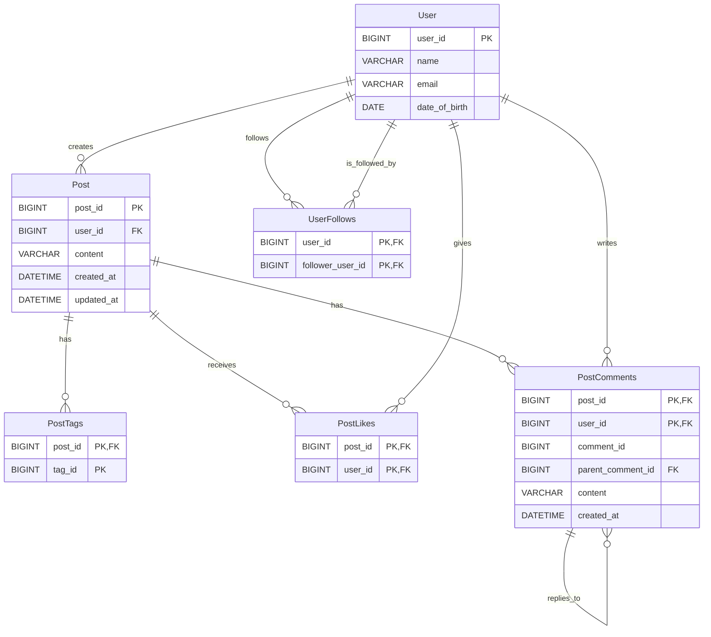

## Design a Social Media service like Instagram
A Social media service like Instagram or Tiktok let's user upload and share their videos/pictures/posts with others.

We will only focus on simple functionality of Instagram and will cover [NewsFeed](../news-feed/news-feed.mdx) in next section.

### Requirements and Goals of the System
Let's discuss what features we will be designing so that we can come up with a set of useful requirements.

<details>
<summary>**Functional Requirements**</summary>
    - Users should be able to upload or “post their images/videos.
    - Users should be able to view/download their posts.
    - Users should be able to follow other users.
</details>

<details>
<summary> **Non-Functional Requirements**</summary>
    - The system should be highly reliable, any data loss should be avoided.
    - The system should be highly available. This is required because if our service is down, users will not be able to access their pastes.
    - System can be eventually consistent in favour of Availability.
    - The system should be highly scalable to support a high number of users uploading/downloading images.
</details>

<details>
<summary>**Extended Requirements**</summary>
    - Analytics, e.g., how many times a post was viewed?
    - Users should be able to search for images by title.
    - Users should be able to tag images.
    - Users should be able to perform CRUD operations on their posts.
</details>

### Capacity Estimation and Constraints
Let’s consider below assumptions :
- Total Users : 1 Billion
- Daily Active Users : 200 Million
- Daily New Posts : 100 Million
- Average Image Size : 200KB
- Average Video Size : 5MB
- Average Post Size : 1MB
- Every 1 out 10 posts is a video
- Average number of tags per post : 10, 10 Bytes per tag
- Average number of comments per post : 20, 100 Bytes per comment
- Average number of likes per post : 50, 8 Bytes per like
- **Read heavy** system, **100:1** read to write ratio.

<details>
<summary>**Traffic**</summary>
    - Total number of post per second: 100M / (24 * 3600) ~= 1150
    - Total number of reads per second: 100 * 1150 ~= 115K
</details>
<details>
<summary>**Storage**</summary>
    - Total storage required for one day of images: 100M * 90% * 200KB ~= 18TB
    - Total storage required for one day of videos: 100M * 10% * 5MB ~= 50TB
    - Total storage required for one day of posts: 18TB + 50TB ~= 70TB
    - Total storage required for one day of tags: 100M * 10 * 10B ~= 10TB
    - Total storage required for one day of comments: 100M * 20 * 100B ~= 200TB
    - Total storage required for one day of likes: 100M * 50 * 8B ~= 40TB
    - Total storage: 2PB + 20TB + 200TB + 50TB ~= 2.3PB
</details>
<details>
<summary>**Bandwidth**</summary>
    - Incoming data: 90M * 200KB + 10M * 5MB ~= 18TB per day
    - Outgoing data: 115K * 1MB ~= 115GB per day
</details>
<details>
<summary>**Memory**</summary>
    - To cache hot images and videos, we will need 20% of daily incoming traffic:
    - 18TB * 20% ~= 4TB
    - To cache hot posts, we will need 20% of daily read traffic: 115GB * 20% ~= 25GB
</details>


### API Design
We can have SOAP or REST APIs to expose the functionality of our service. Let’s see the REST APIs for our service.

- **A service to store post
- **A service to retrieve post

```java
/**
POST API to upload post
api/v1/post/create
    api_dev_key - A developer key to track the user who created the paste and to block abuse

returns
*/
boolean createPost(api_dev_key, post)
    returns True if the post is created successfully or False if failed

/**
GET API to get a paste
api/v1/get/<shortened_url>
    api_dev_key - A developer key to track the user who created the paste and to block abuse
    post_id - key to find the post
returns the original code snippet
*/
String getPost(api_dev_key, post_id)
    returns the post

/**
DELETE API to delete a paste
api/v1/delete/<paste_key>
    api_dev_key - A developer key to track the user who created the paste and to block abuse
    post_id - key to find the post
returns True if the paste existed and was deleted successfully
*/
boolean deletePost(api_dev_key, post_id)
    returns True if the post is deleted successfully or False if failed

/**
POST API to follow a user
api/v1/follow
    api_dev_key - A developer key to track the user who created the paste and to block abuse
    user_id - key to find the user
returns True if the user is followed successfully or False if failed
*/
boolean followUser(api_dev_key, user_id)
    returns True if the user is followed successfully or False if failed


/**
GET API to Search User, Post, etc by tags or title
api/v1/search
    api_dev_key - A developer key to track the user who created the paste and to block abuse
    query - search query
returns list of posts
*/
List<Post> search(api_dev_key, query)
    returns list of posts
```

---

### Database Design
- **We need to store billions of posts**.
- **We need to store metadata** with each post, including **tags**, **creation date**, **the number of likes**, **the number of visits**, **etc**.
- **Each post can have millions of likes** and **comments**.
- **Users can perform CRUD operations** on their posts.
- **Users can follow other users**.
- **Users can search posts** by tags.
- **Users can search posts** by title.
- **Users can search posts** by user.
- **Our service is read-heavy**.
- **Our services has relationships** between **entities**.

#### What kind of database should we use?
- **SQL** databases are not a good fit for such a large scale system as they don’t scale well horizontally.
- **NoSQL** databases are a better choice for such a large dataset as we can add more machines easily when we need to scale out our system.
- **Cassandra** is a good choice because it is specifically designed to handle huge amounts of data and **scale** horizontally across multiple nodes.
- We can store **post** in a distributed **Blob Storage** like **HDFS** or **S3**.
- We can use **MySQL** or a **key-value store** to store **metadata** about the post like **tags**, **number of likes**, **number of comments**, etc.

:::tip
- **We can also use** a **key-value** store like **DynamoDB** or **Riak** to store a **huge amount of data**. **These stores provide** **predictable performance** and **low latency** for **read** and **write** operations, but **the only drawback** is that **they don’t support range queries**.

**Cassandra** is a better choice **if we want to run different queries** on our data.
:::

#### Database Schema
- **User** table will store all the user information who have registered with our system.
- **Post** table will store all the posts.
- **UserFollows** table will store all the follow relationships.
- **PostTags** table will store all the tags for each post.
- **PostLikes** table will store all the likes for each post.
- **PostComments** table will store all the comments on each post.

import Tabs from '@theme/Tabs';
import TabItem from '@theme/TabItem';

<Tabs>
<TabItem value="User">
```sql
CREATE TABLE User (
    user_id BIGINT,
    name VARCHAR(30),
    email VARCHAR(30),
    date_of_birth DATE,
    PRIMARY KEY (user_id)
);

CREATE TABLE UserFollows (
    user_id BIGINT,
    follower_user_id BIGINT,
    PRIMARY KEY (user_id, follower_user_id)
);

```
</TabItem>
<TabItem value="Post">
```sql
CREATE TABLE Post (
    post_id BIGINT,
    user_id BIGINT,
    content VARCHAR(MAX),
    created_at DATETIME,
    updated_at DATETIME,
    PRIMARY KEY (post_id)
);
```
</TabItem>
<TabItem value="PostTags">
```sql
CREATE TABLE PostTags (
    post_id BIGINT,
    tag_id BIGINT,
    PRIMARY KEY (post_id, tag_id)
);
```
</TabItem>
<TabItem value="PostLikes">
```sql
CREATE TABLE PostLikes (
    post_id BIGINT,
    user_id BIGINT,
    PRIMARY KEY (post_id, user_id)
);
```
</TabItem>
<TabItem value="PostComments">
```sql
CREATE TABLE PostComments (
    post_id BIGINT,
    user_id BIGINT,
    comment_id BIGINT,
    parent_comment_id BIGINT,
    content VARCHAR(MAX),
    created_at DATETIME,
    PRIMARY KEY (post_id, user_id)
);
```
</TabItem>
</Tabs>




---

### High Level Design
Since it's a very read heavy system and uploading post can consume most of the data, we can keep **Read** and **Write** as
separate services to scale out separately as well.

We can remove **Single point of Failure** by bringing redundancy, to provide backup or analytics.

import FinalDesignSVG from './high-level-design.svg';

<FinalDesignSVG width="100%" height="80%"/>

### Topics of Discussion
- In our design we have issue of `Reliability` : Loosing files or any Service node dies.
- Single point of failure.
- `DataSharding`: How to partition data to handle issues such as.
    - Imbalanced load distribution.
    - Hotspots.
    - Saving all posts of a user on a single node can lead to `Unavailability` if the Shard is down.

#### Workaround
Below are some of the possible work around.
- **Replication** : Replicate data on multiple nodes.
- **Redundancy** : Keep multiple copies of data on different nodes.
- **Consistent Hashing** : To distribute data evenly across nodes.
- **UserId Partitioning** : We can partition based on UserId to keep all posts together
    - Above approach can lead to hotspots.
    - Some users have more posts than others, distribution will be uneven.
    -
  :::warning
  - Ids can be predicted and can be used to access other urls.
  :::


