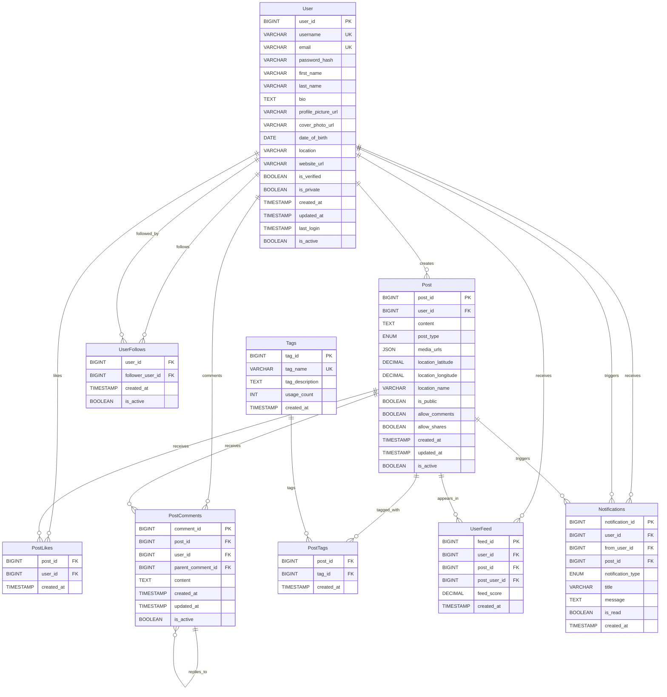
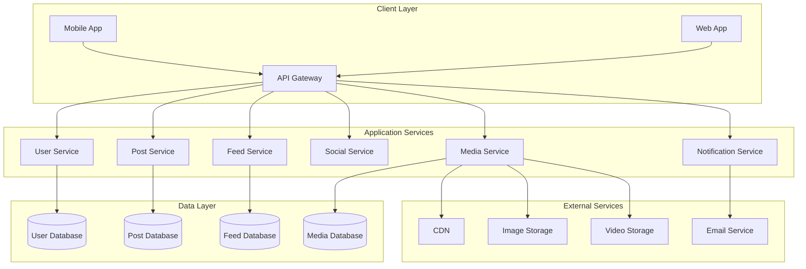
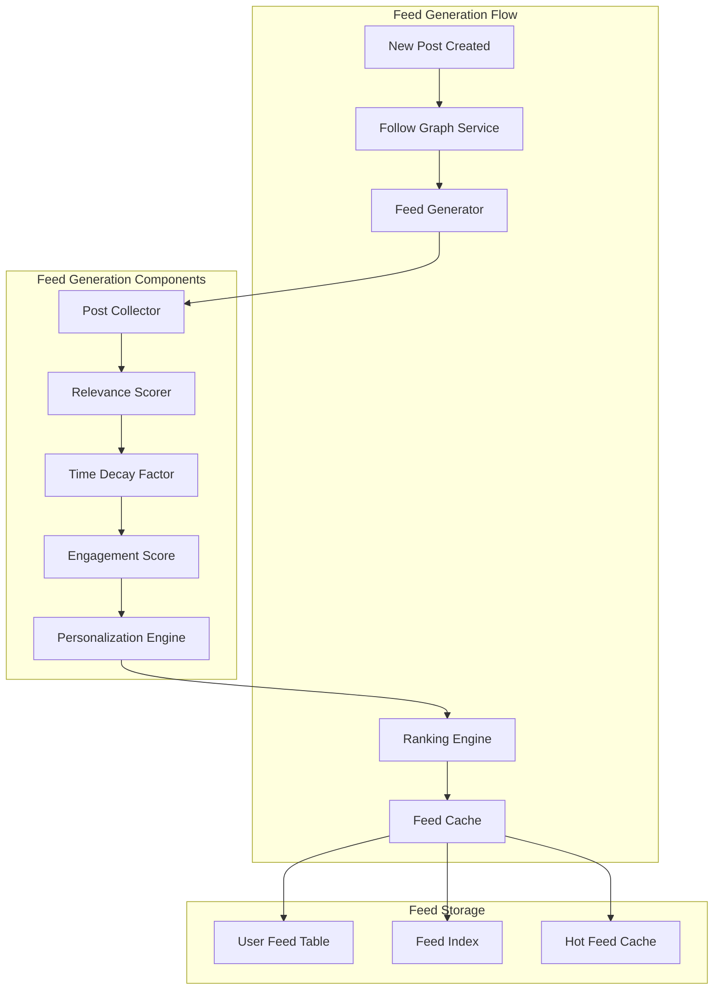
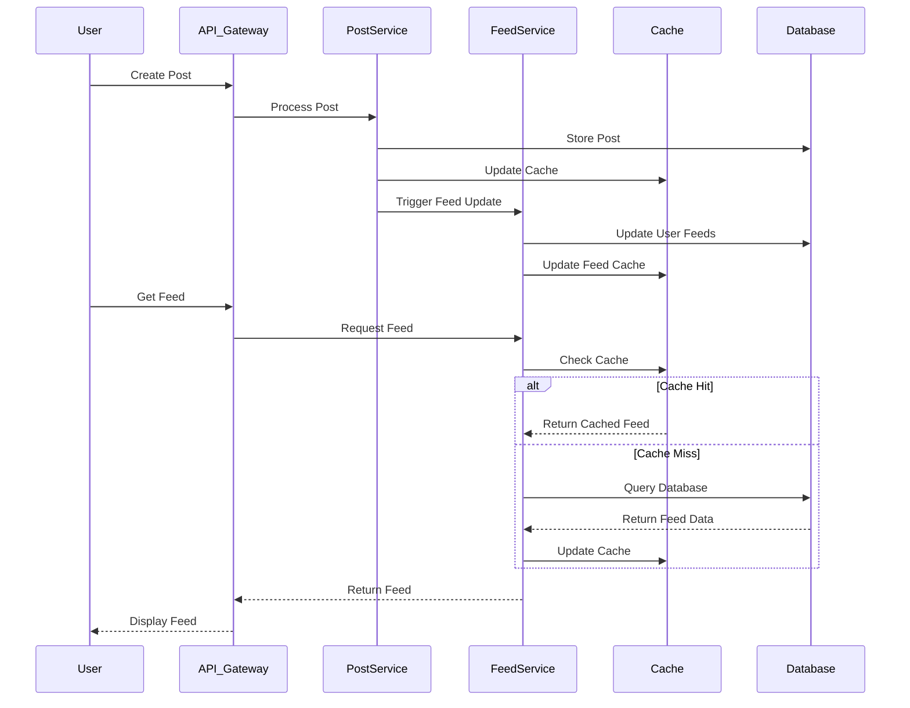
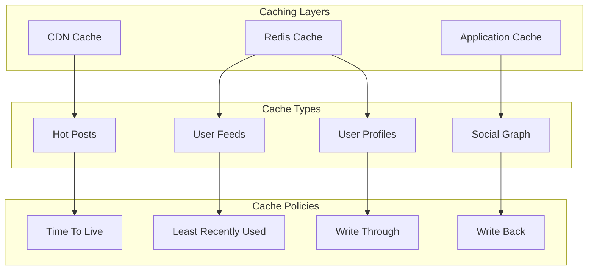
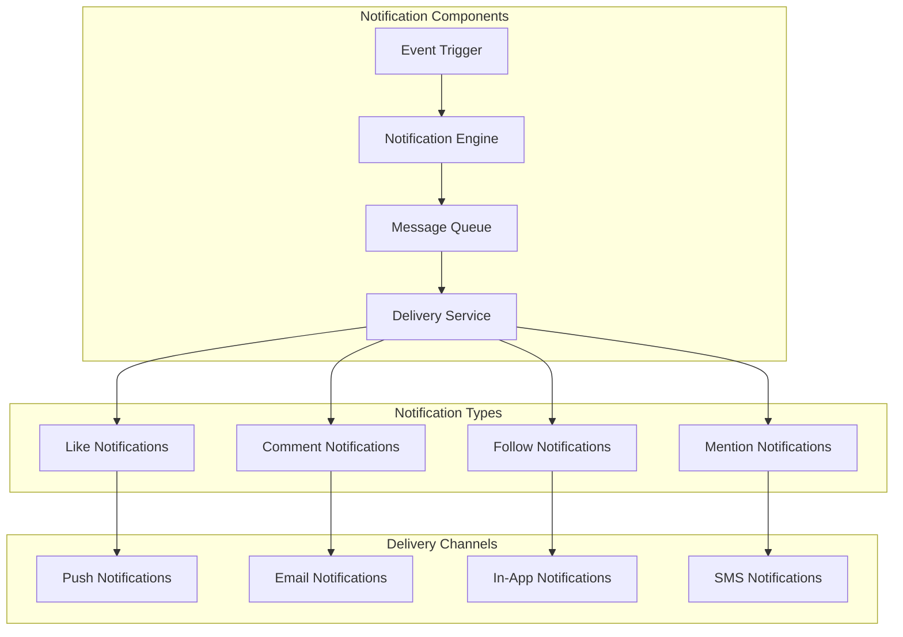
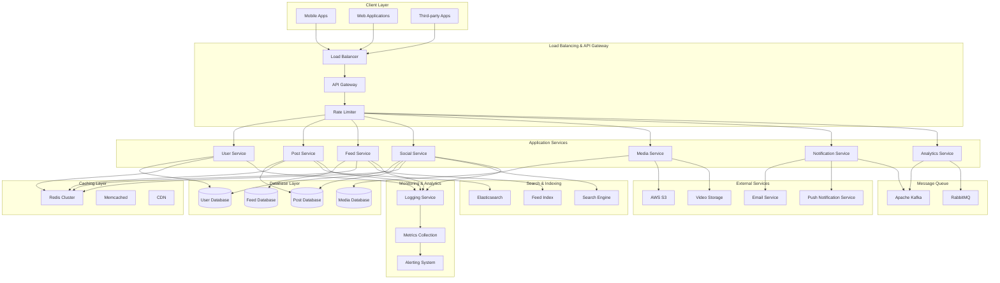

# Design a NewsFeed System like Facebook, Instagram, Twitter
A NewsFeed system is a continuously changing list of Stories comprised of Photos, Videos, Post updates, and activities from People, Pages/Channels & Groups that you have Subscribed or Follow.


### Requirements and Goals of the System
Let's discuss what features we will be designing so that we can come up with a set of useful requirements.

<details>
<summary>**Functional Requirements**</summary>
    - Users should be able to view their NewsFeed containing Stories from people they follow.
    - Feed consists of Text, Images and Videos.
</details>

<details>
<summary> **Non-Functional Requirements**</summary>
    - The system should be highly reliable, any data loss should be avoided.
    - The system should be highly available. This is required because if our service is down, users will not be able to access their pastes.
    - System can be eventually consistent in favour of Availability.
    - The system should be highly scalable to support a high number of users uploading/downloading images.
</details>

<details>
<summary>**Extended Requirements**</summary>
    - Analytics, e.g., how many times a post was viewed?
    - Users should be able to search for images by title.
    - Users should be able to tag images.
    - Users should be able to perform CRUD operations on their posts.
</details>

### Capacity Estimation and Constraints
Let’s consider below assumptions :
- Total Users : 1 Billion
- Daily Active Users : 200 Million
- Daily New Posts : 100 Million
- Average Image Size : 200KB
- Average Video Size : 5MB
- Average Post Size : 1MB
- Every 1 out 10 posts is a video
- Average number of tags per post : 10, 10 Bytes per tag
- Average number of comments per post : 20, 100 Bytes per comment
- Average number of likes per post : 50, 8 Bytes per like
- **Read heavy** system, **100:1** read to write ratio.

<details>
<summary>**Traffic**</summary>
    - Total number of post per second: 100M / (24 * 3600) ~= 1150
    - Total number of reads per second: 100 * 1150 ~= 115K
</details>
<details>
<summary>**Storage**</summary>
    - Total storage required for one day of images: 100M * 90% * 200KB ~= 18TB
    - Total storage required for one day of videos: 100M * 10% * 5MB ~= 50TB
    - Total storage required for one day of posts: 18TB + 50TB ~= 70TB
    - Total storage required for one day of tags: 100M * 10 * 10B ~= 10TB
    - Total storage required for one day of comments: 100M * 20 * 100B ~= 200TB
    - Total storage required for one day of likes: 100M * 50 * 8B ~= 40TB
    - Total storage: 2PB + 20TB + 200TB + 50TB ~= 2.3PB
</details>
<details>
<summary>**Bandwidth**</summary>
    - Incoming data: 90M * 200KB + 10M * 5MB ~= 18TB per day
    - Outgoing data: 115K * 1MB ~= 115GB per day
</details>
<details>
<summary>**Memory**</summary>
    - To cache hot images and videos, we will need 20% of daily incoming traffic:
    - 18TB * 20% ~= 4TB
    - To cache hot posts, we will need 20% of daily read traffic: 115GB * 20% ~= 25GB
</details>


### API Design
This problem can be decomposed into several main components:
- **User Service:** Handles user registration, authentication, and profile management.
- **Post Service:** Handles post creation, updates, and retrieval.
- **Feed Service:** Handles news feed generation and delivery.
- **Social Service:** Handles follow relationships and social interactions.
- **Media Service:** Handles image and video uploads and processing.

<Tabs>
<TabItem value="Post Service">
```java
/**
POST API to create a new post
api/v1/posts
    api_dev_key - A developer key to track the user who created the post and to block abuse
    user_id - ID of the user creating the post
    content - The post content
    media_urls - URLs of attached media files
returns: success or error message
*/
String createPost(String api_dev_key, String user_id, String content, String media_urls)

/**
POST API to like a post
api/v1/posts/{post_id}/like
    api_dev_key - A developer key
    user_id - ID of the user liking the post
    post_id - ID of the post to like
returns: success or error message
*/
String likePost(String api_dev_key, String user_id, String post_id)

/**
POST API to comment on a post
api/v1/posts/{post_id}/comment
    api_dev_key - A developer key
    user_id - ID of the user commenting
    post_id - ID of the post to comment on
    comment - The comment content
returns: success or error message
*/
String commentOnPost(String api_dev_key, String user_id, String post_id, String comment)
```
</TabItem>
<TabItem value="Feed Service">
```java
/**
GET API to get user's news feed
api/v1/feed
    api_dev_key - A developer key to track the user
    user_id - ID of the user requesting the feed
    page - Page number for pagination
    limit - Number of posts per page
returns: list of posts in the user's feed
*/
List<Post> getFeed(String api_dev_key, String user_id, int page, int limit)

/**
POST API to create a user's news feed
api/v1/feed
    api_dev_key - A developer key to track the user
    user_id - ID of the user creating the feed
    post_ids - List of post IDs to create the feed
returns: list of posts in the user's feed
*/
String createFeed(String api_dev_key, String user_id, List<String> post_ids)
```
</TabItem>
<TabItem value="Social Service">
```java
/**
POST API to follow a user
api/v1/follow
    api_dev_key - A developer key
    user_id - ID of the user who wants to follow
    target_user_id - ID of the user to follow
returns: success or error message
*/
String followUser(String api_dev_key, String user_id, String target_user_id)

/**
POST API to unfollow a user
api/v1/unfollow
    api_dev_key - A developer key
    user_id - ID of the user who wants to unfollow
    target_user_id - ID of the user to unfollow
returns: success or error message
*/
String unfollowUser(String api_dev_key, String user_id, String target_user_id)
```
</TabItem>
<TabItem value="Media Service">
```java
/**
POST API to upload a media file
api/v1/media/upload
    api_dev_key - A developer key
    user_id - ID of the user uploading the media
    media_type - Type of the media
    media_url - URL of the media
returns: success or error message
*/
String uploadMedia(String api_dev_key, String user_id, String media_type, String media_url)

/**
POST API to download a media file
api/v1/media/download
    api_dev_key - A developer key
    user_id - ID of the user downloading the media
    media_url - URL of the media
returns: success or error message
*/
String downloadMedia(String api_dev_key, String user_id, String media_type, String media_url)
```
</TabItem>
<TabItem value="Notification Service">
```java
/**
POST API to send notification
api/v1/notification/send
    api_dev_key - A developer key
    user_id - ID of the user sending the notification
    notification_type - Type of the notification
    notification_message - Message of the notification
returns: success or error message
*/
String sendNotification(String api_dev_key, String user_id, String notification_type, String notification_message)

/**
POST API to send analytics
api/v1/analytics/send
    api_dev_key - A developer key
    user_id - ID of the user sending the analytics
    analytics_type - Type of the analytics
    analytics_message - Message of the analytics
returns: success or error message
*/
String sendAnalytics(String api_dev_key, String user_id, String analytics_type, String analytics_message)
```
</TabItem>
</Tabs>

---

### Database Schema
We need to store user data, posts, social relationships, and interactions. Below is a comprehensive schema for the database:

#### Core Tables

import Tabs from '@theme/Tabs';
import TabItem from '@theme/TabItem';

<Tabs>
<TabItem value="User">
```sql
CREATE TABLE User (
    user_id BIGINT PRIMARY KEY,
    username VARCHAR(50) UNIQUE NOT NULL,
    email VARCHAR(100) UNIQUE NOT NULL,
    password_hash VARCHAR(255) NOT NULL,
    first_name VARCHAR(50),
    last_name VARCHAR(50),
    bio TEXT,
    profile_picture_url VARCHAR(500),
    cover_photo_url VARCHAR(500),
    date_of_birth DATE,
    location VARCHAR(100),
    website_url VARCHAR(500),
    is_verified BOOLEAN DEFAULT FALSE,
    is_private BOOLEAN DEFAULT FALSE,
    created_at TIMESTAMP DEFAULT CURRENT_TIMESTAMP,
    updated_at TIMESTAMP DEFAULT CURRENT_TIMESTAMP ON UPDATE CURRENT_TIMESTAMP,
    last_login TIMESTAMP,
    is_active BOOLEAN DEFAULT TRUE,
    INDEX idx_email (email),
    INDEX idx_username (username),
    INDEX idx_created_at (created_at)
);
```
</TabItem>
<TabItem value="Post">
```sql
CREATE TABLE Post (
    post_id BIGINT PRIMARY KEY,
    user_id BIGINT NOT NULL,
    content TEXT,
    post_type ENUM('text', 'image', 'video', 'link') DEFAULT 'text',
    media_urls JSON,
    location_latitude DECIMAL(10, 8),
    location_longitude DECIMAL(11, 8),
    location_name VARCHAR(200),
    is_public BOOLEAN DEFAULT TRUE,
    allow_comments BOOLEAN DEFAULT TRUE,
    allow_shares BOOLEAN DEFAULT TRUE,
    created_at TIMESTAMP DEFAULT CURRENT_TIMESTAMP,
    updated_at TIMESTAMP DEFAULT CURRENT_TIMESTAMP ON UPDATE CURRENT_TIMESTAMP,
    is_active BOOLEAN DEFAULT TRUE,
    FOREIGN KEY (user_id) REFERENCES User(user_id),
    INDEX idx_user (user_id),
    INDEX idx_created_at (created_at),
    INDEX idx_post_type (post_type),
    INDEX idx_location (location_latitude, location_longitude)
);
```
</TabItem>
<TabItem value="UserFollows">
```sql
CREATE TABLE UserFollows (
    user_id BIGINT NOT NULL,
    follower_user_id BIGINT NOT NULL,
    created_at TIMESTAMP DEFAULT CURRENT_TIMESTAMP,
    is_active BOOLEAN DEFAULT TRUE,
    PRIMARY KEY (user_id, follower_user_id),
    FOREIGN KEY (user_id) REFERENCES User(user_id),
    FOREIGN KEY (follower_user_id) REFERENCES User(user_id),
    INDEX idx_follower (follower_user_id),
    INDEX idx_following (user_id)
);
```
</TabItem>
<TabItem value="PostLikes">
```sql
CREATE TABLE PostLikes (
    post_id BIGINT NOT NULL,
    user_id BIGINT NOT NULL,
    created_at TIMESTAMP DEFAULT CURRENT_TIMESTAMP,
    PRIMARY KEY (post_id, user_id),
    FOREIGN KEY (post_id) REFERENCES Post(post_id),
    FOREIGN KEY (user_id) REFERENCES User(user_id),
    INDEX idx_user (user_id),
    INDEX idx_created_at (created_at)
);
```
</TabItem>
<TabItem value="PostComments">
```sql
CREATE TABLE PostComments (
    comment_id BIGINT PRIMARY KEY,
    post_id BIGINT NOT NULL,
    user_id BIGINT NOT NULL,
    parent_comment_id BIGINT,
    content TEXT NOT NULL,
    created_at TIMESTAMP DEFAULT CURRENT_TIMESTAMP,
    updated_at TIMESTAMP DEFAULT CURRENT_TIMESTAMP ON UPDATE CURRENT_TIMESTAMP,
    is_active BOOLEAN DEFAULT TRUE,
    FOREIGN KEY (post_id) REFERENCES Post(post_id),
    FOREIGN KEY (user_id) REFERENCES User(user_id),
    FOREIGN KEY (parent_comment_id) REFERENCES PostComments(comment_id),
    INDEX idx_post (post_id),
    INDEX idx_user (user_id),
    INDEX idx_parent (parent_comment_id),
    INDEX idx_created_at (created_at)
);
```
</TabItem>
</Tabs>

<Tabs>
<TabItem value="PostTags">
```sql
CREATE TABLE PostTags (
    post_id BIGINT NOT NULL,
    tag_id BIGINT NOT NULL,
    created_at TIMESTAMP DEFAULT CURRENT_TIMESTAMP,
    PRIMARY KEY (post_id, tag_id),
    FOREIGN KEY (post_id) REFERENCES Post(post_id),
    FOREIGN KEY (tag_id) REFERENCES Tags(tag_id),
    INDEX idx_post (post_id),
    INDEX idx_tag (tag_id)
);
```
</TabItem>
<TabItem value="Tags">
```sql
CREATE TABLE Tags (
    tag_id BIGINT PRIMARY KEY,
    tag_name VARCHAR(100) UNIQUE NOT NULL,
    tag_description TEXT,
    usage_count INT DEFAULT 0,
    created_at TIMESTAMP DEFAULT CURRENT_TIMESTAMP,
    INDEX idx_name (tag_name),
    INDEX idx_usage (usage_count)
);
```
</TabItem>
<TabItem value="UserFeed">
```sql
CREATE TABLE UserFeed (
    feed_id BIGINT PRIMARY KEY,
    user_id BIGINT NOT NULL,
    post_id BIGINT NOT NULL,
    post_user_id BIGINT NOT NULL,
    feed_score DECIMAL(10, 6),
    created_at TIMESTAMP DEFAULT CURRENT_TIMESTAMP,
    FOREIGN KEY (user_id) REFERENCES User(user_id),
    FOREIGN KEY (post_id) REFERENCES Post(post_id),
    FOREIGN KEY (post_user_id) REFERENCES User(user_id),
    INDEX idx_user (user_id),
    INDEX idx_user_created (user_id, created_at),
    INDEX idx_score (feed_score)
);
```
</TabItem>
<TabItem value="Notifications">
```sql
CREATE TABLE Notifications (
    notification_id BIGINT PRIMARY KEY,
    user_id BIGINT NOT NULL,
    from_user_id BIGINT,
    post_id BIGINT,
    notification_type ENUM('like', 'comment', 'follow', 'mention', 'share') NOT NULL,
    title VARCHAR(200),
    message TEXT,
    is_read BOOLEAN DEFAULT FALSE,
    created_at TIMESTAMP DEFAULT CURRENT_TIMESTAMP,
    FOREIGN KEY (user_id) REFERENCES User(user_id),
    FOREIGN KEY (from_user_id) REFERENCES User(user_id),
    FOREIGN KEY (post_id) REFERENCES Post(post_id),
    INDEX idx_user (user_id),
    INDEX idx_unread (user_id, is_read),
    INDEX idx_created_at (created_at)
);
```
</TabItem>
</Tabs>

#### Entity Relationship Diagram



### Step-by-Step Architecture Design

To better understand the system, let's break down the architecture into smaller, manageable components:

#### 1. Core Services Architecture



#### 2. Feed Generation Module



#### 3. Data Flow Architecture



#### 4. Caching Strategy



#### 5. Database Partitioning Strategy

```mermaid
graph TB
    subgraph "Partitioning Strategy"
        UserPartition[User-based Partitioning]
        PostPartition[Post-based Partitioning]
        FeedPartition[Feed-based Partitioning]
    end
    
    subgraph "User Shards"
        UserShard1[User Shard 1]
        UserShard2[User Shard 2]
        UserShard3[User Shard 3]
        UserShardN[User Shard N]
    end
    
    subgraph "Post Shards"
        PostShard1[Post Shard 1]
        PostShard2[Post Shard 2]
        PostShard3[Post Shard 3]
        PostShardN[Post Shard N]
    end
    
    subgraph "Feed Shards"
        FeedShard1[Feed Shard 1]
        FeedShard2[Feed Shard 2]
        FeedShard3[Feed Shard 3]
        FeedShardN[Feed Shard N]
    end
    
    UserPartition --> UserShard1
    UserPartition --> UserShard2
    UserPartition --> UserShard3
    UserPartition --> UserShardN
    
    PostPartition --> PostShard1
    PostPartition --> PostShard2
    PostPartition --> PostShard3
    PostPartition --> PostShardN
    
    FeedPartition --> FeedShard1
    FeedPartition --> FeedShard2
    FeedPartition --> FeedShard3
    FeedPartition --> FeedShardN
```



#### 6. Notification System



### High Level Design

Now that we understand the individual components, here's how they all work together:



### Topics of Discussion

At a high level, we need to store and index social media data and handle real-time feed generation.
Given that posts are created frequently and feeds are accessed constantly, our system is going to be both read and write heavy.

The topic of discussion for this problem is mainly around the following components:
- How to store and index social media posts efficiently.
- How to generate personalized feeds in real-time.
- How to handle the fan-out problem for popular users.

#### Key Challenges

1. **Feed Generation Performance**: 
   - Real-time feed generation for millions of users
   - Balancing freshness vs. performance
   - Handling viral posts and celebrity users

2. **Data Partitioning**:
   - How to partition data to handle issues such as:
   - Imbalanced load distribution
   - Hotspots for popular users
   - Saving all posts of a user on a single node can lead to unavailability if the shard is down

3. **Scalability Issues**:
   - Read-heavy system with 100:1 read to write ratio
   - Handling millions of concurrent users
   - Managing storage for billions of posts

#### Solutions

Below are some of the possible solutions:

- **Replication**: Replicate data on multiple nodes for high availability
- **Redundancy**: Keep multiple copies of data on different nodes
- **Consistent Hashing**: To distribute data evenly across nodes
- **Hybrid Fan-out**: Combine push and pull models for optimal performance
- **Caching Strategy**: Multi-layer caching for hot data
- **Database Sharding**: Partition data based on user ID, post ID, or geographic location

:::warning
- User IDs can be predicted and can be used to access other users' data
- Need proper authentication and authorization mechanisms
- Consider privacy implications of data partitioning
:::

### AI Generation Prompts

For creating high-quality diagrams using AI tools like ChatGPT, Gemini, or Claude, use these prompts:

#### 1. Entity Relationship Diagram
```
Create a comprehensive ER diagram for a social media newsfeed system with the following entities:
- User (user_id, username, email, profile info)
- Post (post_id, user_id, content, media, location)
- UserFollows (user_id, follower_user_id)
- PostLikes (post_id, user_id)
- PostComments (comment_id, post_id, user_id, content)
- PostTags (post_id, tag_id)
- UserFeed (feed_id, user_id, post_id, score)
- Notifications (notification_id, user_id, type, message)

Include all relationships, foreign keys, and cardinalities. Use a professional color scheme with clear labels.
```

#### 2. System Architecture Diagram
```
Design a high-level system architecture diagram for a social media newsfeed system showing:
- Client layer (mobile, web apps)
- API Gateway and Load Balancer
- Microservices (User, Post, Feed, Social, Media, Notification services)
- Database layer (User DB, Post DB, Feed DB, Media DB)
- Caching layer (Redis, CDN)
- External services (AWS S3, Email service)
- Message queues (Kafka, RabbitMQ)

Use different colors for each layer and show data flow with arrows.
```

#### 3. Feed Generation Flow
```
Create a detailed flowchart showing the newsfeed generation process:
- New post creation trigger
- Follow graph traversal
- Post collection from followed users
- Relevance scoring algorithm
- Time decay factor application
- Engagement score calculation
- Personalization engine
- Final ranking and caching

Use decision diamonds for algorithmic steps and rectangles for processes.
```

#### 4. Data Flow Sequence Diagram
```
Design a sequence diagram showing the complete flow from post creation to feed delivery:
- User creates post
- Post service processes and stores
- Feed service updates user feeds
- Cache updates
- User requests feed
- Feed retrieval and delivery

Include all services, databases, and caches with proper timing and alternatives.
```

#### 5. Caching Strategy Diagram
```
Create a multi-layer caching architecture diagram showing:
- CDN layer for static content
- Redis cluster for hot data
- Application-level caching
- Cache policies (TTL, LRU, Write-through, Write-back)
- Cache invalidation strategies

Use different shapes and colors for each cache layer.
```

#### 6. Database Partitioning Strategy
```
Design a database partitioning diagram showing:
- User-based partitioning
- Post-based partitioning
- Feed-based partitioning
- Shard distribution across servers
- Consistent hashing implementation
- Replication strategies

Include partition keys and replication factors.
```

#### 7. Notification System Architecture
```
Create a notification system architecture showing:
- Event triggers (like, comment, follow, mention)
- Notification engine
- Message queue processing
- Delivery channels (push, email, SMS, in-app)
- User preference management
- Rate limiting and batching

Use different colors for each notification type and delivery channel.
```

#### 8. High-Level System Overview
```
Design a comprehensive system overview diagram showing the complete social media platform:
- All microservices and their interactions
- Database clusters and sharding
- Caching layers and CDN
- External integrations
- Monitoring and analytics
- Security and authentication layers

Use a professional color scheme with clear service boundaries and data flow indicators.
```


