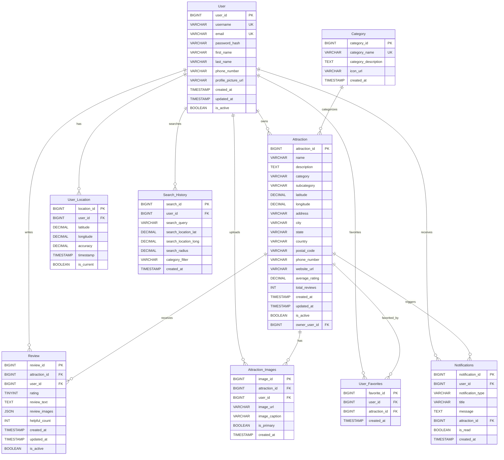
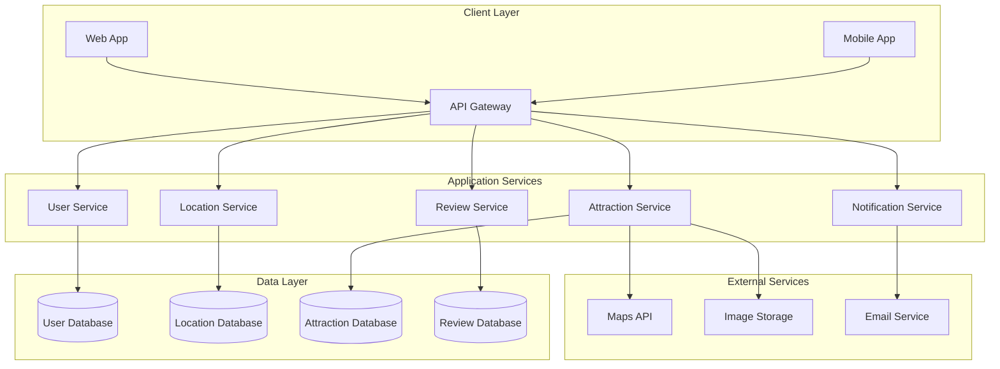
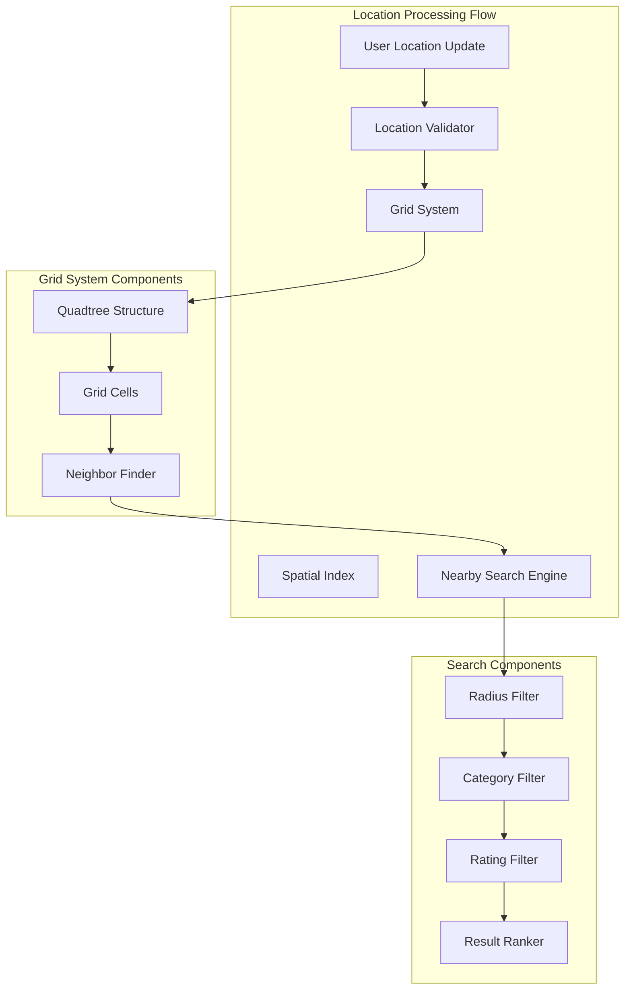
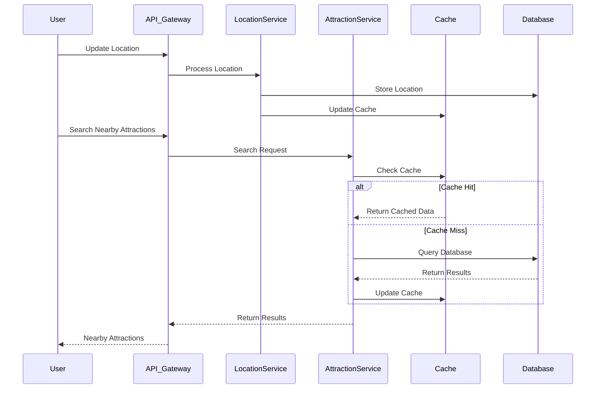
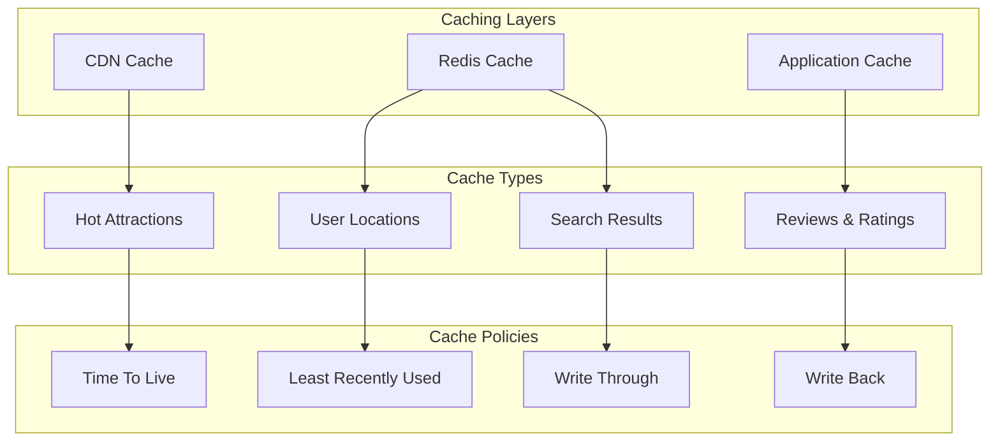
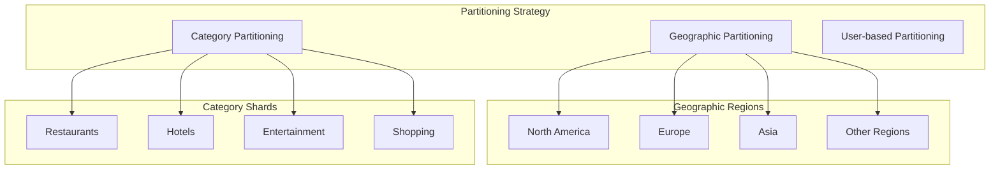
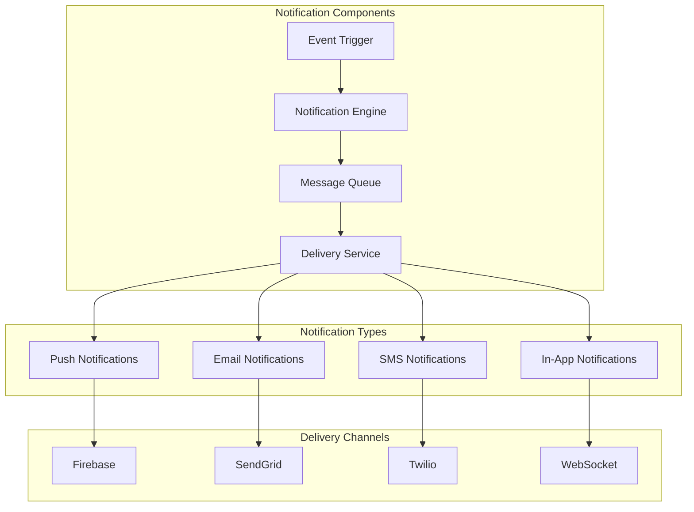
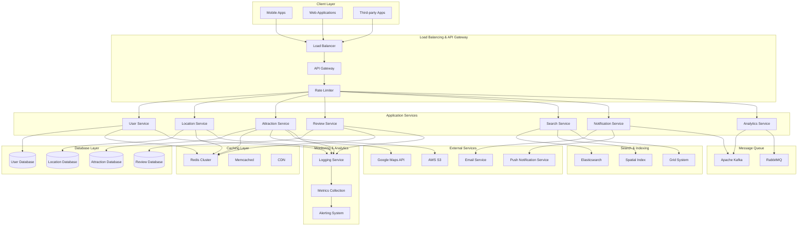
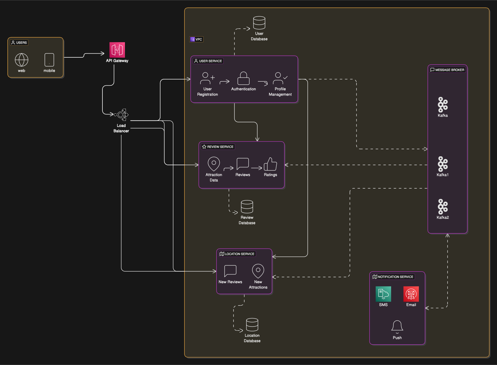

# Design a Nearby or Proximity Service
A Nearby or Proximity Service like Yelp allows users to find and connect with nearby attractions such as restaurants, theaters, etc. Users can see the location of these attractions in real-time, read reviews, and get directions. The system should handle user location updates, attraction data, and notifications.

### Requirements and Goals of the System
Let's discuss what features we will be designing so that we can come up with a set of useful requirements.

<details>
    <summary>**Functional Requirements**</summary>
    - The system should allow users to see nearby attractions.
    - Users should be able to search for specific types of attractions (e.g., restaurants, theaters).
    - Users should be able to see the real-time location of attractions.
    - The system should handle user reviews and ratings for attractions.
    - The feedback can have text, rating and images.
</details>

<details>
    <summary>**Non-Functional Requirements**</summary>
    - The system should be highly available and reliable.
    - The system should have low latency to provide a smooth search and user experience.
    - The system should be scalable to handle a large number of search requests.
    - The system should ensure data consistency and integrity.
</details>

<details>
    <summary>**Extended Requirements**</summary>
    - The system should provide analytics and reporting features.
    - The system should support multiple notification methods.
    - The system should have a robust privacy control for location sharing.
</details>

### Capacity Estimation and Constraints
Let’s consider below assumptions:
- We have **500M places **.
- We have **100K queries per second(QPS)**.
- Assume a 20% growth in places and traffic every year.

Below is Location attributes:
    - LocationID (PK) - 8 bytes
    - UserID (FK) - 8 bytes
    - Location(Latitude, Longitude) - 16 bytes
    - Name - 256 bytes
    - Description - 512 bytes
    - Category - 5 bytes
    - AverageRating - 4 bytes

Total size of each location: 8 + 8 + 16 + 256 + 512 + 5 + 4 = 799 bytes

Below are the Review attributes:
    - ReviewID (PK) - 8 bytes
    - LocationID (FK) - 8 bytes
    - UserID (FK) - 8 bytes
    - Review - 512 bytes
    - Rating - 4 bytes
    - Timestamp - 8 bytes

Total size of each review: 8 + 8 + 8 + 512 + 4 + 8 = 548 bytes

<details>
    <summary>**Traffic**</summary>
    - Total queries per second: 100K
    - Total queries per day: 100K * 3600 * 24 = 8.64B
    - Total queries per year: 8.64B * 365 = 3.15T
</details>

<details>
    <summary>**Storage**</summary>
    - Assuming each location takes 800 bytes of storage, storage requirement: 500M * 800 = 400GB
    - Assuming each location has 10 reviews, each review takes 500 bytes of storage, storage requirement: 500M * 10 * 500 = 2.5TB
    - Yearly storage requirement: 400GB + 2.5TB = 2.9TB
</details>

<details>
    <summary>**Bandwidth**</summary>
    - Incoming data: 100K * 800 = 80MB per second
    - Outgoing data: 100K * 800 = 80MB per second
</details>

<details>
    <summary>**Memory**</summary>
    - If we want to cache 10% of the hot data, we would need to cache 10% of 500M locations, i.e., 50M locations.
    - Size of each location would be 800 bytes, so we would need 50M * 800 = 40GB of memory to cache hot data.
</details>

### API Design
This problem can be decomposed into several main components:
- **User Service:** Handles user registration, authentication, and profile management.
- **Review Service:** Handles attraction data, reviews, and ratings.
- **Location Service:** Handles location updates and retrievals.
- **Notification Management:** Handles notifications for new attractions and reviews.

```java
/**
POST API to update location
api/v1/location/update
    user_id - ID of the user updating the location
    location - New location of the user
returns: success or error message
*/
String updateLocation(String user_id, Location location){
    return status;
}

/**
GET API to get nearby attractions
api/v1/attractions/nearby
    user_id - ID of the user
    category - Category of the attraction (e.g., restaurants, theaters)
returns: list of nearby attractions or error message
*/
List<Attraction> getNearbyAttractions(String user_id, String category){
    return nearbyAttractions;
}

/**
POST API to add a review
api/v1/review/add
    user_id - ID of the user adding the review
    attraction_id - ID of the attraction being reviewed.
    review - The review content
    rating - The rating given by the user
returns: success or error message
*/
String addReview(String user_id, String attraction_id, String review, int rating){
    return status;
}

/**
GET API to get reviews for an attraction
api/v1/review/<attraction_id>
    attraction_id - ID of the attraction
returns: list of reviews or error message
*/
List<Review> getReviews(String attraction_id){
    return reviews;
}
```

### Database Schema
We need to store attraction data, user data, reviews, and location updates. Below is a comprehensive schema for the database:

#### Core Tables

#### Database Schema with SQL Definitions

import Tabs from '@theme/Tabs';
import TabItem from '@theme/TabItem';

<Tabs>
<TabItem value="User">
```sql
CREATE TABLE User (
    user_id BIGINT PRIMARY KEY,
    username VARCHAR(50) UNIQUE NOT NULL,
    email VARCHAR(100) UNIQUE NOT NULL,
    password_hash VARCHAR(255) NOT NULL,
    first_name VARCHAR(50),
    last_name VARCHAR(50),
    phone_number VARCHAR(20),
    profile_picture_url VARCHAR(500),
    created_at TIMESTAMP DEFAULT CURRENT_TIMESTAMP,
    updated_at TIMESTAMP DEFAULT CURRENT_TIMESTAMP ON UPDATE CURRENT_TIMESTAMP,
    is_active BOOLEAN DEFAULT TRUE,
    INDEX idx_email (email),
    INDEX idx_username (username)
);
```
</TabItem>
<TabItem value="Attraction">
```sql
CREATE TABLE Attraction (
    attraction_id BIGINT PRIMARY KEY,
    name VARCHAR(200) NOT NULL,
    description TEXT,
    category VARCHAR(50) NOT NULL,
    subcategory VARCHAR(50),
    latitude DECIMAL(10, 8) NOT NULL,
    longitude DECIMAL(11, 8) NOT NULL,
    address VARCHAR(500),
    city VARCHAR(100),
    state VARCHAR(100),
    country VARCHAR(100),
    postal_code VARCHAR(20),
    phone_number VARCHAR(20),
    website_url VARCHAR(500),
    average_rating DECIMAL(3, 2) DEFAULT 0.00,
    total_reviews INT DEFAULT 0,
    created_at TIMESTAMP DEFAULT CURRENT_TIMESTAMP,
    updated_at TIMESTAMP DEFAULT CURRENT_TIMESTAMP ON UPDATE CURRENT_TIMESTAMP,
    is_active BOOLEAN DEFAULT TRUE,
    owner_user_id BIGINT,
    FOREIGN KEY (owner_user_id) REFERENCES User(user_id),
    INDEX idx_location (latitude, longitude),
    INDEX idx_category (category),
    INDEX idx_rating (average_rating),
    SPATIAL INDEX idx_spatial (latitude, longitude)
);
```
</TabItem>
<TabItem value="Review">
```sql
CREATE TABLE Review (
    review_id BIGINT PRIMARY KEY,
    attraction_id BIGINT NOT NULL,
    user_id BIGINT NOT NULL,
    rating TINYINT NOT NULL CHECK (rating >= 1 AND rating <= 5),
    review_text TEXT,
    review_images JSON,
    helpful_count INT DEFAULT 0,
    created_at TIMESTAMP DEFAULT CURRENT_TIMESTAMP,
    updated_at TIMESTAMP DEFAULT CURRENT_TIMESTAMP ON UPDATE CURRENT_TIMESTAMP,
    is_active BOOLEAN DEFAULT TRUE,
    FOREIGN KEY (attraction_id) REFERENCES Attraction(attraction_id),
    FOREIGN KEY (user_id) REFERENCES User(user_id),
    INDEX idx_attraction (attraction_id),
    INDEX idx_user (user_id),
    INDEX idx_rating (rating),
    INDEX idx_created_at (created_at)
);
```
</TabItem>
<TabItem value="User_Location">
```sql
CREATE TABLE User_Location (
    location_id BIGINT PRIMARY KEY,
    user_id BIGINT NOT NULL,
    latitude DECIMAL(10, 8) NOT NULL,
    longitude DECIMAL(11, 8) NOT NULL,
    accuracy DECIMAL(8, 2),
    timestamp TIMESTAMP DEFAULT CURRENT_TIMESTAMP,
    is_current BOOLEAN DEFAULT FALSE,
    FOREIGN KEY (user_id) REFERENCES User(user_id),
    INDEX idx_user (user_id),
    INDEX idx_current (is_current),
    INDEX idx_timestamp (timestamp),
    SPATIAL INDEX idx_spatial (latitude, longitude)
);
```
</TabItem>
<TabItem value="Category">
```sql
CREATE TABLE Category (
    category_id BIGINT PRIMARY KEY,
    category_name VARCHAR(50) UNIQUE NOT NULL,
    category_description TEXT,
    icon_url VARCHAR(500),
    created_at TIMESTAMP DEFAULT CURRENT_TIMESTAMP,
    INDEX idx_name (category_name)
);
```
</TabItem>
</Tabs>


<Tabs>
<TabItem value="Attraction_Images">
```sql
CREATE TABLE Attraction_Images (
    image_id BIGINT PRIMARY KEY,
    attraction_id BIGINT NOT NULL,
    user_id BIGINT NOT NULL,
    image_url VARCHAR(500) NOT NULL,
    image_caption VARCHAR(500),
    is_primary BOOLEAN DEFAULT FALSE,
    created_at TIMESTAMP DEFAULT CURRENT_TIMESTAMP,
    FOREIGN KEY (attraction_id) REFERENCES Attraction(attraction_id),
    FOREIGN KEY (user_id) REFERENCES User(user_id),
    INDEX idx_attraction (attraction_id),
    INDEX idx_user (user_id),
    INDEX idx_primary (is_primary)
);
```
</TabItem>
<TabItem value="User_Favorites">
```sql
CREATE TABLE User_Favorites (
    favorite_id BIGINT PRIMARY KEY,
    user_id BIGINT NOT NULL,
    attraction_id BIGINT NOT NULL,
    created_at TIMESTAMP DEFAULT CURRENT_TIMESTAMP,
    FOREIGN KEY (user_id) REFERENCES User(user_id),
    FOREIGN KEY (attraction_id) REFERENCES Attraction(attraction_id),
    INDEX idx_user (user_id),
    INDEX idx_attraction (attraction_id)
);
```
</TabItem>

<TabItem value="Search_History" >
```sql
CREATE TABLE Search_History (
    search_id BIGINT PRIMARY KEY,
    user_id BIGINT NOT NULL,
    search_query VARCHAR(500) NOT NULL,
    created_at TIMESTAMP DEFAULT CURRENT_TIMESTAMP,
);
```
</TabItem>
<TabItem value="Notifications">
```sql
CREATE TABLE Notifications (
    notification_id BIGINT PRIMARY KEY,
    user_id BIGINT NOT NULL,
    notification_type VARCHAR(500) NOT NULL,
    created_at TIMESTAMP DEFAULT CURRENT_TIMESTAMP,
);
```
</TabItem>
</Tabs>


#### Entity Relationship Diagram



### Step-by-Step Architecture Design

To better understand the system, let's break down the architecture into smaller, manageable components:

#### 1. Core Services Architecture



#### 2. Location Processing Module



#### 3. Data Flow Architecture



#### 4. Caching Strategy



#### 5. Database Partitioning Strategy



#### 6. Notification System



### High Level Design

Now that we understand the individual components, here's how they all work together:





### Topics of discussion

At a high level, we need to store and index location data and place data.
Given that location doesn't update frequently, our system is going to be read heavy.

The topic of discussion for this problem is mainly around the following components:
- How to store and index location/attraction data.
- How to retrieve nearby attractions based on user location.

Using SQL databases like MySQL or PostgreSQL for storing location data is a straight forward solution,
but querying it with a given user location (user_lat, user_lon) with radius D below a query is inefficient as we need to find distance between two points.

```sql
SELECT * FROM locations
WHERE lattitude BETWEEN user_lat - D AND user_lat + D
AND longitude BETWEEN user_lon - D AND user_lon + D;
```

### Grids
We can use Grids to divide the world into grids and store locations in each grid cell.
This way, we can easily find nearby locations by querying the grid cells around the user's location.

Given Earth's area is around 200 million square miles, we can divide it into 1x1 mile grid cells.
This would give us 200 million grid cells, and each cell would have a unique ID.
To keep

The above solution can run slow for grids that have lot of locations, so we can further divide the grid into smaller cells.
For example, we can divide each 1x1 mile grid cell into 100 smaller cells of 0.1x0.1 mile each.

Challenges:
- How to map grid to the locations.
- How to find grids that are near to each other.

Let's create each grid based on the number of places it has rather than the area it covers.
For e.g. if a grid has more than 100 places, we can divide it into smaller grids.

#### What data structure can we use to store the grid data? How can we efficiently query the grid data?
A tree structure like Quadtree or R-tree can be used to store the grid data.

We will start with a single grid cell that covers the entire world.
If the number of places in a grid cell exceeds a certain threshold, we will divide it into four smaller grid cells.
We will continue this process until each grid cell has fewer than the threshold number of places.
Each node/leaf in the tree will represent a grid cell having a list of places in it.

We will start with the root node to find a location and traverse down the tree to find the location.
Once we reach a leaf node, we will return the list of places/LocationIDs in that grid cell.
Whenever we are inserting a new location, we need to traverse the tree to find the grid cell and insert the location in that grid cell.
If the grid cell has more than 500 places, we need to divide it into four smaller grid cells and redistribute the places.

To retrieve neighboring grids
- We can either use a double-linked list or a hash table to store the places in a grid cell.
- We can goto parent node and find the neighboring grids.

So we can see that the tree structure will help us efficiently query the grid data.

Now we will first find the grid cell in which the user is present and then find the neighboring grid cells to get the nearby places.

### How much memory we need to store the grid data?
Let's assume we have 500M places and stores 500 places, In a node we are only storing Location(lat, long), it takes 16 bytes.
So, the total memory required to store all the locations would be 500M * 16 bytes = 8GB.

Each grid can have 500 places, so we need 500M / 500 = 1M grid cells.
Which means we have 1M nodes in the tree holding 8 GB of data.

### Partitioning
What if we have a large number of places such that our index doesn't fit into memory?

1. We can partition the data based on the region like zip code, so all places in a region belong to a partition.
Certainly we can aks neighboring servers for data.
- What if a region becomes hot, and we need to partition it further?
- What if a region has a lot of places and maintaining uniform distribution is hard?


2. We can partition the data based on the location of the places.
For example, we can partition the data based on the latitude and longitude of the places.
This way, we can store all the places in a partition that falls within a certain range of latitudes and longitudes.
This will help in distributing the data evenly across partitions and make it easier to query nearby places.


### Cache
We can use a cache to store hot attraction data and user locations. This will help reduce the load on the database and improve the system's performance. We can use a distributed cache like Redis or Memcached to store this data.

### Load Balancer
A load balancer can distribute incoming requests to multiple application servers. This helps in scaling the system horizontally and handling a large number of requests. We can use a software load balancer like HAProxy or a cloud-based load balancer like AWS ELB.

