import Tabs from '@theme/Tabs';
import TabItem from '@theme/TabItem';

# Design a Rate Limiter System

A Rate Limiter is a critical component that controls the rate of requests sent by or to a system. It helps prevent abuse, ensures fair usage, and protects services from being overwhelmed by too many requests. Rate limiters are essential for maintaining system stability, security, and providing quality of service guarantees.

## Table of Contents

1. [Requirements and Goals of the System](#requirements-and-goals-of-the-system)
2. [Capacity Estimation and Constraints](#capacity-estimation-and-constraints)
3. [API Design](#api-design)
4. [Database Design](#database-design)
5. [High-Level Design](#high-level-design)
6. [Step-by-Step Architecture Design](#step-by-step-architecture-design)
7. [Rate Limiting Algorithms](#rate-limiting-algorithms)
8. [Topics of Discussion](#topics-of-discussion)
9. [AI Generation Prompts](#ai-generation-prompts)

### Requirements and Goals of the System

<details>
<summary>**Functional Requirements**</summary>
- The system should limit the number of requests per user/IP/API key within a specific time window
- Support multiple rate limiting strategies (per user, per IP, per API key, per endpoint)
- Provide different rate limits for different user tiers (free, premium, enterprise)
- Allow configuration of rate limits dynamically without system restart
- Support both hard limits (block requests) and soft limits (throttle requests)
- Provide real-time monitoring and alerting for rate limit violations
- Support rate limiting based on request complexity or resource usage
- Allow whitelisting of certain users/IPs from rate limiting
</details>

<details>
<summary>**Non-Functional Requirements**</summary>
- The system should have very low latency (< 1ms) for rate limit checks
- High availability (99.99%) as rate limiting is critical for system protection
- Scalable to handle millions of requests per second
- Consistent rate limiting across multiple servers/regions
- Minimal memory footprint for storing rate limit counters
- Support for distributed rate limiting across multiple data centers
- Real-time updates of rate limit configurations
- Fault tolerance - system should continue working even if rate limiter fails
</details>

<details>
<summary>**Extended Requirements**</summary>
- Machine learning-based adaptive rate limiting
- Integration with authentication and authorization systems
- Support for burst traffic handling
- Rate limiting based on user behavior patterns
- Integration with monitoring and analytics systems
- Support for different rate limiting algorithms (token bucket, sliding window, etc.)
- API for rate limit status and quota information
- Support for rate limit bypass for internal services
</details>

### Capacity Estimation and Constraints

Let's consider the following assumptions for a rate limiter system:

- **Total Users**: 100 million registered users
- **Daily Active Users**: 50 million users
- **Peak Requests per Second**: 1 million requests/second
- **Average Requests per User per Day**: 100 requests
- **Rate Limit Check Latency**: < 1ms
- **Memory per Rate Limit Entry**: 100 bytes
- **Rate Limit Window**: 1 minute, 1 hour, 1 day
- **Different User Tiers**: Free (100 req/min), Premium (1000 req/min), Enterprise (10000 req/min)

<details>
<summary>**Traffic Estimation**</summary>
- **Peak QPS**: 1 million requests per second
- **Rate Limit Checks per Second**: 1 million (every request needs rate limit check)
- **Rate Limit Updates per Second**: 1 million (every request updates counters)
- **Configuration Updates per Day**: 1,000 (rate limit rule changes)
- **Monitoring Queries per Second**: 10,000 (dashboard and alerts)
</details>

<details>
<summary>**Storage Requirements**</summary>
- **Active Rate Limit Entries**: 50M users * 3 windows (min/hour/day) = 150M entries
- **Memory per Entry**: 100 bytes (user_id, counters, timestamps, metadata)
- **Total Memory**: 150M * 100 bytes = 15 GB
- **Redis Memory Overhead**: 15 GB * 1.5 = 22.5 GB
- **Configuration Storage**: 1 MB (rate limit rules and policies)
- **Historical Data**: 1 TB (for analytics and monitoring)
</details>

<details>
<summary>**Bandwidth Requirements**</summary>
- **Rate Limit Check Requests**: 1M requests/sec * 100 bytes = 100 MB/sec
- **Rate Limit Check Responses**: 1M responses/sec * 50 bytes = 50 MB/sec
- **Counter Updates**: 1M updates/sec * 200 bytes = 200 MB/sec
- **Total Bandwidth**: 350 MB/sec
- **Peak Bandwidth**: 3x average = 1 GB/sec
</details>

<details>
<summary>**Latency Requirements**</summary>
- **Rate Limit Check**: < 1ms (critical for user experience)
- **Counter Update**: < 2ms (can be slightly higher)
- **Configuration Update**: < 100ms (acceptable for rule changes)
- **Monitoring Query**: < 10ms (acceptable for dashboards)
</details>

:::tip
**Rate Limiter Optimization Techniques:**
- **In-Memory Storage**: Use Redis for fast access to rate limit counters
- **Distributed Caching**: Replicate rate limit data across multiple regions
- **Batch Updates**: Batch counter updates to reduce network overhead
- **Compression**: Compress rate limit data to reduce memory usage
- **TTL Management**: Use TTL to automatically expire old rate limit entries
:::

:::note
**Rate Limiting Strategies:**
- **Per User**: Limit requests per authenticated user
- **Per IP**: Limit requests per IP address (for anonymous users)
- **Per API Key**: Limit requests per API key (for third-party integrations)
- **Per Endpoint**: Different limits for different API endpoints
- **Per Resource**: Limit based on resource consumption (CPU, memory, database queries)
:::

### API Design

We will design REST APIs for our rate limiter system. The system will have the following main services:

- **Rate Limit Service:** Core rate limiting functionality and checks
- **Configuration Service:** Manage rate limit rules and policies
- **Monitoring Service:** Provide rate limit status and analytics
- **User Service:** Manage user tiers and permissions
- **Alert Service:** Handle rate limit violations and notifications

<Tabs>
<TabItem value="Rate Limit Service">
```java
/**
POST API to check rate limit
api/v1/rate-limit/check
    user_id - ID of the user making the request
    api_key - API key for authentication
    endpoint - API endpoint being accessed
    request_size - Size/complexity of the request
returns: rate limit status and remaining quota
*/
RateLimitResponse checkRateLimit(String user_id, String api_key, String endpoint, int request_size)

/**
GET API to get rate limit status
api/v1/rate-limit/status/{user_id}
    user_id - ID of the user
    window - Time window (minute, hour, day)
returns: current usage and limits
*/
RateLimitStatus getRateLimitStatus(String user_id, String window)

/**
POST API to reset rate limit
api/v1/rate-limit/reset
    user_id - ID of the user
    endpoint - API endpoint to reset
returns: success or error message
*/
String resetRateLimit(String user_id, String endpoint)

/**
POST API to bypass rate limit
api/v1/rate-limit/bypass
    user_id - ID of the user
    reason - Reason for bypass
    duration - Duration of bypass in seconds
returns: bypass token
*/
String bypassRateLimit(String user_id, String reason, int duration)
```

</TabItem>
<TabItem value="Configuration Service">
```java
/**
POST API to create rate limit rule
api/v1/rate-limit/rules
    rule_name - Name of the rate limit rule
    user_tier - User tier (free, premium, enterprise)
    endpoint - API endpoint pattern
    limit - Maximum requests allowed
    window - Time window in seconds
    algorithm - Rate limiting algorithm
returns: rule_id
*/
String createRateLimitRule(String rule_name, String user_tier, String endpoint, int limit, int window, String algorithm)

/**
PUT API to update rate limit rule
api/v1/rate-limit/rules/{rule_id}
    rule_id - ID of the rule to update
    limit - New limit value
    window - New time window
    algorithm - New algorithm
returns: success or error message
*/
String updateRateLimitRule(String rule_id, int limit, int window, String algorithm)

/**
DELETE API to delete rate limit rule
api/v1/rate-limit/rules/{rule_id}
    rule_id - ID of the rule to delete
returns: success or error message
*/
String deleteRateLimitRule(String rule_id)

/**
GET API to list rate limit rules
api/v1/rate-limit/rules
    user_tier - Filter by user tier
    endpoint - Filter by endpoint
returns: list of rate limit rules
*/
List<RateLimitRule> getRateLimitRules(String user_tier, String endpoint)
```

</TabItem>
<TabItem value="Monitoring Service">
```java
/**
GET API to get rate limit metrics
api/v1/rate-limit/metrics
    user_id - ID of the user (optional)
    endpoint - API endpoint (optional)
    time_range - Time range for metrics
returns: rate limit metrics
*/
RateLimitMetrics getRateLimitMetrics(String user_id, String endpoint, String time_range)

/**
GET API to get rate limit violations
api/v1/rate-limit/violations
    user_id - ID of the user (optional)
    endpoint - API endpoint (optional)
    severity - Violation severity level
    time_range - Time range for violations
returns: list of rate limit violations
*/
List<RateLimitViolation> getRateLimitViolations(String user_id, String endpoint, String severity, String time_range)

/**
GET API to get rate limit dashboard
api/v1/rate-limit/dashboard
    time_range - Time range for dashboard
returns: dashboard data
*/
RateLimitDashboard getRateLimitDashboard(String time_range)
```

</TabItem>
<TabItem value="User Service">
```java
/**
POST API to create user tier
api/v1/users/tiers
    tier_name - Name of the user tier
    rate_limits - Rate limits for this tier
    features - Features available for this tier
returns: tier_id
*/
String createUserTier(String tier_name, Map<String, Integer> rate_limits, List<String> features)

/**
PUT API to update user tier
api/v1/users/{user_id}/tier
    user_id - ID of the user
    tier_id - New tier ID
returns: success or error message
*/
String updateUserTier(String user_id, String tier_id)

/**
GET API to get user tier
api/v1/users/{user_id}/tier
    user_id - ID of the user
returns: user tier information
*/
UserTier getUserTier(String user_id)

/**
POST API to whitelist user
api/v1/users/{user_id}/whitelist
    user_id - ID of the user
    reason - Reason for whitelisting
    duration - Duration of whitelist
returns: success or error message
*/
String whitelistUser(String user_id, String reason, int duration)
```

</TabItem>
</Tabs>

<Tabs>
<TabItem value="Alert Service">
```java
/**
POST API to create rate limit alert
api/v1/rate-limit/alerts
    alert_name - Name of the alert
    condition - Alert condition
    threshold - Alert threshold
    notification_channels - Notification channels
returns: alert_id
*/
String createRateLimitAlert(String alert_name, String condition, int threshold, List<String> notification_channels)

/**
GET API to get active alerts
api/v1/rate-limit/alerts/active
    user_id - ID of the user (optional)
    endpoint - API endpoint (optional)
returns: list of active alerts
*/
List<RateLimitAlert> getActiveAlerts(String user_id, String endpoint)

/**
POST API to acknowledge alert
api/v1/rate-limit/alerts/{alert_id}/acknowledge
    alert_id - ID of the alert
    user_id - ID of the user acknowledging
returns: success or error message
*/
String acknowledgeAlert(String alert_id, String user_id)
```

</TabItem>
<TabItem value="Analytics Service">
```java
/**
GET API to get rate limit analytics
api/v1/rate-limit/analytics
    user_id - ID of the user (optional)
    endpoint - API endpoint (optional)
    time_range - Time range for analytics
    aggregation - Aggregation level (hour, day, week)
returns: analytics data
*/
RateLimitAnalytics getRateLimitAnalytics(String user_id, String endpoint, String time_range, String aggregation)

/**
GET API to get rate limit trends
api/v1/rate-limit/trends
    metric - Metric to analyze
    time_range - Time range for trends
returns: trend data
*/
RateLimitTrends getRateLimitTrends(String metric, String time_range)

/**
POST API to export rate limit data
api/v1/rate-limit/export
    user_id - ID of the user (optional)
    endpoint - API endpoint (optional)
    time_range - Time range for export
    format - Export format (csv, json)
returns: export job ID
*/
String exportRateLimitData(String user_id, String endpoint, String time_range, String format)
```

</TabItem>
</Tabs>

---

### Database Design

For a rate limiter system, we need to store:
- **User information** and tier assignments
- **Rate limit rules** and configurations
- **Rate limit counters** and usage tracking
- **Violations and alerts** for monitoring
- **Analytics data** for reporting and insights

#### What kind of database should we use?

- **Redis**: For rate limit counters and real-time data (fast access, TTL support)
- **PostgreSQL/MySQL**: For persistent data (users, rules, configurations)
- **Time-series Database (InfluxDB)**: For analytics and monitoring data
- **Cache (Redis/Memcached)**: For frequently accessed rate limit rules

:::tip
**Hybrid Storage Strategy:**
- **Redis**: Store rate limit counters with TTL for automatic expiration
- **PostgreSQL**: Store persistent data (users, rules, configurations)
- **InfluxDB**: Store time-series data for analytics and monitoring
- **Cache**: Store frequently accessed rules and user tier information
:::

#### Database Schema

<Tabs>
<TabItem value="Users">
```sql
CREATE TABLE Users (
    user_id VARCHAR(36) PRIMARY KEY,
    email VARCHAR(255) UNIQUE NOT NULL,
    user_tier VARCHAR(50) NOT NULL,
    is_whitelisted BOOLEAN DEFAULT FALSE,
    whitelist_expires_at TIMESTAMP,
    created_at TIMESTAMP DEFAULT CURRENT_TIMESTAMP,
    updated_at TIMESTAMP DEFAULT CURRENT_TIMESTAMP ON UPDATE CURRENT_TIMESTAMP,
    is_active BOOLEAN DEFAULT TRUE
);

CREATE TABLE User_Tiers (
    tier_id VARCHAR(36) PRIMARY KEY,
    tier_name VARCHAR(100) NOT NULL,
    description TEXT,
    rate_limits JSON NOT NULL, -- Store rate limits as JSON
    features JSON, -- Store features as JSON
    created_at TIMESTAMP DEFAULT CURRENT_TIMESTAMP,
    updated_at TIMESTAMP DEFAULT CURRENT_TIMESTAMP ON UPDATE CURRENT_TIMESTAMP
);
```

</TabItem>
<TabItem value="Rate_Limit_Rules">
```sql
CREATE TABLE Rate_Limit_Rules (
    rule_id VARCHAR(36) PRIMARY KEY,
    rule_name VARCHAR(255) NOT NULL,
    user_tier VARCHAR(50) NOT NULL,
    endpoint_pattern VARCHAR(500) NOT NULL,
    limit_value INT NOT NULL,
    window_seconds INT NOT NULL,
    algorithm VARCHAR(50) NOT NULL, -- token_bucket, sliding_window, fixed_window
    is_active BOOLEAN DEFAULT TRUE,
    created_at TIMESTAMP DEFAULT CURRENT_TIMESTAMP,
    updated_at TIMESTAMP DEFAULT CURRENT_TIMESTAMP ON UPDATE CURRENT_TIMESTAMP
);

CREATE TABLE Rate_Limit_Counters (
    counter_id VARCHAR(36) PRIMARY KEY,
    user_id VARCHAR(36) NOT NULL,
    endpoint VARCHAR(500) NOT NULL,
    window_start TIMESTAMP NOT NULL,
    request_count INT DEFAULT 0,
    last_request_at TIMESTAMP,
    expires_at TIMESTAMP NOT NULL,
    INDEX idx_user_endpoint_window (user_id, endpoint, window_start),
    INDEX idx_expires_at (expires_at)
);
```

</TabItem>
<TabItem value="Violations">
```sql
CREATE TABLE Rate_Limit_Violations (
    violation_id VARCHAR(36) PRIMARY KEY,
    user_id VARCHAR(36) NOT NULL,
    endpoint VARCHAR(500) NOT NULL,
    violation_type VARCHAR(50) NOT NULL, -- rate_limit_exceeded, burst_limit_exceeded
    severity VARCHAR(20) NOT NULL, -- low, medium, high, critical
    request_count INT NOT NULL,
    limit_value INT NOT NULL,
    window_seconds INT NOT NULL,
    ip_address VARCHAR(45),
    user_agent TEXT,
    created_at TIMESTAMP DEFAULT CURRENT_TIMESTAMP,
    INDEX idx_user_endpoint (user_id, endpoint),
    INDEX idx_created_at (created_at),
    INDEX idx_severity (severity)
);
```

</TabItem>
<TabItem value="Alerts">
```sql
CREATE TABLE Rate_Limit_Alerts (
    alert_id VARCHAR(36) PRIMARY KEY,
    alert_name VARCHAR(255) NOT NULL,
    condition_type VARCHAR(50) NOT NULL, -- threshold, percentage, trend
    threshold_value INT NOT NULL,
    notification_channels JSON NOT NULL,
    is_active BOOLEAN DEFAULT TRUE,
    created_at TIMESTAMP DEFAULT CURRENT_TIMESTAMP,
    updated_at TIMESTAMP DEFAULT CURRENT_TIMESTAMP ON UPDATE CURRENT_TIMESTAMP
);

CREATE TABLE Alert_Instances (
    instance_id VARCHAR(36) PRIMARY KEY,
    alert_id VARCHAR(36) NOT NULL,
    user_id VARCHAR(36),
    endpoint VARCHAR(500),
    severity VARCHAR(20) NOT NULL,
    message TEXT NOT NULL,
    is_acknowledged BOOLEAN DEFAULT FALSE,
    acknowledged_by VARCHAR(36),
    acknowledged_at TIMESTAMP,
    created_at TIMESTAMP DEFAULT CURRENT_TIMESTAMP,
    FOREIGN KEY (alert_id) REFERENCES Rate_Limit_Alerts(alert_id),
    INDEX idx_alert_id (alert_id),
    INDEX idx_created_at (created_at),
    INDEX idx_is_acknowledged (is_acknowledged)
);
```

</TabItem>
<TabItem value="Analytics">
```sql
CREATE TABLE Rate_Limit_Metrics (
    metric_id VARCHAR(36) PRIMARY KEY,
    user_id VARCHAR(36),
    endpoint VARCHAR(500),
    metric_name VARCHAR(100) NOT NULL,
    metric_value DECIMAL(15,4) NOT NULL,
    timestamp TIMESTAMP NOT NULL,
    tags JSON, -- Additional metadata as JSON
    INDEX idx_user_endpoint (user_id, endpoint),
    INDEX idx_timestamp (timestamp),
    INDEX idx_metric_name (metric_name)
);

CREATE TABLE Rate_Limit_Usage (
    usage_id VARCHAR(36) PRIMARY KEY,
    user_id VARCHAR(36) NOT NULL,
    endpoint VARCHAR(500) NOT NULL,
    window_start TIMESTAMP NOT NULL,
    window_end TIMESTAMP NOT NULL,
    request_count INT NOT NULL,
    unique_users INT NOT NULL,
    avg_response_time DECIMAL(10,3),
    error_count INT DEFAULT 0,
    created_at TIMESTAMP DEFAULT CURRENT_TIMESTAMP,
    INDEX idx_user_endpoint_window (user_id, endpoint, window_start),
    INDEX idx_window_start (window_start)
);
```

</TabItem>
</Tabs>

#### Entity Relationship Diagram (ERD)

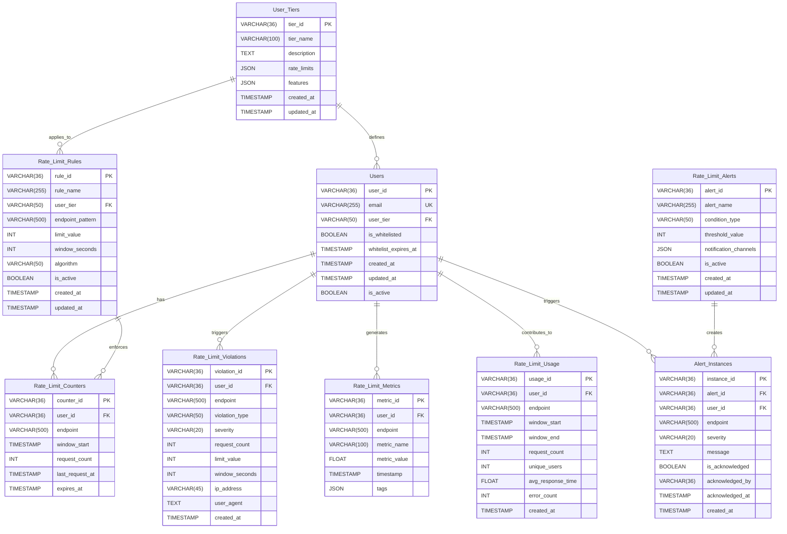

---

### High-Level Design

A rate limiter system consists of several key components working together to provide efficient, scalable, and reliable rate limiting capabilities.

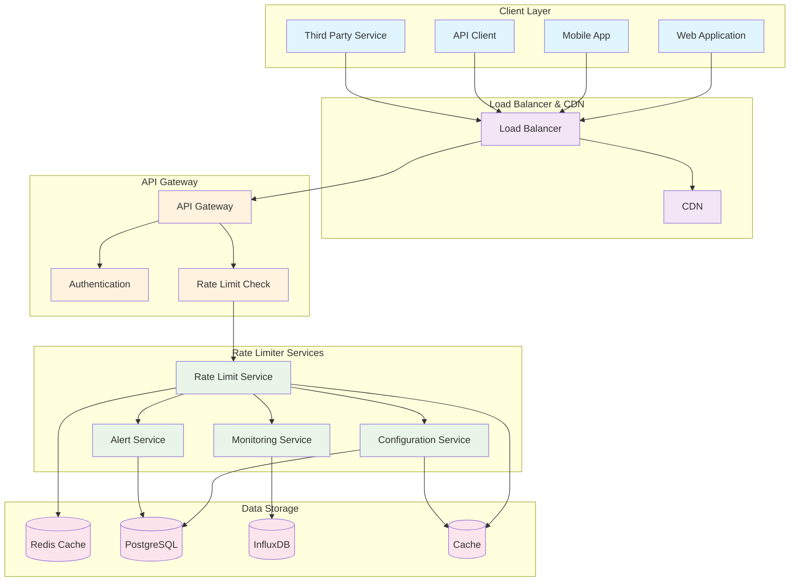

### Step-by-Step Architecture Design

Let's break down the rate limiter system into smaller, manageable components to better understand the architecture.

#### 1. Request Flow and Rate Limit Check

This diagram shows how requests flow through the rate limiter system.

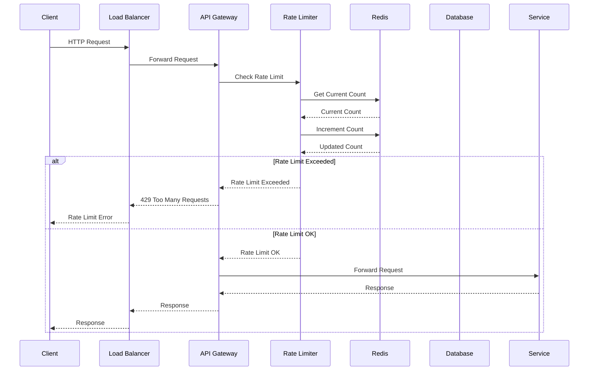

#### 2. Rate Limiter Core Components

This diagram shows the internal components of the rate limiter service.

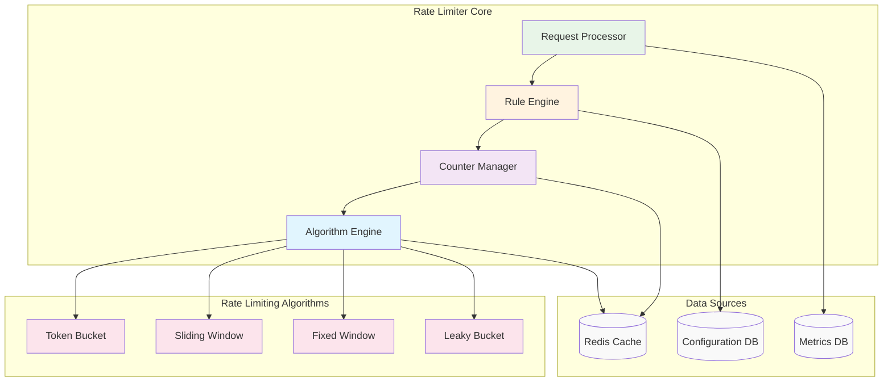

#### 3. Configuration Management

This diagram shows how rate limit configurations are managed and updated.

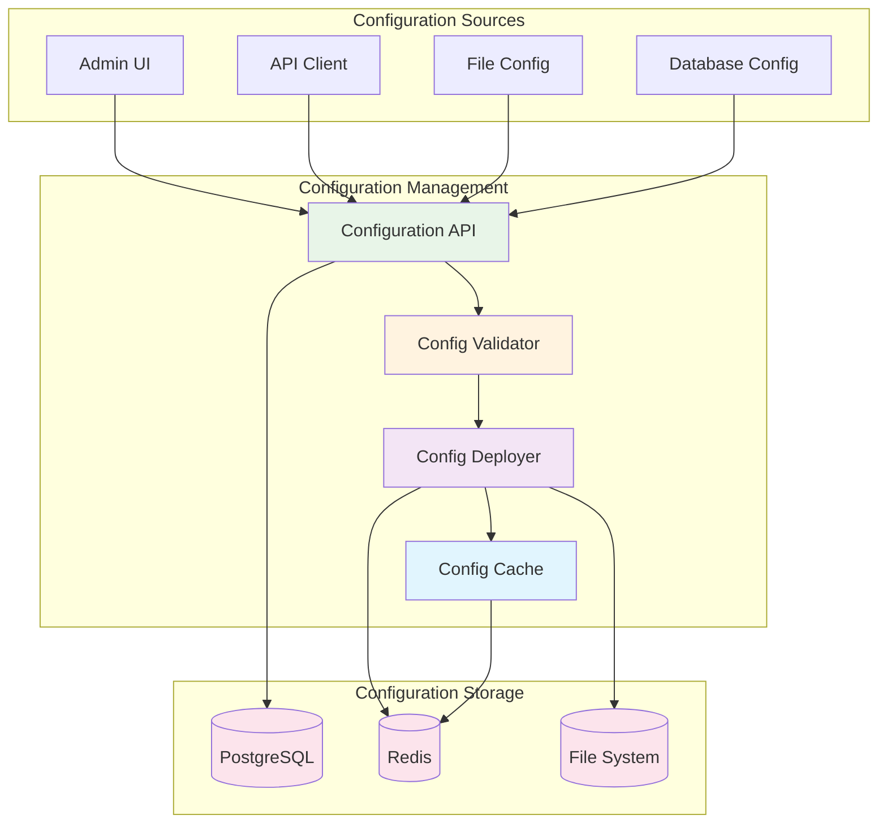

#### 4. Monitoring and Alerting

This diagram shows how monitoring and alerting work in the rate limiter system.

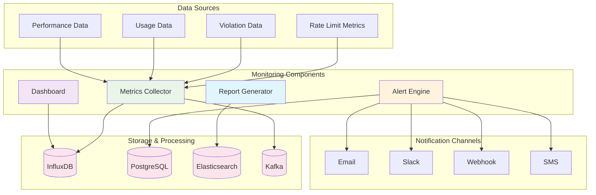

#### 5. Distributed Rate Limiting

This diagram shows how rate limiting works across multiple servers and regions.

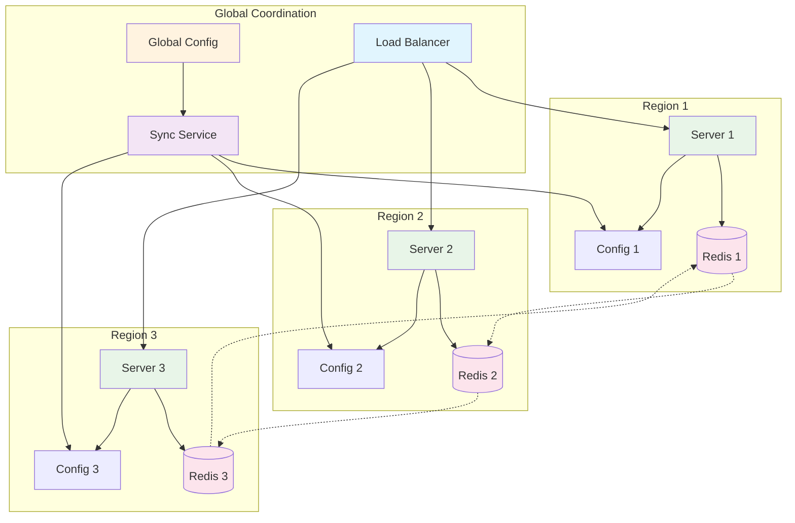

#### 6. Rate Limiting Algorithms Comparison

This diagram shows different rate limiting algorithms and their characteristics.

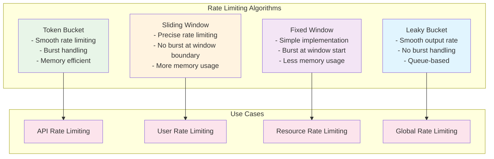

#### 7. Full System Architecture

Combining all components, here's the complete rate limiter system architecture.

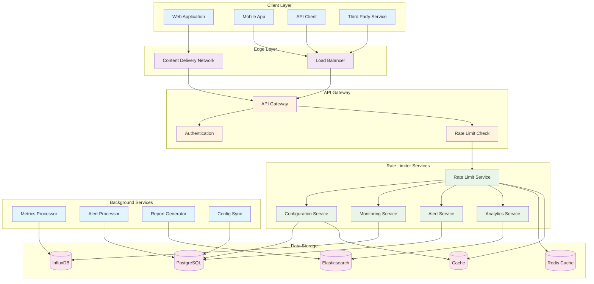

### Rate Limiting Algorithms

Different rate limiting algorithms have different characteristics and use cases. Let's explore the most common ones:

#### 1. Token Bucket Algorithm

The token bucket algorithm allows for burst traffic while maintaining an average rate.

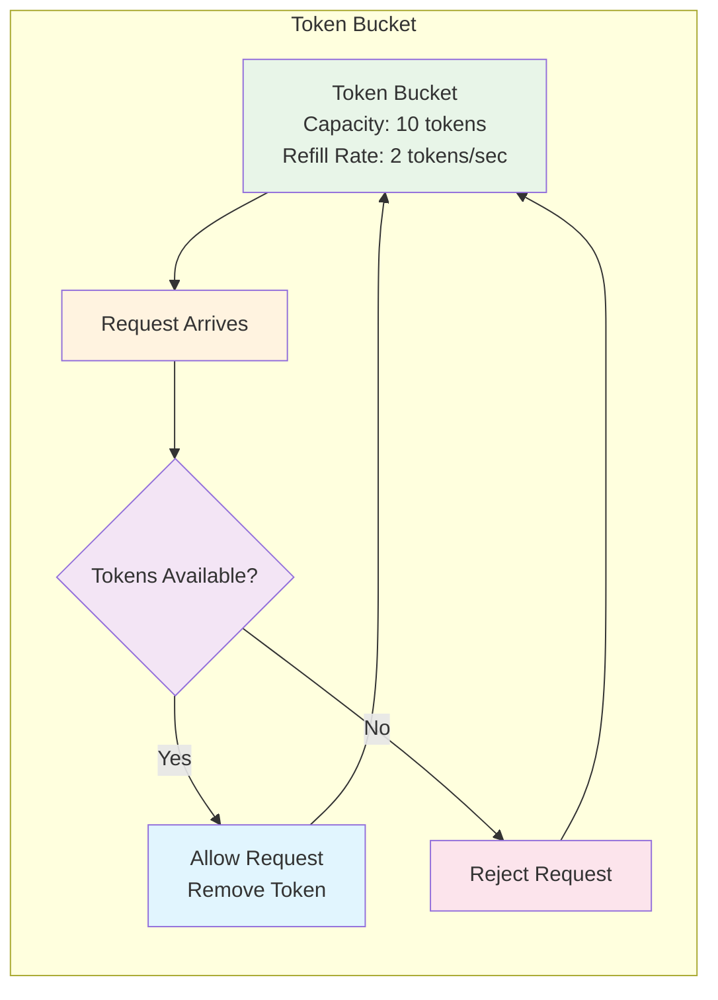

**Characteristics:**
- **Burst Handling**: Allows bursts up to bucket capacity
- **Smooth Rate**: Maintains average rate over time
- **Memory Efficient**: Only stores bucket state
- **Use Case**: API rate limiting, bandwidth control

#### 2. Sliding Window Algorithm

The sliding window algorithm provides precise rate limiting without burst at window boundaries.

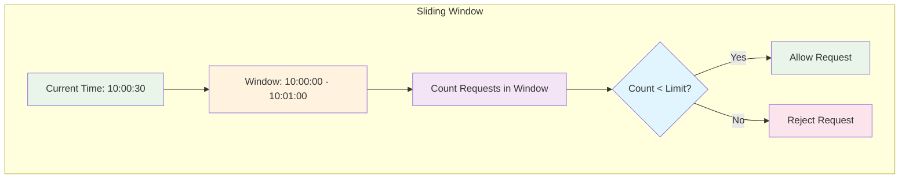

**Characteristics:**
- **Precise Limiting**: No burst at window boundaries
- **Memory Intensive**: Stores request timestamps
- **Complex Implementation**: Requires efficient data structures
- **Use Case**: User rate limiting, strict compliance

#### 3. Fixed Window Algorithm

The fixed window algorithm is simple but can have burst issues at window boundaries.

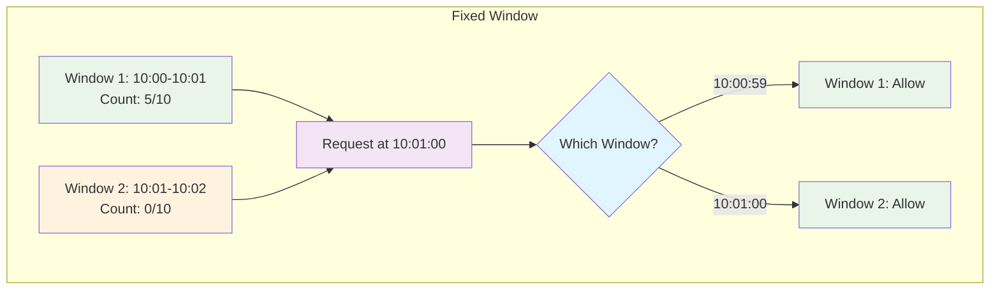

**Characteristics:**
- **Simple Implementation**: Easy to understand and implement
- **Burst at Boundaries**: Can have 2x limit at window start
- **Memory Efficient**: Only stores counter per window
- **Use Case**: Simple rate limiting, less strict requirements

#### 4. Leaky Bucket Algorithm

The leaky bucket algorithm provides smooth output rate with no burst handling.

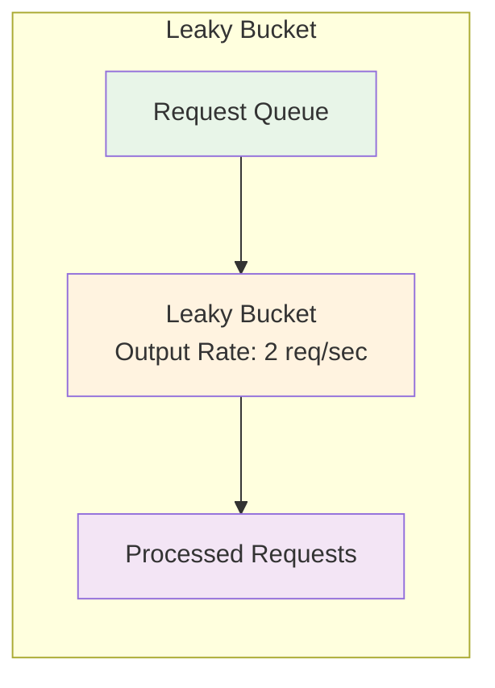

**Characteristics:**
- **Smooth Output**: Constant output rate
- **No Burst**: Cannot handle traffic spikes
- **Queue-based**: Requests are queued and processed
- **Use Case**: Traffic shaping, smooth processing

### Topics of Discussion

#### Key Challenges in Rate Limiter Systems

1. **Distributed Rate Limiting**
   - **Challenge**: Maintaining consistent rate limits across multiple servers
   - **Solution**: Use distributed cache (Redis) with atomic operations
   - **Trade-off**: Network latency vs. consistency

2. **Memory Management**
   - **Challenge**: Storing rate limit counters efficiently
   - **Solution**: Use TTL-based expiration, compression, and sampling
   - **Considerations**: Memory usage vs. accuracy

3. **Configuration Management**
   - **Challenge**: Updating rate limit rules without downtime
   - **Solution**: Hot reloading, versioning, and gradual rollout
   - **Requirements**: Zero-downtime deployments

4. **Performance Optimization**
   - **Challenge**: Minimizing latency for rate limit checks
   - **Solution**: In-memory caching, batch operations, and async processing
   - **Considerations**: Accuracy vs. performance

5. **Scalability**
   - **Challenge**: Handling millions of requests per second
   - **Solution**: Horizontal scaling, sharding, and load balancing
   - **Considerations**: Data consistency vs. performance

#### Rate Limiting Strategies

:::tip
**Algorithm Selection Guide:**
- **Token Bucket**: Best for API rate limiting with burst handling
- **Sliding Window**: Best for user rate limiting with strict compliance
- **Fixed Window**: Best for simple rate limiting with less strict requirements
- **Leaky Bucket**: Best for traffic shaping and smooth processing
:::

:::note
**Implementation Considerations:**
- **Latency**: Rate limit checks should be < 1ms
- **Accuracy**: Balance between precision and performance
- **Storage**: Use appropriate data structures for counters
- **Monitoring**: Track rate limit effectiveness and violations
:::

#### Performance Optimization Techniques

- **Caching**: Cache rate limit rules and user tiers
- **Batching**: Batch counter updates to reduce network overhead
- **Compression**: Compress rate limit data to reduce memory usage
- **Sampling**: Use sampling for high-volume, low-precision scenarios
- **Async Processing**: Process non-critical operations asynchronously

### AI Generation Prompts

Here are some prompts you can use with AI tools like ChatGPT or Gemini to generate enhanced and HD diagrams for this document:

1. **Rate Limiter System Architecture:**
   - "Generate a comprehensive architecture diagram for a rate limiter system. Include client applications (web, mobile, API clients), load balancer, API gateway, rate limiter services (core, configuration, monitoring, alerting), data storage (Redis, PostgreSQL, InfluxDB), and background services. Use a modern, clean visual style with distinct component colors and clear connections."

2. **Rate Limit Check Flow Sequence Diagram:**
   - "Create a detailed sequence diagram for rate limit checking in a distributed system. Participants should include Client, Load Balancer, API Gateway, Rate Limiter, Redis, Database, and Backend Service. Show the complete flow from request to response, including rate limit check, counter update, and decision logic."

3. **Rate Limiting Algorithms Comparison:**
   - "Design a comprehensive comparison diagram of rate limiting algorithms (Token Bucket, Sliding Window, Fixed Window, Leaky Bucket). Show their characteristics, use cases, advantages, and disadvantages. Include visual representations of how each algorithm works with request flows and timing."

4. **Distributed Rate Limiting Architecture:**
   - "Illustrate a distributed rate limiting system across multiple regions. Include regional servers, Redis clusters, configuration synchronization, load balancing, and global coordination. Show how rate limits are maintained consistently across different geographic locations."

5. **Configuration Management Flow:**
   - "Create a detailed flow diagram for rate limit configuration management. Include configuration sources (admin UI, API, files), validation, deployment, caching, and synchronization across multiple servers. Show how configuration changes are propagated without downtime."

6. **Monitoring and Alerting System:**
   - "Generate a comprehensive monitoring and alerting architecture for a rate limiter system. Include metrics collection, data storage (InfluxDB, PostgreSQL), alert processing, notification channels (email, Slack, webhooks), and dashboard components. Show the complete flow from metrics collection to alert delivery."

7. **Rate Limiter Core Components:**
   - "Design a detailed diagram of rate limiter core components. Include request processor, rule engine, counter manager, algorithm engine, and different rate limiting algorithms. Show how these components interact to process rate limit requests and make decisions."

8. **Token Bucket Algorithm Visualization:**
   - "Create a visual representation of the token bucket algorithm. Show token refill process, request processing, burst handling, and rate limiting logic. Include timing diagrams and state transitions."

9. **Sliding Window Algorithm Implementation:**
   - "Illustrate the sliding window rate limiting algorithm. Show window management, request counting, timestamp tracking, and precise rate limiting. Include examples of how the algorithm handles requests at window boundaries."

10. **Rate Limiter Performance Optimization:**
    - "Generate a diagram showing rate limiter performance optimization techniques. Include caching strategies, batch processing, compression, sampling, async processing, and memory management. Show how these optimizations improve system performance and scalability."
