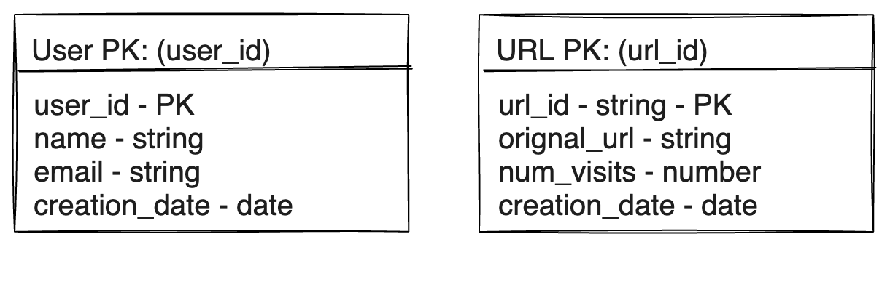

import Tabs from '@theme/Tabs';
import TabItem from '@theme/TabItem';

# Design a url shortner service
URL shortening is used to create shorter aliases for long URLs. We call these shortened aliases “short links.” Users are redirected to the original URL when they hit these short links. Short links save a lot of space when displayed, printed, messaged, or tweeted. Additionally, users are less likely to mistype shorter URLs.

### Requirements and Goals of the System
Let's discuss what features we will be designing so that we can come up with a set of useful requirements.

<details>
<summary>**Functional Requirements**</summary>
  - Given a URL, our service should generate a shorter and unique alias of it. This is called a short link. This link should be short enough to be easily copied and pasted into applications.
  - When users access a short link, our service should redirect them to the original link.
  - Users should optionally be able to pick a custom short link for their URL.
  - Links will expire after a standard default timespan. Users should be able to specify the expiration time.
</details>

<details>
<summary> **Non-Functional Requirements**</summary>
  - The system should be highly available. This is required because, if our service is down, all the URL redirections will start failing.
  - URL redirection should happen in real-time with minimal latency.
  - Shortened links should not be guessable (not predictable).
</details>

<details>
<summary>**Extended Requirements**</summary>
  - Analytics; e.g., how many times a redirection happened?
  - Our service should also be accessible through REST APIs by other services.
  - Users should be able to register and manage their account.
</details>

### Capacity Estimation and Constraints
Let’s consider below assumptions :
- we have **500M new URL shortenings every month**
- on average, we will have 16 URL redirections per shortened URL per month.
- **Read heavy** system, **100:1** read to write ratio.
- Let's assume we will store url mappings for **5 years
- Each URL takes 500bytes and metadata for each URL will take another 100bytes. So we need 600bytes to store metadata for each URL.

Let's assume we need to store some metadata with each URL, including:
    - Original URL
    - Shortened URL alias
    - Creation date
    - Expiry date
    - #of visits
    - etc.

This will bring us to the following calculations:

<details>
<summary>**Traffic**</summary>
    - New URLs shortened per month: 500M * 12 = 6B
    - URLs redirections per month: 500M * 12 * 16 = 96B
    - URLs redirections per second: 96B / (30 * 24 * 3600) ~= 37K
</details>
<details>
<summary>**Storage**</summary>
    - Total URLs needed for 5 years: 6B * 5 ~= 30B
    - Total storage required for metadata: 30B * 100 bytes ~= 3TB
    - Total storage required for redirections: 96B * 500 bytes ~= 46TB
    - Total storage: 3TB + 46TB ~= 50TB
</details>
<details>
<summary>**Bandwidth**</summary>
    - Incoming data: 500M * 500 bytes ~= 250GB per month
    - Outgoing data: 96B * 500 bytes ~= 46TB per month
</details>
<details>
<summary>**Memory**</summary>
    - If we want to cache 20% of the hot URLs, we would need to cache 20% of 30B URLs, i.e., 6B URLs.
    - Size of each object would be 600 bytes (with metadata), so we would need 6B * 600 bytes ~= 3.5TB of memory to cache all hot URLs.
</details>

### API Design
This problem can be decomposed into two main components:
- **URL shortening:** This functionality will take care of shortening a URL and storing the mapping in a database. We will also need a simple web frontend to interact with this service.
- **URL redirection:** Given a shortened URL, this service will redirect the user to the original URL.
```java
/**
POST API to create a shortened URL
api/v1/shorten
    api_dev_key - A developer key to track the API usage
    original_url - Original URL to be shortened
    custom_alias - Optional custom key for the URL
    user_name - Optional user_name parameter (used for authentication)
    expire_date - Optional expiration date for the shortened URL
returns: shortened_url or error message
*/
createURL(api_dev_key, original_url, custom_alias=None, user_name=None, expire_date=None)
    return shortened_url
/**
GET API to get original URL
api/v1/get/<shortened_url>
    shortened_url - Shortened URL to be resolved to the original URL
returns: original_url or error message
*/
getOriginalURL(shortened_url) return shortened_url
    return original_url
/**
DELETE api to delete a url
api/v1/delete/<shortened_url>
    shortened_url - Shortened URL to be deleted
returns: True if the url is deleted else False
*/
deleteURL(shortened_url) return boolean
    return status
```

### Database Design
- **We need to store billions of records** and **support billions of queries**.
- **We need to store metadata** with each URL, including **creation date**, **expiration date**, **the number of visits**, **etc**.
- **We need to support millions of writes per second**.
- **Our service is read-heavy**.
- **URL redirection** should happen in **real-time**.
- **There is no need for complex relationships**.

#### What kind of database should we use?
- **SQL** databases are not a good fit for such scenarios as **their vertical scalability** is limited and **they can not handle** such a **large amount of data**, **write** or **read** load.
- **NoSQL** databases are a better choice for such a large scale system as they are **horizontally scalable** and provide a superior read/write performance.
- **Cassandra** is a good choice for such a system as it can handle a huge amount of data, **read/write** throughput, **has no single point of failure** and **provides tunable consistency**.

:::tip
If we add '.' and '-' (dot and dash) to our allowed character set, we get **64^7** = **16T** unique strings.
:::

### Database Schema



#### How to generate a unique key for each URL?
- We can **generate** a **unique hash** (of fixed length) for each incoming URL and use the first seven characters for the short link.
- We can **store** all the mappings in **Cassandra** with **key** as **shortened URL** and **other attributes** like **original URL**, **creation date**, **expiration date**, **etc.**.
- Whenever a request comes to **shorten a URL**, we **generate** a **hash** for the **given URL** and **store** it in **Cassandra**. We then **use** the **first seven characters** of the **hash** as the **shortened URL** and **return** it to the **user**.
- Whenever a request comes to **expand a shortened URL**, we **fetch** the **original URL** from **Cassandra** and **return** it to the **user**.


### High Level Design

import FinalDesignSVG from './final-design.svg';

<FinalDesignSVG width="100%" height="80%"/>

### Topics of Discussion
In our design we have issue of `Hash Collision` : Since we are generating keys there may be a chance of collision.
Or a Users can opt for same custom short url
#### Workaround
Below are some of the possible workaround.
- Generate keys offline and get it from another service `Key Generation Service`.
Whenever a key gets consumed it should be marked *unavailable* in the Database
  :::warning
  - need to maintain another table to store used and un-used keys which is an additional overhead.
  :::
- Encode url_id and use value as key. This will reduce the chance of collision as user_id will be unique.
  :::warning
  - Ids can be predicted and can be used to access other urls.
  :::

