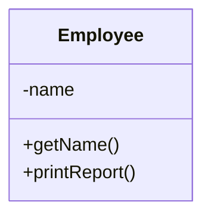
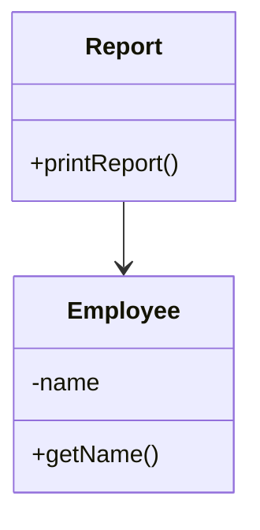
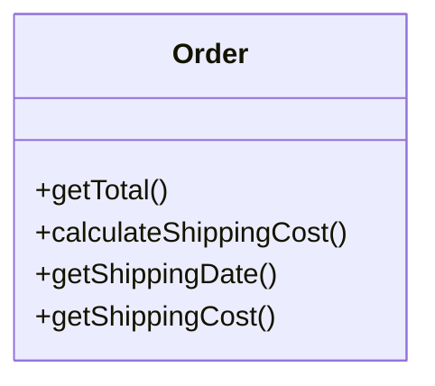
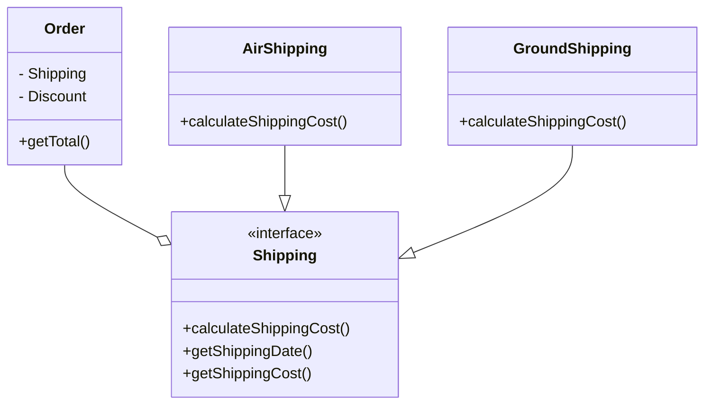
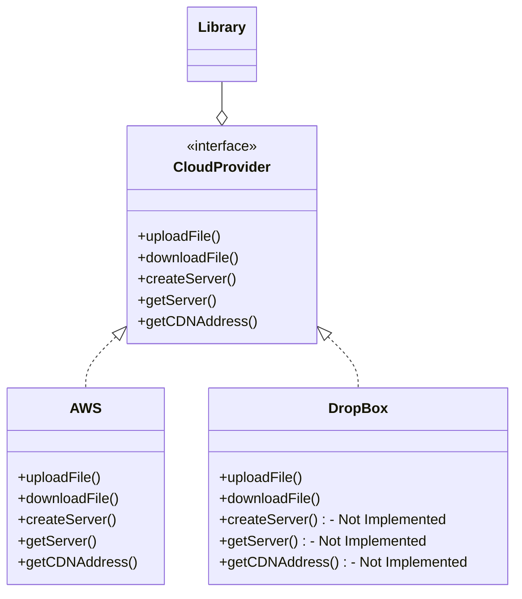
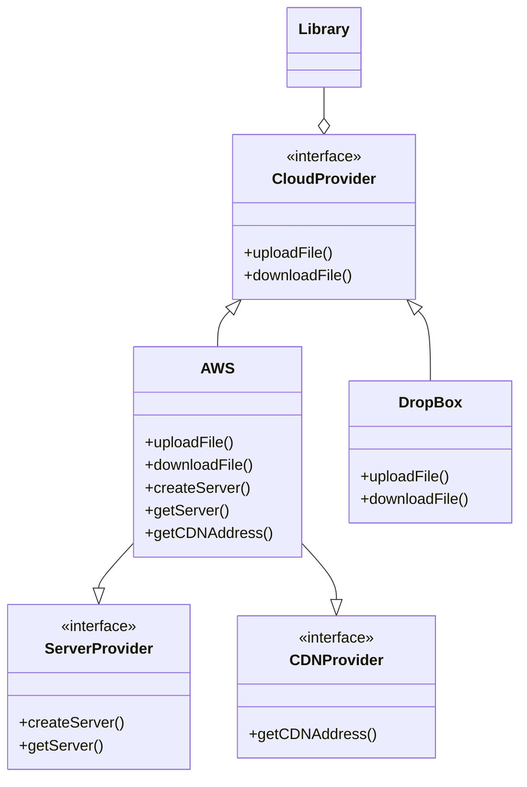
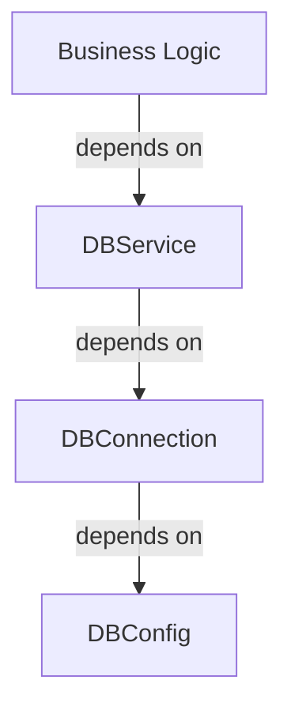
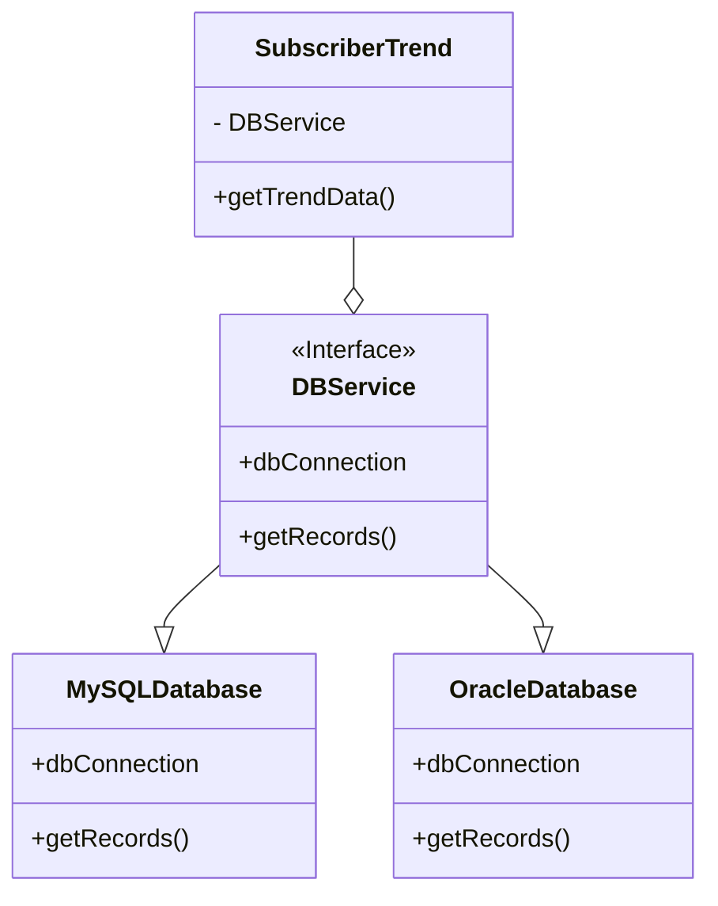

import Tabs from '@theme/Tabs';
import TabItem from '@theme/TabItem';

# SOLID Principles
Robert C. Martin (Uncle Bob) introduced the SOLID principles in his 2000 paper Design Principles and Design Patterns. The SOLID principles are the five principles of good object-oriented programming and design. The SOLID principles are:

- Low level classes : Implement basic operations and have no knowledge of the business rules.
- High level classes : Implement business rules and have no knowledge of the basic operations.

{/* <details> */}
{/* <summary>Single Responsibility Principle</summary> */}
### Single Responsibility Principle

:::note
The main goal of this principle is reducing complexity. You
don’t need to invent a sophisticated design for a program that
only has about 200 lines of code. Make a dozen methods pretty, and you’ll be fine.
:::

At some point classes become so big that
you can no longer remember their details. Code navigation
slows down to a crawl, and you have to scan through whole
classes or even an entire program to find specific things.

If a class does more than one job, it becomes coupled. A change to one responsibility results to modification of the other responsibility. This leads to fragile designs that break in many places.
Employee class has several reason to change over time and so does format to print report.

You can remove behaviour of printing report from Employee class and create a new class Report to print report.
Thus extra work has its own class, we can use composition to add extra work to Employee class.


<!-- </details> -->

{/* <details> */}
{/* <summary>Open Closed Principle</summary> */}
## Open Closed Principle

:::note
The main idea of this principle is to keep existing code from
breaking.

A class is open if you can extend it, produce a subclass and do whatever you want with it—add new methods or fields,
override base behavior, etc. g when you implement new features.
:::

For e.g. we have `Order` class which contains logic for shipping cost calculation. If you want to add a new feature to calculate discount, you can extend the `Order` class and add a new method to calculate discount.

```java
class Order {
    double calculateShippingCost() {
        // Calculate shipping cost
        if(shipping == "GROUND"){
            return 10;
        }else if(shipping == "AIR"){
            return 20;
        }
    }
}
```
Now if you want to add a new feature to calculate discount, you can extend the `Order` class and add a new method to calculate discount.

<!-- </details> -->


{/* <details> */}
{/* <summary>Liskov Substitution Principle</summary> */}
## Liskov Substitution Principle
:::note
When extending a class, remember that you should be
able to pass objects of the subclass in place of objects of
the parent class without breaking the client code.
:::

- A good design should follow the Liskov substitution principle for inheritance.
- Liskov substitution principle means that the objects of a superclass should be replaceable with objects of its subclasses without affecting the functionality of the program.
- This makes the design more extensible and maintainable.

Parameter types of a subclass should match or be a superclass of the parameter types.
If you have a class `RaceCare `that extends `Car`, there is a method to `startEngine` method to start engine,
you should be able to replace `Car` with `RaceCar` without affecting the functionality of the program.
<Tabs>
    <TabItem value="Return Type">
Return type of a method should be a match or subclass of the return type of the overridden method in the superclass.
```java
class Car {
    Car startEngine() {
        // Start the engine
        return new Car
    }
}
class RaceCar extends Car {
    @Override
    RaceCar startEngine() {
        // Start the engine
        return new RaceCar
    }
}
```
    </TabItem>
    <TabItem value="Exceptions">
Exceptions thrown by a subclass should be the same or a subclass of the exceptions thrown by the superclass.
```java
class Car {
    void startEngine() throws EngineStartException {
        // Start the engine
    }
}

class RaceCar extends Car {
    @Override
    void startEngine() throws EngineStartException {
        // Start the engine
    }
}
```
    </TabItem>
    <TabItem value="Private fields">
Subclass should not alter the private fields of the superclass.

```java
class Car {
    private String color;
    void paintCar(String color) {
        // Start the engine
    }
}

class RaceCar extends Car {
    @Override
    void paintCar(String color) {

    }
}
```
    </TabItem>
    <TabItem value="Parameters">
        Parameter Types of a method in a subclass should match or be a superclass of the parameter types of the overridden method in the superclass.
        You overwrote the method to feed any Animal
```java
    class Cat extends Animal {
        @Override
        void feed(Animal animal) {
            // Feed the animal
        }
    }
```
    </TabItem>
</Tabs>

<!-- </details> -->

{/* <details> */}
{/* <summary>Interface Segregation Principle</summary> */}
## Interface Segregation Principle
:::note
Clients shouldn’t be forced to depend on methods they do not use.
:::

- A good design should follow the interface segregation principle.
- Interface segregation principle means that the interfaces should be segregated into smaller interfaces so that the clients only need to know about the methods that they are interested in.
- This makes the design more extensible and maintainable.

Consider example of a Library that makes it easy to integrate with any CloudProvider, initially made for AWS it now has to support DropBox subclass.
<Tabs>
    <TabItem value="Problem">

    </TabItem>
    <TabItem value="Solution">
The better approach is to break down interfaces into parts.
Classes can implement only the interfaces they need.

    </TabItem>
</Tabs>

## Dependency Inversion Principle
:::note
High-level classes shouldn’t depend on low-level classes. Both should depend on abstractions. Abstractions
shouldn’t depend on details. Details should depend on
abstractions.
:::
- A good design should follow the dependency inversion principle.
- Dependency inversion principle means that the high level modules should not depend on the low level modules.
- Instead, both should depend on abstractions.
- This makes the design more extensible and maintainable.

Consider the example of a `Car` class that depends on the `Engine` class. If the `Engine` class changes, the `Car` class also needs to change. This makes the design fragile and hard to maintain.
```java
class Car {
    Engine engine;
    Car(Engine engine) {
        this.engine = engine;
    }
}
```
Instead, the `Car` class should depend on an abstraction of the `Engine` class. This makes the design more extensible and maintainable.
```java
interface Engine {
    void startEngine();
}

class Car {
    Engine engine;
    Car(Engine engine) {
        this.engine = engine;
    }
}
```
you need to design interface for low level classes first and high level classes should depend on the interface.
For instance, business logic should call a method `openPDFReport(file)` rather than a series of methods
`openFile(x)`, `readBytes(n)`, `closeFile(x)` . These interfaces
count as high-level ones.

<Tabs>
    <TabItem value="Problem">
Consider Highlevel class `SubscriberTrend `which is getting data from another class `DBService` for reading and
persisting data. `DBService` is dependent on `DBConnection` and `DBConnection` is dependent on `DBConfig`.
When you change the Database to a new vendor or change the database connection, you need to change the `DBService` class. This makes the design fragile and hard to maintain.

    </TabItem>
    <TabItem value="Solution">
Instead, the `DBService` class should depend on an abstraction of the `DBConnection` class. This makes the design more extensible and maintainable.

    </TabItem>
</Tabs>

:::tip
Using these principles mindlessly can cause more harm than good. The SOLID principles are guidelines, not rules. They are not meant to be followed blindly. They are meant to be used as a guide to help you create better designs.
:::
