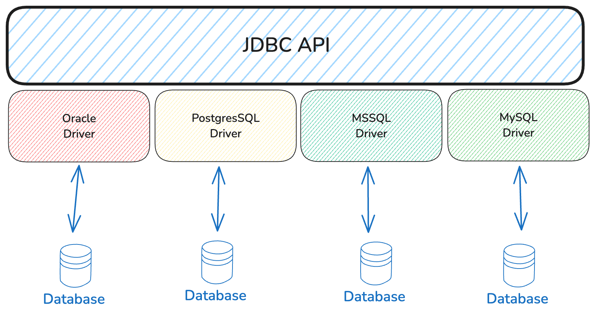
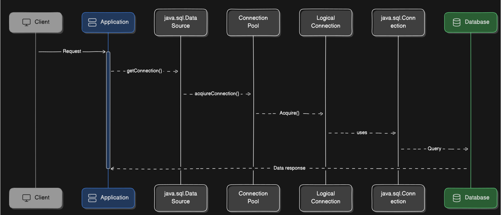
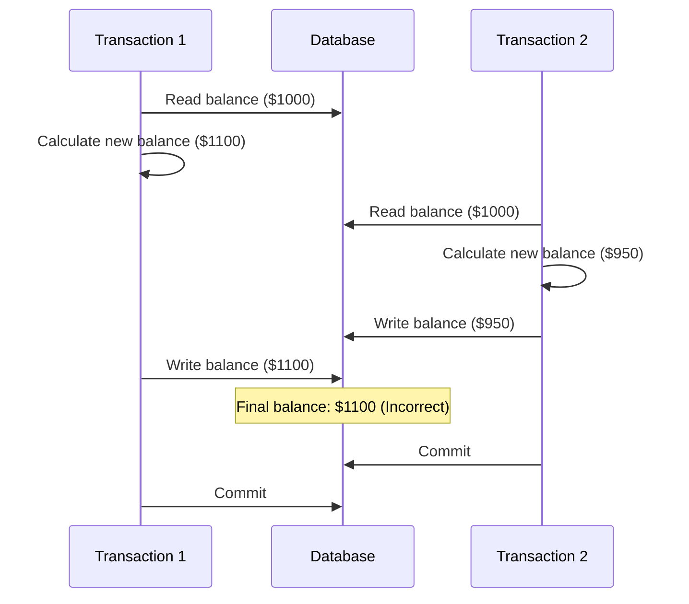

**The JDBC (Java Database Connectivity) API** provides a common interface for communicating to a database server.
All the networking logic and the database specific communication protocol are hidden away behind
the vendor-independent JDBC API.




### Connection Pooling
Relational databases have emerged in the late seventies, and, for two and a half decades,
the database vendors took advantage of the Vertical Scaling.

Every connection requires a TCP socket from the client (application) to the server (database).
The total number of connections offered by a database server depends on the underlying hardware resources, 

because I/O operations are costly, the database uses a buffer pool to map into memory
the underlying data and index pages.
Changes are first applied in memory, and flushed to disk in batches to achieve better write performance.

To provide data consistency, locks (shared and exclusive) are used to protect data 
blocks (rows and indexes) from being concurrently updated.


In a typical enterprise application, the user request throughput is greater than the available database
connection capacity. Opening and closing database connections is a very expensive operation.
For this reason, the database connection pooling is used to manage the connections in a more efficient way.

:::note
**If the connection pool supports it, it’s very important to set the idle connection timeout threshold.
This way, the pool can release unused connections**

Long-running transactions might hold database locks, which, in turn, 
might lead to increasing the serial portion of the current execution context,
therefore hindering parallelism
:::



### Batching
JDBC 2.0 introduced batch updates, so that multiple DML statements can be grouped into a single database request.
This can reduce the number of round trips between the application and the database,

JDBC 3.0 introduced the ability to batch prepared statements, which can be used to execute the same SQL statement multiple times with different parameters.

Batching is supported for `java.sql.Statement` and `java.sql.PreparedStatement` and `java.sql.CallableStatement`.

#### Batching statements
Refer to the following code snippet to see how to use batch statements using `java.sql.Statement`:

<details>
    <summary>Batching statements</summary>

    ```java
    try (Connection connection = dataSource.getConnection();
         Statement statement = connection.createStatement()) {
        statement.addBatch("INSERT INTO employee (id, name) VALUES (1, 'John')");
        statement.addBatch("INSERT INTO employee (id, name) VALUES (2, 'Jane')");
        statement.addBatch("INSERT INTO employee (id, name) VALUES (3, 'Doe')");

        # The numbers of database rows affected by statement is included in the return value of the method.
        int [] updateCounts = statement.executeBatch();
        System.out.println(Arrays.toString(updateCounts));
    }
    ```
</details>

<details>
<summary>Batching prepared statements</summary>
```java
try (Connection connection = dataSource.getConnection();
     PreparedStatement preparedStatement = connection.prepareStatement("INSERT INTO employee (id, name) VALUES (?, ?)")) {
    preparedStatement.setInt(1, 1);
    preparedStatement.setString(2, "John");
    preparedStatement.addBatch();

    preparedStatement.setInt(1, 2);
    preparedStatement.setString(2, "Jane");
    preparedStatement.addBatch();

    preparedStatement.setInt(1, 3);
    preparedStatement.setString(2, "Doe");
    preparedStatement.addBatch();

    int [] updateCounts = preparedStatement.executeBatch();
    System.out.println(Arrays.toString(updateCounts));
}
```
</details>

For dynamic statements, PreparedStatement provides better performance (when enabling batching)
and stronger security guarantees. Most ORM tools use prepared statements, 
and since entities are inserted/update/deleted individually, they can take advantage of batching.

:::tip
As a rule of thumb you should always measure the performance improvement for various batch
sizes. In practice, a relatively low value (between 10 and 30) is usually a good choice
:::

---
### Caching

Caching is a technique used to store frequently accessed data in memory, so that it can be retrieved faster.
Caching is a crucial aspect of optimizing the performance of the persistence layer in applications. 

In database systems, caching can be done at different levels:
- **Statement Caching**: Database systems often incur overhead in parsing and generating execution plans for SQL statements. Statement caching allows reuse of these plans for subsequent executions of the same statement, leading to substantial performance gains, particularly for frequently executed queries in high-throughput OLTP systems.
- **Server-Side Statement Caching**: Database vendors provide execution plan caches where the statement string is hashed and used as a key to retrieve cached plans. Using parameterized queries (e.g., PreparedStatements) instead of dynamic SQL statements is crucial for effective server-side statement caching.
- **Client-Side Statement** Caching: JDBC drivers can cache statement objects, reducing client-side processing time and resource consumption. The goal is to minimize transaction response time by reusing already-constructed statements and their associated metadata.

The SQL statement is parsed and compiled for each execution, which can lead to performance degradation.

`SQLString` becomes the cache key, so the same SQL statement is compiled only once.
*PreparedStatement(s)* and *CallableStatement(s)* have a better chance of getting reused

:::note
The shorter the query processing time, the quicker the row-level locks are
released, and the more scalable the data access layer becomes.
It is important for **scalability** to minimize the time spent in the database.
:::

There are two ways to limit the number of rows returned by a query:
- **Limiting**: The application retrieves a fixed number of rows from the result set in query. e.g. `LIMIT` in MySQL, `ROWNUM` in Oracle, `FETCH FIRST` in DB2.
- **Max Row count**: Configuiring the database to limit the number of rows returned by a query.

---

:::tip
The auto-sharding topology is similar to the Multi-Master replication architecture as it can increase
throughput by distributing incoming load to multiple machines. While in a Multi-Master replicated
environment every node stores the whole database, the auto-sharding cluster distributes data so
that each shard is only a subset of the whole database.
:::


--- 

<details>
<summary>Dirty Write</summary>

A **dirty write** occurs when two concurrent transactions are allowed to modify the same row simultaneously, leading to data integrity issues. In essence, one transaction overwrites the uncommitted changes of another, resulting in a **lost update**.

Here's a scenario illustrating a dirty write:

Imagine a banking system where two transactions are trying to update an account balance simultaneously:
Transaction 1: Transfer $100 to the account
Transaction 2: Deduct $50 from the account
Initial balance: $1000

Sequence of events:
- Transaction 1 reads balance: $1000
- Transaction 1 calculates new balance: $1100
- Transaction 2 reads balance: $1000
- Transaction 2 calculates new balance: $950
- Transaction 2 writes new balance: $950
- Transaction 1 writes new balance: $1100
- Both transactions commit

Final balance: $1100



In this scenario, Transaction 1's write has overwritten Transaction 2's change, resulting in a dirty write. The final balance of $1100 is incorrect, as it doesn't reflect the $50 deduction6.

**The result is a lost update.**  The system has lost the $50 deduction made by Transaction 2, leading to data inconsistency and potential financial discrepancies.

</details>


**Most database systems, by default, prevent dirty writes even at the lowest isolation levels.** They employ locking mechanisms to ensure that only one transaction can modify a row at a given time. 
