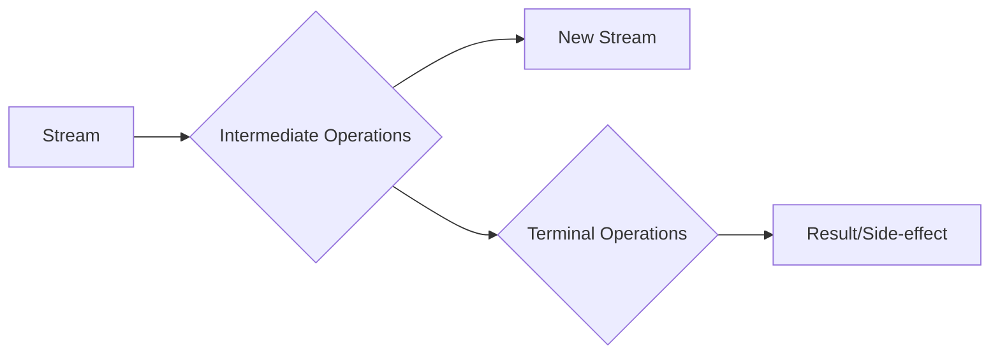

Here’s an intuitive explanation and examples for **Functional Interfaces**, **Lambdas**, and **Streams** in Java 17. These concepts are core to functional programming in Java.

---
<details>
    <summary>
        What is functional programming?
    </summary>

    **Functional programming** is a programming paradigm that treats computation as the evaluation of mathematical functions and avoids changing state and mutable data.
    It emphasizes the use of functions that take inputs and produce outputs without side effects.
</details>

## Functional Interfaces
A **functional interface** is an interface with exactly one abstract method. It can also have default or static methods, but only one abstract method is required. Functional interfaces are the foundation for **lambda expressions**.

<details>
    <summary>
        Example: Custom Functional Interface
    </summary>

    ```java
    @FunctionalInterface
    interface Greeting {
        void sayHello(String name);
    }

    public class FunctionalInterfaceExample {
        public static void main(String[] args) {
        // Using a lambda expression to implement the interface
        Greeting greeting = (name) -> System.out.println("Hello, " + name + "!");
        greeting.sayHello("Alice");
        }
    }
    ```

    **Output**:
    ```
    Hello, Alice!
    ```
</details>


### Built-in Functional Interfaces
Java provides several built-in functional interfaces in the `java.util.function` package, such as:
- **`Predicate<T>`**: Takes one input and returns a boolean.
- **`Function<T, R>`**: Takes one input and returns an output.
- **`Consumer<T>`**: Takes one input and performs an action (no return).
- **`Supplier<T>`**: Provides a value (no input).

---
## Lambda Expressions
A **lambda expression** is a concise way to represent a function that can be passed around. It simplifies the implementation of functional interfaces.

### Syntax
```java
(parameters) -> { body }
```

### Examples:
<details>
    <summary>
        Zero Parameters
    </summary>
    ```java
    Runnable runnable = () -> System.out.println("Running...");
    new Thread(runnable).start();
    ```
</details>

<details>
    <summary>
        Single Parameter
    </summary>

    ```java
    Consumer<String> printer = message -> System.out.println(message);
    printer.accept("Hello, Lambda!");
    ```

</details>

<details>
    <summary>
        Multiple Parameters
    </summary>

    ```java
    @FunctionalInterface
    interface MathOperation {
        int operate(int a, int b);
    }

    public class LambdaExample {
        public static void main(String[] args) {
        MathOperation addition = (a, b) -> a + b;
        MathOperation multiplication = (a, b) -> a * b;

        System.out.println(addition.operate(5, 3)); // Output: 8
        System.out.println(multiplication.operate(5, 3)); // Output: 15
        }
    }
    ```

</details>

---

## Streams

A **Stream** is a sequence of elements that supports functional-style operations like filtering, mapping, and reducing. Streams are lazy and do not store data; they process data on demand.

<details>
    <summary>
        Example: Basic Stream Operations
    </summary>
    ```java
    import java.util.Arrays;
    import java.util.List;

    public class StreamExample {
        public static void main(String[] args) {
            List<Integer> numbers = Arrays.asList(1, 2, 3, 4, 5);

            // Filter even numbers and double them
            numbers.stream()
            .filter(n -> n % 2 == 0)
            .map(n -> n * 2)
            .forEach(System.out::println); // Output: 4, 8
        }
    }
    ```
    #### Explanation:
    1. **`filter`**: Filters elements based on a condition.
    2. **`map`**: Transforms each element.
    3. **`forEach`**: Performs an action on each element.
</details>

An **intermediate operation** returns a new stream and allows chaining multiple operations. Examples include `filter`, `map`, and `sorted`.
A **terminal operation** produces a result or a side-effect and ends the stream. Examples include `forEach`, `collect`, and `reduce`.




<details>
    <summary>
        Example: Reduce Operation
    </summary>
```java
import java.util.stream.IntStream;

public class ReduceExample {
    public static void main(String[] args) {
        int sum = IntStream.range(1, 6) // Stream of numbers from 1 to 5
                           .reduce(0, Integer::sum); // Sum all elements

        System.out.println(sum); // Output: 15
    }
}
```
</details>

<details>
    <summary>
        Example: Collect Operation
    </summary>
```java
import java.util.List;
import java.util.stream.Collectors;
import java.util.stream.IntStream;

public class CollectExample {
    public static void main(String[] args) {
        List<Integer> evenNumbers = IntStream.range(1, 6)
                                             .filter(n -> n % 2 == 0)
                                             .boxed() // Convert to Integer
                                             .collect(Collectors.toList());

        System.out.println(evenNumbers); // Output: [2, 4]
    }
}
```

</details>

#### Summary Table

| Concept                  | Key Feature                                      | Example Code Snippet                                                                 |
|--------------------------|--------------------------------------------------|-------------------------------------------------------------------------------------|
| **Functional Interface** | Single abstract method                           | `@FunctionalInterface interface MyFunc { void execute(); }`                        |
| **Lambda Expression**    | Concise function representation                  | `(x) -> x * x`                                                                     |
| **Streams**              | Functional-style operations on data collections | `list.stream().filter(x -> x > 2).map(x -> x * x).forEach(System.out::println);`    |

By combining these concepts—functional interfaces for structure, lambdas for concise implementation, and streams for processing—you can write clean and powerful functional-style Java code in Java 17!

----

## Write code for below questions

<details>
<summary>
    ### Print Distinct numbers in an Array
</summary>
```java
import java.util.Arrays;
import java.util.List;
public void streamExample_Distinct() {
    List<Integer> numbers = Arrays.asList(1, 1, 2, 6, 2, 3);
    numbers.stream().distinct().forEach(System.out::print); // 1263
}
```
</details>

<details>
    <summary>
        ### Sort numbers in an Array
    </summary>
```java
import java.util.Arrays;
import java.util.List;
public void streamExample_Distinct() {
    List<Integer> numbers = Arrays.asList(1, 1, 2, 6, 2, 3);
    numbers.stream().sorted().forEach(System.out::print); // 1263
    // reverse sorting
    numbers.stream().sorted(Comparator.reverseOrder()).forEach(System.out::print); // 6321
}
```
</details>

<details>
    <summary>
        ### Find the Second Highest Number
    </summary>
    **Problem**: Given a list of integers, find the second highest number.

```java
import java.util.*;
import java.util.stream.*;

public class StreamExample {
    public static void main(String[] args) {
        List<Integer> numbers = Arrays.asList(10, 20, 30, 40, 50);

        // Solution using Streams
        int secondHighest = numbers.stream()
        .sorted(Comparator.reverseOrder()) // Sort in descending order
        .skip(1) // Skip the first element (highest)
        .findFirst() // Get the second element
        .orElseThrow(() -> new RuntimeException("No second highest number found"));

        System.out.println(secondHighest); // Output: 40
    }
}
```
</details>
<details>
    <summary>
        ### Print the 3rd smallest and largest number in the array
    </summary>
```java
import java.util.Arrays;
import java.util.List;
public void streamExample_Distinct() {
    List<Integer> numbers = Arrays.asList(1, 1, 2, 6, 2, 3);

    numbers.stream().sorted().distinct()
    .skip(2).findFirst()
    .ifPresent(System.out::println); // 2
    // reverse sorting
    numbers.stream().sorted(Comparator.reverseOrder())
    .distinct().skip(2)
    .findFirst().ifPresent(System.out::println); // 2
}
```
</details>

<details>
    <summary>
        ### Count number of words in a sentence, return word and count
    </summary>
    ```java
    import java.util.Arrays;
    import java.util.List;
    public void streamExample_Distinct() {
    String str = "Hello, how are you? Hello, World!";

    Map<String, Long> wordCount =
                Arrays.stream(str.split("\\W+"))
                                 .collect(
                                     Collectors.groupingBy(Function.identity() , Collectors.counting())
                );

    System.out.println(charCount); // { =1, !=1, H=1, W=1, d=1, e=1, l=3, o=2, r=1}
}
    ```
</details>

<details>
    <summary>
        ### Frequency of Each Character in a String
    </summary>
```java
import java.util.*;
import java.util.stream.*;

public class CharacterFrequency {
    public static void main(String[] args) {
        String input = "programming";

        Map<Character, Long> frequencyMap = input.chars()
        .mapToObj(c -> (char) c)
        .collect(Collectors.groupingBy(c -> c, Collectors.counting()));

        System.out.println(frequencyMap); // Output: {r=2, o=1, g=2, p=1, m=2, i=1, n=1}
    }
}
```
</details>

<details>
    <summary>
        ### Group Strings by Their Length
    </summary>
    **Problem**: Given a list of strings, group them by their lengths.

```java
import java.util.*;
import java.util.stream.*;

public class StreamExample {
    public static void main(String[] args) {
        List<String> words = Arrays.asList("apple", "banana", "pear", "kiwi", "grape");

        // Solution using Streams
        Map<Integer, List<String>> groupedByLength = words.stream()
        .collect(Collectors.groupingBy(String::length));

        System.out.println(groupedByLength);
        // Output: {5=[apple, grape], 6=[banana], 4=[pear, kiwi]}
    }
}
```
</details>

<details>
    <summary>
        ### Count Frequency of Words in a List
    </summary>
    **Problem**: Given a list of words, count the frequency of each word.

```java
import java.util.*;
import java.util.stream.*;

public class StreamExample {
    public static void main(String[] args) {
        List<String> words = Arrays.asList("apple", "banana", "apple", "orange", "banana", "apple");

        // Solution using Streams
        Map<String, Long> wordCount = words.stream()
        .collect(Collectors.groupingBy(Function.identity(), Collectors.counting()));

        System.out.println(wordCount);
        // Output: {orange=1, banana=2, apple=3}
    }
}
    ```
</details>


<details>
    <summary>
        ### Find All Numbers Starting with a Specific Digit
    </summary>
**Problem**: Given a list of integers, find all numbers starting with the digit `1`.

```java
import java.util.*;
import java.util.stream.*;

public class StreamExample {
    public static void main(String[] args) {
        List<Integer> numbers = Arrays.asList(10, 15, 23, 45, 19, 100, 121);

        // Solution using Streams
        List<Integer> result = numbers.stream()
            .map(String::valueOf) // Convert numbers to strings
            .filter(s -> s.startsWith("1")) // Filter numbers starting with '1'
            .map(Integer::valueOf) // Convert back to integers
            .collect(Collectors.toList());

        System.out.println(result); // Output: [10, 15, 19, 100, 121]
    }
}
```
</details>
<details>
    <summary>
        ### Find the Most Repeated Element in an Array
    </summary>
    **Problem**: Given a list of integers, find all numbers starting with the digit `1`.

```java
import java.util.*;
import java.util.stream.*;

public class MostRepeatedElement {
    public static void main(String[] args) {
        int[] array = {1, 2, 3, 4, 5, 3, 4, 3};

        int mostRepeatedElement = Arrays.stream(array)
        .boxed() // Convert to Integer stream
        .collect(Collectors.groupingBy(e -> e, Collectors.counting()))
        .entrySet() // Convert map to set of entries
        .stream()
        .max(Map.Entry.comparingByValue())
        .get()
        .getKey();

        System.out.println(mostRepeatedElement); // Output: 3
    }
}
```
</details>
<details>
    <summary>
        ### Find Duplicate Elements in a List
    </summary>
**Problem**: Given a list of integers, find all the duplicate elements.

```java
import java.util.*;
import java.util.stream.*;

public class StreamExample {
    public static void main(String[] args) {
        List<Integer> numbers = Arrays.asList(1, 2, 3, 4, 5, 2, 3, 6);

        // Solution using Streams
        Set<Integer> seen = new HashSet<>();
        List<Integer> duplicates = numbers.stream()
            .filter(n -> !seen.add(n)) // Add to set; if false (already exists), it's a duplicate
            .collect(Collectors.toList());

        System.out.println(duplicates); // Output: [2, 3]
    }
}
```
</details>

<details>
    <summary>
        ### Flatten a List of Lists
    </summary>
**Problem**: Given a list of lists of integers, flatten it into a single list.

```java
import java.util.*;
import java.util.stream.*;

public class StreamExample {
    public static void main(String[] args) {
        List<List<Integer>> listOfLists = Arrays.asList(
            Arrays.asList(1, 2),
            Arrays.asList(3, 4),
            Arrays.asList(5)
        );

        // Solution using Streams
        List<Integer> flattenedList = listOfLists.stream()
            .flatMap(List::stream)
            .collect(Collectors.toList());

        System.out.println(flattenedList); // Output: [1, 2, 3, 4, 5]
    }
}
```
</details>

<details>
    <summary>
        ### Partition Numbers into Even and Odd
    </summary>
**Problem**: Partition a list of integers into even and odd numbers.

```java
import java.util.*;
import java.util.stream.*;

public class StreamExample {
    public static void main(String[] args) {
        List<Integer> numbers = Arrays.asList(1, 2, 3, 4, 5);

        // Solution using Streams
        Map<Boolean, List<Integer>> partitioned = numbers.stream()
            .collect(Collectors.partitioningBy(n -> n % 2 == 0));

        System.out.println(partitioned);
        // Output: {false=[1, 3, 5], true=[2, 4]}
    }
}
```
</details>


<details>
    <summary>
        ### Find the Longest String
    </summary>
**Problem**: Find the longest string in a list.

```java
import java.util.*;
import java.util.stream.*;

public class StreamExample {
    public static void main(String[] args) {
        List<String> words = Arrays.asList("apple", "banana", "pear", "watermelon");

        // Solution using Streams
        String longestWord = words.stream()
            .max(Comparator.comparingInt(String::length))
            .orElseThrow(() -> new RuntimeException("Empty list"));

        System.out.println(longestWord); // Output: watermelon
    }
}
```
</details>

<details>
    <summary>
        ### Reverse each word in a String
    </summary>
**Problem**: Reverse each word in a string.

```java
import java.util.*;
import java.util.stream.*;

public class ReverseWords {
    public static void main(String[] args) {
        String sentence = "Java Streams are powerful";

        String result = Arrays.stream(sentence.split(" "))
        .map(word -> new StringBuilder(word).reverse().toString())
        .collect(Collectors.joining(" "));

        System.out.println(result); // Output: avaJ smaertS era lufrewop
    }
}
```

</details>

<details>
    <summary>
        ### Calculate Sum of Squares
    </summary>
**Problem**: Calculate the sum of squares of all integers in a list.

```java
import java.util.*;
import java.util.stream.*;

public class StreamExample {
    public static void main(String[] args) {
        List<Integer> numbers = Arrays.asList(1, 2, 3);

        // Solution using Streams
        int sumOfSquares = numbers.stream()
            .map(n -> n * n) // Square each number
            .reduce(0, Integer::sum); // Sum them up

        System.out.println(sumOfSquares); // Output: 14 (1^2 + 2^2 + 3^2)
    }
}
```
</details>

<details>
    <summary>
        ### Find Palindromes in a List
    </summary>
**Problem**: Find all palindromic strings in a list.

```java
import java.util.*;
import java.util.stream.*;

public class StreamExample {
    public static void main(String[] args) {
        List<String> words = Arrays.asList("madam", "level", "hello", "world");

        // Solution using Streams
        List<String> palindromes = words.stream()
            .filter(word -> word.equals(new StringBuilder(word).reverse().toString()))
            .collect(Collectors.toList());

        System.out.println(palindromes); // Output: [madam, level]
    }
}
```
</details>
<details>
    <summary>
        ### Check if two strings are Anaagrams
    </summary>
    **Problem**: Given two strings, check if they are anagrams of each other.

    ```java
import java.util.*;
import java.util.stream.*;

public class AnagramCheck {
    public static void main(String[] args) {
        String str1 = "listen";
        String str2 = "silent";

        boolean isAnagram = str1.chars().sorted().boxed().collect(Collectors.toList())
        .equals(str2.chars().sorted().boxed().collect(Collectors.toList()));

        System.out.println(isAnagram); // Output: true
    }
}
    ```
</details>


<details>
    <summary>
    ### Generate Fibonacci Series using Streams
    </summary>
    - `iterate()` method is used to generate an infinite stream of Fibonacci numbers.
    - first parameter is the initial seed values.
    - second parameter is a lambda expression to generate the next Fibonacci number.
    - create pairs of Fibonacci numbers and extract the first element of each pair.
```java
import java.util.*;
import java.util.stream.*;

public class FibonacciSeries {
    public static void main(String[] args) {
        int n = 10;

        List<Integer> fibonacci = Stream.iterate(new int[]{0, 1}, arr -> new int[]{arr[1], arr[0] + arr[1]})
        .limit(n)
        .map(arr -> arr[0]) // Extract the first element of each pair
        .collect(Collectors.toList());

        System.out.println(fibonacci); // Output: [0, 1, 1, 2, 3, 5, 8, 13, 21, 34]
    }
}
```
</details>
<details>
    <summary>
        ### Merge two unsorted arrays and sort them
    </summary>
    `boxed()` method is used to convert `IntStream` to `Stream<Integer>`.
```java
import java.util.*;
import java.util.stream.*;

public class MergeArrays {
    public static void main(String[] args) {
        int[] array1 = {3, 5, 7};
        int[] array2 = {2, 3, 6};

        int[] mergedArray = Stream.concat(Arrays.stream(array1).boxed(), Arrays.stream(array2).boxed())
        .distinct()
        .sorted()
        .mapToInt(Integer::intValue)
        .toArray();

        System.out.println(Arrays.toString(mergedArray)); // Output: [2, 3, 5, 6, 7]
    }
}
```
</details>
---

## What Is a Spliterator in Java?

A **Spliterator** (short for "splitable iterator") is an interface introduced in Java 8, located in the `java.util` package. It is designed to traverse and partition elements of a collection or stream efficiently, especially for parallel processing. Unlike traditional iterators, Spliterators can split their data into smaller parts (sub-Spliterators), enabling parallelism.

#### Key Features of Spliterator
1. **Parallel Processing**:
- Spliterator supports parallel traversal by dividing the data into smaller chunks using the `trySplit()` method.
2. **Sequential and Bulk Traversal**:
- Use `tryAdvance()` for element-by-element traversal.
- Use `forEachRemaining()` for bulk sequential traversal.
3. **Characteristics**:
- Provides metadata about the data source (e.g., `ORDERED`, `SIZED`, `IMMUTABLE`).
4. **Core of Stream API**:
- Streams internally use Spliterators for efficient data traversal and partitioning.

---

### Methods of Spliterator

| Method               | Description                                                                 |
|----------------------|-----------------------------------------------------------------------------|
| `tryAdvance(Consumer)` | Processes the next element if available and returns `true`; otherwise, returns `false`. |
| `forEachRemaining(Consumer)` | Processes all remaining elements sequentially.                       |
| `trySplit()`         | Splits the current Spliterator into two, returning a new one for parallel processing. |
| `estimateSize()`     | Returns an estimate of the number of elements remaining.                    |
| `characteristics()`  | Returns metadata about the Spliterator's behavior (e.g., ordered or sized). |

---

### Examples of Using Spliterator

<details>
    <summary>
        #### 1. **Sequential Traversal**
    </summary>
```java
import java.util.ArrayList;
import java.util.List;
import java.util.Spliterator;

public class SpliteratorExample {
    public static void main(String[] args) {
        List<String> names = new ArrayList<>();
        names.add("Alice");
        names.add("Bob");
        names.add("Charlie");

        // Get a Spliterator
        Spliterator<String> spliterator = names.spliterator();

        // Iterate sequentially
        spliterator.forEachRemaining(System.out::println);
    }
}
```
**Output**:
```
Alice
Bob
Charlie
```
</details>

<details>
    <summary>
        #### 2. **Parallel Processing with trySplit()**
    </summary>
```java
import java.util.ArrayList;
import java.util.List;
import java.util.Spliterator;

public class ParallelSpliteratorExample {
    public static void main(String[] args) {
        List<String> names = new ArrayList<>();
        names.add("Alice");
        names.add("Bob");
        names.add("Charlie");
        names.add("David");

        // Get a Spliterator
        Spliterator<String> spliterator = names.spliterator();

        // Split the Spliterator
        Spliterator<String> secondHalf = spliterator.trySplit();

        // Process first half
        System.out.println("First Half:");
        spliterator.forEachRemaining(System.out::println);

        // Process second half
        System.out.println("Second Half:");
        if (secondHalf != null) {
            secondHalf.forEachRemaining(System.out::println);
        }
    }
}
```
**Output** (order may vary):
```
First Half:
Alice
Bob
Second Half:
Charlie
David
```
</details>

<details>
    <summary>
        #### 3. **Custom Spliterator**
    </summary>

    You can create a custom Spliterator to handle specific data structures or behaviors.
```java
import java.util.Spliterator;
import java.util.function.Consumer;

public class CustomSpliterator implements Spliterator<Integer> {
    private final int[] numbers;
    private int index;

    public CustomSpliterator(int[] numbers) {
        this.numbers = numbers;
    }

    @Override
    public boolean tryAdvance(Consumer<? super Integer> action) {
        if (index < numbers.length) {
            action.accept(numbers[index++]);
            return true;
        }
        return false;
    }

    @Override
    public Spliterator<Integer> trySplit() {
        int mid = (index + numbers.length) / 2;
        if (index >= mid) {
            return null; // No more splitting possible
        }
        int[] splitPart = new int[mid - index];
        System.arraycopy(numbers, index, splitPart, 0, splitPart.length);
        index = mid;
        return new CustomSpliterator(splitPart);
    }

    @Override
    public long estimateSize() {
        return numbers.length - index;
    }

    @Override
    public int characteristics() {
        return SIZED | SUBSIZED | ORDERED;
    }

    public static void main(String[] args) {
        int[] numbers = {1, 2, 3, 4, 5, 6};

        CustomSpliterator spliterator = new CustomSpliterator(numbers);

        // Split and process in parallel
        Spliterator<Integer> secondHalf = spliterator.trySplit();

        System.out.println("First Half:");
        spliterator.forEachRemaining(System.out::println);

        System.out.println("Second Half:");
        if (secondHalf != null) {
            secondHalf.forEachRemaining(System.out::println);
        }
    }
}
```
</details>


#### When to Use Spliterators?
- When working with large datasets that benefit from parallel processing.
- When implementing custom traversal logic for non-standard data structures.
- When you need fine-grained control over how collections or streams are split and processed.

Spliterators are particularly powerful when combined with Java's Stream API for efficient parallelism and scalability.

---

### How to Use Spliterator in Java for Performance Optimization
To improve the performance of your Java application using **Spliterator**,
you can leverage its ability to split data into smaller chunks for parallel processing,
as well as optimize sequential traversal.
Below is an explanation of how Spliterator can enhance performance and some practical use cases.

---

### **How Spliterator Improves Performance**

1. **Parallel Processing**:
- Spliterator's `trySplit()` method divides a data source into smaller sub-Spliterators, enabling parallel processing using the Fork/Join framework or parallel streams. This is particularly effective for large datasets.
- For balanced workloads, `trySplit()` ensures that chunks are evenly distributed, reducing bottlenecks in parallel execution [1][5].

2. **Efficient Traversal**:
- Use `tryAdvance()` for element-by-element processing, which allows fine-grained control over iteration.
- Use `forEachRemaining()` for bulk traversal, which is optimized for sequential processing [3][7].

3. **Characteristics-Based Optimizations**:
- Spliterator provides characteristics (e.g., `ORDERED`, `SIZED`, `SORTED`) that help optimize computations. For example:
- A `SIZED` Spliterator can estimate the size of elements accurately, enabling optimizations in operations like counting or partitioning [1][3].
- A `SORTED` Spliterator avoids redundant sorting operations in streams [1].

4. **Custom Implementations**:
- You can implement custom Spliterators tailored to your application's needs, such as shuffling data or handling non-standard data structures efficiently [4].

---

### **Examples of Using Spliterator for Performance**

<details>
    <summary>
    #### 1. **Parallel Stream Processing**
    </summary>
    ```java
    import java.util.ArrayList;
    import java.util.List;

    public class ParallelProcessingExample {
        public static void main(String[] args) {
            List<Integer> numbers = new ArrayList<>();
            for (int i = 0; i < 1000000; i++) {
                numbers.add(i);
            }

            // Parallel processing using stream
            long sum = numbers.parallelStream().mapToLong(Integer::longValue).sum();

            System.out.println("Sum: " + sum);
        }
    }
    ```

    - Here, the underlying Spliterator splits the list into smaller chunks for parallel computation, improving performance on multi-core systems.
</details>

<details>
    <summary>
        #### 2. **Custom Spliterator**
    </summary>
    You can create a custom Spliterator to handle specific traversal logic or optimize data splitting.

    ```java
    import java.util.Spliterator;
    import java.util.function.Consumer;

    public class CustomSpliterator implements Spliterator<Integer> {
        private final int[] numbers;
        private int currentIndex;

        public CustomSpliterator(int[] numbers) {
            this.numbers = numbers;
        }

        @Override
        public boolean tryAdvance(Consumer<? super Integer> action) {
            if (currentIndex < numbers.length) {
                action.accept(numbers[currentIndex++]);
                return true;
            }
            return false;
        }

        @Override
        public Spliterator<Integer> trySplit() {
            int mid = (currentIndex + numbers.length) / 2;
            if (currentIndex >= mid) {
                return null; // No more splitting possible
            }
            int[] splitPart = new int[mid - currentIndex];
            System.arraycopy(numbers, currentIndex, splitPart, 0, splitPart.length);
            currentIndex = mid;
            return new CustomSpliterator(splitPart);
        }

        @Override
        public long estimateSize() {
            return numbers.length - currentIndex;
        }

        @Override
        public int characteristics() {
            return SIZED | SUBSIZED | ORDERED;
        }

        public static void main(String[] args) {
            int[] numbers = {1, 2, 3, 4, 5, 6};

            CustomSpliterator spliterator = new CustomSpliterator(numbers);

            // Split and process in parallel
            Spliterator<Integer> secondHalf = spliterator.trySplit();

            System.out.println("First Half:");
            spliterator.forEachRemaining(System.out::println);

            System.out.println("Second Half:");
            if (secondHalf != null) {
                secondHalf.forEachRemaining(System.out::println);
            }
        }
    }
    ```
    - This example demonstrates a custom implementation of `trySplit()` to divide an array into two parts for balanced processing.
</details>

<details>
    <summary>
        #### 3. **Shuffling Data Efficiently**
    </summary>

    For scenarios like randomizing elements in a collection (e.g., shuffling), you can implement a custom Spliterator that avoids creating additional intermediate collections [4].
</details>

---

### **Best Practices for Using Spliterator**

1. **Use Parallel Streams Wisely**:
- Parallel streams work best with large datasets and computationally intensive tasks.
- Ensure that your data source's Spliterator supports efficient splitting to avoid imbalanced workloads.

2. **Leverage Characteristics**:
- Use characteristics like `SIZED` and `SORTED` to optimize operations such as counting or sorting.

3. **Avoid Concurrent Modifications**:
- Ensure that the underlying data structure is not modified during traversal to prevent issues like `ConcurrentModificationException`.

4. **Custom Implementations**:
- Implement custom Spliterators when working with non-standard data structures or when specific traversal logic is required.

---

By leveraging the features of Spliterators—such as efficient splitting, parallelism support, and characteristics—you can significantly improve the performance of Java applications that involve large-scale data processing or computationally intensive tasks.

<details>
    <summary>
        References
    </summary>
    - [Java 17 Documentation](https://docs.oracle.com/en/java/javase/17/docs/api/java.base/java/util/stream/package-summary.html)
    - [Java Functional Interfaces](https://docs.oracle.com/javase/8/docs/api/java/util/function/package-summary.html)
    - [Java Spliterator | DigitalOcean https://www.digitalocean.com/community/tutorials/java-spliterator]
    - [Understand Java Stream Spliterators - YouTube https://www.youtube.com/watch?v=LlLR5G7LKVQ]
    - [Java Spliterator Explained | belief driven design https://belief-driven-design.com/java-spliterator-explained-45434919ec7/]
    - [Java Spliterator (with Examples) - HowToDoInJava https://howtodoinjava.com/java/collections/java-spliterator/]
    - [Spliterator (Java Platform SE 8 ) - Oracle Help Center https://docs.oracle.com/javase/8/docs/api/java/util/Spliterator.html]
    - [Understanding Spliterator, Collector and Stream in Java 8 https://stackoverflow.com/questions/19235606/understanding-spliterator-collector-and-stream-in-java-8]
    - [Introduction to Spliterator in Java | Baeldung https://www.baeldung.com/java-spliterator]
</details>

