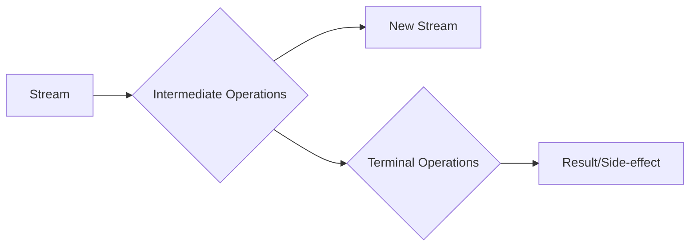

import Tabs from '@theme/Tabs';
import TabItem from '@theme/TabItem';

Here’s an intuitive explanation and examples for **Functional Interfaces**, **Lambdas**, and **Streams** in Java 17. These concepts are core to functional programming in Java.

---
<details>
    <summary>
        What is functional programming?
    </summary>

    **Functional programming** is a programming paradigm that treats computation as the evaluation of mathematical functions and avoids changing state and mutable data.
    It emphasizes the use of functions that take inputs and produce outputs without side effects.
</details>

## Functional Interfaces
A **functional interface** is an interface with exactly one abstract method. It can also have default or static methods, but only one abstract method is required. Functional interfaces are the foundation for **lambda expressions**.

<details>
    <summary>
        Example: Custom Functional Interface
    </summary>

    ```java
    @FunctionalInterface
    interface Greeting {
        void sayHello(String name);
    }

    public class FunctionalInterfaceExample {
        public static void main(String[] args) {
        // Using a lambda expression to implement the interface
        Greeting greeting = (name) -> System.out.println("Hello, " + name + "!");
        greeting.sayHello("Alice");
        }
    }
    ```

    **Output**:
    ```
    Hello, Alice!
    ```
</details>


### Built-in Functional Interfaces
Java provides several built-in functional interfaces in the `java.util.function` package, such as:
- **`Predicate<T>`**: Takes one input and returns a boolean.
- **`Function<T, R>`**: Takes one input and returns an output.
- **`Consumer<T>`**: Takes one input and performs an action (no return).
- **`Supplier<T>`**: Provides a value (no input).

---
## Lambda Expressions
A **lambda expression** is a concise way to represent a function that can be passed around. It simplifies the implementation of functional interfaces.

### Syntax
```java
(parameters) -> { body }
```

### Examples:
<details>
    <summary>
        Zero Parameters
    </summary>
    ```java
    Runnable runnable = () -> System.out.println("Running...");
    new Thread(runnable).start();
    ```
</details>

<details>
    <summary>
        Single Parameter
    </summary>

    ```java
    Consumer<String> printer = message -> System.out.println(message);
    printer.accept("Hello, Lambda!");
    ```

</details>

<details>
    <summary>
        Multiple Parameters
    </summary>

    ```java
    @FunctionalInterface
    interface MathOperation {
        int operate(int a, int b);
    }

    public class LambdaExample {
        public static void main(String[] args) {
        MathOperation addition = (a, b) -> a + b;
        MathOperation multiplication = (a, b) -> a * b;

        System.out.println(addition.operate(5, 3)); // Output: 8
        System.out.println(multiplication.operate(5, 3)); // Output: 15
        }
    }
    ```

</details>

---

## Streams

A **Stream** is a sequence of elements that supports functional-style operations like filtering, mapping, and reducing. Streams are lazy and do not store data; they process data on demand.

<details>
    <summary>
        Example: Basic Stream Operations
    </summary>
    ```java
    import java.util.Arrays;
    import java.util.List;

    public class StreamExample {
        public static void main(String[] args) {
            List<Integer> numbers = Arrays.asList(1, 2, 3, 4, 5);

            // Filter even numbers and double them
            numbers.stream()
            .filter(n -> n % 2 == 0)
            .map(n -> n * 2)
            .forEach(System.out::println); // Output: 4, 8
        }
    }
    ```
    #### Explanation:
    1. **`filter`**: Filters elements based on a condition.
    2. **`map`**: Transforms each element.
    3. **`forEach`**: Performs an action on each element.
</details>

An **intermediate operation** returns a new stream and allows chaining multiple operations. Examples include `filter`, `map`, and `sorted`.
A **terminal operation** produces a result or a side-effect and ends the stream. Examples include `forEach`, `collect`, and `reduce`.




<details>
    <summary>
        Example: Reduce Operation
    </summary>
```java
import java.util.stream.IntStream;

public class ReduceExample {
    public static void main(String[] args) {
        int sum = IntStream.range(1, 6) // Stream of numbers from 1 to 5
                           .reduce(0, Integer::sum); // Sum all elements

        System.out.println(sum); // Output: 15
    }
}
```
</details>

<details>
    <summary>
        Example: Collect Operation
    </summary>
```java
import java.util.List;
import java.util.stream.Collectors;
import java.util.stream.IntStream;

public class CollectExample {
    public static void main(String[] args) {
        List<Integer> evenNumbers = IntStream.range(1, 6)
                                             .filter(n -> n % 2 == 0)
                                             .boxed() // Convert to Integer
                                             .collect(Collectors.toList());

        System.out.println(evenNumbers); // Output: [2, 4]
    }
}
```

</details>

#### Summary Table

| Concept                  | Key Feature                                      | Example Code Snippet                                                                 |
|--------------------------|--------------------------------------------------|-------------------------------------------------------------------------------------|
| **Functional Interface** | Single abstract method                           | `@FunctionalInterface interface MyFunc { void execute(); }`                        |
| **Lambda Expression**    | Concise function representation                  | `(x) -> x * x`                                                                     |
| **Streams**              | Functional-style operations on data collections | `list.stream().filter(x -> x > 2).map(x -> x * x).forEach(System.out::println);`    |

By combining these concepts—functional interfaces for structure, lambdas for concise implementation, and streams for processing—you can write clean and powerful functional-style Java code in Java 17!

----

## Write code for below questions

<details>
<summary>
    ### Print Distinct numbers in an Array
</summary>
```java
import java.util.Arrays;
import java.util.List;
public void streamExample_Distinct() {
    List<Integer> numbers = Arrays.asList(1, 1, 2, 6, 2, 3);
    numbers.stream().distinct().forEach(System.out::print); // 1263
}
```
</details>

<details>
    <summary>
        ### Sort numbers in an Array
    </summary>
```java
import java.util.Arrays;
import java.util.List;
public void streamExample_Distinct() {
    List<Integer> numbers = Arrays.asList(1, 1, 2, 6, 2, 3);
    numbers.stream().sorted().forEach(System.out::print); // 1263
    // reverse sorting
    numbers.stream().sorted(Comparator.reverseOrder()).forEach(System.out::print); // 6321
}
```
</details>

<details>
    <summary>
        ### Print the 3rd smallest and largest number in the array
    </summary>
```java
import java.util.Arrays;
import java.util.List;
public void streamExample_Distinct() {
    List<Integer> numbers = Arrays.asList(1, 1, 2, 6, 2, 3);

    numbers.stream().sorted().distinct().skip(2).findFirst().ifPresent(System.out::println); // 2
    // reverse sorting
    numbers.stream().sorted(Comparator.reverseOrder()).distinct().skip(2).findFirst().ifPresent(System.out::println); // 2
}
```
</details>

---

<details>
    <summary>
        References
    </summary>
    - [Java 17 Documentation](https://docs.oracle.com/en/java/javase/17/docs/api/java.base/java/util/stream/package-summary.html)
    - [Java Functional Interfaces](https://docs.oracle.com/javase/8/docs/api/java/util/function/package-summary.html)
</details>

