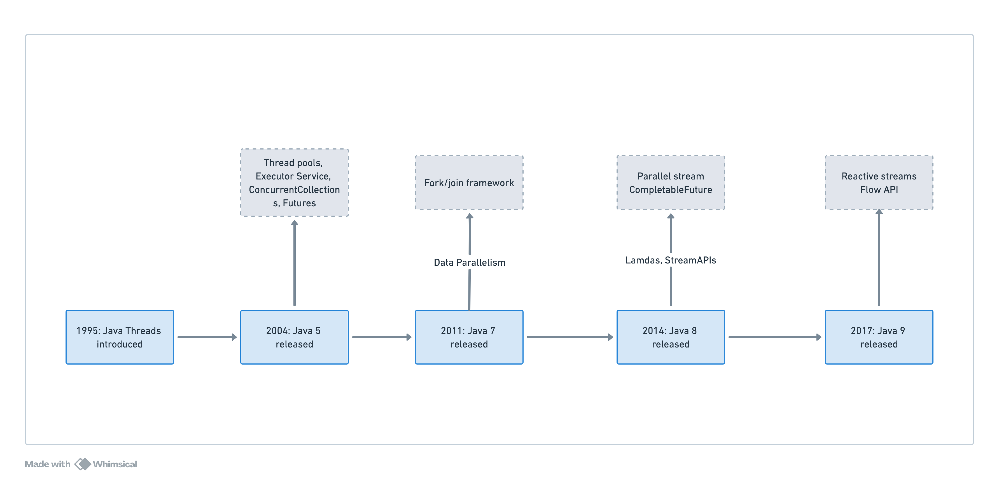

import Tabs from '@theme/Tabs';
import TabItem from '@theme/TabItem';


### What is the difference between `Concurrency` and `Parallelism`?
Concurrency is when two tasks can start, run, and complete in overlapping time periods. It doesn't necessarily mean they'll ever both be running at the same instant. For example, multitasking on a single-core machine.
Parallelism is when tasks literally run at the same time, e.g., on a multicore processor.

:::note
Concurrency is a concept which is implemented in Java using Threads
:::
<details>
    <summary>What is `Process`?</summary>
    - A process is a program in execution. It is an active entity.
</details>

<details>
    <summary>What is `Thread`?</summary>
    ```java
    public class Main {
    public static void main(String[] args) {
    System.out.println("Concurrency vs Parallelism");
    System.out.println("Concurrency: " + Runtime.getRuntime().availableProcessors());
    System.out.println("Parallelism: " + Runtime.getRuntime().availableProcessors());
}
}
    ```
    A thread is a single sequential flow of control within a program. It is a lightweight process.
</details>


### What is `Multi-tasking`?
Multi-tasking is a process of executing multiple tasks simultaneously. We use multi-tasking to utilize the CPU. Multi-tasking can be achieved by two ways:

- Process-based Multitasking (Multiprocessing)
- Thread-based Multitasking (Multithreading)
<Tabs>
    <TabItem value="Multi-threading">
        Multi-threading is a Java feature that allows concurrent execution of two or more parts of a program for maximum utilization of CPU. Each part of such program is called a thread. So, threads are light-weight processes within a process.
    </TabItem>
    <TabItem value="Multiprocessing">
        Multiprocessing is a process of executing multiple processes simultaneously. For example: typing and listening music both are going on simultaneously.
    </TabItem>
</Tabs>

