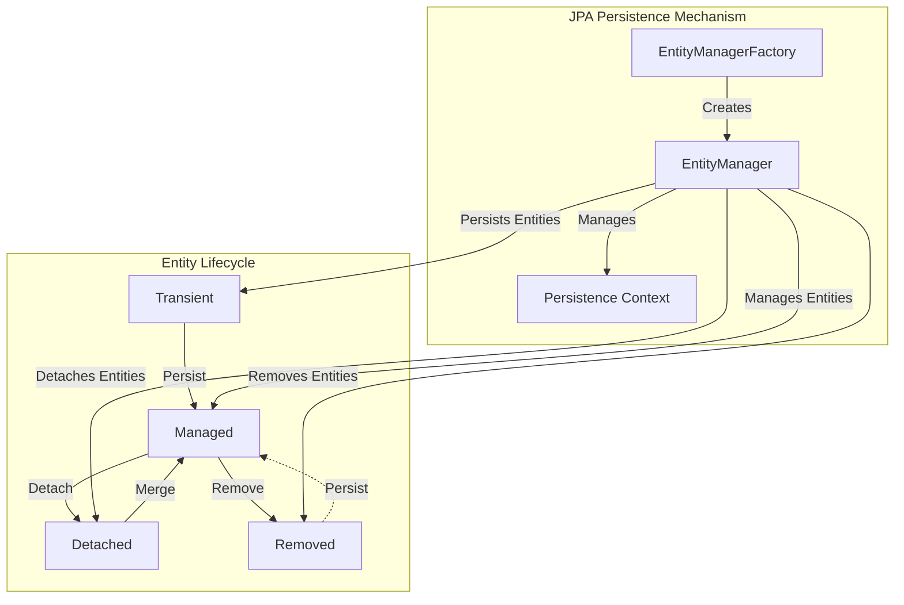
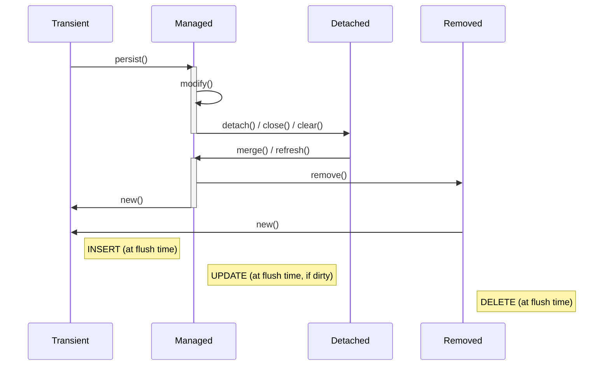

import Tabs from '@theme/Tabs';
import TabItem from '@theme/TabItem';

## Persistence Unit:
Think of it as a box holding all the necessary information to create an EntityManagerFactory instance.
In Spring Boot, you can specify these details via `application.properties`, and Spring Boot will handle the creation of the persistence unit.

- Includes details about the data source (JDBC URL, user, password, SQL dialect, etc.), the list of entities that will be managed, and other specific properties.
- Transaction type can be resource-local (single data source) or JTA (multiple data sources).
- You can have multiple persistence units in the same application, each identified by a name, allowing connections to different databases.

## EntityManagerFactory:
**A factory capable of creating on-demand EntityManager instances.**
*   You provide the necessary information via the persistence unit.
*   It exposes a method named `createEntityManager()`, which returns a new application-managed EntityManager instance at each invocation.
*   It has various attributes like `dataSource`, `packagesToScan`, `jpaVendorAdapter`, etc. which are used to configure the `EntityManager`.
*   You can open an EntityManagerFactory via injection (`@PersistenceUnit`) or via `Persistence#createEntityManagerFactory()`.
*   You can check its status via the `isOpen()` method and close it via the `close()` method. Closing it closes all its entity managers.


## **EntityManager**:
**Concerned with data extracted from the database.**
*   Fetching data from the database results in a copy of that data in memory (JDBC result set or data snapshot).
*   This zone of memory that holds the fetched data is known as the **Persistence Context** or the First Level Cache.
*   The Persistence Context acts as an entity state transitions buffer and as a transactional write-behind cache.
*   At flush time, Hibernate translates the buffered entities' state transitions into data manipulation language (DML) statements to synchronize the in-memory persistent state with the database.
*   One single active Persistence Context should be allocated to the currently active database transaction.
*   Avoid using more than one Persistence Context per database physical transaction.
*   After modifying the in-memory Persistence Context, you expect to see these modifications reflected in the database. This action is known as a **flush**.
*   Once the current transaction completes (by commit or rollback), all objects that were in the Persistence Context are detached. Detaching all entities takes place when the EntityManager is cleared via the `clear()` method or closed via the `close()` method.
*   You can open an EntityManager via injection (`@PersistenceContext`) or via `EntityManagerFactory#createEntityManager()`. You can check its status via the `isOpen()` method, clear it via the `clear()` method, and close it via the `close()` method.

## **Entity State Transitions**:
**A JPA entity can be in any of the following states:**
*   **Transient (or New)**: A new entity that is totally unknown to the database (at flush time, Hibernate will issue an INSERT statement for it).
*   **Managed (or Persistent)**: The entity has a corresponding row in the database and is currently loaded in the Persistence Context. In read-write mode, at flush time, Hibernate will run the Dirty Checking mechanism for this entity, and, if it detects modifications, it will issue the proper UPDATE statements.
*   **Detached**: The entity was in the Persistence Context, but the Persistence Context was closed, or the entity was cleared/evicted (any modifications of a detached entity are not propagated automatically to the database).
*   **Removed**: The entity was in the Persistence Context, and it was marked for deletion (at flush time, Hibernate will issue the proper DELETE statement).


## DataSource

JPA has a class `DataSource` which is used to connect to the database.
In Spring Boot, you can define multiple `DataSource` beans and use the`@Primary` annotation to specify the
primary `DataSource`.

JPA has a class `DataSourceProperties` which is used to configure the data source.
You can define multiple `DataSourceProperties` beans and use the `@Qualifier` annotation to specify the `DataSourceProperties` to use.

The `DataSource` bean will be pooled using `HikariCP` by default in Spring Boot. 
If not present in the classpath, it will fall back to `Tomcat JDBC Connection Pool`.

### DataSourceProperties

This class has a method `initializeDataSourceBuilder()` which is used to create a `DataSourceBuilder`.
It has various attributes like `url`, `username`, `password`, `driverClassName`, etc. which are used to configure the data source.
The class comes with prefix `spring.datasource`.

In order to set values for it these properties can be configured in the `application.properties` file.


<Tabs>
    <TabItem value="application.properties" label="application.properties">

```properties
spring.datasource.url=jdbc:mysql://localhost:3306/mydb
spring.datasource.username=root
spring.datasource.password=secret
spring.datasource.driver-class-name=com.mysql.cj.jdbc.Driver

spring.jpa.properties.hibernate.dialect=org.hibernate.dialect.MySQLDialect
spring.jpa.hibernate.ddl-auto=update
```

    </TabItem>
    <TabItem value="application.yml" label="application.yml">

```yaml
spring:
  datasource:
    url: jdbc:postgresql://localhost:5432/mydatabase
    username: dbuser
    password: dbpassword
    driver-class-name: org.postgresql.Driver
  jpa:
    properties:
      hibernate:
        dialect: org.hibernate.dialect.PostgreSQLDialect
    hibernate:
      ddl-auto: update

```
</TabItem>
</Tabs>

We can also configure database initilization scripts using `spring.datasource.schema` and `spring.datasource.data` properties.

<Tabs>
    <TabItem value="Single" label="Single">
    ```yaml
    spring:
      datasource:
        schema: classpath:schema.sql
        data: classpath:data.sql
    ```
    </TabItem>
    <TabItem value="Multiple" label="Multiple">
    ```yaml
    spring:
      datasource:
        schema:
          - classpath:schema1.sql
          - classpath:schema2.sql
        data:
          - classpath:data1.sql
          - classpath:data2.sql
    ```
    </TabItem>
</Tabs>

<details>
<summary>Example how to configure multiple data sources in Spring Boot</summary>

```java
@Configuration
public class DataSourceConfig {
    @Bean
    @ConfigurationProperties("app.datasource.mysql")
    public DataSourceProperties mysqlDataSourceProps() {
        return new DataSourceProperties();
    }

    @Primary
    @Bean
    public DataSource dataSource(DatabaseProperties mysqlDataSourceProps) {
        return mysqlDataSourceProps.initializeDataSourceBuilder().build();
    }

    @Bean
    @ConfigurationProperties("app.datasource.postgres")
    public DataSourceProperties pgDataSourceProps() {
        return new DataSourceProperties();
    }

    @Secondary
    @Bean
    public DataSource dataSource(DatabaseProperties pgDataSourceProps) {
        return pgDataSourceProps.initializeDataSourceBuilder().build();
    }
}
```
</details>

## Repositories

JPA has a class called `JpaRepository` which is used to provide basic CRUD operations.
You can define multiple `JpaRepository` beans and use the `@Qualifier` annotation to specify the `JpaRepository` to use.

This class has various methods like `save()`, `findById()`, `deleteById()`, etc. which are used to perform CRUD operations.

<details>
<summary>Example how to create a repository in Spring Boot</summary>

```java
@Entity
@Table(name = "users")
public class User {
    @Id
    @GeneratedValue(strategy = GenerationType.IDENTITY)
    private Long id;

    @Column(name = "name")
    private String name;

    @Column(name = "email")
    private String email;

    // standard getters and setters
}

@Repository
public interface UserRepository extends JpaRepository<User, Long> {
    List<User> findByName(String name);
}
```
</details>

<Tabs>
    <TabItem value="JPA Repository" label="JPA Repository">
        `JpaRepository` is used to provide basic CRUD operations. 


        ```java
        @Repository
        public interface UserRepository extends JpaRepository<User, Long> {
            List<User> findByName(String name);
        }
        ```
    </TabItem>
    <TabItem value="CRUD Repository" label="CRUD Repository">
        `CrudRepository` is used to provide basic CRUD operations.

        In case you want to use `CrudRepository` instead of `JpaRepository`, you can use below code.

        ```java
        @Repository
        public interface UserRepository extends CrudRepository<User, Long> {
            List<User> findByName(String name);
        }
        ```
    </TabItem>
</Tabs>

## EntityManager 

JPA has a class called `EntityManager` which is used to interact with the database.
You can define multiple `EntityManager` beans and use the `@Qualifier` annotation to specify the `EntityManager` to use.

This class has a method `createEntityManagerFactory()` which is used to create an `EntityManagerFactory`.
It has various attributes like `dataSource`, `packagesToScan`, `jpaVendorAdapter`, etc. which are used to configure the `EntityManager`.
The class comes with prefix `spring.jpa`.

To override default `LocalEntityManagerFactoryBean`, you can use `LocalContainerEntityManagerFactoryBean` class and configure below.

- Either name your `LocalContainerEntityManagerFactoryBean` bean as `entityManagerFactory`

- Or you can give name to your bean using `@Bean(name="")` annotation.

- Or you can use @EnableJpaRepositories annotation to specify the entityManagerFactoryRef and transactionManagerRef.

    <details>
    <summary>Example</summary>
        ```java
        @Configuration
        @EnableJpaRepositories(
            basePackages = "com.example.repositories.mysql",
            entityManagerFactoryRef = "mysqlEntityManagerFactory",
            transactionManagerRef = "mysqlTransactionManager"
        )
        @EnableTransactionManagement
        public class EntityManagerConfig {
            @Primary
            @Bean
            public LocalContainerEntityManagerFactoryBean mysqlEntityManagerFactory(
                EntityManagerFactoryBuilder builder,
                    @Qualifier("mysqlDataSource") DataSource dataSource) {
                return builder
                    .dataSource(dataSource)
                    .packages("com.example.entities.mysql")
                    .persistenceUnit("mysql")
                    .build();
            }

            @Bean
            public PlatformTransactionManager mysqlTransactionManager( @Qualifier("mysqlEntityManagerFactory") EntityManagerFactory entityManagerFactory) {
                return new JpaTransactionManager(entityManagerFactory);
            }
        }
        ```
    </details>


## TransactionManager

JPA has a class called `PlatformTransactionManager` which is used to manage transactions.
You can define multiple `PlatformTransactionManager` beans and use the `@Qualifier` annotation to specify the `PlatformTransactionManager` to use.

This class has a method `createTransactionManager()` which is used to create a `TransactionManager`.
It has various attributes like `entityManagerFactory`, `dataSource`, etc. which are used to configure the `TransactionManager`.
The class comes with prefix `spring.jpa`.
