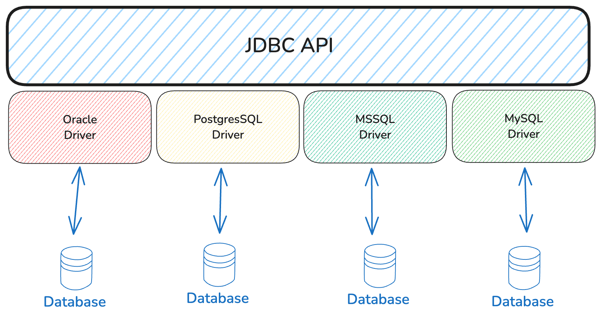

:::note
Asynchronous replication can provide better throughput, at the price of having to resolve update conflicts. The asynchronous Multi-Master replication
requires a conflict detection and an automatic conflict resolution algorithm. When a conflict is
detected, the automatic resolution tries to merge the two conflicting branches, and, in case it fails,
manual intervention is required.
:::

    <summarry>JDBC API</summarry>

    **The JDBC (Java Database Connectivity) API** provides a common interface for communicating to a database server.
        All the networking logic and the database specific communication protocol are hidden away behind 
        the vendor-independent JDBC API. 

