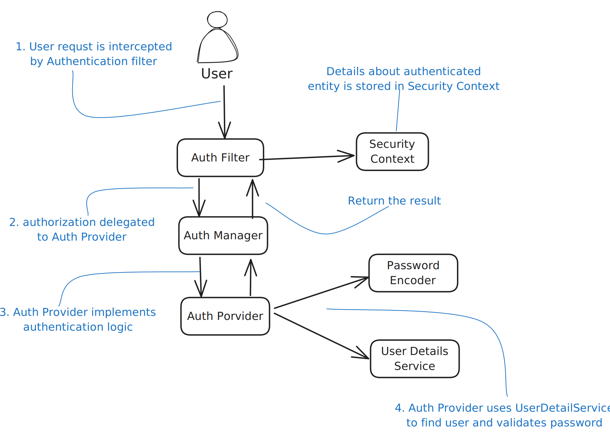
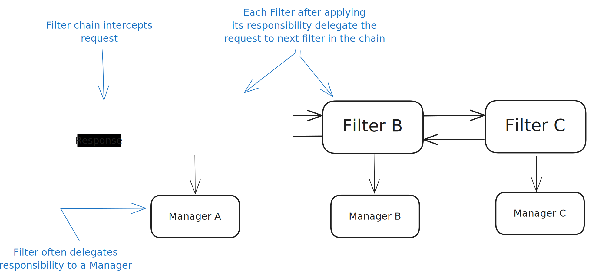
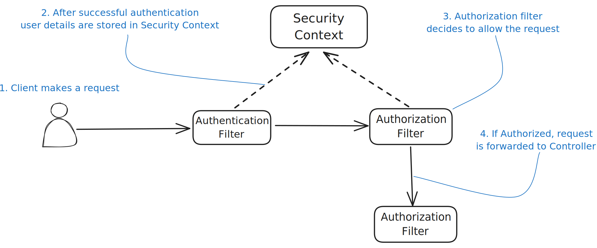
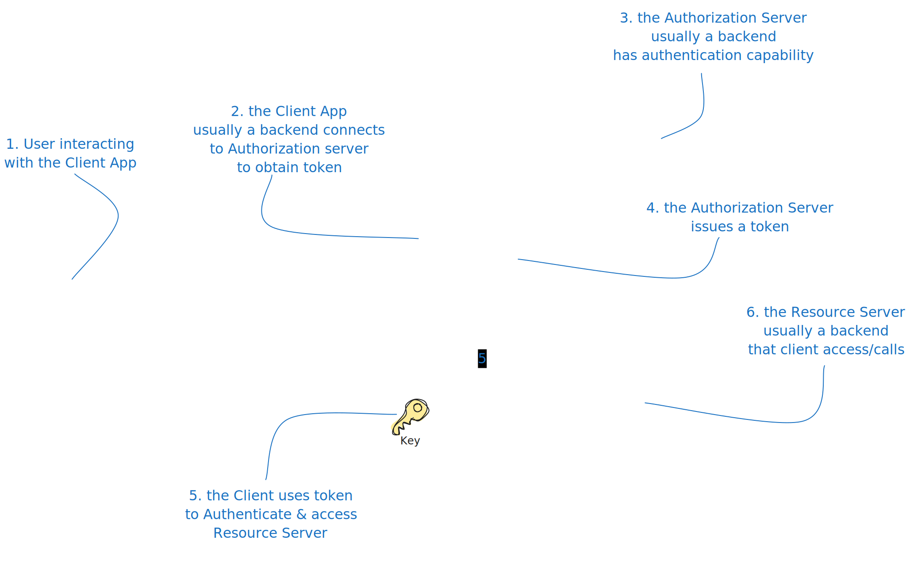

import Tabs from '@theme/Tabs';
import TabItem from '@theme/TabItem';

# Spring Security

- `Encoding` refers to any transformation of a given input. For example, if we have a function
`x` that reverses a string, function `x` -> `y` applied to ABCD produces DCBA
- `Hashing` is a particular type of encoding, except the function is only one way.
That is, from an output `y` of the hashing function, you cannot get back the input `x`.
- `Encryption` is a particular type of encoding in which, to obtain the output, we provide both
the input value and a key. The key makes it possible to choose afterward who should be
able to reverse the function (obtain the input from the output).
### What is Spring Security?
It is a powerful and highly customizable authentication and access-control framework.
It is the de-facto standard for securing Spring-based applications.

#### Authentication flow



### Difference between Authentication and Authorization
Authentication is the process of verifying the identity of a user, whereas authorization is the process of verifying
that the authenticated user has access to the requested resource.
To customize authentication and authorization, we’ll need to define a bean of type SecurityFilterChain.
```java
@Configuration
public class ProjectConfig {
    @Bean
    SecurityFilterChain configure(HttpSecurity http) throws Exception {
        http.httpBasic(Customizer.withDefaults()); // Authentication approach
        http.authorizeHttpRequests(
            c -> c.anyRequest().authenticated()
        ); // Authorization approach, customizing the authorization at specific endpoints
        return http.build();
    }

    @Bean
    PasswordEncoder passwordEncoder() {
        return NoOpPasswordEncoder.getInstance();
    }
}
```

:::tip
The HTTP 401 Unauthorized status code is a bit ambiguous. Usually, it’s
used to represent a failed authentication rather than authorization.

For a failed authorization, we’d probably use the 403 Forbidden status.
Generally, an HTTP 403 means that the server identified the caller of
the request, but they don’t have the needed privileges for the call that they are
trying to make.
:::

:::warning
a PasswordEncoder
exists together with the default UserDetailsService. When we replace the
default implementation of the UserDetailsService, we must also specify a
PasswordEncoder
:::


----

### UserDetailsService and PasswordEncoder
You can define users with the `User` class. A user should at least have a username, a password, and an authority.
Authorities are actions that you allow a user to do in the context of the application.
- **Principal** → The user requesting the access to the application.
- **UserDetails** → Describes user for Spring, must have at least on Authority.
- **GrantedAuthority** → Describes the actions assigned to a user, authority of a user, actions he/she can perform.
- **PasswordEncoder** → It is a contract to tell spring how to encode and verify the password.
    - It has two methods named `encode()` and `matches()`.
    - `NoOpPasswordEncoder.getInstance()` is used to store passwords in plain text.

<details>
    <summary>UserDetailsService</summary>

    - It is used to retrieve user-related data.
    - It has one method named `loadUserByUsername()` which returns a UserDetails object.
    - A simple implementation of a UserDetailsService that Spring Security
    provides is `InMemoryUserDetailsManager`
    - The JdbcUserDetailsManager implementation expects three columns in the users table: a username,
  a password, and enabled, which you can use to deactivate the user.
</details>
<details>
    <summary>UserDetailsManager</summary>

    - It is used to manage user-related data.
    - It has methods like `createUser()`, `updateUser()`, and `deleteUser()`.
</details>
<details>
    <summary>AuthenticationProvider</summary>

    - It is used to authenticate a user by delegating to `UserDetailsService` and `PasswordEncoder`.
    - It's responsibility is strongly coupled with the `Authentication` contract.
  It has one method named `authenticate()` which receives `Authentication` object as parameter and returns
  an Authentication object.
    - If method receives an `Authentication` object which is not supported then it must return null.

  :::note
  `AuthenticationProvider` is where you find conditions to decide whether to authenticate a user or not.
  The component that delegate this responsibility to the AuthenticationProvide is  `AuthenticationManager` which
  received request from the HTTP filter layers.
  :::
</details>

---


:::note
```bash Base64-encoded string
echo -n user:93a01cf0-794b-4b98-86ef-54860f36f7f3 | base64
```

HTTP Basic authentication doesn’t offer confidentiality of the credentials.
Base64 is only an encoding method for the convenience of the transfer; it’s
not an encryption or hashing method. While in transit, if intercepted, anyone
can see the credentials. Generally, we don’t use HTTP Basic authentication
without at least HTTPS for confidentiality.
:::

:::tip
Sometimes the class design allows the app to store
sensitive data like credentials or private keys for a long time. In such cases,
someone who has the privilege to make a heap dump could find these details
and then use them maliciously
:::

### Filters
In Spring Security, HTTP filters delegate the different responsibilities that apply to an HTTP request.
In Spring Security, in general, HTTP filters manage each responsibility that must be applied to the request.
The filters form a chain of responsibilities. A filter receives a request, executes its logic,
and eventually delegates the request to the next filter in the chain (figure below).



Knowing how to customize the HTTP filter chain of responsibilities is a valuable skill.
You can add or remove filters, change the order of filters, or even replace a filter with a custom one.

Spring Security offers a few abstract classes that implement the Filter interface and for which you can extend your
filter definitions.
These classes also add functionality your implementations could benefit from when you extend them.
`OncePerRequestFilter`, as the name suggests, implements logic to make sure that the filter’s `doFilter()` method
is executed only one time per request.


In the below example we have a `ValidateRequestFilter` which will be applied before authentication filter.
We only only check if request has a header value `X-Request-Id` and if it is not present we will throw an exception.

<details>
  <summary>Example code</summary>
```java
public class ValidateRequestFilter extends OncePerRequestFilter {
    @Override
    protected void doFilterInternal(HttpServletRequest request, HttpServletResponse response, FilterChain filterChain) throws ServletException, IOException {
        String requestId = request.getHeader("X-Request-Id");
        if (requestId == null) {
            response.setResponse(HttpStatus.BAD_REQUEST);
            throw new RuntimeException("No X-Request-Id header present");
        }
        filterChain.doFilter(request, response);
    }
}
```

```java
@Configuration
public class ProjectConfig {
    @Bean
    SecurityFilterChain configure(HttpSecurity http) throws Exception {
        http.addFilterBefore(new ValidateRequestFilter(), UsernamePasswordAuthenticationFilter.class);
        http.httpBasic(Customizer.withDefaults());
        http.authorizeHttpRequests(
            c -> c.anyRequest().authenticated()
        );
        return http.build();
    }

    @Bean
    PasswordEncoder passwordEncoder() {
        return NoOpPasswordEncoder.getInstance();
    }
}
```
</details>

:::tip
When adding a filter at a specific position, Spring Security does not assume it is the only one at that position.
You might add more filters at the same location in the chain.
In this case, Spring Security doesn’t guarantee in which order these will act.

Some developers think that when you apply a filter at a position of a known one, it will be replaced.
This is not the case! We must make sure not to add filters that we don’t need to the chain

**Adding multiple filters in the same position in the chain can lead to unexpected behavior,
it makes sense to define order in the chain.**
:::


### Authentication Provider
Authentication Provider's responsibility is strongly coupled with the `Authentication` contract.
The user requesting the access to the application is called the `principal`.

In Java Security, an interface named Principal represents the same concept.
The Authentication interface of Spring Security extends this contract

**How to implement `authenticate()` method**
  - The method should throw `AuthenticationException` if the authentication fails.
  - If method receives an `Authentication` object which is not supported then it must return null.

**How to implement `supports()` method**
  - You can implement the method to return true if the `Authentication` object is supported by the provider.
  - Even if this method returns true, the `authenticate()` method can still return null if the
    provider cannot authenticate the user.

---


### Security Context

On Successful authentication, the `SecurityContext` is populated with the `Authentication` object.
The SecurityContext is a thread-local object
that holds details of the principal currently interacting with the application.
It is used to store the details of the currently authenticated user, also known as the principal.
The SecurityContextHolder is a helper class that provides access to the SecurityContext.
It is used to store the SecurityContext and retrieve it when needed.

```java
public interface SecurityContext extends Serializable{
    Authentication getAuthentication();
    void setAuthentication(Authentication authentication);
}
```

3 Strategies to store the SecurityContext:
<details>
  <summary>MODE_THREADLOCAL</summary>

  Default implementation, Offers the ability to isolate `SecurityContext` for each Thread, `SecurityContext` is stored in a ThreadLocal.
</details>
<details>
  <summary>MODE_INHERITABLETHREADLOCAL</summary>

  SecurityContext is stored in an InheritableThreadLocal.

  When your code creates a thread it does not have SecurityContext stored in the ThreadLocal
  as framework is not aware about. The `Autherization` object is null and can get a `NullPointerException`
  while accessing the SecurityContext in the new thread.

  `DelegatingSecurityContextCallable` and `DelegatingSecurityContextExecutorService` is used to propagate
  the SecurityContext to the new thread.

</details>
<details>
  <summary>MODE_GLOBAL</summary>

  SecurityContext is stored in a static field. This is not recommended for multi-threaded applications.
</details>

:::tip
If you want to perform action based on failed authentication such as adding a header to the response, you can use
`AuthenticationFailureHandler` interface.
You can implement the `onAuthenticationFailure()` method to perform the action and register them in `SecurityFilterChain`.
:::

----
<details>
  <summary>**Configuration Examples** : </summary>

  We have an endpoint accepts item code as a path variable,
  ```java
  @RestController
  public class ItemController {
    @GetMapping("/item/{code}")
      public String productCode(@PathVariable String code) {
      return code;
    }
  }
  ```

  Configure authorization so that only digits are permitted for path, while all other calls are denied.


  ```java
  @Configuraion
  public class ProjectConfig {
      @Bean
      SecurityFilterChain configure(HttpSecurity http) throws Exception {
          http.addFilterBefore(new ValidateRequestFilter(), UsernamePasswordAuthenticationFilter.class);
          http.httpBasic(Customizer.withDefaults());
          http.authorizeHttpRequests(
              c -> c.requestMatchers("/item/{code:^[0-9]+$}").permitAll()
                    .anyRequest().denyAll()
          );
          return http.build();
      }

      @Bean
      PasswordEncoder passwordEncoder() {
          return NoOpPasswordEncoder.getInstance();
      }
  }
```
  :::note
  When using parameter expressions with a regex, make sure to not have a space between the name of the parameter,
  the colon (:), and the regex, as displayed in the above code.
  :::
  ---

  Configure authorization so that only email ending with `.com` are permitted for path, while all other calls are denied.
  ```java
  @Configuraion
  public class ProjectConfig {
    @Bean
      SecurityFilterChain configure(HttpSecurity http) throws Exception {
      http.addFilterBefore(new ValidateRequestFilter(), UsernamePasswordAuthenticationFilter.class);
      http.httpBasic(Customizer.withDefaults());
      http.authorizeHttpRequests(
        c -> c.requestMatchers("/email/{code:*(?:.+@.+\\.com)$}").permitAll()
            .anyRequest().denyAll()
      );
      return http.build();
    }
  }
  ```

  ---
  when you need to write a more complex rule, eventually referring to more path patterns and multiple path variable
  values, it’s easier to write a regex matcher.

  Configure authorization so that only paths from `/ca/fr`, `/uk/fr`,`/us/fr` or `/uk|us|ca/en` are permitted,
  while all other calls are denied.
  ```java
  @Configuraion
  public class ProjectConfig {
    @Bean
      SecurityFilterChain configure(HttpSecurity http) throws Exception {
      http.addFilterBefore(new ValidateRequestFilter(), UsernamePasswordAuthenticationFilter.class);
      http.httpBasic(Customizer.withDefaults());
      http.authorizeHttpRequests(
      c -> c.regexMatchers(".*/(us|uk|ca)+/(fr|en).*")
              .authenticated()
            .anyRequest().denyAll()
      );
      return http.build();
    }
  }
  ```
</details>

### OAuth 2.0
`OAuth 2` is a specification that tells one how to separate the authentication responsibilities in a system.
This way, multiple apps can use one other app that implements the authentication,
helping the users to authenticate faster, keeping their details more secure,
and minimizing the costs of implementation in the apps.



:::note
In the first version of OAuth, the auth server directly returned the access token to the client.
This was a problem because the client could see the access token, and if the client was compromised, or redirect is
intercepted by a malicious actor, the access token could be stolen.

By returning authorization code instead of access token, the auth server forces to resend a request where they
authenticate again.
This way getting authorization code alone is not enough to get access to the resource.
:::

`Tokens` are like access keys for an app, `Tokens` are an essential part of the
OAuth 2 authentication and authorization process because they’re the ones used to
prove the authenticity of a client and user authentication, but they are also the way a
backend gets more details about the client and the user.

- **Opaque—Tokens** which don’t store data. To implement the authorization, the resource server usually needs to call
  the authorization server, provide the opaque token, and get the user & client details to whom token was issued.
  This call is known as the introspection call, can be compared to signed documents.
- **Non-opaque—Tokens** that store data, making it immediately possible for the backend to implement the authorization.
  The JSON Web Token (JWT) is the most used non-opaque token implementation.

`JWT` is composed of three parts: the header, the payload, and the signature.
The data in the header and body is JSON formatted, then encoded as Base64 to make it smaller and easier to transfer.

:::tip Session vs Token
<Tabs>
    <TabItem value="Session">
        - **Session** is a server-side storage of the user’s state. Often stored in a database and then linked to the user’s browser with a cookie.
        - **Session** requires server-side storage. This makes it **stateful** and harder to scale.
        - **Session** is more secure because the user’s state is stored on the server and can be revoked.
    </TabItem>
    <TabItem value="Token">
        - **Token** is a client-side storage of the user’s state. Often stored in the browser’s local storage or in a cookie.
        - **Token** does not require server-side storage, making it **stateless** and scaling easier.
        - **Token** is less secure because the user’s state is stored on the client and can be stolen.
    </TabItem>
</Tabs>
:::

##### When to use Opaque Tokens
Non-opaque tokens are the most frequently used today because they don’t require introspection to validate them.
However, non-opaque tokens contain data, and the client sends this data over the wire to its backend,
anyone getting the token can also see the data the token carries. In the majority of cases, this is not a problem.

**But what should you do if you have a larger amount of data or data that is unsafe to send over the wire carried within a token?**
In such case Opaque tokens are the best choice.


:::note Token Revocation
Token revocation is a process where the authorization server invalidates a token before it expires.
Normally, an access token lifespan is short, so stealing a token still makes it difficult for one to use it.
But sometimes you want to be extra cautious.
:::


## Questions

### How to implement a custom login page in Spring Boot?
```java
@Configuration
public class SecurityConfig extends WebSecurityConfigurerAdapter {
    @Override
    protected void configure(HttpSecurity http) throws Exception {
        http
            .authorizeRequests()
                .antMatchers("/login").permitAll()
                .anyRequest().authenticated()
                .and()
            .formLogin()
                .loginPage("/login")
                .permitAll()
                .and()
            .logout()
                .permitAll();
    }
}
```

### How to implement a custom filter in Spring Boot?
```java
@Component
public class CustomFilter implements Filter {
    @Override
    public void doFilter(ServletRequest request, ServletResponse response, FilterChain chain) throws IOException, ServletException {
        // Custom logic
        chain.doFilter(request, response);
    }
}
```

### How to implement a custom interceptor in Spring Boot?
```java
@Component
public class CustomInterceptor implements HandlerInterceptor {
    @Override
    public boolean preHandle(HttpServletRequest request, HttpServletResponse response, Object handler) throws Exception {
        // Custom logic
        return true;
    }
}
```
