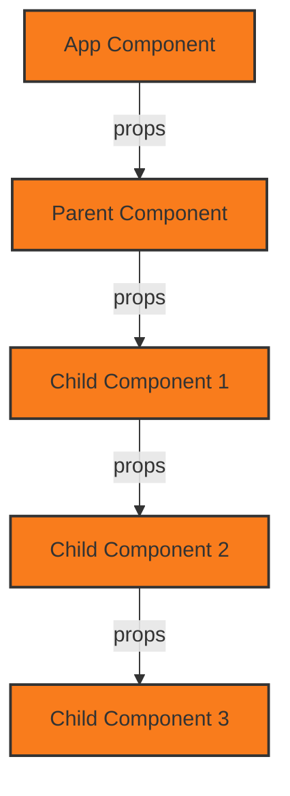

import Tabs from "@theme/Tabs";
import TabItem from "@theme/TabItem";


<Tabs>
    <TabItem value="Basics" label="React">
### What is React? What are the features of React?
React is a JavaScript library for building user interfaces. It is maintained by Facebook and a community of individual developers and companies.
- It uses the virtual DOM instead of the real DOM.
- It uses server-side rendering.
- It follows unidirectional data flow or data binding.

### What is JSX?
JSX is a syntax extension for JavaScript. It was written to be used with React. JSX code looks a lot like HTML. JSX is a preprocessor step that adds XML syntax to JavaScript.

### What is the difference between Real DOM and Virtual DOM?
Real DOM | Virtual DOM
--- | ---
It updates slow | It updates faster
Can directly update HTML | Can't directly update HTML
Creates a new DOM if element updates | Updates the JSX if element updates
Too much of memory wastage | No memory wastage

### What are Synthetic events?
The `SyntheticEvent` is a cross-browser wrapper around the browser’s native event. It is a wrapper around the browser’s native event. It is used to ensure that the events have consistent properties across different browsers.

### What is the use of keys in React?
Keys are used to identify unique Virtual DOM Elements with their corresponding data driving the UI. It is used to identify which items have changed, are added, or are removed.

### What is the use of Fragment in React?
The `Fragment` component is used to group multiple children without adding extra nodes to the DOM. It is used to group multiple children without adding extra nodes to the DOM.
```jsx
import React from 'react';

const MyComponent = () => {
    return (
        <React.Fragment>
            <h1>Heading 1</h1>
            <h2>Heading 2</h2>
        </React.Fragment>
    );
};
```

### What are the difference between Package.json and Package.lock.json ?
The package.json and package-lock.json files are essential components of Node.js projects, each serving distinct but complementary purposes in dependency management.
`package.json` | `package-lock.json`
--- | ---
This file contains metadata about the project, including its dependencies, scripts, and configuration settings. It specifies which packages are required and their version ranges, allowing developers to define the necessary libraries for their application | This is an automatically generated file that locks the exact versions of all installed packages and their dependencies. It ensures that every installation results in the same dependency tree, providing consistency across different environments
Typically created manually by developers using commands like npm init, or edited directly to add dependencies or scripts | Automatically generated by npm during installation or when modifying dependencies (e.g., running npm install). It should not be manually edited 

while package.json outlines the project’s dependencies and configurations, package-lock.json ensures that these dependencies are installed consistently across various environments by locking their exact versions. Together, they form a robust system for managing project dependencies effectively.

### What is the use of ReactDOM in React?
ReactDOM is a package that provides DOM specific methods that can be used at the top level of your app. Most of the components are not required to use this module. It provides the method `render()` that is used to render the components.

### What is the use of render() in React?
The `render()` method is the only required method in a class component. It is called by React to render the component. It returns a React element which is a lightweight description of what to render.

### What are Props and State in React? and What is the difference between state and props in React?
Props is a special keyword in React, which stands for properties and is being used for passing data from one component to another. But the important part is that data with props are being passed in a uni-directional flow. (one way from parent to child)

State is a built-in React object that contains data that influences the output of render. The state is mutable, i.e., it can be changed. The state must be kept in the parent component. It is used to store the data that the component may need to change over time. The `setState()` method is used to update the state of a component. It is used to update the state of the component. It will trigger the render method and the updated component will be displayed on the screen.


State | Props
--- | ---
State is mutable | Props are immutable
State is an object | Props are an argument
State changes inside the component | Props are passed to the component
State is local or owned by the component | Props are owned by the parent component

### What is props drilling ? 
The process of passing props from one component to another component to another component and so on is called props drilling. It is a process of passing props from one component to another component to another component and so on.


### What is the use of context in React?
Context provides a way to pass data through the component tree without having to pass props down manually at every level. It is designed to share data that can be considered “global” for a tree of React components.

```jsx
import React, { useContext } from 'react';

const MyComponent = () => {
    const value = useContext(MyContext);

    return <div>{value}</div>;
};
```

### What are the various ways to pass data from child component to parent component?
There are several ways to pass data from a child component to a parent component in React.

<details>
    <summary>Using Callbacks</summary>

    ```jsx
    // ParentComponent.js
    import React, { useState } from 'react';
    import ChildComponent from './ChildComponent';

    function ParentComponent() {
        const [message, setMessage] = useState('');

        const handleChildClick = (newMessage) => {
            setMessage(newMessage);
        };

        return (
            <div>
                <h1>{message}</h1>
                <ChildComponent onChildClick={handleChildClick} />
            </div>
        );
    }

    // ChildComponent.js
    import React from 'react';

    function ChildComponent({ onChildClick }) {
        const handleClick = () => {
            onChildClick('Hello from Child!');
        };

        return <button onClick={handleClick}>Click Me</button>;
    }
    ````
</details>

<details>
    <summary>Using Context API</summary>

    ```jsx
    // ParentComponent.js
    import React, { createContext, useState } from 'react';
    export const MessageContext = createContext();

    function ParentComponent() {
        const [message, setMessage] = useState('');

        return (
            <MessageContext.Provider value={{ message, setMessage }}>
                <div>
                    <h1>{message}</h1>
                    <ChildComponent />
                </div>
            </MessageContext.Provider>
        );
    }

    // ChildComponent.js
    import React, { useContext } from 'react';
    import { MessageContext } from './ParentComponent';

    function ChildComponent() {
        const { setMessage } = useContext(MessageContext);

        const handleClick = () => {
            setMessage('Hello from Child!');
        };

        return <button onClick={handleClick}>Click Me</button>;
    }
    ```
</details>

<details>
    <summary>Using Refs</summary>
    ```jsx

    // ParentComponent.js
    import React, { useRef } from 'react';

    function ParentComponent() {
        const messageRef = useRef('');

        const handleChildClick = () => {
            console.log('Received data:', messageRef.current);
        };

        return (
            <div>
                <h1 ref={messageRef}></h1>
                <ChildComponent messageRef={messageRef} onChildClick={handleChildClick} />
            </div>
        );
    }

    // ChildComponent.js
    import React from 'react';

    function ChildComponent({ messageRef, onChildClick }) {
        const handleClick = () => {
            messageRef.current = 'Hello from Child!';
            onChildClick();
        };

        return <button onClick={handleClick}>Click Me</button>;
    }
    ```
</details>

<details>
    <summary>Using Custom Events</summary>
    ```jsx
    // ParentComponent.js
    import React, { useEffect } from 'react';
    import { EventEmitter } from 'events';
    import ChildComponent from './ChildComponent';

    const eventEmitter = new EventEmitter();

    function ParentComponent() {
        useEffect(() => {
            const handleEvent = (data) => {
                console.log('Received data:', data);
            };
            
            eventEmitter.on('childData', handleEvent);
            
            return () => {
                eventEmitter.off('childData', handleEvent);
            };
        }, []);

        return <ChildComponent />;
    }

    // ChildComponent.js
    import React from 'react';
    import { eventEmitter } from './ParentComponent';

    function ChildComponent() {
        const sendDataToParent = () => {
            eventEmitter.emit('childData', 'Data from Child');
        };

        return <button onClick={sendDataToParent}>Send Data</button>;
    }

    ```
</details>

<details>
    <summary>Using Refs</summary>
    ```jsx
    // ParentComponent.js

    import React, { useRef } from 'react';

    function ParentComponent() {
        const messageRef = useRef('');

        const handleChildClick = () => {
            console.log('Received data:', messageRef.current);
        };

        return (
            <div>
                <h1 ref={messageRef}></h1>
                <ChildComponent messageRef={messageRef} onChildClick={handleChildClick} />
            </div>
        );
    }

    // ChildComponent.js

    import React from 'react';

    function ChildComponent({ messageRef, onChildClick }) {
        const handleClick = () => {
            messageRef.current = 'Hello from Child!';
            onChildClick();
        };

        return <button onClick={handleClick}>Click Me</button>;
    }
    ```
</details>

<details>
    <summary>Using State Management Libraries</summary>

    ```jsx
    // ParentComponent.js
    import React from 'react';
    import { useStore } from './store';

    function ParentComponent() {
        const { state, dispatch } = useStore();

        const handleClick = () => {
            dispatch({ type: 'UPDATE_MESSAGE', payload: 'Hello from Child!' });
        };

        return (
            <div>
                <h1>{state.message}</h1>
                <button onClick={handleClick}>Click Me</button>
            </div>
        );

    ```
</details>
    </TabItem>
    <TabItem value="Hooks" label="Hooks">
### What is the use of React Hooks?
Hooks are a new addition in React 16.8. They let you use state and other React features without writing a class. Hooks are functions that let you “hook into” React state and lifecycle features from function components.

### What are the rules for Hooks?
- Only call Hooks at the top level.
- Only call Hooks from React functions.
- Don’t call Hooks from regular JavaScript functions.
- Only call Hooks from React functional components.

### What are the advantages of using React Hooks?
- It allows you to use state and other React features without writing a class.
- It allows you to reuse stateful logic without changing your component hierarchy.
- It allows you to use more of React’s features without classes.

### What are the limitations of using React Hooks?
- It is hard to reuse stateful logic between components.
- It is hard to understand the complex components.
- It is hard to test the components.

### What is the use of useEffect in React?
The `useEffect` hook is used to perform side effects in functional components. It is a close replacement for `componentDidMount`, `componentDidUpdate`, and `componentWillUnmount` lifecycle methods in class components.
```jsx
import React, { useEffect } from 'react';

const MyComponent = () => {
    useEffect(() => {
        // Custom logic
    });

    return <div>My Component</div>;
};
```

### What is the use of useReducer in React?
The `useReducer` hook is used to manage complex state logic in React. It is an alternative to `useState`. It is mostly used to manage state objects that contain multiple sub-values.
```jsx
```

### What is the use of useMemo in React?
The `useMemo` hook is used to optimize the performance of the functional components. It is used to memorize the output of a function and return the cached result when the input is the same.
```jsx
```

### What is the use of useCallback in React?
The `useCallback` hook is used to optimize the performance of the functional components. It is used to memorize the callback functions and return the cached result when the input is the same.

```jsx
import React, { useState, useCallback } from 'react';

const MyComponent = () => {
    const [count, setCount] = useState(0);

    const handleClick = useCallback(() => {
        setCount(count + 1);
    }, [count]);

    return (
        <button onClick={handleClick}>Click Me</button>
    );
};

```

#### What is the purpose of callback function as an argument of setState()?
Callback function as an argument of `setState()` is used to ensure that the state is updated before the callback function is executed.
It is used to ensure that the state is updated before the callback function is executed.

### What is the use of useContext in React?
The `useContext` hook is used to consume the context in a functional component.
It is used to access the context value and re-renders the component when the context value changes.

```jsx
import React, { useContext } from 'react';

const MyComponent = () => {
    const value = useContext(MyContext);

    return <div>{value}</div>;
};
```

### What is the use of refs in React?
Refs are used to get reference to a DOM (Document Object Model) node or an instance of a component in React. It is used to access the DOM nodes directly within React.

```jsx
import React, { useRef } from 'react';

const MyComponent = () => {
    const inputRef = useRef();

    const handleClick = () => {
        inputRef.current.focus();
    };

    return (
        <div>
            <input type="text" ref={inputRef} />
            <button onClick={handleClick}>Focus</button>
        </div>
    );
};

```

### What is the use of forwardRef in React?
The `forwardRef` function is used to forward the ref from the parent component to the child component.
```jsx
import React, { forwardRef } from 'react';

const MyComponent = forwardRef((props, ref) => {
    return <input type="text" ref={ref} />;
});

```

### What is the use of createRef in React?
The `createRef` function is used to create a reference to the DOM nodes or React elements. It is used to access the DOM nodes directly within React.
```jsx
import React, { createRef } from 'react';

const MyComponent = () => {
    const inputRef = createRef();

    const handleClick = () => {
        inputRef.current.focus();
    };

    return (
        <div>
            <input type="text" ref={inputRef} />
            <button onClick={handleClick}>Focus</button>
        </div>
    );
};

```


### What is the use of useImperativeHandle in React?
The `useImperativeHandle` hook is used to customize the instance value that is exposed to the parent components when using `ref`.
It is used to hide some of the properties of the instance value.

```jsx

import React, { forwardRef, useImperativeHandle } from 'react';

const MyComponent = forwardRef((props, ref) => {
    useImperativeHandle(ref, () => ({
        focus: () => {
            // Custom focus logic
        }
    }));

    return <input type="text" />;
});

```

### What is the use of useLayoutEffect in React?
The `useLayoutEffect` hook is used to perform the side effects in a functional component.
It is similar to `useEffect` but it runs synchronously after all DOM mutations.

```jsx
import React, { useLayoutEffect } from 'react';

const MyComponent = () => {
    useLayoutEffect(() => {
        // Custom logic
    });

    return <div>My Component</div>;
};

```

### What is the use of useDebugValue in React?
The `useDebugValue` hook is used to display a label for custom hooks in React DevTools.
It is used to display the label for custom hooks in the React DevTools.

```jsx
import { useDebugValue } from 'react';

const useCustomHook = () => {
    useDebugValue('Custom Hook');
};
```
### create a custom hook for increment/decrement counter ?
```jsx

import React, { useState } from 'react';

const useCounter = (initialValue) => {
    const [count, setCount] = useState(initialValue);

    const increment = () => {
        setCount(count + 1);
    };

    const decrement = () => {
        setCount(count - 1);
    };

    return { count, increment, decrement };
};

const MyComponent = () => {
    const { count, increment, decrement } = useCounter(0);

    return (
        <div>
            <button onClick={increment}>Increment</button>
            <span>{count}</span>
            <button onClick={decrement}>Decrement</button>
        </div>
    );
    
};
```

    </TabItem>
    <TabItem value="Components" label="Components">
### What is Strict mode in react ?
StrictMode is a tool for highlighting potential problems in an application. Like Fragment, StrictMode does not render any visible UI.
It activates additional checks and warnings for its descendants.

```jsx
import React from 'react';

const MyComponent = () => {
    return (
        <React.StrictMode>
            <div>My Component</div>
        </React.StrictMode>
    );
};

```

### What are Pure Components in React?
Pure components are the components that do not re-renders when the value of state and props has been updated with the same values. It is used to prevent unnecessary re-renders of the functional components.

For functional components, React provides a built-in memoization feature called `React.memo`. It is used to prevent unnecessary re-renders of the functional components.
```jsx
import React from 'react';

const MyFunctionalComponent = React.memo(({ text }) => {
    return <div>{text}</div>;
});
```
:::tip
Utilizing pure components in React can lead to significant performance improvements by preventing unnecessary renders. By understanding their characteristics and implementation methods, developers can create more efficient and maintainable applications.
:::

### What are Higher Order Components in React?
Higher-order components (HOCs) are a design pattern in React that allows developers to reuse component logic. They are a pattern that emerges from React’s compositional nature.

```jsx
import React from 'react';

const MyComponent = ({ text }) => {
    return <div>{text}</div>;
};

const withUpperCase = (Component) => {
    return (props) => {
        return <Component {...props} text={props.text.toUpperCase()} />;
    };
};

const MyEnhancedComponent = withUpperCase(MyComponent);
```

### What are Controlled Components in React?
Controlled components are components that render form elements and control them by keeping the form data in the component's state. It is used to control the form elements by keeping the form data in the component's state.

```jsx
import React, { useState } from 'react';

const MyComponent = () => {
    const [value, setValue] = useState('');

    const handleChange = (event) => {
        setValue(event.target.value);
    };

    return (
        <input type="text" value={value} onChange={handleChange} />
    );
};
```

### What are Uncontrolled Components in React?
Uncontrolled components are components that render form elements and control them by letting the DOM handle the form data. It is used to let the DOM handle the form data.

```jsx

import React from 'react';

const MyComponent = () => {
    return <input type="text" />;
};

```

### What are the differences between client side and server side rendering ?
Client Side Rendering | Server Side Rendering
--- | ---
The initial HTML is generated by the server and sent to the client. The client-side JavaScript then takes over and renders the rest of the page. | The server generates the initial HTML and sends it to the client. The client-side JavaScript is used to enhance the page and make it interactive.
The initial page load is faster, but the page may take longer to become interactive. | The initial page load may be slower, but the page becomes interactive more quickly.
The server sends the HTML and the client-side JavaScript separately. | The server sends the HTML and the client-side JavaScript together.


### What is the use of Profiler in React?
The `Profiler` component is used to measure the cost of rendering a part of the application. It is used to measure the cost of rendering a part of the application.

### What is the use of lazy and Suspense in React?
`lazy` and `Suspense` are used to load the components lazily. It is used to load the components only when they are needed.

The `Suspense` component is used to show a loading indicator while the child components are being loaded. It is used to show a loading indicator while the child components are being loaded.

```jsx
import React, { Suspense } from 'react';

const MyComponent = React.lazy(() => import('./MyComponent'));

const App = () => {
    return (
        <Suspense fallback={<div>Loading...</div>}>
            <MyComponent />
        </Suspense>
    );
};

```

### What is the use of Error Boundary in React?
Error boundaries are React components that catch JavaScript errors anywhere in their child component tree, log those errors, and display a fallback UI instead of the component tree that crashed.

### What is the use of Portals in React?
Portals provide a first-class way to render children into a DOM node that exists outside the DOM hierarchy of the parent component.

### What is the use of Higher-Order Components in React?
A higher-order component (HOC) is an advanced technique in React for reusing component logic. HOCs are not part of the React API, per se. They are a pattern that emerges from React’s compositional nature.

### What is the use of Render Props in React?
A render prop is a function prop that a component uses to know what to render. This technique makes it easy to share code between components using a prop whose value is a function.
### What is the use of PureComponent in React?
`PureComponent` is exactly the same as `Component` except that it handles the `shouldComponentUpdate` method for you. When props or state changes, `PureComponent` will do a shallow comparison on both props and state.
    </TabItem>
</Tabs>

