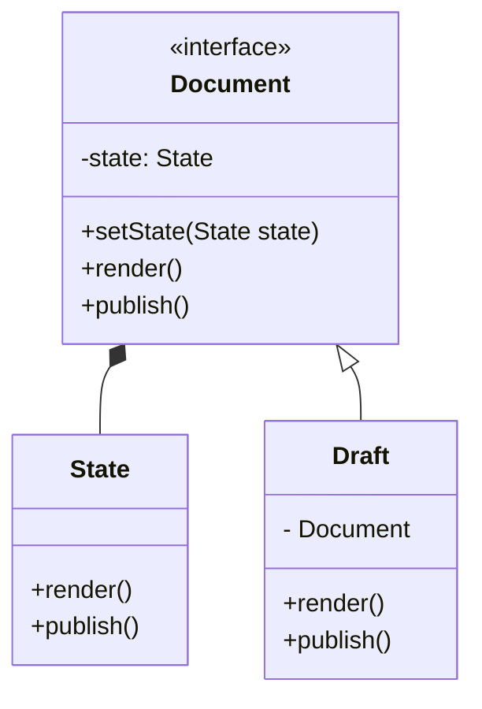
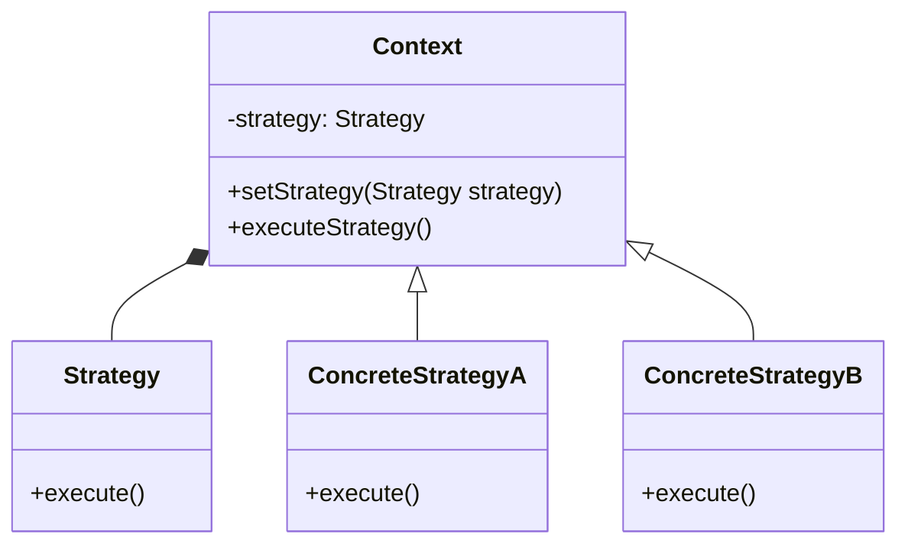
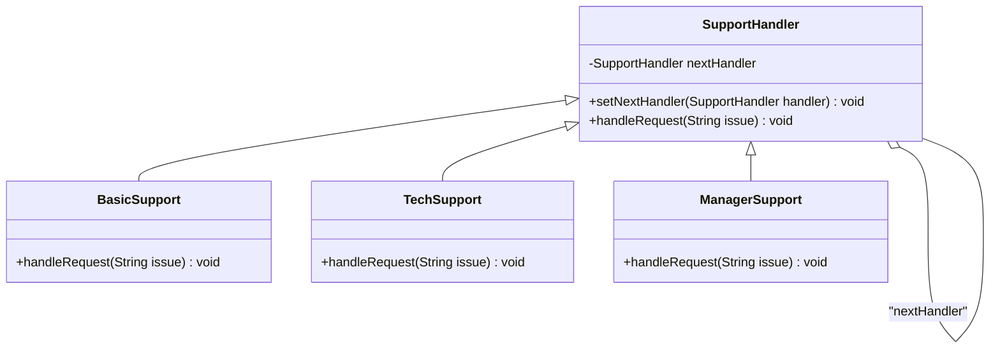
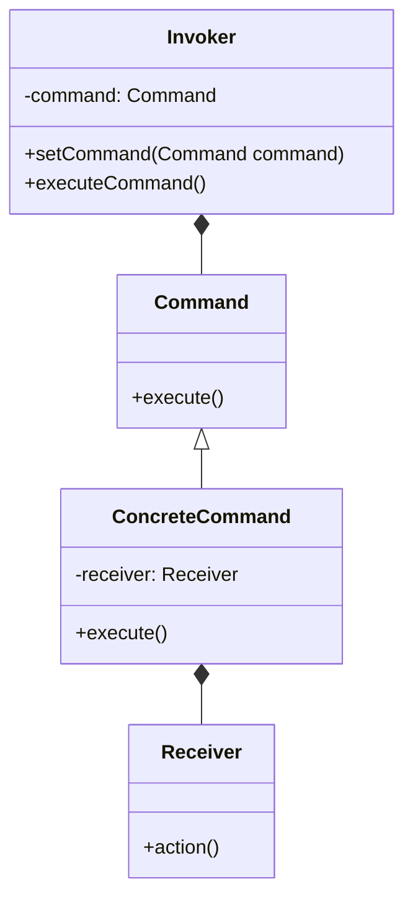
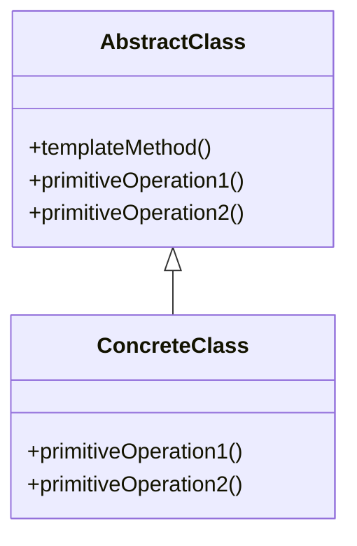
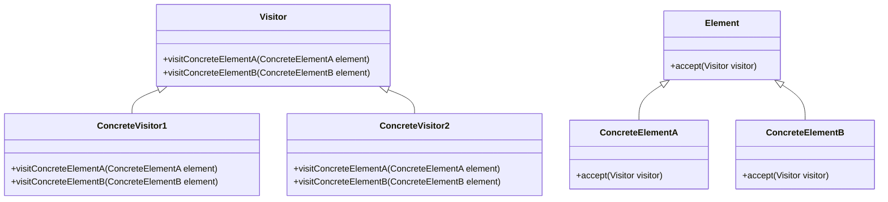
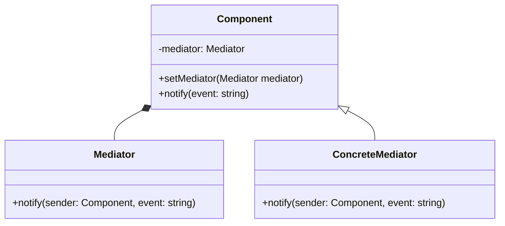
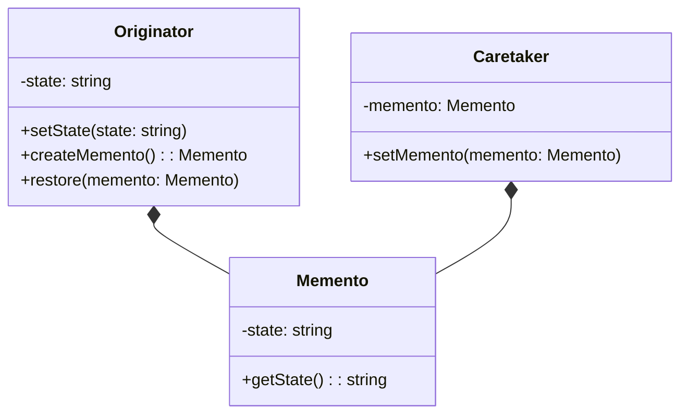
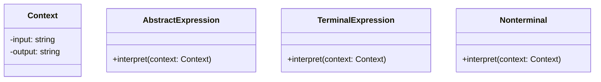

import Tabs from '@theme/Tabs';
import TabItem from '@theme/TabItem';

## Observer Pattern
- The observer pattern is a software design pattern in which an object, called the subject, maintains a list of its dependents, called observers, and notifies them of any state changes, usually by calling one of their methods.
- It is mainly used to implement distributed event handling systems, in "event driven" software.

**When to use the Observer Pattern?**
- When a change to one object requires changing others, and you don't know how many objects need to be changed.
- When an object should be able to notify other objects without making assumptions about who these objects are.

**Advantages of Observer Pattern**
- It supports the principle of loose coupling between objects that interact with each other.
- It allows sending data to other objects effectively without any change in the Subject or Observer classes.


In the below example, we have a Subject class and a list of Observer objects. Whenever the state of the Subject changes, it notifies the observers.
<Tabs>
    <TabItem value="Subject">
        ```java
        import java.util.ArrayList;
        import java.util.List;

        public class Subject {
           private List<Observer> observers = new ArrayList<Observer>();
           private int state;

           public int getState() {
              return state;
           }

           public void setState(int state) {
              this.state = state;
              notifyAllObservers();
           }

           public void attach(Observer observer){
              observers.add(observer);
           }

           public void notifyAllObservers(){
              for (Observer observer : observers) {
                 observer.update();
              }
           }
        }
        ```
    </TabItem>
    <TabItem value="Observer">
        ```java
        public abstract class Observer {
           protected Subject subject;
           public abstract void update();
        }
        ```
        ```java
        public class BinaryObserver extends Observer{

           public BinaryObserver(Subject subject){
              this.subject = subject;
              this.subject.attach(this);
           }

           @Override
           public void update() {
              System.out.println( "Binary String: " + Integer.toBinaryString( subject.getState() ) );
           }
        }
        ```
        ```java
        public class OctalObserver extends Observer{

           public OctalObserver(Subject subject){
              this.subject = subject;
              this.subject.attach(this);
           }

           @Override
           public void update() {
              System.out.println( "Octal String: " + Integer.toOctalString( subject.getState() ) );
           }
        }
        ```
        ```java
        public class HexaObserver extends Observer{

           public HexaObserver(Subject subject){
              this.subject = subject;
              this.subject.attach(this);
           }

           @Override
           public void update() {
              System.out.println( "Hex String: " + Integer.toHexString( subject.getState() ).toUpperCase() );
           }
        }
        ```
    </TabItem>
    <TabItem value="Demo">
        ```java
        public class ObserverPatternDemo {
           public static void main(String[] args) {
              Subject subject = new Subject();

              new HexaObserver(subject);
              new OctalObserver(subject);
              new BinaryObserver(subject);

              System.out.println("First state change: 15");
              subject.setState(15);
              System.out.println("Second state change: 10");
              subject.setstate(10);
           }
        }
        ```
    </TabItem>
</Tabs>

---

## State
State is a behavioral design pattern that lets an object alter its behavior when its internal state changes.
 It appears as if the object changed its class.

The State pattern is closely related to the concept of a FiniteState Machine.
For e.g. `State` interface is being implemented by `Document` class and `State` interface has methods like `render` and `publish`.
`Draft` is a concrete class that implements the `State` interface.



## Strategy
Strategy is a behavioral design pattern that lets you define a family of algorithms, put each of them into a separate class, and make their objects interchangeable.

The Strategy pattern suggests that you take a class that does something specific in a lot of different ways and extract all of these algorithms into separate classes called strategies.



## Chain of Responsibility
Chain of Responsibility is a behavioral design pattern that lets you pass requests along a chain of handlers.
Upon receiving a request, each handler decides either to process the request or to pass it along the chain.

#### Example Scenario
Let’s create an example where we handle different levels of support tickets—basic support,
 technical support, and managerial support.
 Each type of support will handle certain issues, passing on those they cannot address to the next level.




<Tabs>
    <TabItem value="SupportHandler">
        ```java
        // Handler
        abstract class SupportHandler {
            protected SupportHandler nextHandler;

            public void setNextHandler(SupportHandler handler) {
                this.nextHandler = handler;
            }

            public abstract void handleRequest(String issue);
        }
        ```
    </TabItem>
    <TabItem value="Implementors">
        ```java
        // Concrete Handler for Basic Support
        class BasicSupport extends SupportHandler {
            @Override
            public void handleRequest(String issue) {
                if (issue.equalsIgnoreCase("basic")) {
                    System.out.println("Basic Support: Handling basic issue.");
                } else if (nextHandler != null) {
                    nextHandler.handleRequest(issue);
                } else {
                    System.out.println("Basic Support: Unable to handle the issue.");
                }
            }
        }

        // Concrete Handler for Technical Support
        class TechSupport extends SupportHandler {
            @Override
            public void handleRequest(String issue) {
                if (issue.equalsIgnoreCase("technical")) {
                    System.out.println("Tech Support: Handling technical issue.");
                } else if (nextHandler != null) {
                    nextHandler.handleRequest(issue);
                } else {
                    System.out.println("Tech Support: Unable to handle the issue.");
                }
            }
        }

        // Concrete Handler for Managerial Support
        class ManagerSupport extends SupportHandler {
            @Override
            public void handleRequest(String issue) {
                if (issue.equalsIgnoreCase("managerial")) {
                    System.out.println("Manager Support: Handling managerial issue.");
                } else {
                    System.out.println("Manager Support: Issue could not be handled.");
                }
            }
        }
        ```
    </TabItem>
    <TabItem value="Demo">

        - Basic Support handles only basic issues, Tech Support handles technical issues, and Manager Support handles managerial issues.
        - If an issue cannot be handled, the request moves to the next handler in the chain.
        - If no handler can process the issue, a message is displayed stating the issue couldn’t be handled.
        ```java
        public class ChainOfResponsibilityDemo {
            public static void main(String[] args) {
                // Create handlers
                SupportHandler basicSupport = new BasicSupport();
                SupportHandler techSupport = new TechSupport();
                SupportHandler managerSupport = new ManagerSupport();

                // Set up the chain
                basicSupport.setNextHandler(techSupport);
                techSupport.setNextHandler(managerSupport);

                // Test the chain with different issues
                System.out.println("Testing basic issue:");
                basicSupport.handleRequest("basic");

                System.out.println("\nTesting technical issue:");
                basicSupport.handleRequest("technical");

                System.out.println("\nTesting managerial issue:");
                basicSupport.handleRequest("managerial");

                System.out.println("\nTesting unknown issue:");
                basicSupport.handleRequest("unknown");
            }
        }
        ```
    </TabItem>
</Tabs>


## Command
Command is a behavioral design pattern that turns a request into a stand-alone object that contains all information about the request.
This transformation lets you parameterize methods with different requests, delay or queue a request’s execution, and support undoable operations.



## Template Method
Template Method is a behavioral design pattern that defines the skeleton of an algorithm in the superclass but lets subclasses override specific steps of the algorithm without changing its structure.



:::tip
Use the Chain of Responsibility pattern when your program
is expected to process different kinds of requests in various
ways, but the exact types of requests and their sequences are
unknown beforehand.
:::

## Visitor
Visitor is a behavioral design pattern that lets you separate algorithms from the objects on which they operate.



## Mediator
Mediator is a behavioral design pattern that lets you reduce chaotic dependencies between objects.
The pattern restricts direct communications between the objects and forces them to collaborate only via a mediator object.



## Memento
Memento is a behavioral design pattern that lets you save and restore the previous state of an object without revealing the details of its implementation.



## Interpreter
Interpreter is a behavioral design pattern that specifies how to evaluate sentences in a language.
The basic idea is to have a class for each symbol (terminal or nonterminal) in a specialized computer language.


