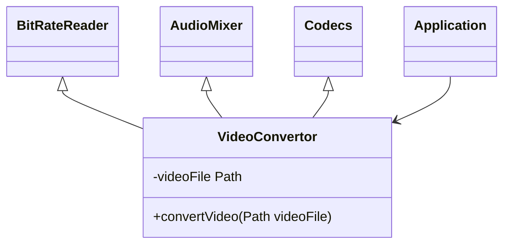
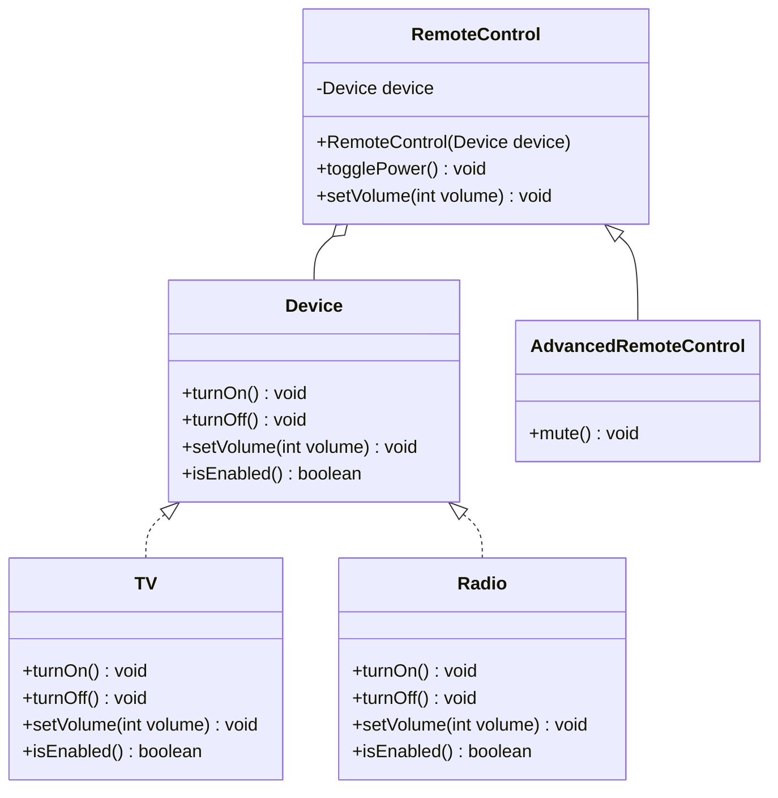
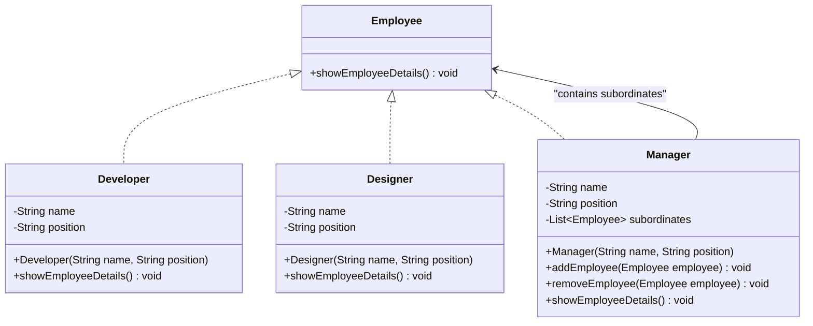
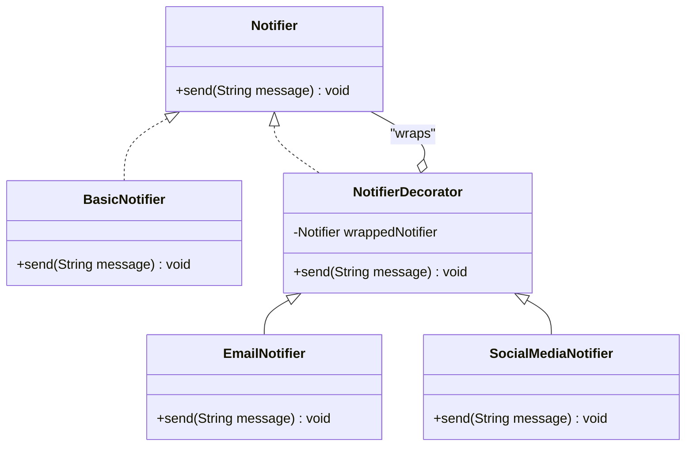
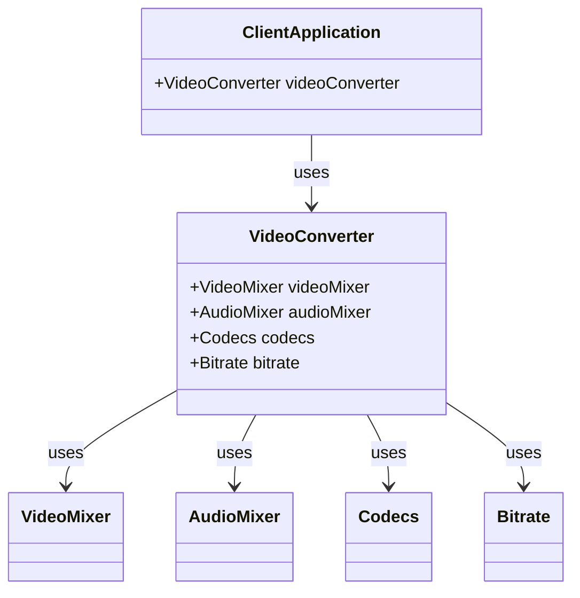
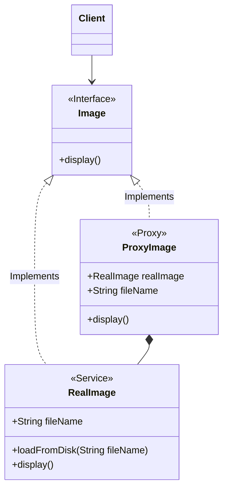

import Tabs from '@theme/Tabs';
import TabItem from '@theme/TabItem';

Structural Design Patterns are concerned with how classes and objects can be composed, to form larger structures. The structural design patterns simplify the structure by identifying the relationships.


### Adapter Pattern
The Adapter pattern is used to allow two incompatible interfaces to work together. This is the real world definition for an adapter.

An adapter allows a system to use classes of another system that is incompatible with it.

`MediaPlayer` class is the interface that we want to use in our application. `VlcPlayer` and `Mp4Player` are the classes that we want to use in our application, but their interfaces are not compatible with our `MediaPlayer` interface. So, we create an `MediaAdapter` class that implements the `MediaPlayer` interface and uses `VlcPlayer` and `Mp4Player` classes to play the required audio format.



<Tabs>
    <TabItem value="MediaPlayer">
```java
public interface MediaPlayer {
   public void play(String audioType, String fileName);
}
```
```java
public interface AdvancedMediaPlayer {
   public void playVlc(String fileName);
   public void playMp4(String fileName);
}
```
    </TabItem>
    <TabItem value="VlcPlayer">
```java
public class VlcPlayer implements AdvancedMediaPlayer{
   @Override
   public void playVlc(String fileName) {
      System.out.println("Playing vlc file. Name: "+ fileName);
   }
   @Override
   public void playMp4(String fileName) {
      //do nothing
   }
}
```
```java
public class Mp4Player implements AdvancedMediaPlayer{

   @Override
   public void playVlc(String fileName) {
      //do nothing
   }

   @Override
   public void playMp4(String fileName) {
      System.out.println("Playing mp4 file. Name: "+ fileName);
   }
}
```
    </TabItem>
    <TabItem value="MediaAdapter">
    ```java
    public class MediaAdapter implements MediaPlayer {

       AdvancedMediaPlayer advancedMusicPlayer;

       public MediaAdapter(String audioType){
          if(audioType.equalsIgnoreCase("vlc") ){
             advancedMusicPlayer = new VlcPlayer();
          } else if (audioType.equalsIgnoreCase("mp4")){
             advancedMusicPlayer = new Mp4Player();
          }
       }

       @Override
       public void play(String audioType, String fileName) {
          if(audioType.equalsIgnoreCase("vlc")){
             advancedMusicPlayer.playVlc(fileName);
          }else if(audioType.equalsIgnoreCase("mp4")){
             advancedMusicPlayer.playMp4(fileName);
          }
       }
    }
    ```
    </TabItem>
    <TabItem value="AudioPlayer">
    ```java
    public class AudioPlayer implements MediaPlayer {
       MediaAdapter mediaAdapter;
       @Override
       public void play(String audioType, String fileName) {
          if(audioType.equalsIgnoreCase("mp3")){
             System.out.println("Playing mp3 file. Name: "+ fileName);
          } else if(audioType.equalsIgnoreCase("vlc") || audioType.equalsIgnoreCase("mp4")){
             mediaAdapter = new MediaAdapter(audioType);
             mediaAdapter.play(audioType, fileName);
          } else{
             System.out.println("Invalid media. "+ audioType + " format not supported");
          }
       }
    }
    ```
    </TabItem>
</Tabs>

**Demo Code**
```java
public class AdapterPatternDemo {
   public static void main(String[] args) {
      AudioPlayer audioPlayer = new AudioPlayer();
      audioPlayer.play("mp3", "beyond the horizon.mp3");
      audioPlayer.play("mp4", "alone.mp4");
      audioPlayer.play("vlc", "far far away.vlc");
      audioPlayer.play("avi", "mind me.avi");
   }
}
```

:::tip
Use the Adapter pattern when you want to use some existing class, but its interface isn't compatible with the rest of your code.
:::

---

### Bridge Pattern
The Bridge pattern is used to separate the abstract elements of a class from the implementation details, providing the means to replace the implementation details without modifying the abstraction. The Bridge pattern is used to separate the abstract elements of a class from the implementation details, providing the means to replace the implementation details without modifying the abstraction.

**Example Scenario**

Imagine we want to control different types of devices (e.g., a TV and a Radio) with a remote control.
 The remote control has different controls like power, volume, and channel, but the way each device handles these
  commands may vary.
  Using the Bridge Pattern, we can decouple the remote control (abstraction) from the devices (implementation).

<Tabs>
    <TabItem value="Device">
        ```java
        // Implementor
        interface Device {
            void turnOn();
            void turnOff();
            void setVolume(int volume);
            boolean isEnabled();
        }
        ```
    </TabItem>
    <TabItem value="Implementor">
        You can develop the remote control classes independently
        from the device classes. All that’s needed is to create a new
        remote subclass. For example, a basic remote control might
        only have two buttons, but you could extend it with additional
        features, such as an extra battery or a touchscreen.
        ```java
            // Concrete Implementor
            class TV implements Device {
                private boolean on = false;
                private int volume = 30;

                @Override
                public void turnOn() {
                    on = true;
                    System.out.println("TV is turned on.");
                }

                @Override
                public void turnOff() {
                    on = false;
                    System.out.println("TV is turned off.");
                }

                @Override
                public void setVolume(int volume) {
                    this.volume = volume;
                    System.out.println("TV volume set to " + volume);
                }

                @Override
                public boolean isEnabled() {
                    return on;
                }
            }

            // Concrete Implementor
            class Radio implements Device {
                private boolean on = false;
                private int volume = 50;

                @Override
                public void turnOn() {
                    on = true;
                    System.out.println("Radio is turned on.");
                }

                @Override
                public void turnOff() {
                    on = false;
                    System.out.println("Radio is turned off.");
                }

                @Override
                public void setVolume(int volume) {
                    this.volume = volume;
                    System.out.println("Radio volume set to " + volume);
                }

                @Override
                public boolean isEnabled() {
                    return on;
                }
            }
        ```
    </TabItem>
    <TabItem value="Abstraction">
        ```java
            // Abstraction
            class RemoteControl {
                protected Device device;

                public RemoteControl(Device device) {
                    this.device = device;
                }

                public void togglePower() {
                    if (device.isEnabled()) {
                        device.turnOff();
                    } else {
                        device.turnOn();
                    }
                }

                public void setVolume(int volume) {
                    device.setVolume(volume);
                }
            }
        ```
    </TabItem>
    <TabItem value="Refined Abstraction">
        ```java
            // Refined Abstraction
            class AdvancedRemoteControl extends RemoteControl {

                public AdvancedRemoteControl(Device device) {
                    super(device);
                }

                public void mute() {
                    device.setVolume(0);
                    System.out.println("Device is muted.");
                }
            }
        ```
    </TabItem>
    <TabItem value="Demo">
            ```java
                public class BridgePatternDemo {
                public static void main(String[] args) {
                    Device tv = new TV();
                    Device radio = new Radio();

                    RemoteControl remoteControl = new RemoteControl(tv);
                    AdvancedRemoteControl advancedRemoteControl = new AdvancedRemoteControl(radio);

                    System.out.println("Using Remote Control with TV:");
                    remoteControl.togglePower();
                    remoteControl.setVolume(20);

                    System.out.println("\nUsing Advanced Remote Control with Radio:");
                    advancedRemoteControl.togglePower();
                    advancedRemoteControl.mute();
                }
            }
        ```
    </TabItem>
</Tabs>

:::tip

Bridge is usually designed up-front, letting you develop parts
of an application independently of each other. On the other
hand, Adapter is commonly used with an existing app to make
some otherwise-incompatible classes work together nicely.
:::

---

## Composite Pattern
The Composite Pattern is a structural design pattern that allows you to compose objects into tree-like structures to
 represent part-whole hierarchies.
This pattern lets clients treat individual objects and compositions of objects uniformly,
making it ideal for scenarios where you want to treat both a single object and a group of objects in the same way.


<Tabs>
    <TabItem value="Interface">
        Create `Employee` interface which act as Component and defines behaviour.
        ```java
        // Component
        interface Employee {
            void showEmployeeDetails();
        }
        ```
    </TabItem>
    <TabItem value="Implementors">
        ```java
        // Leaf
        class Developer implements Employee {
            private String name;
            private String position;

            public Developer(String name, String position) {
                this.name = name;
                this.position = position;
            }

            @Override
            public void showEmployeeDetails() {
                System.out.println(name + " works as a " + position);
            }
        }

        // Leaf
        class Designer implements Employee {
            private String name;
            private String position;

            public Designer(String name, String position) {
                this.name = name;
                this.position = position;
            }

            @Override
            public void showEmployeeDetails() {
                System.out.println(name + " works as a " + position);
            }
        }

        ```
    </TabItem>
    <TabItem value="Manager">
    ```java
        // Composite
        import java.util.ArrayList;
        import java.util.List;

        class Manager implements Employee {
            private String name;
            private String position;
            private List<Employee> subordinates;

            public Manager(String name, String position) {
                this.name = name;
                this.position = position;
                this.subordinates = new ArrayList<>();
            }

            public void addEmployee(Employee employee) {
                subordinates.add(employee);
            }

            public void removeEmployee(Employee employee) {
                subordinates.remove(employee);
            }

            @Override
            public void showEmployeeDetails() {
                System.out.println(name + " works as a " + position);
                for (Employee employee : subordinates) {
                    employee.showEmployeeDetails();
                }
            }
        }
    ```
    </TabItem>
    <TabItem value="Usage/Demo">
    ```java
           public class CompositePatternDemo {
               public static void main(String[] args) {
                   Employee dev1 = new Developer("John Doe", "Backend Developer");
                   Employee dev2 = new Developer("Jane Smith", "Frontend Developer");
                   Employee designer = new Designer("Alice Brown", "UI Designer");

                   Manager techLead = new Manager("Mike Johnson", "Tech Lead");
                   techLead.addEmployee(dev1);
                   techLead.addEmployee(dev2);

                   Manager manager = new Manager("Sarah Connor", "Project Manager");
                   manager.addEmployee(techLead);
                   manager.addEmployee(designer);

                   System.out.println("Organization Structure:");
                   manager.showEmployeeDetails();
               }
           }
    ```
    </TabItem>
</Tabs>
:::tip
Use Composition over Inheritance when you want to represent part-whole hierarchies.
:::

---

## Decorator Pattern
The Decorator Pattern is a structural design pattern that allows you to dynamically add behavior to an object without
altering its structure.
 It’s useful when you want to extend functionality in a flexible and reusable way, as opposed to using inheritance.

<Tabs>
    <TabItem value="Notifier Interface">
                This interface defines a send method that all types of notifiers will implement.
        ```java
        // Component
        interface Notifier {
            void send(String message);
        }
        ```
    </TabItem>
    <TabItem value="BasicNotifier">
        ```java
        // Concrete Component
        class BasicNotifier implements Notifier {
            @Override
            public void send(String message) {
                System.out.println("Sending basic notification: " + message);
            }
        }
        ```
    </TabItem>
    <TabItem value="Decorators">
        This class represents the core notifier, which could be the default notification method, such as a basic SMS notification.
    ```java
        // Concrete Decorator for Email
        class EmailNotifier extends NotifierDecorator {
            public EmailNotifier(Notifier notifier) {
                super(notifier);
            }

            @Override
            public void send(String message) {
                super.send(message);
                System.out.println("Sending email notification: " + message);
            }
        }

        // Concrete Decorator for Social Media
        class SocialMediaNotifier extends NotifierDecorator {
            public SocialMediaNotifier(Notifier notifier) {
                super(notifier);
            }

            @Override
            public void send(String message) {
                super.send(message);
                System.out.println("Posting on social media: " + message);
            }
        }
    ```
    </TabItem>
    <TabItem value="Usage/Demo">
    ```java
        public class DecoratorPatternDemo {
            public static void main(String[] args) {
                Notifier notifier = new BasicNotifier();

                // Wrap notifier with Email and SocialMedia decorators
                Notifier emailNotifier = new EmailNotifier(notifier);
                Notifier socialMediaNotifier = new SocialMediaNotifier(emailNotifier);

                System.out.println("Sending combined notification:");
                socialMediaNotifier.send("Hello, this is a decorated notification!");
            }
        }
    ```
    </TabItem>
</Tabs>

:::tip
Use the Adapter pattern when you want to use some existing class, but its interface isn't compatible with the rest of your code.
:::

---

## Facade Pattern
- The Client uses the Facade to access the subsystem. The Facade pattern is used to provide a simple interface to a complex subsystem, library, a framework.
- Having a Facade is handy when you want to integrate your app with a sophisticated library that has dozens of features, but you just need a tiny bit of its functionality.
:::tip
- Use the Facade pattern when you want to provide a simple interface to a complex subsystem.
- A Facade class can often be a Singleton since the same facade can be used by many clients.
- Unlike Facade pattern, Proxy has similar interface, but Proxy does not add any new functionality, it just controls access to the object while Facade provides a simplified interface.
:::



<details>
<summary>ShapeMaker Example</summary>
- In this example, we have a `ShapeMaker` class that provides a simple interface to the complex subsystem of classes that draw different shapes. The `ShapeMaker` class hides the complexity of the subsystem from the client.

```java
public class ShapeMaker {
   private Shape circle;
   private Shape rectangle;
   private Shape square;
   public ShapeMaker() {
      circle = new Circle();
      rectangle = new Rectangle();
      square = new Square();
   }
   public void drawCircle(){
      circle.draw();
   }
   public void drawRectangle(){
      rectangle.draw();
   }
   public void drawSquare(){
      square.draw();
   }
}
```
```java
public class FacadePatternDemo {
   public static void main(String[] args) {
      ShapeMaker shapeMaker = new ShapeMaker();
      shapeMaker.drawCircle();
      shapeMaker.drawRectangle();
      shapeMaker.drawSquare();
   }
}
```

</details>

---

## Flyweight Pattern
- The Flyweight pattern is used to reduce the memory footprint of objects.
- It's let you fit more objects into the available amount of RAM by sharing common parts of state between multiple objects, instead of keeping all of the data in each object.
- Divide the object's state into intrinsic (invariant) and extrinsic (context-dependent) state. The intrinsic state is stored in the Flyweight object and is invariant (i.e., it doesn't change). The extrinsic state is computed or supplied by client code and is stored externally.
:::warning
Use the Flyweight pattern only when your program must support a huge number of objects which barely fit into available RAM.
:::

In the below example we have a `Circle` class that has intrinsic state (color) and extrinsic state (x, y, and radius). We have a `ShapeFactory` class that returns a `Circle` object by looking up the color in a `HashMap`. The `FlyweightPatternDemo` class uses the `ShapeFactory` to get a `Circle` object and sets the extrinsic state.
<Tabs>
    <TabItem value="Interface">
        ```java
        public interface Shape {
           void draw();
        }
        ```
    </TabItem>
    <TabItem value="Implementor">
        ```java
        public class Circle implements Shape {
           private String color;
           private int x;
           private int y;
           private int radius;
           public Circle(String color){
              this.color = color;
           }
           public void setX(int x) {
              this.x = x;
           }
           public void setY(int y) {
              this.y = y;
           }
           public void setRadius(int radius) {
              this.radius = radius;
           }
           @Override
           public void draw() {
              System.out.println("Circle: Draw() [Color : " + color + ", x : " + x + ", y :" + y + ", radius :" + radius);
           }
        }
        ```
    </TabItem>
    <TabItem value="Factory">
        ```java
        public class ShapeFactory {
           private static final HashMap<String, Shape> circleMap = new HashMap();
           public static Shape getCircle(String color) {
              Circle circle = (Circle)circleMap.get(color);
              if(circle == null) {
                 circle = new Circle(color);
                 circleMap.put(color, circle);
                 System.out.println("Creating circle of color : " + color);
              }
              return circle;
           }
        }
        ```
    </TabItem>
    <TabItem value="Demo">
        ```java
        public class FlyweightPatternDemo {
           private static final String colors[] = { "Red", "Green", "Blue", "White", "Black" };
           public static void main(String[] args) {
              for(int i=0; i < 20; ++i) {
                 Circle circle = (Circle)ShapeFactory.getCircle(getRandomColor());
                 circle.setX(getRandomX());
                 circle.setY(getRandomY());
                 circle.setRadius(100);
                 circle.draw();
              }
           }
           private static String getRandomColor() {
              return colors[(int)(Math.random()*colors.length)];
           }
           private static int getRandomX() {
              return (int)(Math.random()*100 );
           }
           private static int getRandomY() {
              return (int)(Math.random()*100);
           }
        }
        ```
    </TabItem>
</Tabs>

---

## Proxy Pattern
- The Proxy pattern is used to provide a placeholder for another object to control access to it.
- It suggests you create a new proxy class with the same interface as an original service object. Then you update your app so that it passes the proxy object to all of the original object’s clients.
 Upon receiving a request from a client, the proxy creates a real service object and delegates all the work to it.

:::tip
- Use the Proxy pattern when you want to control access to an object.
- Use the Proxy pattern when you need to add functionality to an object without changing its interface such as `lazy initialization`, `access control`, `logging`, `caching`, etc.
:::

In the below example, we have an `Image` interface and a `RealImage` class that implements the `Image` interface.
 We have a `ProxyImage` class that also implements the `Image` interface.
  The `ProxyImage` class controls access to the `RealImage` object and provides additional functionality such as `lazy initializaton` when required.

<Tabs>
    <TabItem value="Interface">
        ```java
        public interface Image {
           void display();
        }
        ```
    </TabItem>
    <TabItem value="Implements">
        ```java
        public class RealImage implements Image {
           private String fileName;
           public RealImage(String fileName){
              this.fileName = fileName;
              loadFromDisk(fileName);
           }
           @Override
           public void display() {
              System.out.println("Displaying " + fileName);
           }
           private void loadFromDisk(String fileName){
              System.out.println("Loading " + fileName);
           }
        }
        ```
    </TabItem>
    <TabItem value="ProxyImage">
        ```java
        public class ProxyImage implements Image{
           private RealImage realImage;
           private String fileName;
           public ProxyImage(String fileName){
              this.fileName = fileName;
           }
           @Override
           public void display() {
              if(realImage == null){
                 realImage = new RealImage(fileName);
              }
              realImage.display();
           }
        }
        ```
    </TabItem>
    <TabItem value="Demo">
        ```java
        public class ProxyPatternDemo {
           public static void main(String[] args) {
              Image image = new ProxyImage("test_10mb.jpg");
              image.display();
              System.out.println("");
              image.display();
           }
        }
        ```
    </TabItem>
</Tabs>


