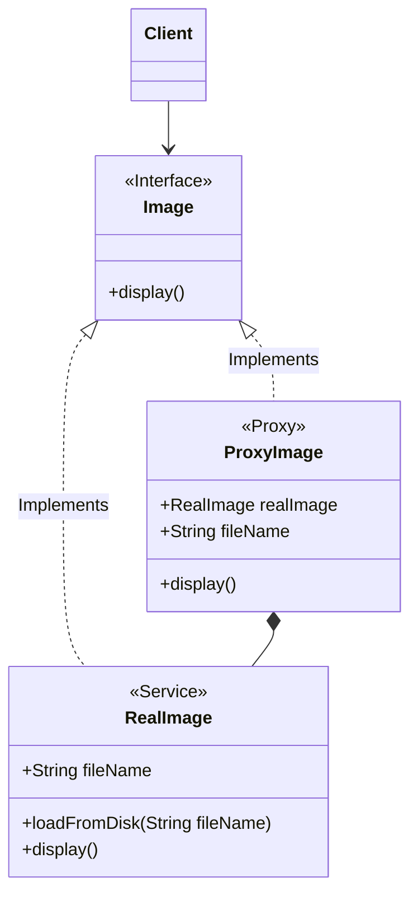

import Tabs from '@theme/Tabs';
import TabItem from '@theme/TabItem';

Structural Design Patterns are concerned with how classes and objects can be composed, to form larger structures. The structural design patterns simplify the structure by identifying the relationships.

<details>
<summary>Adapter Pattern</summary>
- The Adapter pattern is used to allow two incompatible interfaces to work together. This is the real world definition for an adapter.
- An adapter allows a system to use classes of another system that is incompatible with it.

:::tip
Use the Adapter pattern when you want to use some existing class, but its interface isn't compatible with the rest of your code.
:::

`MediaPlayer` class is the interface that we want to use in our application. `VlcPlayer` and `Mp4Player` are the classes that we want to use in our application, but their interfaces are not compatible with our `MediaPlayer` interface. So, we create an `MediaAdapter` class that implements the `MediaPlayer` interface and uses `VlcPlayer` and `Mp4Player` classes to play the required audio format.

```java
public interface MediaPlayer {
   public void play(String audioType, String fileName);
}
```
```java
public interface AdvancedMediaPlayer {
   public void playVlc(String fileName);
   public void playMp4(String fileName);
}
```
```java
public class VlcPlayer implements AdvancedMediaPlayer{
   @Override
   public void playVlc(String fileName) {
      System.out.println("Playing vlc file. Name: "+ fileName);
   }
   @Override
   public void playMp4(String fileName) {
      //do nothing
   }
}
```
```java
public class Mp4Player implements AdvancedMediaPlayer{
   @Override
   public void playVlc(String fileName) {
      //do nothing
   }
   @Override
   public void playMp4(String fileName) {
      System.out.println("Playing mp4 file. Name: "+ fileName);
   }
}
```
```java
public class MediaAdapter implements MediaPlayer {
   AdvancedMediaPlayer advancedMusicPlayer;
   public MediaAdapter(String audioType){
      if(audioType.equalsIgnoreCase("vlc") ){
         advancedMusicPlayer = new VlcPlayer();
      } else if (audioType.equalsIgnoreCase("mp4")){
         advancedMusicPlayer = new Mp4Player();
      }
   }
   @Override
   public void play(String audioType, String fileName) {
      if(audioType.equalsIgnoreCase("vlc")){
         advancedMusicPlayer.playVlc(fileName);
      }else if(audioType.equalsIgnoreCase("mp4")){
         advancedMusicPlayer.playMp4(fileName);
      }
   }
}
```
```java
public class AudioPlayer implements MediaPlayer {
   MediaAdapter mediaAdapter;
   @Override
   public void play(String audioType, String fileName) {
      if(audioType.equalsIgnoreCase("mp3")){
         System.out.println("Playing mp3 file. Name: "+ fileName);
      } else if(audioType.equalsIgnoreCase("vlc") || audioType.equalsIgnoreCase("mp4")){
         mediaAdapter = new MediaAdapter(audioType);
         mediaAdapter.play(audioType, fileName);
      } else{
         System.out.println("Invalid media. "+ audioType + " format not supported");
      }
   }
}
```
```java
public class AdapterPatternDemo {
   public static void main(String[] args) {
      AudioPlayer audioPlayer = new AudioPlayer();
      audioPlayer.play("mp3", "beyond the horizon.mp3");
      audioPlayer.play("mp4", "alone.mp4");
      audioPlayer.play("vlc", "far far away.vlc");
      audioPlayer.play("avi", "mind me.avi");
   }
}
```
</details>

<details>
<summary>Bridge Pattern</summary>
- The Bridge pattern is used to separate the abstract elements of a class from the implementation details, providing the means to replace the implementation details without modifying the abstraction. The Bridge pattern is used to separate the abstract elements of a class from the implementation details, providing the means to replace the implementation details without modifying the abstraction.
</details>

<details>
<summary>Composite Pattern</summary>
The Composite pattern is used to compose objects into tree structures to represent part-whole hierarchies. The Composite pattern is used to compose objects into tree structures to represent part-whole hierarchies.

</details>

<details>
<summary>Decorator Pattern</summary>
- The Decorator pattern is used to add new functionality to an existing object, without altering its structure. The Decorator pattern is used to add new functionality to an existing object, without altering its structure.

</details>

<details>
<summary>Facade Pattern</summary>
- The Client uses the Facade to access the subsystem. The Facade pattern is used to provide a simple interface to a complex subsystem, library, a framework.
- Having a Facade is handy when you want to integrate your app with a sophisticated library that has dozens of features, but you just need a tiny bit of its functionality.
:::tip
- Use the Facade pattern when you want to provide a simple interface to a complex subsystem.
- A Facade class can often be a Singleton since the same facade can be used by many clients.
- Unlike Facade pattern, Proxy has similar interface, but Proxy does not add any new functionality, it just controls access to the object while Facade provides a simplified interface.
:::
In this example, we have a `ShapeMaker` class that provides a simple interface to the complex subsystem of classes that draw different shapes. The `ShapeMaker` class hides the complexity of the subsystem from the client.

```java
public class ShapeMaker {
   private Shape circle;
   private Shape rectangle;
   private Shape square;
   public ShapeMaker() {
      circle = new Circle();
      rectangle = new Rectangle();
      square = new Square();
   }
   public void drawCircle(){
      circle.draw();
   }
   public void drawRectangle(){
      rectangle.draw();
   }
   public void drawSquare(){
      square.draw();
   }
}
```
```java
public class FacadePatternDemo {
   public static void main(String[] args) {
      ShapeMaker shapeMaker = new ShapeMaker();
      shapeMaker.drawCircle();
      shapeMaker.drawRectangle();
      shapeMaker.drawSquare();
   }
}
```

</details>

<details>
<summary>Flyweight Pattern</summary>
- The Flyweight pattern is used to reduce the memory footprint of objects.
- It's let you fit more objects into the available amount of RAM by sharing common parts of state between multiple objects, instead of keeping all of the data in each object.
- Divide the object's state into intrinsic (invariant) and extrinsic (context-dependent) state. The intrinsic state is stored in the Flyweight object and is invariant (i.e., it doesn't change). The extrinsic state is computed or supplied by client code and is stored externally.
:::warning
Use the Flyweight pattern only when your program must support a huge number of objects which barely fit into available RAM.
:::

In the below example we have a `Circle` class that has intrinsic state (color) and extrinsic state (x, y, and radius). We have a `ShapeFactory` class that returns a `Circle` object by looking up the color in a `HashMap`. The `FlyweightPatternDemo` class uses the `ShapeFactory` to get a `Circle` object and sets the extrinsic state.
```java
public interface Shape {
   void draw();
}
```
```java
public class Circle implements Shape {
   private String color;
   private int x;
   private int y;
   private int radius;
   public Circle(String color){
      this.color = color;
   }
   public void setX(int x) {
      this.x = x;
   }
   public void setY(int y) {
      this.y = y;
   }
   public void setRadius(int radius) {
      this.radius = radius;
   }
   @Override
   public void draw() {
      System.out.println("Circle: Draw() [Color : " + color + ", x : " + x + ", y :" + y + ", radius :" + radius);
   }
}
```
```java
public class ShapeFactory {
   private static final HashMap<String, Shape> circleMap = new HashMap();
   public static Shape getCircle(String color) {
      Circle circle = (Circle)circleMap.get(color);
      if(circle == null) {
         circle = new Circle(color);
         circleMap.put(color, circle);
         System.out.println("Creating circle of color : " + color);
      }
      return circle;
   }
}
```
```java
public class FlyweightPatternDemo {
   private static final String colors[] = { "Red", "Green", "Blue", "White", "Black" };
   public static void main(String[] args) {
      for(int i=0; i < 20; ++i) {
         Circle circle = (Circle)ShapeFactory.getCircle(getRandomColor());
         circle.setX(getRandomX());
         circle.setY(getRandomY());
         circle.setRadius(100);
         circle.draw();
      }
   }
   private static String getRandomColor() {
      return colors[(int)(Math.random()*colors.length)];
   }
   private static int getRandomX() {
      return (int)(Math.random()*100 );
   }
   private static int getRandomY() {
      return (int)(Math.random()*100);
   }
}
```
</details>

<details>
<summary>Proxy Pattern</summary>
- The Proxy pattern is used to provide a placeholder for another object to control access to it.
- It suggests you create a new proxy class with the same interface as an original service object. Then you update your app so that it passes the proxy object to all of the original object’s clients.
 Upon receiving a request from a client, the proxy creates a real service object and delegates all the work to it.

:::tip
- Use the Proxy pattern when you want to control access to an object.
- Use the Proxy pattern when you need to add functionality to an object without changing its interface such as `lazy initialization`, `access control`, `logging`, `caching`, etc.
:::

In the below example, we have an `Image` interface and a `RealImage` class that implements the `Image` interface.
 We have a `ProxyImage` class that also implements the `Image` interface.
  The `ProxyImage` class controls access to the `RealImage` object and provides additional functionality such as `lazy initializaton` when required.


```java
public interface Image {
   void display();
}
```
```java
public class RealImage implements Image {
   private String fileName;
   public RealImage(String fileName){
      this.fileName = fileName;
      loadFromDisk(fileName);
   }
   @Override
   public void display() {
      System.out.println("Displaying " + fileName);
   }
   private void loadFromDisk(String fileName){
      System.out.println("Loading " + fileName);
   }
}
```
```java
public class ProxyImage implements Image{
   private RealImage realImage;
   private String fileName;
   public ProxyImage(String fileName){
      this.fileName = fileName;
   }
   @Override
   public void display() {
      if(realImage == null){
         realImage = new RealImage(fileName);
      }
      realImage.display();
   }
}
```
```java
public class ProxyPatternDemo {
   public static void main(String[] args) {
      Image image = new ProxyImage("test_10mb.jpg");
      image.display();
      System.out.println("");
      image.display();
   }
}
```
</details>


