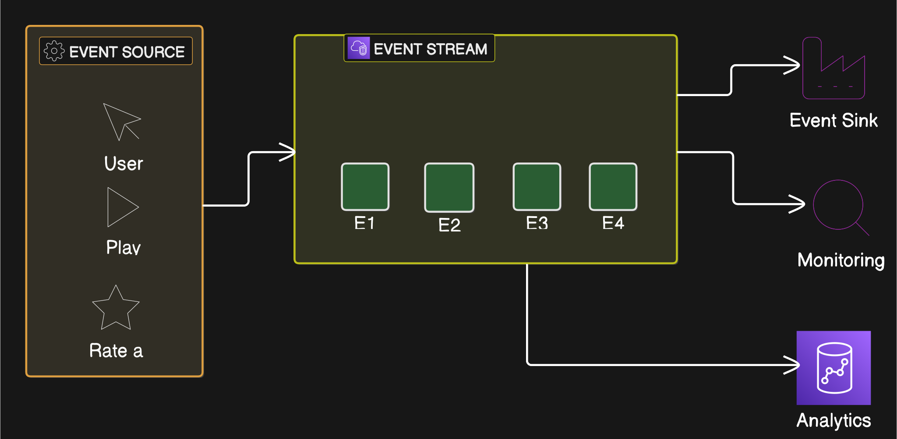

### Problem
Traditional request-response models encounter significant challenges as applications grow and the number of services increases.
 a request-response model, services directly communicate with each other, leading to a tightly coupled system.
As the number of services grows, managing these interactions becomes exponentially complex, hindering scalability and flexibility.

**Event-driven architecture (EDA)** addresses this problem by introducing a fundamentally different approach to communication between services.
n EDA, services communicate through the generation, propagation, and consumption of events.
n **event** is a signal that indicates a significant occurrence within the system.
Instead of direct calls, services react to these events, resulting in a decoupled and more scalable system.

### The main elements of an event-driven system are:

*   **Event Producers:** Microservices or systems that generate events. These events can represent user actions (e.g., a purchase) or system changes (e.g., a data update).
*   **Event Broker:** An intermediary like Kafka, RabbitMQ, or Azure Service Bus that sits between producers and consumers and handles event queuing or streaming. Producers send events to the broker, which then forwards them to consumers. Some systems might have publishers and subscribers that use a publish-subscribe (pub-sub) model to ensure asynchronous communication. Publishers send events, while subscribers receive them from the event broker.
*   **Event Consumers:** Services or systems that consume events and trigger actions like storing data, interacting with applications, or saving data to a file system.
*   **Event Types and Contracts:** Clearly defined event types and contracts ensure that consumers can process each event. For instance, an "order placed" event might include fields like order ID, product details, and payment status.

Netflix's event-driven architecture exemplifies these components. User actions on the platform, like starting a show, generate events. These events are processed by various services, such as the recommendation engine, which acts as an event consumer. Netflix uses a robust event broker to manage the flow of billions of events daily.
There are two types of events in EDA:

---

---

### How does event-driven architecture improve scalability and flexibility in modern systems?
Event-Driven Architecture (EDA) enhances scalability and flexibility in modern systems by **decoupling services through the use of events**.
Instead of services directly calling each other, they communicate by responding to events, which are signals of significant occurrences.
This decoupling enables services to **scale independently** to handle traffic spikes or workload changes.

Here's how EDA improves scalability and flexibility:

*   **Decoupled Services:** EDA enables services to scale independently because producers and consumers do not need to know about each other.
They only need to be connected through a common messaging infrastructure to communicate via events.
*   **Independent Scaling:** Services can scale independently, making it easier to manage increases in traffic or workload.
For example, Netflix uses EDA to manage real-time user events like watching, pausing, or rating content, allowing services like recommendation engines or analytics systems to scale independently.
*   **Flexible System Evolution:** Introducing or updating a service doesn't disrupt the entire network of connections.
Since services are decoupled, changes in one service do not require modifications in others, as long as the event format remains consistent.

In contrast to traditional request-response models,
where managing interactions becomes exponentially complex as the application grows,
EDA offers a streamlined alternative.
This results in a more adaptable and resilient system.

#### Simple vs. Complex Event Processing
Event-driven architectures (EDAs) can employ two primary styles of event processing: **simple event processing** and **complex event processing**.

**Simple event processing involves a direct, one-to-one relationship between an event and a reaction.** For example, when an "order placed" event is generated, the inventory service updates the stock, and the shipping service prepares the order. This approach is straightforward and easy to implement.

**Complex event processing**, on the other hand, involves analyzing multiple events together to identify patterns or trends, enabling more advanced decision-making. For instance, Uber's pricing system considers events related to traffic demand and driver availability to trigger surge pricing. In this case, the system isn't reacting to a single event but rather analyzing a series of events to make a more informed decision.

Here's a table summarizing the key differences:

| Feature               | Simple Event Processing | Complex Event Processing |
| --------------------- | ------------------------- | -------------------------- |
| Event-Reaction        | One-to-one              | Many-to-one                |
| Complexity            | Low                     | High                       |
| Decision-Making       | Basic                    | Advanced                   |
| Example               | Order processing         | Surge pricing              |

Both simple and complex event processing play crucial roles in event-driven systems, and the choice depends on the specific requirements of the application.
### Explain Netflix's use of event-driven architecture.
**Netflix uses an event-driven architecture (EDA) to handle over a billion events each day.**
The platform uses EDA to manage lots of operations, including:

* Streaming
* Data analytics
* Recommendations
* Error handling

**Every user action on Netflix, such as starting a show, rating content, or pausing a stream, generates an event.** This data is collected in real time and distributed to various services. For instance, when a user starts a new show, the recommendation service uses this event to update the user's list with similar content.

Netflix's architecture also leverages EDA to **monitor the health of each service**. If a service slows down or fails, events are generated, and the monitoring service uses these events to alert engineers or initiate automatic recovery processes.

**Netflix benefits from EDA in several ways**:

* **Handling massive amounts of real-time data**
* **Scaling services independently**
* **Ensuring users receive personalized recommendations instantly**
* **Avoiding tightly coupled services**

**While Netflix utilizes EDA for asynchronous communication of real-time user events, it also relies on synchronous service-to-service communication for real-time decisions.** For instance, fetching data from its catalog service or streaming services requires synchronous calls. A service mesh is employed to manage these synchronous calls, ensuring reliable load balancing and traffic routing.

In addition, each microservice in Netflix's architecture has a sidecar proxy that might manage tasks like encryption for securing data streams, logging user events, and service discovery to ensure proper communication between services.

### Challenges of Event-Driven Architecture

While event-driven architecture offers lots of benefits, it also presents some challenges:

*   **Ensuring the Correct Event Order:** In large systems with a lot of events, guaranteeing events are processed in the correct order can be complex.
*   **Handling Event Reprocessing:** Events may be reprocessed in case of failure, requiring measures to prevent actions like deducting stock or processing payments multiple times.
*   **Managing Eventual Consistency:** Achieving eventual consistency across multiple services requires careful planning and design, as real-time event processing doesn't guarantee immediate consistency.

### Tools
The below tools for building event-driven systems:

*   **Apache Kafka**: Kafka is a highly scalable messaging platform widely used for real-time data streaming and event-driven systems. Companies like LinkedIn and Uber use Kafka to handle millions of events per second.
*   **Amazon's cloud-based messaging services**: These services are ideal for event-driven architectures built on AWS.
*   **RabbitMQ**: RabbitMQ is a lightweight messaging broker that is easy to set up and use, making it well-suited for smaller-scale event-driven systems.
