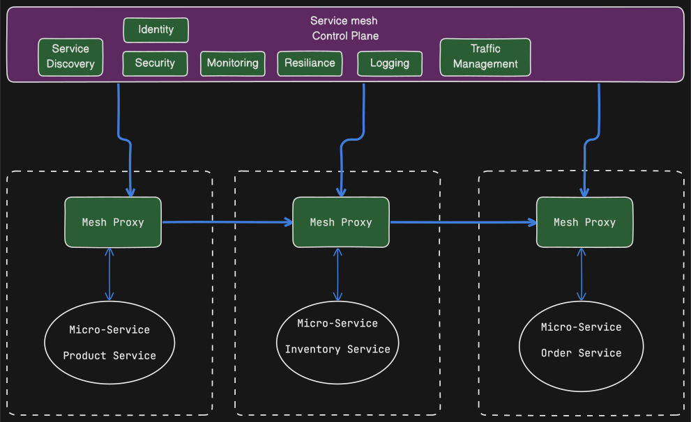

A range of deployment patterns used in microservice architectures, particularly those built using Spring Boot and Java:

  
**Language-Specific Packaging Format:**

This traditional approach involves deploying services as executable packages, such as JAR or WAR files. These packages contain the compiled code and necessary dependencies, requiring manual configuration of the runtime environment on the target machine. The deployment pipeline typically builds the package and uses a service management interface to deploy it to the production environment.

- **Benefits:**
  - Efficient resource utilization
  - Fast deployment
- **Drawbacks:**
  -  **Lack of Encapsulation of the Technology Stack:** Requires operations teams to have detailed knowledge of each service's deployment requirements, increasing complexity and risk of errors.
  -  **No Ability to Constrain Resources:** Inability to limit resource consumption by individual services, potentially leading to resource starvation for other services.
  -  **Lack of Isolation:** Running multiple services on the same machine without isolation can lead to conflicts and dependencies.
  -  **Automatic Placement Challenges:** Determining where to place service instances automatically is difficult.

  
**Virtual Machines (VMs):**

  **Virtual Machines (VMs):** Deploying services as VMs offers greater isolation and resource control than language-specific packages. Each service instance runs in its own VM, reducing conflicts and dependencies. The deployment pipeline creates VM images, including the service and its runtime environment, and deploys them to the production environment.

  
**Containers:**

  **Containers:** Containers, such as Docker, provide a lightweight and portable approach to deploying microservices. Each service instance runs in its own container, offering similar benefits to VMs but with greater efficiency and speed. Deployment pipelines build container images and use container orchestration platforms like Kubernetes to manage and deploy the services.

  **Kubernetes:** Kubernetes is a popular container orchestration platform used to deploy and manage containerized microservices at scale. It provides features for automated deployment, scaling, service discovery, and health monitoring. Deployment pipelines typically interact with Kubernetes APIs to deploy and manage services.

  
**Serverless Deployment:**

  **Serverless Deployment:** In serverless deployment, developers only need to upload the service code, while the serverless platform manages infrastructure concerns. Platforms like AWS Lambda handle scaling, resource allocation, and execution automatically, allowing developers to focus on business logic.

---

    
**Deployment Pipeline:**

    **Deployment Pipeline:** A critical aspect of microservice deployment is a robust deployment pipeline that automates the process from code commit to production release. This pipeline typically includes stages for building, testing, packaging, and deploying the service, often using tools like Jenkins or similar CI/CD platforms.

#### General steps in a deployment pipeline:
- **Build:** Compile the source code, run tests, and package the application.
- **Containerize:** Create a Docker image containing the application and its dependencies.
- **Deploy:** Deploy the containerized application to a container orchestration platform like Kubernetes.
- **Monitor:** Monitor the application's health, performance, and resource usage.
- **Scale:** Scale the application based on demand, using features like auto-scaling in Kubernetes.

In GitHub Actions, you can define these steps in a workflow file, which automates the deployment process when code changes are pushed to the repository.
- **Build and Test:** Run Maven commands to build the application and execute tests.
- **Docker Build:** Build a Docker image containing the application.
- **Docker Push:** Push the Docker image to a container registry.
- **Kubernetes Deployment:** Deploy the application to a Kubernetes cluster.

**We use different branches for different environments, such as `main` for production and `develop` for staging.
This allows us to test changes in a staging environment before deploying them to production.**

:::tip
If you are perpetually making changes across multiple services, It's likely your microservices are too tightly coupled.
It may be worth considering merging the services
:::

---
## Microservice Chassis

A microservice chassis is a framework or set of frameworks that provide a foundation for building microservices,
addressing common concerns such as externalized configuration, health checks, application metrics, service discovery,
circuit breakers, and distributed tracing. The sources detail three key benefits of adopting this approach:

- **Reduced Development Effort:**  A microservice chassis handles numerous cross-cutting concerns, reducing the amount of code developers need to write and configure from scratch. This simplification allows developers to focus on implementing the service’s business logic without the burden of repeatedly addressing these common concerns.
- **Improved Consistency and Maintainability:**  Using a microservice chassis ensures that all services consistently implement essential features like logging, monitoring, and security.  This consistency makes it easier to manage and maintain the overall microservices system, reducing the risk of inconsistencies and errors.
- **Accelerated Development:**  By handling these cross-cutting concerns, a microservice chassis can significantly speed up the development process. Developers can get new services up and running faster, focusing on the unique functionality rather than boilerplate infrastructure code. This accelerated development enables teams to deliver new features and updates more rapidly, supporting agile development practices and continuous delivery.

---

  
**Service Mesh:**

  ### What is a Service Mesh?
  A service mesh is a dedicated infrastructure layer that manages communication between services in a microservices architecture.
  It acts as an intermediary for all network traffic flowing in and out of services,
  handling tasks such as service discovery, load balancing, traffic routing, security, and observability.
  It's essentially a **network of proxies** deployed alongside each service instance,
  often referred to as "sidecar proxies," forming a mesh-like structure for managing communications.

  ### Key Functions and Benefits of a Service Mesh

  - **Traffic Management:**  Service meshes offer fine-grained control over traffic routing. This allows you to implement strategies like:
    - **Canary Releases:** Gradually roll out new service versions to a subset of users, minimizing risks associated with deployments.
    - **A/B Testing:** Route traffic to different service versions for testing and experimentation purposes.
    - **Blue/Green Deployments:**  Seamlessly switch traffic between different environments (blue and green) for zero-downtime deployments.

  - **Resilience:** Service meshes enhance application resilience by handling failures gracefully:
    - **Circuit Breaking:**  Prevent cascading failures by automatically stopping requests to failing services.
    - **Retries:**  Automatically retry failed requests to potentially recover from transient errors.
    - **Timeouts:**  Set limits on how long requests can take, preventing long-running requests from blocking resources.

  - **Security:** Service meshes can improve security by:
    - **Mutual TLS (mTLS):**  Encrypt communication between services, ensuring confidentiality and integrity.
    - **Access Control:**  Enforce access policies to restrict communication between services.

  - **Observability:** Service meshes provide valuable insights into the behavior of microservices:
    - **Metrics Collection:** Collect metrics on request rates, latency, error rates, and other performance indicators.
    - **Distributed Tracing:** Track requests across multiple services to understand their flow and identify performance bottlenecks.
    - **Logging:** Aggregate and manage logs from all services in a centralized location.

  **Service Mesh:** A service mesh, such as Istio, enhances communication and management capabilities in a microservices environment. It provides features like service discovery, load balancing, traffic management, and security policies, often operating alongside a container orchestration platform like Kubernetes.

**Istio**, **Linkerd**, and **Conduit** as prominent service mesh implementations.
They recommend Istio for its robust features and integration with Kubernetes.

A `Control Plane` would sit on top of the service mesh, providing a centralized management interface for configuring and monitoring the mesh.

### Best Cases for Implementing a Service Mesh

### Considerations When Using Service Meshes

  * **Complexity:**  Service meshes add a new layer to your infrastructure, which can increase complexity. However, the benefits often outweigh the additional complexity, particularly in large-scale microservices deployments.
  * **Performance Overhead:**  The sidecar proxies introduce some performance overhead, but it's typically minimal and acceptable given the benefits.
  * **Learning Curve:**  Teams need to learn new concepts and tools associated with the chosen service mesh.

##  Externalized Configuration
**Externalized Configuration:** In microservices, externalized configuration allows for environment-specific settings to be applied without modifying the application code. This can be achieved through mechanisms like environment variables,
configuration files, or dedicated configuration servers. The deployment environment supplies the configuration properties when creating a service instance,
typically read by the service instance upon startup.

**Best Practices for Externalized Configuration:**
*   **Complete Separation**: Configuration should be entirely separate from the deployable service. This means not embedding configurations within the source code. This prevents the need to redeploy services for configuration changes, which can be time consuming and lead to inconsistencies.
*   **Runtime Supply:** Configuration properties should be supplied at runtime, ensuring that the service adapts to its environment. This can be done via environment variables, configuration files, or a configuration server.
*   **Centralized Management:** It's beneficial to manage configurations in one place, making them easier to oversee. This can be done with a configuration server, that can store configuration information for a group of microservices in one location, with settings for different environments.
*   **Secure Storage of Sensitive Data:** Sensitive information, such as credentials, should be stored securely using a secrets storage mechanism like Hashicorp Vault or AWS Parameter Store. The configuration server should be able to decrypt sensitive data before providing it to the service.
*   **Version Control:** Configuration data needs to be tracked and version controlled to avoid bugs and unplanned outages.
*   **Abstraction**: Access to configuration data should be abstracted behind a service interface. Use a REST-based service to retrieve the application's configuration data instead of directly reading from the repository.
*   **Dynamic Reconfiguration:** Services should be able to detect updated property values and reconfigure themselves, potentially via polling.

**Methods of Implementation:**

*   **Push Model:** The deployment infrastructure supplies configuration properties to the service instance, using methods like environment variables or configuration files. The service then reads these properties when it starts up.
*   **Environment Variables:** Properties are passed as environment variables.
*  **Configuration Files:** Properties are supplied using configuration files.
*   **Pull Model:** The service instance reads its configuration properties from a configuration server. On startup, the service queries the configuration service to retrieve its configuration. The configuration server’s location is usually provided to the service instance using a push-based configuration method.
*   **Configuration Server**: Uses a central repository, making configurations easier to manage, and enabling global defaults that can be overridden. Spring Cloud Config is a tool that can be used to implement a configuration server.

**Pitfalls and Challenges:**
*   **Scattered Configuration:** Configuration values may be scattered throughout the definitions of numerous services, making it difficult to manage.
*  **Complexity**: If not handled properly, externalized configuration can lead to an external dependency that will need to be managed and version controlled.
*  **Security Vulnerabilities:** Hard-wiring configurations into the source code can introduce security vulnerabilities, and limit where the service can be deployed.
*   **Reconfiguration Challenges:** Reconfiguring a running service using a push model can be difficult, if not impossible, without restarting it.
*   **Single Point of Failure:** Using a pull model with a configuration server can introduce a single point of failure if there is no redundancy. Using a service discovery mechanism like Netflix Eureka can help mitigate this issue by registering multiple config server instances.
* **Initial Connection**: It should be decided whether the client connects first to the config server to retrieve its configuration, or first to the discovery server.
*   **Configuration Drift:** It is possible for configuration to drift and become inconsistent if not managed properly. The Phoenix Server pattern encourages tearing down and setting up servers to drive out configuration drift.
* **Managing many microservices**: Keeping the configuration up to date for many small components can be challenging.

**Tools and Technologies:**
*   **Spring Cloud Config:** Provides centralized management of configuration files. It supports storing files in Git, and other backends, and encrypting sensitive information.
*   **HashiCorp Vault:** A secrets management tool for securely storing and managing sensitive data.
*   **AWS Parameter Store:** A service for managing configuration data and secrets.
*   **Docker Compose:** Can be used to specify externalized configuration properties using a YAML file, especially useful during development.
*   **Kubernetes ConfigMap:** A named collection of name-value pairs that defines the externalized configuration for one or more application services. ConfigMap can be used to define a container's environment variables and create configuration files inside the container.

By implementing externalized configuration effectively, microservices can be more flexible, secure, and easier to manage across various environments.
