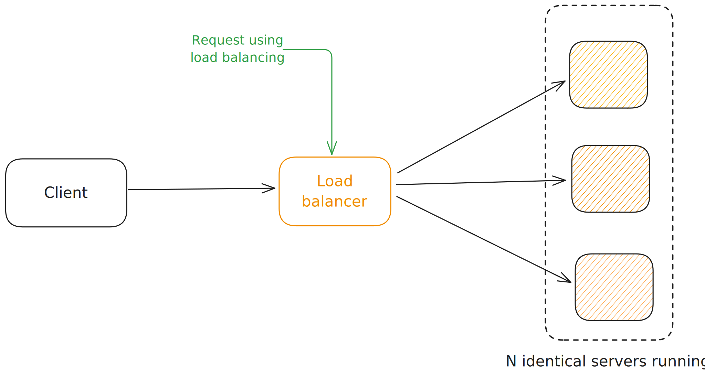

import Tabs from '@theme/Tabs';
import TabItem from '@theme/TabItem';

You run multiple instances of application behind a load balancer. Each instance is identical and can handle any request. This is horizontal scaling.

### Microservices as a Form of Modularity
Consider an example where you have a monolithic application that consists of multiple modules.
Each module is a separate piece of functionality within the application.
In a monolithic architecture, these modules are tightly coupled, making it challenging to modify or scale individual
modules independently.

**If you have to deploy a new version of the application, you need to deploy the entire monolith,
even if only a small part of it has changed.**

It eventually becomes difficult to maintain and scale the application as it grows in size and complexity.

Factors to consider include:

* **Application complexity:** Microservices are generally more suitable for large, complex applications that benefit from independent scalability and deployability.
* **Team structure and skills:** Microservices require a culture of autonomous teams and expertise in distributed systems development.
* **Operational maturity:** Implementing and managing a microservice architecture demands a high level of operational automation and monitoring capabilities.

:::note
In conclusion, the microservice architecture represents an evolution of service-based architectures,
emphasizing agility, scalability, and loose coupling through fine-grained services, lightweight communication protocols,
and independent data management.
:::

#### Step by Step breakdown of Micro-Services

  
**Planning and Design:**

  - Identify business capabilities: Break down your application's functionality into small, independent units based on business capabilities.
  - Define boundaries: Determine the boundaries of each service and how they will interact with each other.
  - Choose communication protocols: Select appropriate communication protocols (e.g., REST APIs, event-driven messaging) for service interaction.
  - Design data management: Decide on data ownership and consistency strategies across services.

  
**Development and Implementation:**

  - Develop individual services: Each service is developed independently using chosen technologies and programming languages.
  - Implement APIs: Define and implement APIs for each service to facilitate communication with other services.
  - Focus on loose coupling: Minimize dependencies between services to promote independent development and deployment.
  - Automate build and deployment: Implement automated build and deployment pipelines for each service.

  
**Deployment and Operation:**

  - Independent deployment: Deploy each service independently based on its own needs and schedule.
  - Containerization: Utilize containerization technologies (e.g., Docker) for packaging and deploying services.
  - Orchestration: Use an orchestration platform (e.g., Kubernetes) to manage the lifecycle of services.
  - Monitoring and logging: Implement robust monitoring and logging systems for each service and overall system health.

  
**Testing and Maintenance:**

  - Unit testing: Test individual services in isolation.
  - Integration testing: Test interactions between services through their APIs.
  - Automated testing: Implement automated testing frameworks for continuous feedback and regression prevention.
  - Continuous monitoring: Continuously monitor service health and performance for proactive issue identification.
  - Logging and tracing: Utilize logs and distributed tracing for troubleshooting and performance analysis.

  
**Tools and Resources**

  - Programming Languages: Java, Python, Node.js, Go, etc.
  - Frameworks: Spring Boot, Micronaut, Quarkus, etc.
  - Containerization: Docker
  - Orchestration: Kubernetes
  - Service Discovery: Consul, Eureka, DNS
  - Configuration Management: Kubernetes ConfigMaps, Secrets
  - Monitoring: Prometheus, Grafana
  - Logging: ELK Stack (Elasticsearch, Logstash, Kibana)
  - Tracing: Jaeger, Zipkin

### Additional considerations:
- **Security:** Implement security measures in each service and API communication to protect against vulnerabilities.
- **API gateway:** Consider using an API gateway to manage and secure external access to your microservices.
- **Service discovery:** Employ a service discovery mechanism to enable services to find each other dynamically.
- **Configuration management:** Implement a configuration management strategy to manage individual service configurations.
- **Remember:** Adopting a microservices architecture requires careful planning, development, and operational practices. While it offers several benefits like agility and resilience, it also presents challenges around complexity and distributed system management. Ensure you have the necessary resources and expertise before embarking on a microservices journey.

### A Comparison of Microservice Architecture and SOA

MicroServices are quite similar to SOA (Service Oriented Architecture) but with a few differences. MicroServices are more fine-grained and lightweight compared to SOA. MicroServices are designed to be independently deployable and scalable. They are organized around business capabilities and can be developed, deployed, and scaled independently.
<Tabs>
  <TabItem value={"Inter-Service Communication"}>
  * **SOA:** SOA typically employs "**smart pipes**," such as an **Enterprise Service Bus (ESB)**, to facilitate communication between services. The ESB acts as a central hub for routing, transforming, and enriching messages, often using heavyweight protocols like **SOAP and other WS* standards**.
  * **Microservices:** Microservices favor "**dumb pipes**," such as **message brokers** or **lightweight protocols like REST or gRPC**. This approach promotes simpler, direct communication between services, reducing the complexity and overhead associated with a centralized ESB.
  </TabItem>
  <TabItem value={"Data Management"}>

    * **SOA:** SOA applications typically rely on a **global data model and shared databases**. This can lead to tight coupling between services and make it difficult to evolve services independently.
    * **Microservices:** In contrast, each microservice in a microservice architecture typically has its own **dedicated database and domain model**. This promotes loose coupling and allows services to evolve and scale independently. However, it also introduces challenges for maintaining data consistency and implementing queries that span multiple services.
  </TabItem>
  <TabItem value={"Service Size"}>

    * **SOA:** SOA is typically used to integrate large, complex monolithic applications, resulting in a **smaller number of large services**.
    * **Microservices:** Microservices emphasize decomposing applications into **smaller, more focused services**, leading to a **larger number of services**. This fine-grained approach aims to improve maintainability, deployability, and scalability.
  </TabItem>
  <TabItem value={"Technology Stack"}>

    * **SOA:** SOA applications often utilize **heavyweight technologies** like **SOAP, WS* standards, and ESBs**.
    * **Microservices:** Microservices tend to embrace **lightweight, open-source technologies** like **REST, gRPC, and message brokers**. This focus on agility and simplicity aligns with the principles of continuous delivery and deployment.
  </TabItem>
</Tabs>

While both microservice architecture and service-oriented architecture (SOA) structure a system as a set of services,
they exhibit significant differences in their approach to inter-service communication,
data management, service size, and technology stacks.

**Comparison Table**

<Tabs>
  <TabItem value={"SOA"}>
    - Uses heavy protocols like SOAP and other WS-* standards
    - Typically uses Smart pipes such as ESB (Enterprise Service Bus) for communication
    - Global Data Model and shared databases often integrating Monolithic applications
  </TabItem>

  <TabItem value={"MicroService"}>
    - Uses lightweight protocols like REST, JSON, and HTTP
    - Typically uses dumb pipes like messaging brokers such as Kafka or RabbitMQ
    - Data Model and databases are private to each service
    - Decentralized and independently deployable services
  </TabItem>
</Tabs>

---

