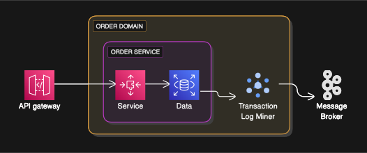
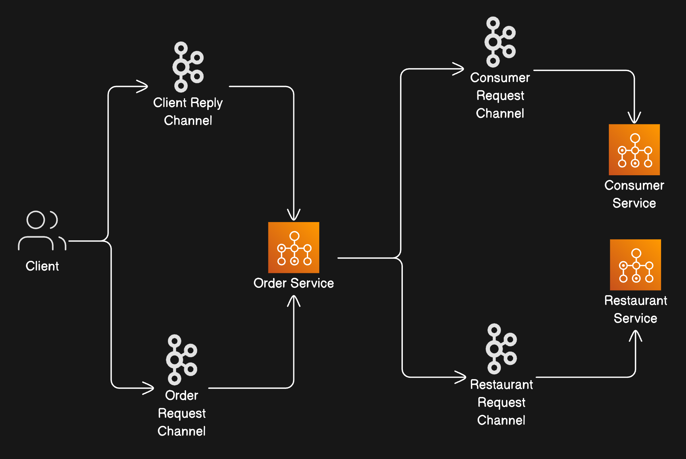
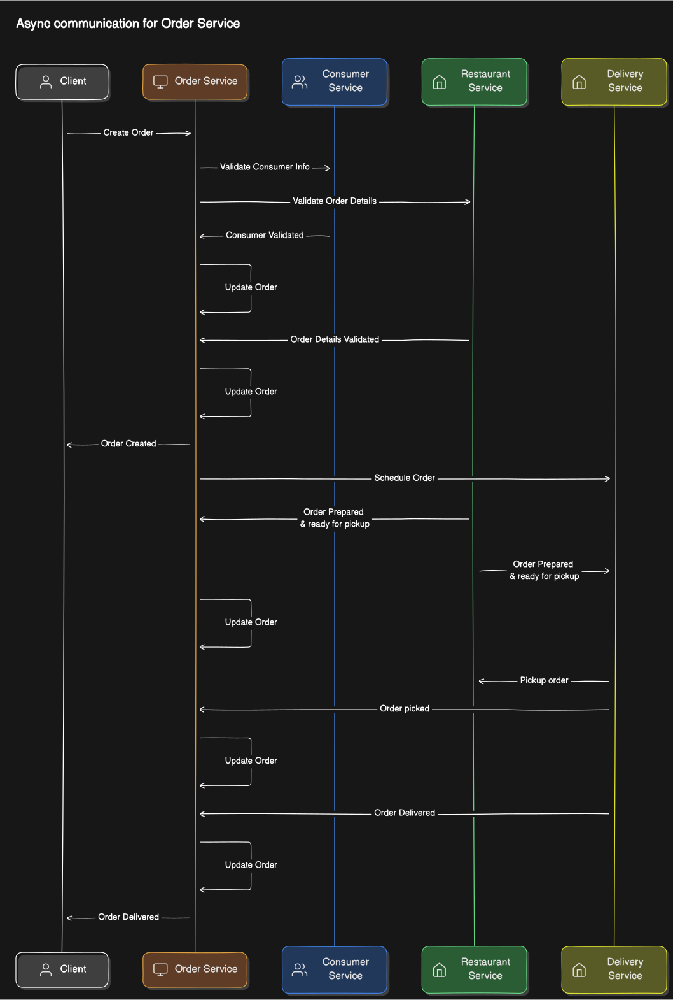

import Tabs from '@theme/Tabs';
import TabItem from '@theme/TabItem';

A message consists of a header and a payload. The header contains metadata about the message,
such as the message type, the sender, and the recipient. The payload contains the actual data that is being sent.

There are sevral different kind of messages :
- `Document Messages` : These messages contain a document or a file.
- `Command Messages` : These messages contain a command that is to
- `Event Messages` : These messages contain an event that has occurred.

:::note `correlation id`
A correlation ID is a unique identifier that is added to a message by the sender.
The receiver can use the correlation ID to correlate the message with other messages or with a request.
:::

---
### Brokerless vs Broker based messaging
<Tabs>
  <TabItem value={"Brokerless"}>
    **Pros**
    - Allows lighter network traffic and better latency, because messages go directly
    from the sender to the receiver, instead of having to go from the sender to the
    message broker and from there to the receiver

    **Cons**
    - Eliminates the possibility of the message broker being a performance bottleneck or a single point of failure
    - Services need to know about each other’s locations and must therefore use one
    of the discovery mechanisms
    - Offers reduced availability as both sender and receiver has to be available.
  </TabItem>
  <TabItem value={"Broker"}>
    - A message broker is an intermediary through which all messages flow. A sender writes
    the message to the message broker, and the message broker delivers it to the receiver.
    - An important benefit of using a message broker is that the sender doesn’t need to
    know the network location of the consumer.
    - Another benefit is that a message broker
    buffers messages until the consumer is able to process them.
  </TabItem>
</Tabs>
---

<details>
  <summary>Factors to consider choosing message broker</summary>

  Each broker makes different trade-offs. For example, a very low-latency broker might
  not preserve ordering, make no guarantees to deliver messages, and only store messages in memory. A messaging broker
  that guarantees delivery and reliably stores
  messages on disk will probably have higher latency.

  - Supported Messaging standard : AMQP, MQTT, STOMP, etc.
  - Message Ordering : FIFO, LIFO, etc.
  - Delivery guarantees : At-most-once, At-least-once, Exactly-once
  - Persistence : Disk or Memory
  - Latency : How fast messages are delivered
</details>

:::note
Another fairly unique feature of Kafka is message permanence.
With a normal message broker, once the last consumer has received a message,
the broker no longer needs to hold on to that message. With Kafka, messages can be stored for a configurable period.
[Apache Kafka Intro](https://www.youtube.com/watch?v=hNDjd9I_VGA&list=WL&index=41&ab_channel=GauravSen)
:::


:::warning Downside using Message Brokers
- **Additional Complexity** - Message brokers introduce additional complexity to the system.
- **Performance Bottleneck** - They can introduce latency, they can be difficult to scale and can cause
a performance bottleneck.
- **Single Point of Failure** - They can be a single point of failure.
:::


### Message Ordering
A simple messaging system can deliver multiple messages concurrently,
but due to network delays or garbage collections, the order in which they are delivered is not guaranteed.

In theory, a service instance might process the
Order Cancelled message before another service processes the Order Created message!

A common solution is to use Sharding, where messages are partitioned into different queues based on some key.
Sender specifies the shard key, and the message broker ensures that all messages with the same key are delivered in order.

```json
{
  "shard_key": "order_id",
  "message": "Order Created"
}
```
Message broker assigns a shard to a consumer, and all messages with the same key are delivered to the same shard.
As a result, all messages with the same key are delivered in order.


### Handling Duplicate Messages
When a message broker delivers a message to a consumer, it doesn't know if the consumer has processed the message successfully.
If the consumer crashes after processing the message but before acknowledging it, the message broker will redeliver the message.
This can lead to duplicate processing of the message.

:::note
A message broker should ideally deliver each message exactly once.
But guranteeing exactly once delivery in all cases is costly and impossible.
Instead most message brokers provide at-least-once delivery, where the message is delivered at least once but may be duplicated.

There are a couple of different ways to handle duplicate messages:
  - **Write idempotent message handlers** : A method is idempotent if it can be called many times without changing
the result beyond the initial application.
So it is harmless to process the same message multiple times.
  - **Track messages and discard duplicates** : Write message handlers that keep track of the messages you have
processed and discard duplicates.

<details>
  <summary>Scenario Example</summary>

Consider for e.g. a message that authorize a payment.
If the message is processed twice, the payment will be authorized twice.
A message handler handling this logic must become important.
A simple solution is to track `message_id` and discard duplicates.

```java
void authorizePayment(Message message){
  if (processedMessages.contains(message.id)) return;
  authorizePayment(message);
}
```
Another option is to record `message_id` in an application table and check if the message has been processed before.
```sql
CREATE TABLE processed_messages (
  message_id VARCHAR(255) PRIMARY KEY
);
```
</details>
:::

### Transactional Messaging

Services often need to use messaging to update database a part of a transaction.
Transactional messaging is a way to ensure that messages are processed exactly once.

A traditional solution is to use distributed transactions across databases and the
message broker.It is not a good choice for mordern applications because it is slow and can lead to
deadlocks and other issues.

Another solution is to store the message in the same database as the data it is updating.
This is called `Outbox Pattern`. The service writes the message to the outbox table and the
transaction commits. A separate process reads the messages from the outbox table and sends them to the message broker.

```sql
CREATE TABLE outbox_messages (
  id SERIAL PRIMARY KEY,
  message TEXT NOT NULL,
  created_at TIMESTAMP DEFAULT CURRENT_TIMESTAMP
);
```

**Polling Database** is a simple way to implement the outbox pattern, which works well for low-volume systems.
A separate process queries the outbox table for new messages and sends them to the message broker.

### Log Miner
A sophisticated solution is for MessageRelay to tail the database transaction log (also
called the commit log).
Every committed update made by an application is represented as an entry in the database’s transaction log.



A transaction log miner can read
the transaction log and publish each change as a message to the message broker.

A better approach is to use a higher-level library or framework that hides the low-level
details and directly supports the higher-level interaction styles.


The client and service communicate asynchronously using a message broker.



A service maintains a replica of the data that it needs when processing requests.
It keeps the replica up-to-date by subscribing to events published by the services that
own the data.

For example, Order Service could maintain a replica of data owned by
Consumer Service and Restaurant Service. This would enable Order Service to
handle a request to create an order without having to interact with those services.
Consumer Service and Restaurant Service publish events whenever their data
changes. Order Service subscribes to those events and updates its replica.

:::warning
One drawback of replication is that it can sometimes
require the replication of large amounts of data, which is inefficient.
:::


