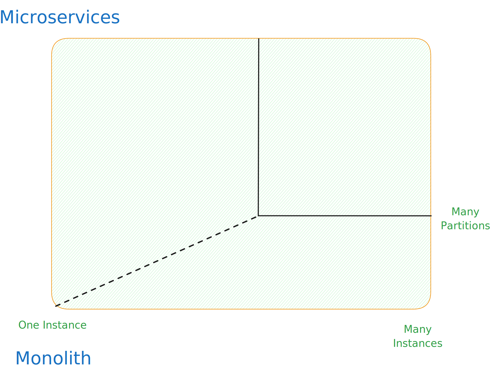
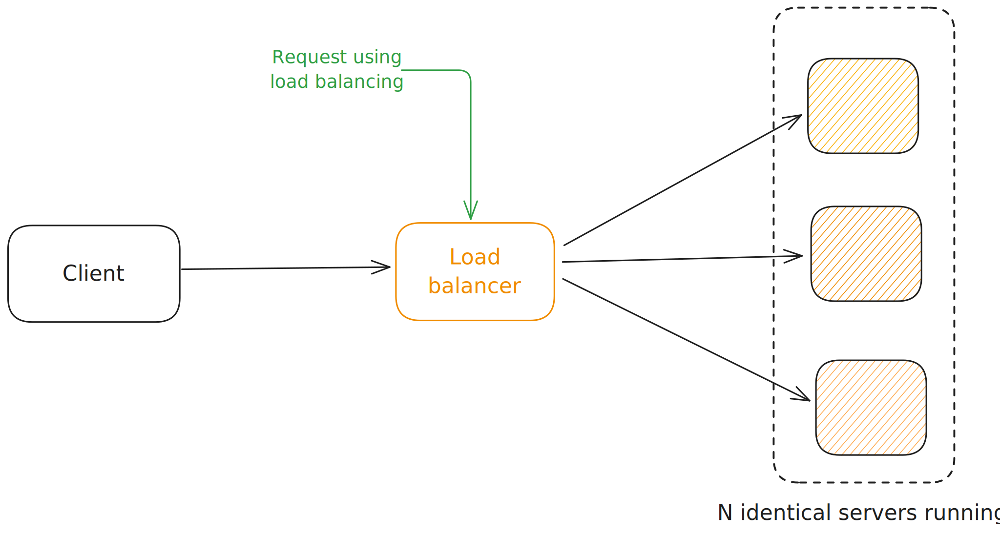

import Tabs from '@theme/Tabs';
import TabItem from '@theme/TabItem';

You run multiple instances of application behind a load balancer. Each instance is identical and can handle any request. This is horizontal scaling.

MicroServices are quite similar to SOA (Service Oriented Architecture) but with a few differences. MicroServices are more fine-grained and lightweight compared to SOA. MicroServices are designed to be independently deployable and scalable. They are organized around business capabilities and can be developed, deployed, and scaled independently.
<Tabs>
  <TabItem value={"SOA"}>
    - Uses heavy protocols like SOAP and other WS-* standards
    - Typically uses ESB (Enterprise Service Bus) for communication
    - Global Data Model and shared databases
    - Monolithic applications
  </TabItem>

  <TabItem value={"MicroService"}>
    - Uses lightweight protocols like REST, JSON, and HTTP
    - Typically uses messaging systems like Kafka or RabbitMQ
    - Data Model and databases are private to each service
    - Decentralized and independently deployable services
  </TabItem>
</Tabs>

### What are the key characteristics of Micro-Services?
- **Componentization via Services**: Micro-Services are organized around business capabilities
- **Organized around Business Capabilities**: Micro-Services are organized around business capabilities
- **Products not Projects**: Micro-Services are long-lived
- **Smart endpoints and dumb pipes**: Micro-Services are designed to be consumed by clients
- **Decentralized Governance**: Micro-Services are decentralized
- **Decentralized Data Management**: Micro-Services have their own databases
- **Infrastructure Automation**: Micro-Services are automated
- **Design for failure**: Micro-Services are designed for failure
- **Evolutionary Design**: Micro-Services are designed to evolve
- **Consumer-first**: Micro-Services are designed to be consumed by clients

## Step by Step breakdown of Micro-Services

**Planning and Design:**

    - Identify business capabilities: Break down your application's functionality into small, independent units based on business capabilities.
    - Define boundaries: Determine the boundaries of each service and how they will interact with each other.
    - Choose communication protocols: Select appropriate communication protocols (e.g., REST APIs, event-driven messaging) for service interaction.
    - Design data management: Decide on data ownership and consistency strategies across services.

**Development and Implementation:**

    - Develop individual services: Each service is developed independently using chosen technologies and programming languages.
    - Implement APIs: Define and implement APIs for each service to facilitate communication with other services.
    - Focus on loose coupling: Minimize dependencies between services to promote independent development and deployment.
    - Automate build and deployment: Implement automated build and deployment pipelines for each service.

**Deployment and Operation:**

    - Independent deployment: Deploy each service independently based on its own needs and schedule.
    - Containerization: Utilize containerization technologies (e.g., Docker) for packaging and deploying services.
    - Orchestration: Use an orchestration platform (e.g., Kubernetes) to manage the lifecycle of services.
    - Monitoring and logging: Implement robust monitoring and logging systems for each service and overall system health.

**Testing and Maintenance:**

    - Unit testing: Test individual services in isolation.
    - Integration testing: Test interactions between services through their APIs.
    - Automated testing: Implement automated testing frameworks for continuous feedback and regression prevention.
    - Continuous monitoring: Continuously monitor service health and performance for proactive issue identification.
    - Logging and tracing: Utilize logs and distributed tracing for troubleshooting and performance analysis.

---

**Tools and Resources**

- Programming Languages: Java, Python, Node.js, Go, etc.
- Frameworks: Spring Boot, Micronaut, Quarkus, etc.
- Containerization: Docker
- Orchestration: Kubernetes
- Service Discovery: Consul, Eureka, DNS
- Configuration Management: Kubernetes ConfigMaps, Secrets
- Monitoring: Prometheus, Grafana
- Logging: ELK Stack (Elasticsearch, Logstash, Kibana)
- Tracing: Jaeger, Zipkin

### Additional considerations:
- **Security:** Implement security measures in each service and API communication to protect against vulnerabilities.
- **API gateway:** Consider using an API gateway to manage and secure external access to your microservices.
- **Service discovery:** Employ a service discovery mechanism to enable services to find each other dynamically.
- **Configuration management:** Implement a configuration management strategy to manage individual service configurations.
- **Remember:** Adopting a microservices architecture requires careful planning, development, and operational practices. While it offers several benefits like agility and resilience, it also presents challenges around complexity and distributed system management. Ensure you have the necessary resources and expertise before embarking on a microservices journey.

