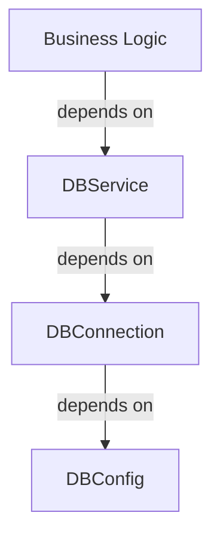
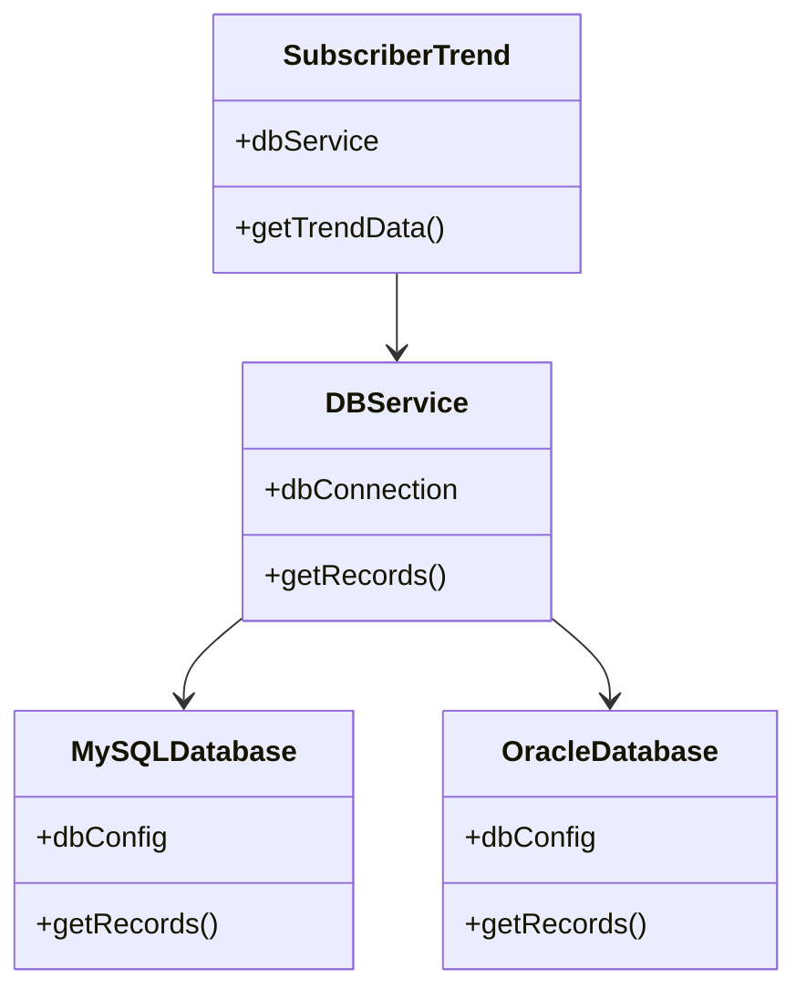

import Tabs from '@theme/Tabs';
import TabItem from '@theme/TabItem';

# SOLID Principles
Robert C. Martin (Uncle Bob) introduced the SOLID principles in his 2000 paper Design Principles and Design Patterns. The SOLID principles are the five principles of good object-oriented programming and design. The SOLID principles are:

- Low level classes : Implement basic operations and have no knowledge of the business rules.
- High level classes : Implement business rules and have no knowledge of the basic operations.

<details>
<summary>Single Responsibility Principle</summary>
- A class should have one and only one reason to change, meaning that a class should have only one job.
- A class should have one and only one reason to change, meaning that a class should have only one job.

If a class does more than one job, it becomes coupled. A change to one responsibility results to modification of the other responsibility. This leads to fragile designs that break in many places.
</details>


<details>
<summary>Open Closed Principle</summary>
- A good design should follow the open closed principle.
- Open closed principle means that the design should be open for extension but closed for modification.
- This makes the design more extensible and maintainable.
</details>


<details>
<summary>Liskov Substitution Principle</summary>
- A good design should follow the Liskov substitution principle for inheritance.
- Liskov substitution principle means that the objects of a superclass should be replaceable with objects of its subclasses without affecting the functionality of the program.
- This makes the design more extensible and maintainable.

Parameter types of a subclass should match or be a superclass of the parameter types.
If you have a class `RaceCare `that extends `Car`, there is a method to `startEngine` method to start engine,
you should be able to replace `Car` with `RaceCar` without affecting the functionality of the program.
```java
class StartRace {
    void startEngine(Car car) {
        // Start the engine
        // can accept any car
    }
 }
```
---
Return type of a method should be a match or subclass of the return type of the overridden method in the superclass.
```java
class Car {
    Car startEngine() {
        // Start the engine
        return new Car
    }
}
class RaceCar extends Car {
    @Override
    RaceCar startEngine() {
        // Start the engine
        return new RaceCar
    }
}
```

---
Exceptions thrown by a subclass should be the same or a subclass of the exceptions thrown by the superclass.
```java
class Car {
    void startEngine() throws EngineStartException {
        // Start the engine
    }
}

class RaceCar extends Car {
    @Override
    void startEngine() throws EngineStartException {
        // Start the engine
    }
}
```

---
Subclass should not alter the private fields of the superclass.

```java
class Car {
    private String color;
    void paintCar(String color) {
        // Start the engine
    }
}

class RaceCar extends Car {
    @Override
    void paintCar(String color) {

    }
}
```
</details>

<details>
<summary>Interface Segregation Principle</summary>
- A good design should follow the interface segregation principle.
- Interface segregation principle means that the interfaces should be segregated into smaller interfaces so that the clients only need to know about the methods that they are interested in.
- This makes the design more extensible and maintainable.

Consider example of an Automatic Transmission ElectricCar and a Manual Transmission Feul Car. Both of them have a method to change gears, but the Automatic Transmission RaceCar does not need a method to change gears.
So, the interface should be segregated into two interfaces, one for the Automatic Transmission RaceCar and one for the Manual Transmission RaceCar.
</details>


<details>
<summary>Dependency Inversion Principle</summary>
- A good design should follow the dependency inversion principle.
- Dependency inversion principle means that the high level modules should not depend on the low level modules.
- Instead, both should depend on abstractions.
- This makes the design more extensible and maintainable.

Consider the example of a `Car` class that depends on the `Engine` class. If the `Engine` class changes, the `Car` class also needs to change. This makes the design fragile and hard to maintain.
```java
class Car {
    Engine engine;
    Car(Engine engine) {
        this.engine = engine;
    }
}
```
Instead, the `Car` class should depend on an abstraction of the `Engine` class. This makes the design more extensible and maintainable.
```java
interface Engine {
    void startEngine();
}

class Car {
    Engine engine;
    Car(Engine engine) {
        this.engine = engine;
    }
}
```
you need to design interface for low level classes first and high level classes should depend on the interface.
For instance, business logic should call a method `openPDFReport(file)` rather than a series of methods
`openFile(x)`, `readBytes(n)`, `closeFile(x)` . These interfaces
count as high-level ones.

Consider Highlevel class `SubscriberTrend `which is getting data from another class `DBService` for reading and
persisting data. `DBService` is dependent on `DBConnection` and `DBConnection` is dependent on `DBConfig`.
When you change the Database to a new vendor or change the database connection, you need to change the `DBService` class. This makes the design fragile and hard to maintain.

Instead, the `DBService` class should depend on an abstraction of the `DBConnection` class. This makes the design more extensible and maintainable.


</details>

:::tip
Using these principles mindlessly can cause more harm than good. The SOLID principles are guidelines, not rules. They are not meant to be followed blindly. They are meant to be used as a guide to help you create better designs.
:::
