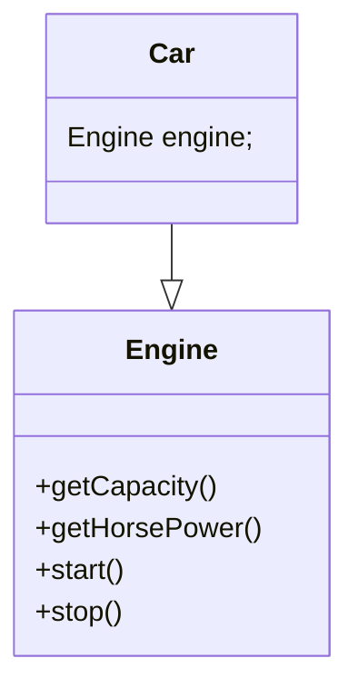
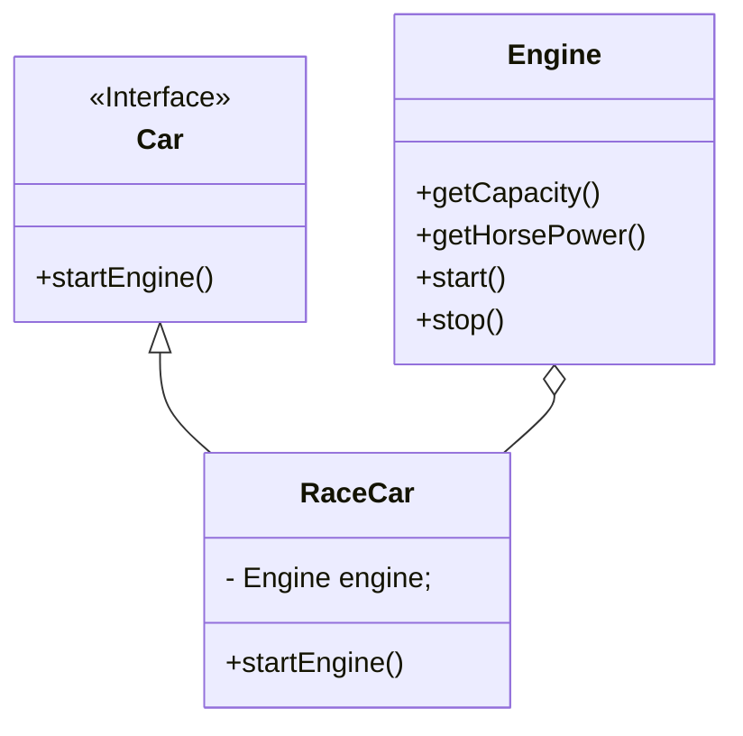
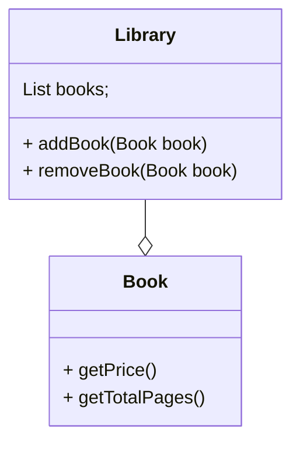
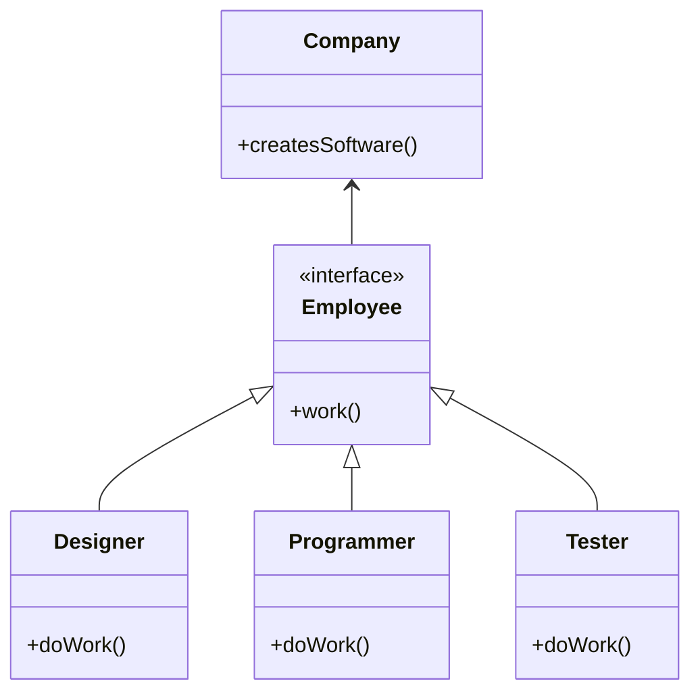
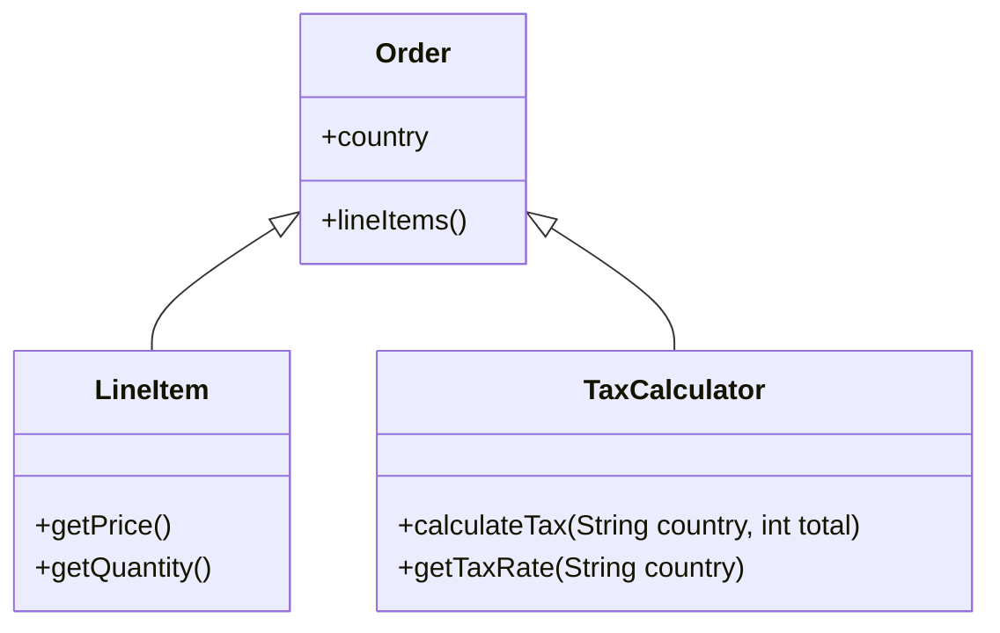
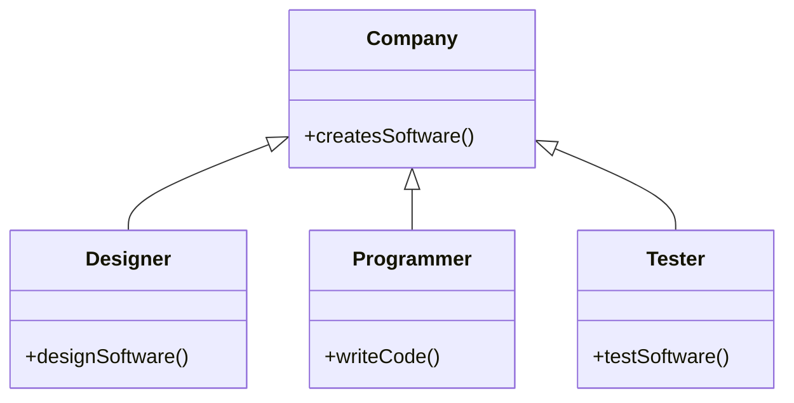
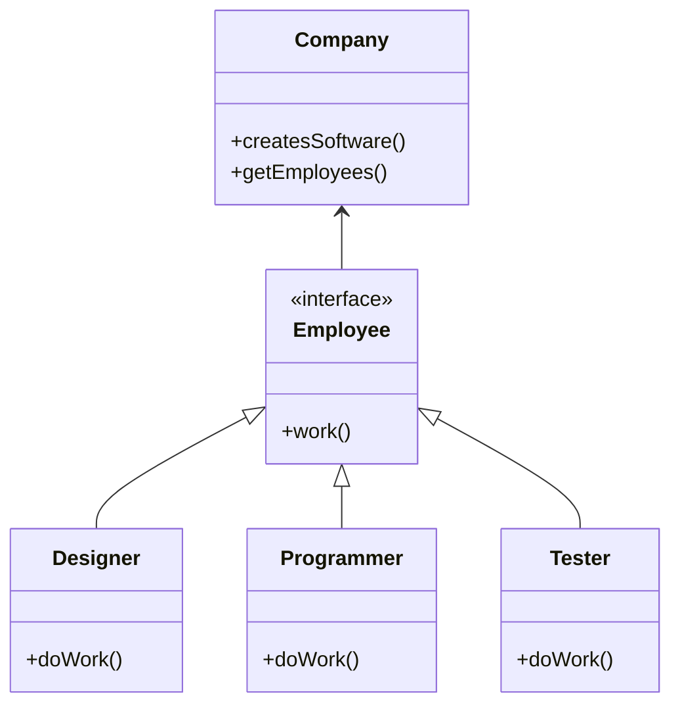
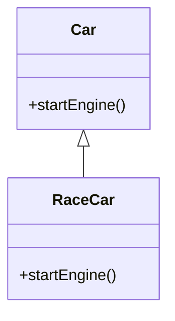

In this section, we will discuss the clean code principles that you should follow to write clean and maintainable code.

#### Terminologies
- **Composition** : For e.g. you create a new class by combining multiple classes. A car manges the Engine and engine
can not exist independently.

- **Inheritance** : For e.g. you extend a class to create a new class.

- **Aggregation** : For e.g. you create a new class by combining multiple classes. Child classes can exist independently.

- **Implementation/Realization** : For e.g. you implement an interface to create a new class.

<details>
<summary>Difference between Composition and Aggregation</summary>
    - Composition is a strong type of Aggregation.
    - Aggregation implies a relationship where the child can exist independently of the parent.
    - Composition implies a relationship where the child cannot exist independently of the parent.
</details>


### Encapsulate what varies
The main goal of this is to encapsulate the parts of the code that are likely to change.
 This is a key principle of object-oriented programming.
  The idea is to separate the parts of the code that are likely to change from the parts that are not likely to change.
 This makes the code more maintainable and easier to change.

For e.g.

```java
method getOrderTotal(Order order){
    int total = 0;
    // Calculate the total order amount
    for (LineItem item : order.lineItems()) {
        total += item.getPrice() * item.getQuantity();
    }

    // Calculate the tax
    if(order.country == "US") total += total * 0.07;
    if(order.country == "UK") total += total * 0.20;

    // Calculate the discount
    // Calculate the shipping charges
    // Calculate the total amount
    return total;
}

```
You can hide the tax calculation logic in a separate method and use it into the main class.

```java
int getOrderTotal(Order order){
    int total = 0;
    // Calculate the total order amount
    for (LineItem item : order.lineItems()) {
        total += item.getPrice() * item.getQuantity();
    }

    // Calculate the tax
    total += calculateTax(order.country, total);

    // Calculate the discount
    // Calculate the shipping charges
    // Calculate the total amount
    return total;
}

int calculateTax(String country, int total){
    if(country == "US") return total * 0.07;
    if(country == "UK") return total * 0.20;
    return 0;
}

```
Over time you will add more responsibilities to the class, and it will become harder to maintain and test.
Extracting every responsibility into a separate class will make the code more maintainable and easier to test.



### Program to an Interface, not an Implementation
This principle states that you should program to an interface, not an implementation.
 This means that you should use interfaces to define the behavior of your classes, rather than using concrete classes.
  This makes your code more flexible and easier to change.


* A design is flexible enough to allow for multiple implementations of the same interface. *
Take another example


The company class is tightly coupled with the Designer, Programmer, and Tester classes.
If you want to add a new role, such as a Project Manager, you will have to modify the Company class.
**This violates the open/closed principle, which states that a class should be open for extension but closed for modification.**

```java
class Company {
    void createsSoftware(){
        Designer designer = new Designer();
        designer.designSoftware();

        Programmer programmer = new Programmer();
        programmer.writeCode();

        Tester tester = new Tester();
        tester.testSoftware();
    }
}
```

By using an interface, you can add new roles without modifying the Company class.
This makes the code more flexible and easier to change.


Better polymorphism helped to add new roles without modifying the Company class.

```java
class Company {
    void createsSoftware(){
        List<Employee> employees = getEmployees();
        for(Employee employee : employees){
            employee.work();
        }
    }
}
```

### Composition over Inheritance
Composition over inheritance is a design principle that states that you should prefer composition over inheritance.
 This means that you should use composition to build complex objects from simpler objects, rather than using inheritance.
  This makes your code more flexible and easier to change.

- Inheritance is a powerful tool, but it can lead to complex and hard-to-understand code. *
- Overriding methods in a subclass can lead to unexpected behavior and bugs.
- Subclasses are tightly coupled with their superclasses, which makes the code harder to change.



```mdx-code-block
import DocCardList from '@theme/DocCardList';

<DocCardList />
```

