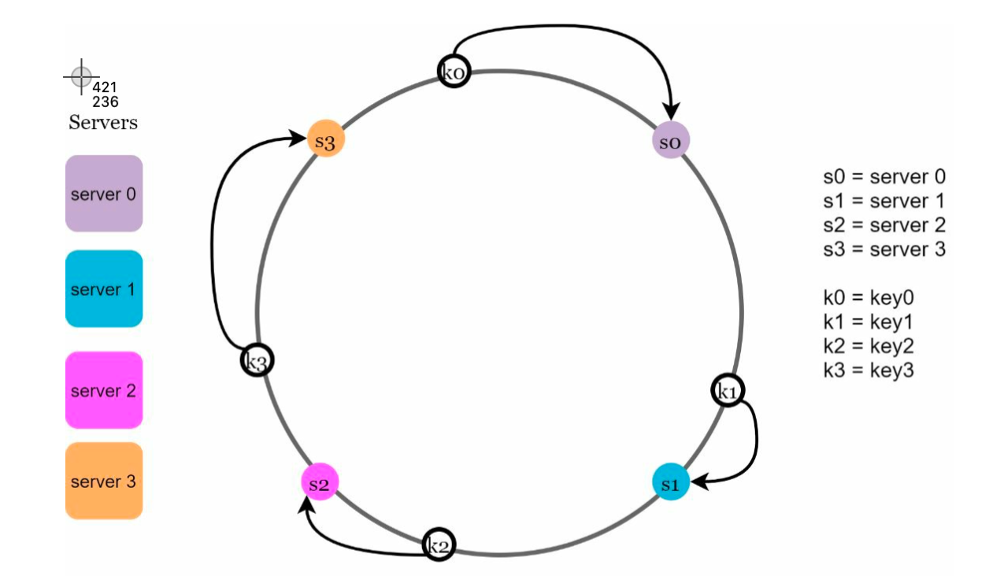

### What is Consistent Hashing?
Consistent hashing is a special kind of hashing such that when a hash table is resized, only `K/n` keys need to be remapped on average, where `K` is the number of keys, and `n` is the number of slots.
- Consistent hashing is a scheme that provides hash table functionality in a way that the addition or removal of one slot does not significantly change the mapping of keys to slots.
- Consistent hashing is used to distribute the load among multiple servers while maintaining the same mapping from keys to servers.

:::warning Hashing Problem
- To store a key-value pair, the key is hashed to yield an integer, which is then mapped modulo the number of servers, `n`. This maps the key to one of the `n` servers.
- This approach is simple and works well until the number of servers changes. When a server is added, most keys have to be remapped to different servers. When a server is removed, even more keys have to be remapped to different servers.
- Applying modulus operation to the hash function can lead to uneven distribution of keys.
::::

### Hash Space and Hash Ring
- The hash space is a circle with values ranging from `0` to `2^32-1` (32-bit hash values).
- Each server is assigned a random value within the hash space.
- Connecting the two ends of the hash space creates a ring, called the hash ring.
- A partition is a space between two adjacent servers in the hash ring.

### Consistent Hashing Algorithm
- To map a key to a server, the hash value of the key is calculated, and then the hash ring is traversed clockwise until the first server is found, starting from the hash value of the key.
- If the hash value of the key is greater than the largest hash value of a server, the key is mapped to the first server in the hash ring.

**Issues**

    - Size of Ring is not fixed, it varies when servers are added or removed.
    - Size of partitions is not uniform, one partition can be very large and another can be very small.
    - Impossible to add or remove servers without remapping all the keys.

#### Virtual Nodes
- To solve the issues of Consistent Hashing, we can add virtual nodes to the hash ring.
- Each server is assigned multiple random values within the hash space.
- Each server is represented by multiple virtual nodes in the hash ring.
- Each virtual node is mapped to a single server.
- Each server is responsible for all the keys between it and its predecessor in the hash ring.
- The number of virtual nodes that a server is assigned is proportional to its capacity.

