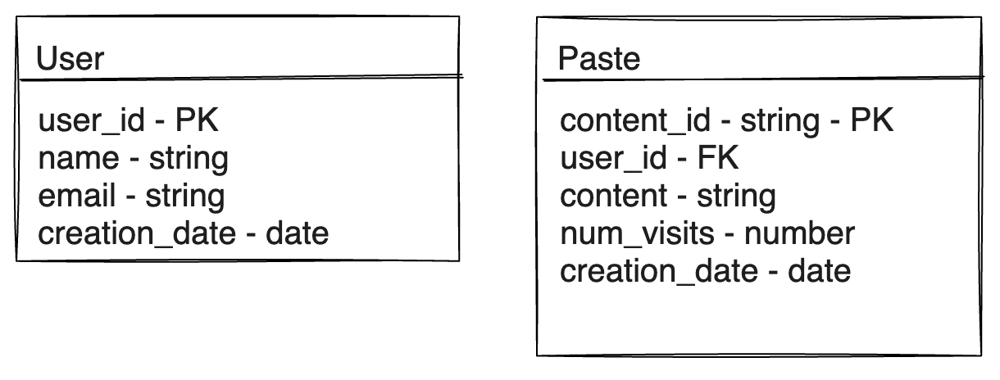

## Design a NewsFeed System like Facebook, Instagram, Twitter
A NewsFeed system is continuously changing list of Stories comprised of Photos, Videos, Post updates, activity
from People, Page/Channel & Groups that you have Subscribed or Follow.


### Requirements and Goals of the System
Let's discuss what features we will be designing so that we can come up with a set of useful requirements.

<details>
<summary>**Functional Requirements**</summary>

</details>

<details>
<summary> **Non-Functional Requirements**</summary>
    - The system should be highly reliable, any data loss should be avoided.
    - The system should be highly available. This is required because if our service is down, users will not be able to access their pastes.
    - Paste retrieval should be fast; users should be able to access a paste in milliseconds.
    - Shortened links should not be guessable (not predictable).
    - The system should be highly scalable to support millions of new pastes per day.
</details>

<details>
<summary>**Extended Requirements**</summary>
    - Analytics, e.g., how many times a paste was accessed?
    - Our service should also be accessible through REST APIs by other services.
    - Our service should provide an option to create a user profile.
    - Users should be able to comment on each other’s pastes.
    - Users should be able to “like” each other’s pastes.
    - Users should be able to follow other users.
</details>

### Capacity Estimation and Constraints
Let’s consider below assumptions :
- 100M new pastes per month
- Limit users to have snippet size of 1MB
- Limit custom url length to maintain consistent URL length.
- **Read heavy** system, **100:1** read to write ratio.
- Let's assume we will store snippets for 2 years
- Each Paste metadata for each Paste will take another 100bytes.

<details>
<summary>**Traffic**</summary>
    - Total number of write requests per month = 100M
    - Total number of requests per second: 100M / (30 * 24 * 3600) ~= 40
    - Total number of reads per month: 100M * 100 = 10B
    - Total number of requests per second: 10B / (30 * 24 * 3600) ~= 40K
</details>
<details>
<summary>**Storage**</summary>
    - Total number of pastes for 2 years = 100M * 24 = 2.4B
    - Total storage required for metadata: 2.4B * 100 bytes ~= 240GB
    - Total storage required for code snippets: 2.4B * 1MB ~= 2.4PB
    - Total storage: 240GB + 2.4PB ~= 2.4PB
</details>
<details>
<summary>**Bandwidth**</summary>
    - Incoming data: 100M * 1MB ~= 100TB per month
    - Outgoing data: 100M * 1MB * 100 ~= 100PB per month
</details>
<details>
<summary>**Memory**</summary>
    - If we want to cache some of the hot pastes that are frequently accessed, how much memory will we need to store them?
    - If we follow the 80-20 rule, meaning 20% of the pastes generate 80% of the traffic, we would like to cache these 20% pastes.
    - Number of hot pastes = Total pastes * 20% = 2.4B * 20% ~= 500M
    - Memory required to store hot pastes = 500M * 1MB ~= 500TB
</details>


### API Design
This problem can be decomposed into two main components:
- **A service to store and retrieve code snippets.**
- **A service to generate and manage short URLs.**

```java
/**
POST API to upload code snippets
api/v1/create
    api_dev_key - A developer key to track the user who created the paste and to block abuse
    paste_code - Code snippet, limited to 1MB
    paste_name - Name of the paste
    paste_private - 0=public, 1=unlisted, 2=private
    paste_expire_date - An integer representing the number of minutes. (optional)
    user_name - Name of the user who created the paste (optional)
    paste_folder_key - A folder key to put the paste in a folder (optional)

returns a shortened URL (e.g., http://tinyurl.com/xyz123)
*/
String createPaste(api_dev_key, paste_code, paste_name, paste_private, paste_expire_date, user_name, paste_folder_key)
    returns a shortened URL (e.g., http://tinyurl.com/xyz123)

/**
GET API to get a paste
api/v1/get/<shortened_url>
    api_dev_key - A developer key to track the user who created the paste and to block abuse
    api_paste_key - The key of the paste to be retrieved
returns the original code snippet
*/
String getPaste(api_dev_key, api_paste_key)
    returns the original code snippet

/**
DELETE API to delete a paste
api/v1/delete/<paste_key>
    api_dev_key - A developer key to track the user who created the paste and to block abuse
    api_paste_key - The key of the paste to be deleted
returns True if the paste existed and was deleted successfully
*/
boolean deletePaste(api_dev_key, api_paste_key)
    returns True if the paste existed and was deleted successfully
```

### Database Design
- **We need to store billions of records** and **support billions of queries**.
- **We need to store metadata** with each URL, including **creation date**, **expiration date**, **the number of visits**, **etc**.
- **We need to support millions of writes per second**.
- **Our service is read-heavy**.
- **URL redirection** should happen in **real-time**.
- **There is no need for complex relationships**.

#### What kind of database should we use?
- **SQL** databases are not a good fit for such scenarios as **their vertical scalability** is limited and **they can not handle** such a **large amount of data**, **write** or **read** load.
- **NoSQL** databases are a better choice for such a large scale system as they are **horizontally scalable** and provide a superior read/write performance.
- **Cassandra** is a good choice for such a system as it can handle a huge amount of data, **read/write** throughput, **has no single point of failure** and **provides tunable consistency**.

:::tip
- **We can also use** a **key-value** store like **DynamoDB** or **Riak** to store a **huge amount of data**. **These stores provide** **predictable performance** and **low latency** for **read** and **write** operations, but **the only drawback** is that **they don’t support range queries**. **Cassandra** is a better choice **if we want to run different queries** on our data.
:::

#### Database Schema
```sql
CREATE TABLE Paste (
    paste_id BIGINT,
    user_id BIGINT,
    content VARCHAR(MAX),
    created_at DATETIME,
    updated_at DATETIME,
    expires_at DATETIME,
    PRIMARY KEY (paste_id)
);
```
__

### High Level Design

import FinalDesignSVG from './high-level-design.svg';

<FinalDesignSVG width="100%" height="80%"/>

### Topics of Discussion
In our design we have issue of `Hash Collision` : Since we are generating keys there may be a chance of collision.
Or a Users can opt for same custom short url
#### Workaround
Below are some of the possible work around.
- Generate keys offline and get it from another service `Key Generation Service`.
Whenever a key gets consumed it should be marked *unavailable* in the Database
  :::warning
  - need to maintain another table to store used and un-used keys which is an additional overhead.
  :::
- Encode url_id and use value as key. This will reduce the chance of collision as user_id will be unique.
  :::warning
  - Ids can be predicted and can be used to access other urls.
  :::


