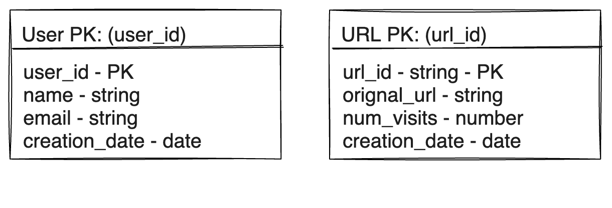

import Tabs from '@theme/Tabs';
import TabItem from '@theme/TabItem';

### Design a url shortner service
URL shortening is used to create shorter aliases for long URLs. We call these shortened aliases “short links.” Users are redirected to the original URL when they hit these short links. Short links save a lot of space when displayed, printed, messaged, or tweeted. Additionally, users are less likely to mistype shorter URLs.

#### Requirements and Goals of the System
Let's discuss what features we will be designing so that we can come up with a set of useful requirements.

<details>
<summary>**Functional Requirements**</summary>
  - Given a URL, our service should generate a shorter and unique alias of it. This is called a short link. This link should be short enough to be easily copied and pasted into applications.
  - When users access a short link, our service should redirect them to the original link.
  - Users should optionally be able to pick a custom short link for their URL.
  - Links will expire after a standard default timespan. Users should be able to specify the expiration time.
</details>

<details>
<summary> **Non-Functional Requirements**</summary>
  - The system should be highly available. This is required because, if our service is down, all the URL redirections will start failing.
  - URL redirection should happen in real-time with minimal latency.
  - Shortened links should not be guessable (not predictable).
</details>

<details>
<summary>**Extended Requirements**</summary>
  - Analytics; e.g., how many times a redirection happened?
  - Our service should also be accessible through REST APIs by other services.
  - Users should be able to register and manage their account.
</details>

#### Capacity Estimation and Constraints
Let’s consider below assumptions :
- we have **500M new URL shortenings every month**
- on average, we will have 16 URL redirections per shortened URL per month.
- **Read heavy** system, **100:1** read to write ratio.
- Let's assume we will store url mappings for **5 years
- Each URL takes 500bytes and metadata for each URL will take another 100bytes. So we need 600bytes to store metadata for each URL.

Let's assume we need to store some metadata with each URL, including:
    - Original URL
    - Shortened URL alias
    - Creation date
    - Expiry date
    - #of visits
    - etc.

This will bring us to the following calculations:

<details>
<summary>**Traffic**</summary>
    - New URLs shortened per month: 500M * 12 = 6B
    - URLs redirections per month: 500M * 12 * 16 = 96B
    - URLs redirections per second: 96B / (30 * 24 * 3600) ~= 37K
</details>
<details>
<summary>**Storage**</summary>
    - Total URLs needed for 5 years: 6B * 5 ~= 30B
    - Total storage required for metadata: 30B * 100 bytes ~= 3TB
    - Total storage required for redirections: 96B * 500 bytes ~= 46TB
    - Total storage: 3TB + 46TB ~= 50TB
</details>
<details>
<summary>**Bandwidth**</summary>
    - Incoming data: 500M * 500 bytes ~= 250GB per month
    - Outgoing data: 96B * 500 bytes ~= 46TB per month
</details>
<details>
<summary>**Memory**</summary>
    - If we want to cache 20% of the hot URLs, we would need to cache 20% of 30B URLs, i.e., 6B URLs.
    - Size of each object would be 600 bytes (with metadata), so we would need 6B * 600 bytes ~= 3.5TB of memory to cache all hot URLs.
</details>

#### API Design
This problem can be decomposed into two main components:
- **URL shortening:** This functionality will take care of shortening a URL and storing the mapping in a database. We will also need a simple web frontend to interact with this service.
- **URL redirection:** Given a shortened URL, this service will redirect the user to the original URL.
```JSON
// POST API to create a shortened URL
// api/v1/shorten
createURL(api_dev_key, original_url, custom_alias=None, user_name=None, expire_date=None)
    returns shortened_url or error message
{
    api_dev_key - A developer key to track the API usage
    original_url - Original URL to be shortened
    custom_alias - Optional custom key for the URL
    user_name - Optional user_name parameter (used for authentication)
    expire_date - Optional expiration date for the shortened URL
}

// GET API to get original URL
// api/v1/get/<shortened_url>
getOriginalURL(shortened_url) return shortened_url
    returns original_url or error message
{
    shortened_url - Shortened URL to be resolved to the original URL
}
```

What happens when a user enters a `shortened_url` in a browser?
- The user will be redirected to the original URL.
- The service will look up the URL by `shortened_url` and fetch the original URL.
- The service will issue an HTTP redirect to the original URL.

<Tabs>
<TabItem value="301 Redirect">
- The HTTP response status code 301 Moved Permanently is used for permanent URL redirection, meaning current links or records using the URL that the response is received for should be updated.
- The new URL should be provided in the Location field included with the response.
- Browsers will cache 301 redirects until they expire, so 301 redirects should only be used when the location of the resource has moved permanently.
The 301 redirect is considered a best practice for upgrading users from HTTP to HTTPS.

</TabItem>
<TabItem value="302 Redirect">
- The HTTP response status code 302 Found is a common way of performing URL redirection.
- An HTTP response with this status code will additionally provide a URL in the Location header field.
- The request will be continued to the service and then redirected to the original url.
- Important if analytics are being used to track the number of clicks on the shortened URL.
</TabItem>
</Tabs>

[HTTP Status Codes](https://developer.mozilla.org/en-US/docs/Web/HTTP/Status)

import RedirectSVG from './redirect.svg';

<RedirectSVG width="80%" height="60%"/>

#### Database Design
Most effective way to store the mappings is to use a **NoSQL database** like **Cassandra** or **Dynamo**. These databases provide **fast lookups** with **O(1)** time complexity and provide **flexibility** to **store billions of records**. Also, since we don’t have any **relationships** between columns, **NoSQL** databases are a better choice over **SQL** databases.
- The urls will be shortened using a Hash Function.
- The hash function will generate a unique key for each url in consisting of characters and digits [a-zA-Z0-9].
- Hash value length will be 7 characters. This will give us **62^7** = **3.5T** unique strings.
##### What kind of database should we use?
- **SQL** databases are not a good fit for such **highly scalable** systems as their **vertical scalability** is limited.
- **NoSQL** databases are a better choice for such a large scale system as they are **horizontally scalable** and provide a superior read/write performance.
- **Cassandra** is a good choice because it provides a **superior write performance**. It can **write** thousands of records per second on a single commodity or cloud server.
- **Cassandra** has **no single point of failure** and it is **relatively easier** to add more nodes to the system for **horizontal scaling**.

##### Database Schema



##### How to generate a unique key for each URL?
- We can **generate** a **unique hash** (of fixed length) for each incoming URL and use the first seven characters for the short link.
- We can **store** all the mappings in **Cassandra** with **key** as **shortened URL** and **other attributes** like **original URL**, **creation date**, **expiration date**, **etc.**.
- Whenever a request comes to **shorten a URL**, we **generate** a **hash** for the **given URL** and **store** it in **Cassandra**. We then **use** the **first seven characters** of the **hash** as the **shortened URL** and **return** it to the **user**.
- Whenever a request comes to **expand a shortened URL**, we **fetch** the **original URL** from **Cassandra** and **return** it to the **user**.


#### High Level Design
#### High Level Design
At a high-level, we need to store all the URLs and their shortened aliases. Whenever we have a request to shorten a URL, we need to generate an alias and see if it is not used before. This problem is a good candidate for applying the hashing-based sharding and storing in the distributed hash table. We can divide our system into multiple shards, where each shard will store all the URL mappings that will be hashed to that shard using the URL’s hash key. This scheme is called consistent hashing that we have discussed in our [Grokking the System Design Interview](https://www.educative.io/courses/grokking-the-system-design-interview) course.


